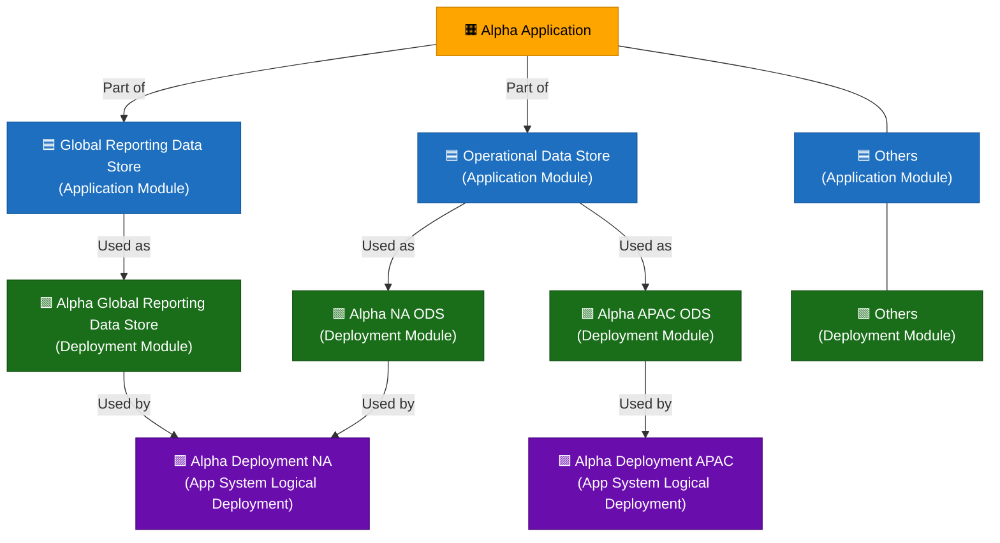

# SEAL Application Hierarchy

The Mermaid diagram below captures how a single SEAL-registered **Application**
decomposes into deployable units. It uses the fictional example "Alpha Application" to walk
through four tiers, each rendered as its own color.

## Tiers

| Tier | Example node(s) | Color | Meaning |
|---|---|---|---|
| **Application** | Alpha Application | orange (`#FFA500`) | The top-level SEAL record — one Application ID covers the whole system. |
| **Application Module** | Global Reporting Data Store, Operational Data Store, Others | blue (`#1E6FBF`) | Logical sub-components of the Application (e.g. a reporting store vs. an operational store), each `-->|Part of|` the Application. |
| **Deployment Module** | Alpha Global Reporting Data Store, Alpha NA ODS, Alpha APAC ODS, Others | green (`#1a6e1a`) | Concrete, named instances of an Application Module — a module can fan out into multiple deployments (the ODS module `-->|Used as|` both an NA and an APAC deployment). |
| **App System Logical Deployment** | Alpha Deployment NA, Alpha Deployment APAC | purple (`#6a0dad`) | Regional runtime groupings that consume one or more Deployment Modules (`-->|Used by|`). NA pulls from both the Global Reporting deployment and the NA ODS deployment; APAC pulls from the APAC ODS deployment. |

## Relationships

- **Part of** — Application Module → Application. Every module belongs to exactly one Application.
- **Used as** — Deployment Module → Application Module. A module is realized as one or more concrete deployments.
- **Used by** — Deployment Module → App System Logical Deployment. A logical deployment (regional runtime) draws on one or more deployment modules.
- Plain `---` edges (Application → "Others" module, module → "Others" deployment) indicate the diagram is illustrative, not exhaustive — every Application has additional modules/deployments collapsed into an "Others" placeholder.

## Read of the example

Alpha Application has (at least) two modules: a Global Reporting Data Store and an Operational
Data Store. The reporting module deploys once (Alpha Global Reporting Data Store); the
operational module deploys twice, regionally split (Alpha NA ODS, Alpha APAC ODS). Those
deployments are then consumed by two logical deployments: **Alpha Deployment NA** (reporting +
NA ODS) and **Alpha Deployment APAC** (APAC ODS only).

## Why it matters for DryDocs

This is the shape SEAL uses to answer "what is this Application actually made of, and where does
it run" — Application is the governance/ownership anchor (SEAL ID), Application/Deployment
Modules are the logical→physical decomposition, and App System Logical Deployment is the
regional runtime grouping production support cares about when an incident is scoped to one
region. Modeling this as a 4-tier chain (rather than collapsing Application straight to
deployment) preserves the module-level reuse pattern (one module, multiple regional deployments)
that the diagram is specifically illustrating.
