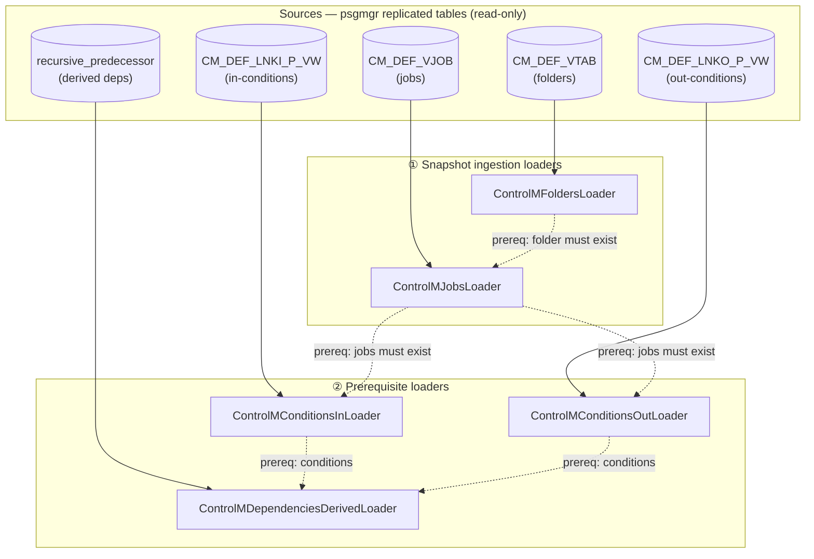
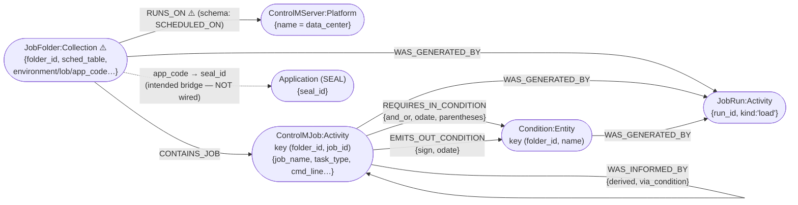

# Control-M Loader Flow — Ingestion Baseline (for schema review)

**Purpose:** baseline flow of the Control-M loaders and the graph schema they produce, for review/correction **against `drydocs/schema/schema_graph.cypher`**. Seed for the `controlm-spinoff` engine.
**Created:** 2026-06-11 (on `main`). **Sources read:** `drydocs/loaders/controlm_*.py` + `drydocs/loaders/cypher/controlm_*.cypher` + `drydocs/schema/schema_graph.cypher`.

> ⚠️ **Drift found during this mapping — needs correction (see §4).** The loaders still write `:JobFolder` and folder-`:RUNS_ON`-server; the schema (updated 2026-06-09) renamed these to `:ControlMFolder` and `:SCHEDULED_ON`. The diagrams below show **loader-actual** with the schema target flagged.

---

## 1. Loader pipeline (order + prerequisites)

Two classes of loader: **snapshot ingestion** (current-state definitions) and **prerequisite** (the condition/dependency plane). Run order is fixed by `Prereq:` chains (a MATCH silently drops rows if its parent hasn't loaded).

**Run order:** Folders → Jobs → (ConditionsIn ∥ ConditionsOut) → DependenciesDerived.

---

## 2. Graph schema produced (nodes + relationships)

Every loader inherits `BaseLoader`: opens a `:JobRun {kind:'load'}`, and every node it writes gets `-[:WAS_GENERATED_BY {source:'BMC'}]->(:JobRun)` (provenance, omitted from the main edges below for clarity, shown separately).

`WAS_INFORMED_BY` is the **derived job→job dependency**: ConditionsDerived matches an `EMITS_OUT_CONDITION` to a `REQUIRES_IN_CONDITION` (via the recursive-predecessor SQL) and collapses it to a direct predecessor edge — the prerequisite plane made navigable.

---

## 3. Node/edge ↔ schema_graph.cypher mapping

| Element | Loader writes | schema_graph.cypher | vocab_id | status |
|---|---|---|---|---|
| Folder node | `:JobFolder:Collection` | **`:ControlMFolder`** (renamed 2026-06-09) | — | ⚠️ drift |
| Server node | `:ControlMServer:Platform` | `:ControlMServer` | — | ✅ |
| Job node | `:ControlMJob:Activity` | `:ControlMJob` (Activity) | — | ✅ |
| Condition node | `:Condition:Entity` | `:Condition` (Entity) | — | ✅ |
| Run node | `:JobRun` | `:JobRun` (Activity) | — | ✅ |
| Folder→Server | `RUNS_ON` | **`SCHEDULED_ON`** (RUNS_ON deprecated here; reserved for Job→ExecutionHost, planned) | `m3_runs_on`→renamed | ⚠️ drift |
| Folder→Job | `CONTAINS_JOB` | `CONTAINS_JOB` (prov:hadMember) | `m3_contains_job` | ✅ active |
| Job→Condition (in) | `REQUIRES_IN_CONDITION` | same (prov:used) | `m3_requires_in_condition` | ✅ active |
| Job→Condition (out) | `EMITS_OUT_CONDITION` | same (prov:generated) | `m3_emits_out_condition` | ✅ active |
| Job→Job (derived) | `WAS_INFORMED_BY` | same (prov:wasInformedBy) | `m3_was_informed_by` | ✅ active |
| *→Run | `WAS_GENERATED_BY` | same (prov:wasGeneratedBy, all domains) | `prov_was_generated_by` | ✅ active |
| Folder→Application | — (not emitted) | via ontology (Product `HAS_APPLICATION` Application; Application→Batch child) | — | ⛔ Control-M side unwired |

---

## 4. Corrections needed (review actions)

1. **`:JobFolder` → `:ControlMFolder`** — align `controlm_folders.cypher` (+ `controlm_jobs.cypher` MATCH, conditions MATCHes) to the renamed label, **or** revert the schema. Pick one source of truth.
2. **Folder→Server `RUNS_ON` → `SCHEDULED_ON` — FUNCTIONAL BREAK, not just naming.** The schema (`m3_scheduled_on`, status `active`) and **`cli.py:391` already read `(f)-[:SCHEDULED_ON]->(:ControlMServer)`**, but `controlm_folders.cypher` still **writes `RUNS_ON`** — so that query path matches nothing on a freshly loaded graph. `relationship_vocabulary.yaml` documents the 2026-06-09 rename + migration (match `RUNS_ON`, recreate as `SCHEDULED_ON`, delete old). Fix: update the loader to write `SCHEDULED_ON`; migrate existing graphs. (`RUNS_ON` is reserved for the planned Job→ExecutionHost edge.) **Highest-priority correction.**
3. **Control-M → SEAL `:Application` bridge is unwired** — folder `app_code` (positions 3-5 of the folder name) is the documented "canonical mechanism," but no loader emits the edge. Decide owner: a Control-M-side derived loader, or the ontology side. (Note: `ControlMJob.application` is the Control-M app code, **not** SEAL — do not join on it.)
4. **`ControlMJobRun` (execution history, M3 P2)** is in the schema as `:Activity` but **not** produced by these phase-1 structural loaders — confirm it stays out of the spin-off baseline (definitions only) or is in scope.

---

## 5. Notes for the spin-off baseline

- The **snapshot** loaders (folders, jobs) + **prerequisite** loaders (conditions in/out, derived) are the read-only ingestion surface the `ctm-remediate` engine consumes/produces; they pair with the C3 normalization (variables/resolver/commands) on the same definitions.
- Provenance (`:JobRun` + `WAS_GENERATED_BY`) is uniform across all loaders — keep it in the spin-off.
- Resolve §4 drift **before** the engine lift (M1) so the baseline schema is internally consistent.

Related: `drydocs/schema/schema_graph.cypher`, `drydocs/ontology/relationship_vocabulary.yaml`, [[project_controlm_c3_normalization]], [[project-controlm-remediation-spinoff]]
