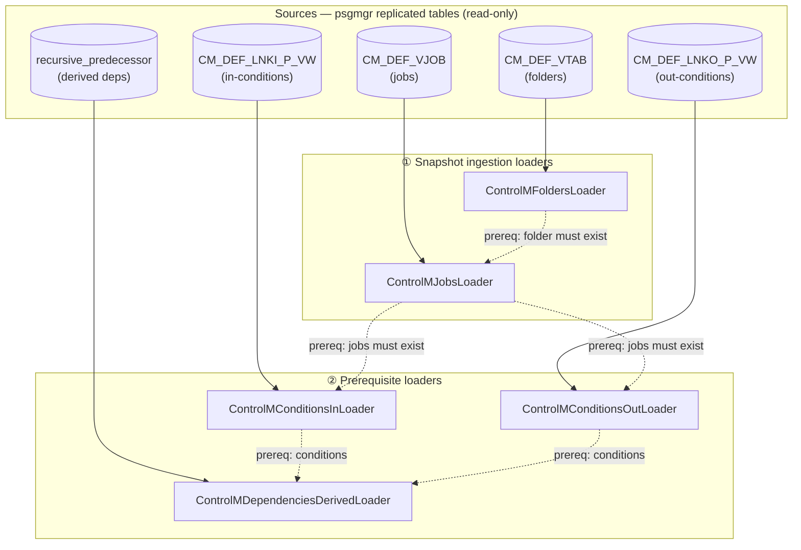

# Control-M Loader Flow — Ingestion Baseline (for schema review)

**Purpose:** baseline flow of the Control-M loaders and the graph schema they produce, for review/correction **against `drydocs_core/schema/schema_graph.cypher`**. Seed for the `controlm-spinoff` engine.
**Created:** 2026-06-11 (on `main`). **Sources read:** `drydocs/loaders/controlm_*.py` + `drydocs/loaders/cypher/controlm_*.cypher` + `drydocs_core/schema/schema_graph.cypher`.

> ✅ **Status refresh 2026-07-15 — the §4 drift is resolved.** The loaders now write
> `:ControlMFolder` and `SCHEDULED_ON`; the folder pass additionally derives
> `:ControlMApplication` + `CONTAINS_FOLDER` (gate `controlm-q1q3-phase1`, 2026-07-07); and the
> Control-M → SEAL bridge shipped as the **job-level** K2 attribution loader (2026-07-14) — not
> the folder-`app_code` mechanism §4.3 anticipated. The diagrams below are kept as the
> **2026-06-11 loader-actual baseline** (the ⚠️ flags mark the drift as it stood then); the
> current authoritative description is
> [`docs/design/controlm-ingestion-tdd.md`](design/controlm-ingestion-tdd.md) and
> [`controlm-staging-ingestion-flow.md`](controlm-staging-ingestion-flow.md) §3a.

---

## 1. Loader pipeline (order + prerequisites)

Two classes of loader: **snapshot ingestion** (current-state definitions) and **prerequisite** (the condition/dependency plane). Run order is fixed by `Prereq:` chains (a MATCH silently drops rows if its parent hasn't loaded).

**Run order:** Folders → Jobs → (ConditionsIn ∥ ConditionsOut) → DependenciesDerived.

---

## 2. Graph schema produced (nodes + relationships)

Every loader inherits `BaseLoader`: opens a `:JobRun {kind:'load'}`, and every node it writes gets `-[:WAS_GENERATED_BY {source:'BMC'}]->(:JobRun)` (provenance, omitted from the main edges below for clarity, shown separately).

`WAS_INFORMED_BY` is the **derived job→job dependency**: ConditionsDerived matches an `EMITS_OUT_CONDITION` to a `REQUIRES_IN_CONDITION` (via the recursive-predecessor SQL) and collapses it to a direct predecessor edge — the prerequisite plane made navigable.

---

## 3. Node/edge ↔ schema_graph.cypher mapping

| Element | Loader writes | schema_graph.cypher | vocab_id | status |
|---|---|---|---|---|
| Folder node | `:ControlMFolder:Collection` | **`:ControlMFolder`** (renamed 2026-06-09) | — | ✅ resolved — loader writes `:ControlMFolder` |
| Server node | `:ControlMServer:Platform` | `:ControlMServer` | — | ✅ |
| Job node | `:ControlMJob:Activity` | `:ControlMJob` (Activity) | — | ✅ |
| Condition node | `:Condition:Entity` | `:Condition` (Entity) | — | ✅ |
| Run node | `:JobRun` | `:JobRun` (Activity) | — | ✅ |
| Folder→Server | `RUNS_ON` | **`SCHEDULED_ON`** (RUNS_ON deprecated here; reserved for Job→ExecutionHost, planned) | `m3_scheduled_on` | ✅ resolved — loader writes `SCHEDULED_ON`; `m3-verify` asserts it |
| Folder→Job | `CONTAINS_JOB` | `CONTAINS_JOB` (prov:hadMember) | `m3_contains_job` | ✅ active |
| Job→Condition (in) | `REQUIRES_IN_CONDITION` | same (prov:used) | `m3_requires_in_condition` | ✅ active |
| Job→Condition (out) | `EMITS_OUT_CONDITION` | same (prov:generated) | `m3_emits_out_condition` | ✅ active |
| Job→Job (derived) | `WAS_INFORMED_BY` | same (prov:wasInformedBy) | `m3_was_informed_by` | ✅ active |
| *→Run | `WAS_GENERATED_BY` | same (prov:wasGeneratedBy, all domains) | `prov_was_generated_by` | ✅ active |
| Folder→Application | — (not emitted) | via ontology (Product `HAS_APPLICATION` Application; Application→Batch child) | — | ✅ superseded — shipped **job-level** as K2: `WAS_ASSOCIATED_WITH {role: seal_app_ref}` from STG_APP_FACT (`m3_seal_app_ref` active 2026-07-14) |

---

## 4. Corrections needed (review actions) — resolution status 2026-07-15

1. ✅ **RESOLVED — label rename.** The loaders write `:ControlMFolder` throughout
   (`controlm_folders.cypher` + downstream MATCHes); constraint `controlmfolder_id` backs the key.
2. ✅ **RESOLVED — `SCHEDULED_ON`.** `controlm_folders.cypher` writes `SCHEDULED_ON`
   (rename applied per the vocabulary, B.1); `m3-verify` asserts `SCHEDULED_ON` is present and
   `RUNS_ON` is retired for this pair. `RUNS_ON` remains reserved for the planned
   Job→ExecutionHost / host-group edges (`m3_runs_on_agent_host`, `m3_runs_on_host_group`).
3. ✅ **RESOLVED (differently than anticipated) — SEAL bridge.** Shipped **job-level**, not
   folder-level: K2 loads `WAS_ASSOCIATED_WITH {role: seal_app_ref}` from **STG_APP_FACT
   semantic facts** via `drydocs load-seal-attribution` (`seal_attribution.cypher`;
   `m3_seal_app_ref` active; gate `seal-attribution-match-policy` confirmed 2026-07-14).
   Neither raw `job.APPLICATION` nor the folder-name `app_code` parse is used for SEAL
   identity — both are documented unreliable.
4. **STILL ACCURATE — `ControlMJobRun` (execution history, M3 P2)** remains in the schema as
   `:Activity` and out of the phase-1 structural loaders (definitions-only baseline holds).

---

## 5. Notes for the spin-off baseline

- The **snapshot** loaders (folders, jobs) + **prerequisite** loaders (conditions in/out, derived) are the read-only ingestion surface the `ctm-remediate` engine consumes/produces; they pair with the C3 normalization (variables/resolver/commands) on the same definitions.
- Provenance (`:JobRun` + `WAS_GENERATED_BY`) is uniform across all loaders — keep it in the spin-off.
- ~~Resolve §4 drift **before** the engine lift (M1) so the baseline schema is internally consistent.~~ **Done** — §4 items 1–3 resolved as of 2026-07-15 (see resolution status above).

Related: `drydocs_core/schema/schema_graph.cypher`, `drydocs_core/ontology/relationship_vocabulary.yaml`, [[project_controlm_c3_normalization]], [[project-controlm-remediation-spinoff]]
