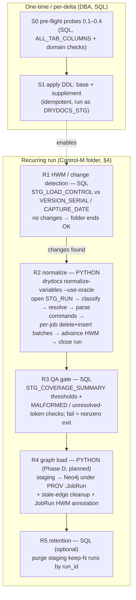

# Control-M C3 Normalization — Staging Schema & Orchestrated Flow

**Re-draft: 2026-07-07.** Supersedes the 2026-06-11 DDL-request note (narrative only —
the DDL scripts remain authoritative for object shapes):
`drydocs/loaders/sql/ddl/controlm_staging_ddl.sql` + `controlm_staging_supplement_ddl.sql`.
Related: [`controlm-c3-normalization-status.md`](controlm-c3-normalization-status.md) (phase status),
[`restructure/06a-controlm-source-er-review.md`](restructure/06a-controlm-source-er-review.md) (source ER + SME gate resolutions),
[`reviews/persona-oracle-dba.md`](reviews/persona-oracle-dba.md) (incremental design, superseded into this doc).

**What this describes:** the `DRYDOCS_STG` schema (ER overview below), the recurring
normalization run split into SQL and Python stages, and the **Control-M folder under the
DBA application** that orchestrates it. The pipeline that ingests Control-M definitions
is itself scheduled by Control-M — once live, the folder appears in its own lineage graph.

---

## 1. ER overview — DRYDOCS_STG

Key/distinguishing columns only; the DDL scripts are the full column reference.
`JOB_DETAILED_VIEW`, `JOB_VARIABLE_VIEW`, `JOB_DEVELOPER_VIEW`, and
`STG_COVERAGE_SUMMARY` are **views** (projection-only, no storage); everything else
is a heap table with b-tree indexes. All eight `STG_*` content tables share the
carry key `(run_id, data_center, folder_id, job_id)` and surrogate IDENTITY PKs
(natural keys are not unique — duplicate `(job, var_name)` definitions are legitimate).

```mermaid
erDiagram
    %% ---- source layer (psgmgr, read-only via CM_RO_USER) ----
    CM_DEF_VTAB {
        number  TABLE_ID PK "folder_id"
        varchar DATA_CENTER PK "composite key defensively (pre-flight 0.1)"
        varchar SCHED_TABLE "folder name"
        varchar USER_DAILY "NOT NULL = actively scheduled"
    }
    CM_DEF_VJOB {
        number  TABLE_ID PK,FK
        number  JOB_ID PK
        varchar JOB_NAME
        varchar TASK_TYPE "SMART Table = folder header row (JOB_ID=1)"
        varchar CMD_LINE
        varchar IS_CURRENT_VERSION "filter — reliability probe pending (0.3)"
        number  VERSION_SERIAL "incremental change signal"
        date    CAPTURE_DATE "replication stamp; coarse HWM only"
    }
    CM_DEF_SETVAR_VW {
        number  TABLE_ID PK,FK "object name confirmed 2026-07-10"
        number  JOB_ID PK,FK
        varchar NAME "dupes per (job,name) legitimate"
        varchar VALUE
    }

    %% ---- read views (owned by DRYDOCS_STG; Python ingestion surface) ----
    JOB_DETAILED_VIEW {
        varchar VIEW_ "1 row per current-version job + folder context"
        varchar fn_decode "env / lob / appcode / folder-type from name prefix"
        varchar is_folder_header "update to JOB_ID=1 + TASK_TYPE rule (gate Q1)"
    }
    JOB_VARIABLE_VIEW {
        varchar VIEW_ "1 row per variable def, ~1.1M rows"
        varchar var_scope "FOLDER | JOB"
        varchar hint_flags "syntactic only; Python owns classification"
    }
    JOB_DEVELOPER_VIEW {
        varchar VIEW_ "1 row per SID-bearing column per job"
        varchar developer_sid "UPPER(REGEXP_REPLACE(sid,'p$',''))"
        varchar is_automation "trailing lowercase p"
    }

    %% ---- run / load control ----
    STG_RUN {
        varchar run_id PK "UUID from normalizer; PROV JobRun in graph"
        varchar status "RUNNING | SUCCEEDED | FAILED"
        varchar data_centers
        varchar normalizer_version
    }
    STG_LOAD_CONTROL {
        varchar source_object PK
        varchar data_center PK
        varchar load_mode "FULL | INCREMENTAL"
        timestamp hwm_capture_date "coarse HWM"
        number  hwm_version_serial "primary change signal"
        varchar last_run_id FK "advanced ONLY after committed batch"
    }
    STG_SAMPLE_MANIFEST {
        varchar run_id FK
        varchar scenario "scope binds + coverage per sample run"
        number  rows_pulled
    }

    %% ---- normalized staging (written by Python normalizer) ----
    STG_VARIABLE {
        number  variable_sk PK
        varchar var_kind "9-kind taxonomy"
        clob    resolved_value "post fixed-point substitution"
        varchar unresolved_tokens
    }
    STG_INVOCATION {
        number  invocation_sk PK
        varchar invocation_source "CMDLINE | MEMNAME | PRECMD | POSTCMD | ..."
        varchar invocation_type "ABINITIO | INFORMATICA | PYSPARK | ..."
        clob    raw_command
    }
    STG_FILE_REF {
        number  file_ref_sk PK
        varchar ref_role "WATCH_INPUT | INPUT | OUTPUT | ..."
        varchar path_canonical "dates tokenized: {ODATE} {TS16}"
    }
    STG_FILE_OP {
        number  file_op_sk PK
        varchar op_type "COPY | MOVE | DELETE | MKDIR | TRANSFORM | COMPRESS | OTHER"
        varchar src_tgt_patterns
    }
    STG_NOTIFICATION {
        number  notification_sk PK
        varchar channel
        varchar address
    }
    STG_APP_FACT {
        number  app_fact_sk PK
        varchar fact_type "SEAL | FID | DS_ID | IMAGE | TGT_TABLE | ..."
        varchar fact_value
    }
    STG_PARSE_QUALITY {
        varchar run_dc_folder_job PK "one row per job per run (TDQ rollup)"
        number  var_total_resolved
        varchar cmd_present_classified
    }
    STG_UNPARSED_COMMAND {
        number  unparsed_sk PK
        clob    raw_text "iteration backlog; drives launcher-registry growth"
        varchar fail_reason
    }
    STG_COVERAGE_SUMMARY {
        varchar VIEW_ "per run per DC; pct_vars_resolved + pct_cmds_classified"
    }

    %% ---- source joins ----
    CM_DEF_VTAB ||--o{ CM_DEF_VJOB : "TABLE_ID"
    CM_DEF_VJOB ||--o{ CM_DEF_SETVAR_VW : "TABLE_ID + JOB_ID"

    %% ---- views project sources ----
    CM_DEF_VJOB ||..|| JOB_DETAILED_VIEW : projects
    CM_DEF_SETVAR_VW ||..|| JOB_VARIABLE_VIEW : projects
    CM_DEF_VJOB ||..|| JOB_DEVELOPER_VIEW : projects

    %% ---- every staging row carries its producing run ----
    STG_RUN ||--o{ STG_VARIABLE : run_id
    STG_RUN ||--o{ STG_INVOCATION : run_id
    STG_RUN ||--o{ STG_FILE_REF : run_id
    STG_RUN ||--o{ STG_FILE_OP : run_id
    STG_RUN ||--o{ STG_NOTIFICATION : run_id
    STG_RUN ||--o{ STG_APP_FACT : run_id
    STG_RUN ||--o{ STG_PARSE_QUALITY : run_id
    STG_RUN ||--o{ STG_UNPARSED_COMMAND : run_id
    STG_RUN ||--o{ STG_SAMPLE_MANIFEST : run_id
    STG_RUN |o--o{ STG_LOAD_CONTROL : last_run_id
    STG_PARSE_QUALITY ||..|| STG_COVERAGE_SUMMARY : aggregates
```

---

## 2. What changed since the 2026-06-11 draft

1. **Orchestration.** The runbook was manual (SQL Developer export → CLI → CSV import).
   The flow is now a **Control-M folder under the DBA application** (§4) — the same
   definitions store we ingest schedules the ingestion.
2. **Load pattern.** The old note claimed idempotency via "each run deletes its own
   prior rows by run_id" — that never removed *prior* runs' rows and was corrected in
   the DBA persona review: the idempotent unit is the **job**. Incremental =
   watermark (`STG_LOAD_CONTROL`) → changed-job extract → per-job delete+insert in one
   transaction → commit + advance HWM. Full refresh remains the baseline/rebuild path
   (direct-path `/*+ APPEND */` allowed there only).
3. **New objects.** The supplement DDL adds `STG_LOAD_CONTROL` (incremental keystone),
   `STG_SAMPLE_MANIFEST` (sample provenance), and `JOB_DEVELOPER_VIEW` (inline SID
   normalization; `STG_DEV_SID` dimension deferred). The old "pure DDL, no PL/SQL"
   claim no longer holds — the supplement uses PL/SQL existence-check wrappers
   (ORA-00955 swallowed) for idempotent re-runs.
4. **SME gate resolutions (2026-07-07, `controlm-q1q3-phase1`)** that touch the views:
   - **Folder-header detection**: header rows are `JOB_ID = 1` / `TASK_TYPE = 'SMART Table'`.
     Both base views currently use the `JOB_NAME = SCHED_TABLE` heuristic for
     `is_folder_header` / `var_scope` — **update the views** to the resolved rule.
   - **`IS_CURRENT_VERSION` is unreliable across legacy vs new folders** — both views
     hard-code `= '1'`. A domain-value probe is now pre-flight **0.3** before the filter
     stays hard (§3, stage S0).
   - `ctlm_id = TABLE_ID || '.' || JOB_ID` approved as a derived property; `MEMNAME`
     demoted to informational (never a key or join).
   - `USER_DAILY IS NOT NULL` scope is a readability choice, not semantics — manual-order
     folders run in production; retention decided later by the review module.
5. **Phases B and C are complete** (fixed-point resolver; command parser + launcher
   registry + path canonicalizer + fact routing). `drydocs normalize-variables` emits
   all eight staging shapes, not three — the old "three CSVs" load step is stale.
6. **Both `%%VAR` and `%%$VAR`** reference user variables here (finding 1 of the old
   doc) — encoded in `variables.py` registries; carried forward unchanged.

---

## 3. Stage flow — what runs in SQL, what runs in Python

### S0 — SQL pre-flight (run once, review output, do not skip)

| # | Probe | Consequence |
|---|-------|-------------|
| 0.1 | `TABLE_ID` unique across the 4 data centers? | If collisions: enable the `DATA_CENTER` join predicate in both views (staging already keys defensively on `(data_center, folder_id, job_id)`) |
| 0.2 | `MEMLIB` / `OVERLIB` / `APPL_TYPE` exist on `CM_DEF_VJOB`? | Drop absent columns from `JOB_DETAILED_VIEW` before compile |
| ✓ | 0.3 RESOLVED 2026-07-15 (D4) — `IS_CURRENT_VERSION` domain is **`'Y'`** (finalized company ingestion TDD; live-verified on `CM_DEF_VJOB` + LNKI/LNKO, and SME-confirmed for `CM_DEF_SETVAR_VW` same day). `= 'Y'` is the hard filter in both views; no residual | Gate Q2 caveat closed |
| 0.4 | **NEW** — `CREATION_USER` / `CHANGE_USERID` exist on `CM_DEF_VJOB`? | Required by `JOB_DEVELOPER_VIEW`'s CROSS APPLY; drop branches if absent |
| ✓ | RESOLVED 2026-07-10 — object confirmed as `psgmgr.CM_DEF_SETVAR_VW` (a view carrying its own `IS_CURRENT_VERSION` / `VERSION_SERIAL`); extracts now filter `V.IS_CURRENT_VERSION = 'Y'` (literal corrected `'1'`→`'Y'` 2026-07-15, D4) | Unblocked the variable extract + HWM hash; the `** VERIFY NAME **` flags are removed |

### Recurring stages (each is one Control-M job)

| Stage | Language | Mechanism | Idempotency / restart |
|-------|----------|-----------|-----------------------|
| R1 change detection | SQL (sqlplus script) | Per `(source_object, data_center)`: `VERSION_SERIAL > hwm` (versioned sources) or content hash / `CAPTURE_DATE > hwm` (folders, variables). Zero changes → clean stop, folder OK. | Read-only |
| R2 normalize | Python (`drydocs` CLI) | Opens `STG_RUN` (RUNNING); reads `JOB_VARIABLE_VIEW` / `JOB_DETAILED_VIEW`; taxonomy classify (9 kinds) → fixed-point resolve (folder→job scope chain, cycle guard) → command parse (launcher registry, PRECMD/POSTCMD shell, FileWatch, UCM) → bulk insert all 8 `STG_*` shapes. **Gap:** today `normalize-variables` emits CSVs (`--out-dir`); the direct Oracle write-back (delete+insert, HWM advance) is the code delta this flow requires. | Per changed job: delete+insert in one transaction, commit per batch, advance HWM after commit. Failure resumes from last committed HWM; `STG_RUN` left FAILED. |
| R3 QA gate | SQL (sqlplus script) | Thresholds on `STG_COVERAGE_SUMMARY.pct_vars_resolved` / `pct_cmds_classified`; count `MALFORMED` and new `STG_UNPARSED_COMMAND` rows vs prior run. Below threshold → nonzero exit → folder stops before graph load. | Read-only |
| R4 graph load (Phase D) | Python | Staging → Neo4j under `:JobRun`; stale-edge cleanup for changed jobs before re-assert; annotate `:JobRun` with `load_mode`/HWM; ISO-8601 date conversion at the boundary. | Same changed-job batch loop as R2 |
| R5 retention | SQL | Keep-N runs: delete staging rows for expired `run_id`s (children first, then `STG_RUN`). Cadence/retention is open item 4. | DELETE by run_id, re-runnable |

Sampling (`controlm_variables_scenarios.sql` + scope binds) stays **out of the recurring
folder** — it is an ad-hoc dev path, but every sample run must write a
`STG_SAMPLE_MANIFEST` row so coverage is provable.

---

## 3a. Graph load order (R4) — DEFINED 2026-07-07, verified against Neo4j import practice

The `drydocs ingest-controlm` chain order is **contractual** (enforced by
`tests/unit/test_controlm_cypher.py::test_ingest_chain_order_is_enforced`); the
rule behind it is the standard Neo4j import discipline: *constraints first, all
nodes before any relationships, relationship-only passes `MATCH` their endpoints
(never `MERGE` them), so a missing endpoint surfaces instead of creating a ghost
node* (neo4j-skills import/cypher references).

| # | Pass | Nodes MERGEd | Relationships written | Endpoint rule |
|---|------|--------------|----------------------|---------------|
| 0 | `constraints.cypher` (bootstrap, once) | — | — | every MERGE key below is constraint-backed (`controlm_server`, `controlmapplication_name`, `controlmfolder_id`, `controlmjob_key`, `condition_key`) |
| 1 | **folders** | `:ControlMFolder` + **two field-derived grouping labels**: `DATA_CENTER` → `:ControlMServer`, header-row `APPLICATION` → `:ControlMApplication` (LEFT JOIN `CM_DEF_VJOB` `JOB_ID=1`, the SMART-Table header per the gate) | `SCHEDULED_ON`, `CONTAINS_FOLDER` | self-contained — all endpoints created in this pass |
| 2 | **jobs** | `:ControlMJob` | `CONTAINS_JOB` | `MATCH` folder (exists from pass 1); job silently dropped if folder absent → rerun folders first |
| 3 | **conditions in / out** | `:Condition` (shared `(folder_id, name)` key) | `REQUIRES_IN_CONDITION`, `EMITS_OUT_CONDITION` | `MATCH` job by `(folder_id, job_id)` |
| 4 | **dependencies (separate pass)** | none | `WAS_INFORMED_BY` (derived from the recursive LNKO⋈LNKI condition match) | `MATCH` **both** endpoint jobs — pure edge pass, never creates nodes |
| later | SEAL attribution (K2 — **live 2026-07-14**: gate `seal-attribution-match-policy` confirmed; `drydocs load-seal-attribution`) | none | `WAS_ASSOCIATED_WITH {role: seal_app_ref}` | runs only after jobs **and** `:Application` reference exist |

Why the application grouping moved to the **folder** pass (not jobs, where the
vocabulary note originally parked it): the folder pass is where field-derived
grouping labels live (`ControlMServer` already), the header row is folder-grain
data, and it keeps pass 2 a pure child pass — every grouping node exists before
any job lands. Folders without a header row load normally (LEFT JOIN; the
cypher's `WHERE row.application IS NOT NULL` skips the app MERGE — the
null-key-MERGE guard from the import checklist).

Verification checklist applied (neo4j-skills import skill): constraints before
import ✓; all nodes before any relationships ✓ (order above); relationship
passes MATCH endpoints ✓ (jobs/conditions/dependencies); `UNWIND $batch` driver
batching ✓; no `MERGE` on nullable keys ✓ (WHERE guard); post-load validation =
`drydocs m3-verify` (now also asserts no orphan `:ControlMApplication`). Known
accepted hot-spot: many folder rows MERGE the same server/application node
inside one batch transaction — lock-serialized, harmless at this scale (4 DCs,
hundreds of applications); revisit batch dedup only if load profiling ever says so.

---

## 4. The Control-M folder (DBA application)

One **SMART folder** under the DBA team's application, on the Control-M/Server whose
agent host has the `drydocs` runtime and sqlplus with wallet-based connectivity to the
staging DB (psgmgr is centrally replicated, so a single folder covers all four data
centers — the normalizer processes all DCs in one run; ~1.1M rows is fine).

| Property | Value |
|----------|-------|
| Folder name | `P<L><APP>D-DRYDOCS-C3NORM` — placeholder; positions 1–6 per site convention (env `P`, LOB code, the DBA app's 3-char appcode, type `D` = daily) |
| Folder type | SMART (folder-level scheduling + actions inherited) |
| Order method | Site-standard User Daily (daily New Day order) |
| Run As | OS service account mapped to `<PY_NORMALIZER_USER>` — credentials via Oracle wallet, **never** in `CMD_LINE` |
| Application / Sub-application | DBA app / `DRYDOCS-STG` |
| Folder actions | On NOTOK → Do Notify (email group / on-call); no auto-rerun of R2 (rerun is safe but should be deliberate) |

### Jobs

| # | Job name (suffix) | Task type | Runs | In-condition | Out-condition (ODATE) |
|---|-------------------|-----------|------|--------------|------------------------|
| 010 | `HWM-CHECK` | OS Command | `sqlplus @hwm_check.sql` — R1; exits 0 setting `CHANGES=Y/N` step marker; on `N`, Do OK → force-complete remaining jobs (quiet day) | — | `DRYDOCS-C3-HWM-OK` |
| 020 | `NORMALIZE` | OS Command | `drydocs normalize-variables --use-oracle` — R2 (write-back mode to be added; see R2 gap note) | `DRYDOCS-C3-HWM-OK` | `DRYDOCS-C3-NORM-OK` |
| 030 | `QA-GATE` | OS Command | `sqlplus @coverage_gate.sql` — R3; nonzero exit on threshold breach | `DRYDOCS-C3-NORM-OK` | `DRYDOCS-C3-QA-OK` |
| 040 | `GRAPH-LOAD` | OS Command | `drydocs load-staging-graph` — R4 (**Phase D; add when built**, initially Hold/disabled) | `DRYDOCS-C3-QA-OK` | `DRYDOCS-C3-GRAPH-OK` |
| 050 | `RETENTION` | OS Command | `sqlplus @retention_purge.sql` — R5 | `DRYDOCS-C3-QA-OK` (parallel to 040) | `DRYDOCS-C3-DONE` |

Failure semantics: any NOTOK stops the downstream chain (out-condition never added),
`STG_RUN` stays `FAILED`, the HWM was only advanced for committed batches — so the next
ordered run (or a manual rerun) resumes safely from the last committed watermark.
No cyclic jobs; one pass per ODATE.

**Self-lineage note:** once ordered daily, this folder, its jobs, conditions, and any
variables are themselves rows in `CM_DEF_VTAB` / `CM_DEF_VJOB` / the variable object —
the pipeline ingests its own definition. Useful as a permanent end-to-end smoke test:
the folder must appear in its own coverage report.

---

## 5. Accounts & grants (summary — templates live in the DDL scripts)

| Account | Needs |
|---------|-------|
| `DRYDOCS_STG` (owner) | SELECT on the three psgmgr objects (via `CM_RO_USER` convention); owns all staging objects |
| `<PY_NORMALIZER_USER>` | SELECT on the three views; SELECT/INSERT/DELETE on the 8 staging tables + `STG_SAMPLE_MANIFEST`; SELECT/INSERT/**UPDATE**/DELETE on `STG_RUN` and `STG_LOAD_CONTROL` (UPDATE advances the HWM) |
| Analyst role | SELECT on views + staging + `STG_COVERAGE_SUMMARY` |

Delta vs the old note: `UPDATE` on `STG_LOAD_CONTROL` is new and required; no new psgmgr
grant is needed for the dev-SID columns (columns on already-granted objects) — and the
variable object is now confirmed as `CM_DEF_SETVAR_VW`, closing the last open psgmgr
grant question.

---

## 6. Open items (blocking, carried + new)

1. **`CM_DEF_SETVAR_VW` real name — RESOLVED 2026-07-10.** Confirmed against live
   `psgmgr` as a view carrying its own `IS_CURRENT_VERSION` / `VERSION_SERIAL`; the
   extracts filter `V.IS_CURRENT_VERSION = 'Y'` (literal corrected 2026-07-15, D4) and the `** VERIFY NAME **` flags are removed.
2. **`CAPTURE_DATE` per-row or per-extract-uniform?** Decides its role as change signal
   vs coarse HWM only.
3. **`CREATION_USER` / `CHANGE_USERID` existence** on `CM_DEF_VJOB` (pre-flight 0.4).
4. **Retention cadence** — keep-N runs vs replace-in-place (drives R5).
5. **View updates from the gate** — `is_folder_header` / `var_scope` still use the
   `JOB_NAME = SCHED_TABLE` heuristic in the base DDL; update to the resolved
   `JOB_ID = 1` + `TASK_TYPE = 'SMART Table'` rule (`CREATE OR REPLACE` deltas).
   The `IS_CURRENT_VERSION` half is closed — probe 0.3 resolved 2026-07-15 (D4),
   `= 'Y'` is the hard filter in both views.
6. **DBA app folder naming** — confirm the DBA application's appcode and LOB code for
   the folder-name prefix so the folder classifies correctly in our own taxonomy decode.
