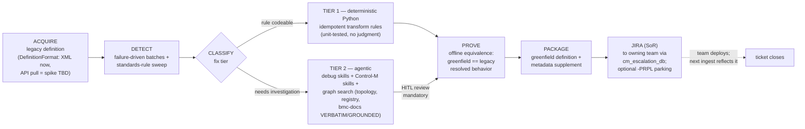

# Technical Design — `drydocs-remediation` (Control-M fix packages: detect → transform → prove → Jira)

<!-- anchor: front-matter -->
**Status:** PRESCRIPTIVE — specifies an UNBUILT component. **Rev 1, 2026-07-08**, authored at
commit `24d6a4b` (backlog **G3** `todo`, gated on **G2** core extraction; contract = ADR 0002-B). ·
**Classification:** Internal-Public — mechanism only; real folder/job names, fix-rule values,
and Jira coordinates live company-side. ·
**Audience:** the production-support SME (author of fixes) + the source-app dev teams who
deploy them. ·
**Companion:** `docs/decisions/0002-b-spinoff-rebase-checklist.md` (the rebase contract this
design realizes); `docs/design/controlm-ingestion-tdd.md` (the ingest chain that later
*reflects* a landed fix); `MODULE_MAP.md` ("C1 — failures → Jira; no graph write").

Worked example throughout (synthetic, mechanism-only): a FileWatcher job in folder
`PRARAF-FW1D-…` fails repeatedly on a mis-declared watch path; its Description field carries
no metadata block; ownership is ambiguous in `cm_escalation_db`. The remediation loop
produces a greenfield definition + metadata supplement and hands it to the owning dev team.

> **Read-me-first.** This component **writes no graph, deploys nothing**. Separation of
> duties is the founding constraint: production support authors the fix; the source
> application's dev team holds deploy rights. The only durable outputs are the greenfield
> definition artifact and the Jira ticket (the system of record for the handoff). Closure is
> observed, not performed: after the dev team lands the change, the next `ingest-controlm`
> load reflects it and the ticket closes.

---

<!-- anchor: purpose-scope -->
## Purpose & scope

**Purpose.** Specify how DryDocs turns *detected Control-M definition/metadata defects* into
*deployable greenfield fix packages* — deterministically where a rule can be coded, agent-
assisted where investigation is required — without ever touching production or the graph.

**In scope.**
- The remediation loop: acquire → detect → classify → transform → prove → package → Jira.
- The **two-tier fix model**: Tier-1 deterministic Python rules vs Tier-2 agentic
  investigation (debug skills + Control-M skills + graph search over the loaded DB).
- The **acquisition seam** (`DefinitionFormat`) and the open API spike: *what can be pulled*
  from the Control-M environment programmatically (TBD — see §HITL).
- The metadata supplement: what a "fixed" definition carries (Description-field metadata
  block, ownership/SEAL alignment) and where those standards come from.

**Out of scope.** Deployment (dev teams, SoD); any graph write (structural invariant);
runbook *generation* (the `controlm-runbook-automation` skill — remediation is its
fix-package half's engine, not its author); SEAL attribution loading (**K2**, gated);
the description-field metadata *standard itself* (its own plan — consumed here, defined there).

<!-- anchor: context-frame -->
## 1. Where this sits — the four-layer frame

| Layer | Remediation's relationship | Direction |
|-------|---------------------------|-----------|
| **1. Taxonomy** | folder-naming decode (PRAOCG positions), fix-rule categories | read |
| **2. Ontology** | conformance rules cite confirmed mappings (what edges *should* exist) | read |
| **3. Knowledge graph** | corroboration + investigation surface: sample Control-M topology, the software registry, and the **bmc-docs lexical corpus** (vendor legality) | **read-only** |
| **4. Context graph** | future: failure/freshness context sharpens detection | read (future) |

`drydocs-remediation` is a **consumer** of all four layers and a producer of **none** — its
outputs leave the system (XML artifact + Jira). This is the inverse of every loader and the
reason the no-graph-write test is structural, not stylistic.

---

<!-- anchor: definitions -->
## Definitions, acronyms & references

| Term | Meaning |
|---|---|
| greenfield definition | a regenerated folder/job definition that re-derives the SAME resolved behavior as the legacy one, minus the defect — new artifact, not an edit |
| SoD | separation of duties — support authors, dev deploys; the constraint that shapes the whole loop |
| `DefinitionFormat` | the format-agnostic read/write seam (XML impl now; JSON/Automation-API impl later — BMC is phasing XML out; deprecated from 9.0.21.100, supported until 9.0.22) |
| `ctm-remediate` | the archived standalone spin-off (`DryDocs-v0-archive@controlm-spinoff`) whose remediation logic is re-homed here (ADR 0002-B: re-home, don't replay) |
| Tier-1 / Tier-2 | deterministic Python fix vs agent-assisted fix — see §3 |
| `-PRPL` parking | greenfield definitions may be loaded to a parallel-run folder left in **manual order** so the dev team can inspect before anything runs |
| `cm_escalation_db` | the escalation/ownership table (EJOBNAME join) deciding *which team gets the Jira* |
| metadata block | the pipe-delimited key:value convention for the 4000-char Description field (own plan; consumed here) |
| equivalence proof | offline demonstration that greenfield resolved behavior == legacy resolved behavior, via `drydocs_core` resolution |

**References.** ADR 0002 (component topology, D3) + **0002-B** (rebase checklist — the
step-by-step contract); ADR 0002-A (core extraction, the G2 dependency);
`.claude/skills/controlm-db` + `controlm-runbook-automation` (the Tier-2 skill surface);
`graph-tests/bmc-docs-lexical.yaml` (the corpus the Tier-2 agent searches);
`config/gate-log.md` 2026-07-08 (bmc-docs trust tiers — the VERBATIM/GROUNDED-only rule).

<!-- anchor: design-summary -->
## 2. Design summary

One loop, two lanes. Everything a *rule* can express runs deterministic and silent; anything
needing judgment runs agent-assisted and **always** passes human review before it becomes a
ticket. Both lanes converge on the same exit criteria: an equivalence proof and a Jira. The
graph — including the freshly loaded bmc-docs corpus — is the investigation surface, never
the write target.

<!-- anchor: detailed-design -->
## 3. Detailed design

### Stage A — Acquire (the `DefinitionFormat` seam)

The engine never parses raw vendor formats directly; it reads through `DefinitionFormat`:

| Source | Status | Notes |
|---|---|---|
| Definition **XML** export (`exportdeftable` / env export) | **now** — the 9.0.21.300 reality | XML deprecated from 9.0.21.100 but supported to 9.0.22 — inside the window |
| **API pull** | **SPIKE, TBD** — the user is probing what the environment exposes programmatically | lands as a second `DefinitionFormat` impl if viable; findings gate at §HITL (OQ-1) |
| `psgmgr` replica + loaded graph | corroboration only, read-only | legacy definition must *reconcile* with both before any transform is trusted |

Format assumptions stay out of the engine (ADR 0002-B §0 note) — the transform rules operate
on the parsed model from `drydocs_core.controlm`, never on format syntax.

### Stage B — Detect

Two feeds, one queue:
- **Failure-driven batches** (the primary use case): a production failure names the folder/
  jobs; remediation sweeps *that batch* for every defect class it knows.
- **Standards sweep**: the internal rules registry (naming, metadata-block presence,
  ownership resolvability via `cm_escalation_db`) run as read-only checks — company-side
  rule *values*, producer-side rule *mechanism*.

Each finding is a typed defect: `{defect_class, folder/job key, evidence, suggested_tier}`.

### Stage C — Classify: the two-tier fix model

**Tier 1 — deterministic Python.** A fix whose rule is fully expressible in code: metadata-
block templating into Description, naming normalization, dead-parameter cleanup, derived
field supplements (e.g. SEAL id resolved from an unambiguous escalation-DB row). Properties:
idempotent, unit-tested per rule, batch-safe, no LLM anywhere. These are the "some of the
meta updates can be coded in Python" class — the default lane whenever possible.

**Tier 2 — agentic.** A fix requiring investigation or judgment: ambiguous ownership,
conflicting metadata, behavior-affecting changes, defects with no coded rule yet. The agent
works with:
1. **debug skills** (log/diagnostic interpretation),
2. **Control-M skills** (`controlm-db` for replica queries; `controlm-runbook-automation`
   for the fix-package procedure),
3. **graph search over the loaded DB** — the sample Control-M topology, the software
   registry, and the **bmc-docs lexical corpus** for vendor legality ("is this definition
   shape legal per Control-M?"), constrained to chunks with `provenance IN
   [VERBATIM, GROUNDED]` — **SYNTHESIZED chunks are never citable evidence** (the
   two-corpus rule, gate 2026-07-08).

Tier-2 output is a *proposed* transform + cited evidence; **HITL review is mandatory**
before it proceeds to Stage D. A Tier-2 fix that recurs identically is a candidate to be
*promoted into a Tier-1 rule* (with its own unit test) — the loop's learning mechanism.

### Stage D — Transform + prove

Port of the spin-off's core (ADR 0002-B §4): `remediation/transform.py` produces the
greenfield definition; `remediation/equivalence.py` proves it. The proof reuses
`drydocs_core` resolution so it is apples-to-apples: parse legacy → resolve; parse
greenfield → resolve; assert equal resolved behavior (schedule, command, conditions,
variables) modulo the intended fix, which is itself asserted *changed*.

### Stage E — Package + handoff

`remediation/jira.py` emits one ticket per batch to the owning team (resolved via the
escalation-DB rule; unresolvable ownership is itself a defect, surfaced not guessed):
greenfield artifact attached, equivalence proof + evidence citations in the body. Optional
`-PRPL` parking: the greenfield definition loaded to a parallel folder in **manual order**
for dev-team inspection. Jira is the SoR; there is no app-side ticket store.

<!-- anchor: design-data-mapping -->
### Source → column-level field mapping

**N/A — no ingestion.** This component loads nothing into the graph. The column-level view
of what it *reads* lives with the sources themselves (`config/source-mappings/`, doc 08).

<!-- anchor: classification-security -->
## 4. Classification & security

- **This document:** Internal-Public — mechanism only. Real folder/job names, real rule
  values, real Jira project coordinates, and the filled rules registry are **Internal** and
  live in the company twin (same split as `review-labels`/gate pages).
- **Definition XML is Internal by content** (real job names, hosts, run-as users): artifacts
  stay in gitignored workspace paths producer-side; the producer repo carries fixtures only
  (synthetic definitions).
- **No credentials in the engine:** Jira auth and any API-pull credentials are company-side
  config, never committed (PUBLISH-BOUNDARY.md).
- **The SoD constraint is also a security property:** the component holds no deploy
  permissions to hold safely.

<!-- anchor: qa-tests -->
## 5. QA & tests

The ADR 0002-B verification gates, as tests (all offline):

| Gate | Test |
|---|---|
| **No-graph-write** (structural) | mock `Neo4jClient`; assert no write transaction ever opens |
| **Jira-only side effects** | emitter-boundary test: sole side effects = artifact + Jira call |
| **Offline equivalence** | greenfield re-derives legacy resolved behavior via `drydocs_core` |
| **Core boundary** | `drydocs-remediation` imports only `drydocs_core.*` (module-boundary guard extended) |
| **Tier-1 rules** | one unit test per coded rule: fixture-in → expected transform, idempotency (f(f(x)) == f(x)) |
| **Tier-2 evidence discipline** | citation check: agent evidence references resolve to VERBATIM/GROUNDED chunks only |
| Suite gates | `poetry run pytest -q`, package import, `--help` |

<!-- anchor: hitl-gate -->
## 6. HITL gate & open questions

**Gates this design already binds to:** every Tier-2 fix passes human review before Jira
(per-fix HITL, not per-design); promoting a Tier-2 pattern to a Tier-1 rule is a reviewed
change (rule + test); the metadata-block standard arrives through its own plan's gate.

**Open questions (the spike list):**
- **OQ-1 — API pull (TBD, user spike in progress):** what does the environment expose
  programmatically to *pull* definitions/config (Automation API availability at 9.0.21.300
  vs XML export only)? Outcome decides the second `DefinitionFormat` impl and whether
  acquisition can be self-service or stays export-file-driven.
- **OQ-2 — rules registry shape:** where Tier-1 rules live (config YAML per the repo idiom
  vs code-only) and how company-side rule values twin with producer-side mechanism.
- **OQ-3 — PoC batch selection:** first failure-driven batch to run end-to-end (a FileWatcher
  defect class is the standing candidate).
- **OQ-4 — Tier-2 agent runtime:** which agent surface executes the investigation (Claude
  Code session with skills vs a scripted ADK agent) — interacts with the LLM-key question
  already in IDEAS.

<!-- anchor: traceability-matrix -->
## 7. Requirements traceability matrix

| Requirement | Design section | Component / module | Test / verify | Status |
|---|---|---|---|---|
| FR-REM-1 — acquire legacy definitions format-agnostically | design-summary; detailed-design (Stage A) | `DefinitionFormat` (transcript impl live; XML impl schema-blocked) | fixture parse round-trip test (green) | partial (2026-07-10) |
| FR-REM-2 — detect defects in failure-driven batches + standards sweep | detailed-design (Stage B) | `drydocs_remediation/detect.py` (R1 detector) | per-defect-class fixture tests (R1 green) | partial (2026-07-10) |
| FR-REM-3 — deterministic Tier-1 metadata fixes in Python | detailed-design (Stage C) | `drydocs_remediation/transform.py` (ratified-only engine + canonical-rename rule) | per-rule unit tests + idempotency (green) | partial (2026-07-10) |
| FR-REM-4 — agent-assisted Tier-2 fixes w/ skills + graph search | detailed-design (Stage C) | agent surface + skills + read-only graph | evidence-citation check (VERBATIM/GROUNDED only); mandatory HITL review | planned |
| FR-REM-5 — offline equivalence proof | detailed-design (Stage D) | `drydocs_remediation/equivalence.py` (watch paths; schedule/command/conditions = M2 generalization) | equivalence tests via `drydocs_core` resolution (green) | partial (2026-07-10) |
| FR-REM-6 — Jira handoff to owning team (SoR) | detailed-design (Stage E) | `drydocs_remediation/jira.py` (render + `JiraSubmitter` boundary; REST impl company-side) | Jira-only side-effect boundary test (green) | partial (2026-07-10) |
| NFR-REM-1 — no graph write, ever | context-frame; qa-tests | whole component | structural no-graph-write test (green); runtime mock half lands with corroboration | partial (2026-07-10) |
| NFR-REM-2 — core boundary (imports drydocs_core only) | qa-tests | package layout | module-boundary guard (`remediation` group, green) | done (2026-07-10) |
| NFR-REM-3 — publish boundary honoured | classification-security | repo layout / twins | classification tests green; fixtures synthetic; real M0 artifacts under `internal/` | in force (2026-07-10) |
| UC-REM-1 — failed FileWatcher batch → greenfield + metadata + Jira (worked example) | design-summary; detailed-design | end-to-end loop | PoC acceptance run (OQ-3); gates 1/2/4 mechanized, verdict pending A3/B1 | partial (2026-07-10) |

<!-- anchor: decisions-discussions -->
## 8. Decisions & discussions

- **Re-home, don't replay** (ADR 0002-B): the archived spin-off is source *material*; its
  parser is dropped for `drydocs_core.controlm` (already strengthened by G8's folded deltas).
- **Two tiers, one exit:** the deterministic/agentic split is an *authoring* distinction, not
  two pipelines — both lanes meet the same proof + handoff bar, which keeps SoD and audit
  uniform. Tier-2→Tier-1 promotion is the intended direction of travel over time.
- **Sequencing:** G3 stays blocked on G2 (core physically extractable). This TDD is
  deliberately PRESCRIPTIVE now so the API spike (OQ-1) and rule inventory can proceed
  against a stable contract; flip sections DESCRIPTIVE as they land.
- **Why the graph read includes the docs corpus:** vendor legality was previously a
  skill-file lookup; with the bmc-docs lexical graph loaded (2026-07-08), Tier-2 evidence
  can be a *graph citation* (doc → chunk, tier-filtered) — the two-corpus validation model
  operationalized.

<!-- anchor: appendices -->
## Appendix A — Tier examples (mechanism-level)

| Defect class | Tier | Rule sketch |
|---|---|---|
| Description missing metadata block | 1 | render template from resolvable facts; insert; idempotent re-run |
| Trailing-'p' SID in ownership field | 1 | strip per the gated employee_sid rule |
| Watch-path typo vs actual file drops | 2 | debug skill on failure logs + graph lookup of sibling FileWatchers + vendor doc check (file-watcher chunk, GROUNDED) |
| Ambiguous APPLICATION vs folder decode | 2 | escalation-DB + folder-name decode + SME confirm |
| Dead schedule (folder in manual order, years unrun) | 2 | CM_HIST corroboration; recommend decommission ticket, not transform |
