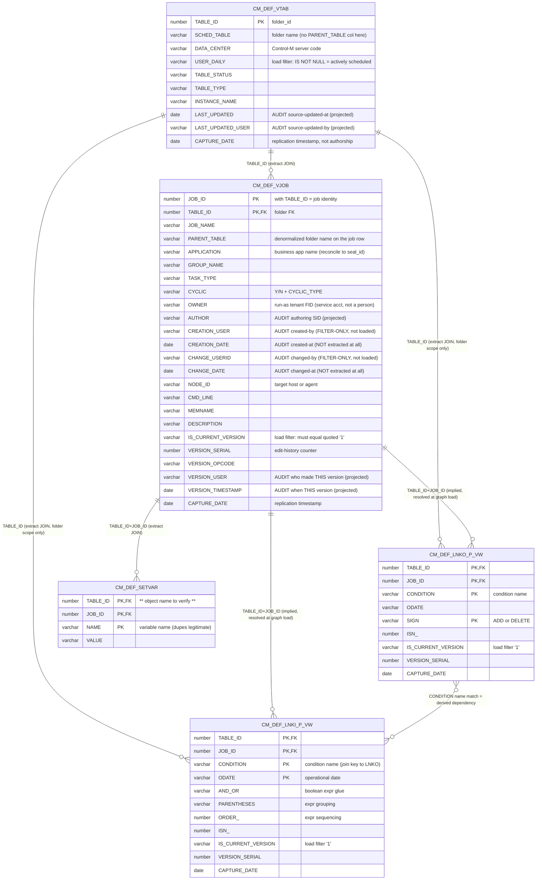

# 06a — Control-M source ER review (for the audit-fields gate session)

**Status: FOR SME REVIEW — feeds Phase 0 of
[`06-provenance-source-audit-fields.md`](06-provenance-source-audit-fields.md).**
Everything below is transcribed from the committed extracts
(`drydocs/loaders/sql/controlm_*.sql` — the authoritative CM_ names) and the
cypher loaders. Mechanism only; no data values.

## ER diagram — the psgmgr CM_ objects we extract from

Only projected/filter columns are shown (CM_DEF_VJOB has 100+; we project ~26).
`AUDIT` marks authorship/change columns relevant to the audit-envelope decision.

## Source → Neo4j label mapping (as the loaders write today)

| Extract | Source object(s) | Node label(s) MERGEd | Edges written |
|---|---|---|---|
| `controlm_folders` | `CM_DEF_VTAB` | **two nodes per row**: `:ControlMFolder:Collection {folder_id}` **and** `:ControlMServer:Platform {name: DATA_CENTER}` | `(folder)-[:SCHEDULED_ON]->(server)` |
| `controlm_jobs` | `CM_DEF_VJOB ⋈ CM_DEF_VTAB` | `:ControlMJob:Activity {folder_id, job_id}` | `(folder)-[:CONTAINS_JOB]->(job)` |
| `controlm_conditions_in` | `CM_DEF_LNKI_P_VW ⋈ CM_DEF_VTAB` | `:Condition:Entity` | `(job)-[:REQUIRES_IN_CONDITION]->(cond)` |
| `controlm_conditions_out` | `CM_DEF_LNKO_P_VW ⋈ CM_DEF_VTAB` | `:Condition:Entity` | `(job)-[:EMITS_OUT_CONDITION]->(cond)` |
| `controlm_dependencies` (derived) | LNKO ⋈ LNKI on `CONDITION` | none (matches existing jobs) | `(consumer)-[:WAS_INFORMED_BY {via_condition}]->(producer)` |
| `controlm_variables` | `CM_DEF_SETVAR ⋈ VJOB ⋈ VTAB` | **staging only — no graph node yet** (design decision open) | — |

(Every loader also writes `WAS_GENERATED_BY → :JobRun` per touched node — the
supernode pattern doc 06 proposes to retire. Second labels are the ontology
layer: `Collection`/`Activity`/`Entity`/`Platform` are the PROV/DPROD terms.)

## Audit-column inventory (the Phase-0 decision table)

| Object | Created by | Created at | Last changed by | Last changed at | Today |
|---|---|---|---|---|---|
| `CM_DEF_VTAB` (folder) | — (none on folder) | — | `LAST_UPDATED_USER` | `LAST_UPDATED` | **projected**, loaded to staging; not yet an envelope property |
| `CM_DEF_VJOB` (job) | `CREATION_USER` | `CREATION_DATE` | `CHANGE_USERID` | `CHANGE_DATE` | **filter-only / not extracted** — the doc-06 gap |
| `CM_DEF_VJOB` per-version | — | — | `VERSION_USER` | `VERSION_TIMESTAMP` | projected (this version's editor — differs from CHANGE_*?) |
| conditions / variables | — | — | inherit job/folder? | — | only `CAPTURE_DATE` |

Distinct people, not interchangeable: `OWNER` = run-as service FID;
`AUTHOR` = authoring SID; `CREATION_USER` = original creator;
`CHANGE_USERID`/`VERSION_USER` = last/this editor. `CAPTURE_DATE` is
replication time — never authorship.

## Questions for your feedback

- **Q1 — joins.** Conditions extracts join only `VTAB` (folder scope); the job
  link is resolved at graph-load by `(TABLE_ID, JOB_ID)` MATCH. Should they join
  `VJOB` in SQL instead (guaranteeing the job is current-version *in the same
  extract*)? Also: is `SETVAR → VJOB` on `(TABLE_ID, JOB_ID)` correct for
  folder-scope variables (header rows where `JOB_NAME = SCHED_TABLE`)?
- **Q2 — audit columns.** Confirm the envelope mapping per object (the table
  above), especially: does `CHANGE_USERID/CHANGE_DATE` duplicate
  `VERSION_USER/VERSION_TIMESTAMP` on the current version, or do they diverge
  (e.g. bulk migrations)? Exact `CREATION_DATE`/`CHANGE_DATE` column names need
  a data-dictionary probe — they're inferred from the `*_USER` twins.
- **Q3 — labels.** Confirm the two-labels-per-folder-row pattern
  (`ControlMFolder` + `ControlMServer` from `DATA_CENTER`) and whether
  variables should become nodes or stay properties/staging.

## SME resolutions (2026-07-07 — gate `controlm-q1q3-phase1`, see `config/gate-log.md`)

- **Q1 — RESOLVED: join in SQL.** Conditions and SETVAR extracts join `CM_DEF_VJOB`
  in the extract (current-version guaranteed there, not at graph load). Folder-scope
  header rows are `JOB_ID = 1` / `TASK_TYPE = SMART Table` (the folder itself).
  Load is two-pass: pass 1 = folder + job nodes in one extract; pass 2 = dependencies
  from a recursive in/out-condition query.
- **Q2 — RESOLVED: envelope = CREATION_* + CHANGE_*.** `VERSION_USER`/`VERSION_TIMESTAMP`
  duplicate `CHANGE_USERID`/`CHANGE_DATE` on the current version — excluded from the
  envelope. `USER`/`USER_ID` column-name variants are the same field. Derived
  `employee_sid` = `*_USER` minus the trailing `p` (kept distinct from the raw column).
  ⚠ `IS_CURRENT_VERSION` is unreliable across legacy vs new folders — domain-value
  probe required before it remains a hard filter.
- **Q3 — RESOLVED: labels confirmed; one addition.** Two-labels-per-folder-row stands.
  New: `:ControlMApplication:Collection` (from `CM_DEF_VJOB.APPLICATION` — the Control-M
  grouping, deliberately not the business `:Application`/SEAL concept) with
  `(:ControlMApplication)-[:CONTAINS_FOLDER]->(:ControlMFolder)` (`m3_contains_folder`,
  planned). Variables stay staging-only; node-vs-property deferred.
- **Identity:** `ctlm_id` = `TABLE_ID || '.' || JOB_ID` approved as a *derived* property
  alongside the `(folder_id, job_id)` node key. `MEMNAME` is demoted to informational —
  may duplicate `JOB_NAME` or hold junk; never a key or join (`cm_avg_run.JOB_MEM_NAME`
  joins on `JOB_NAME`).
- **Phase-1 scope:** initial load = `USER_DAILY IS NOT NULL` folders only, recorded as a
  **readability choice, not semantics** — `USER_DAILY` is a mutable scheduling mode
  (manual ↔ scheduled); manual-order folders (incl. parallel-run copies) run in
  production, and support ownership comes from the escalation-DB rule, never the name
  or this column. The review module decides retention of manual-order folders later.
