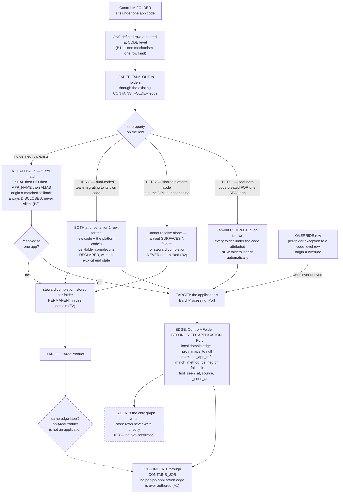

# K7 — how a folder gets its application

Working diagram for the `seal-app-ref-edge-reshape` gate session (backlog K7).
Rulings §A–§E. Dashed boxes are **not yet ruled**. Mechanism only — no real app
codes, SEAL ids, or folder names.

## Ruled so far

| § | Ruling |
|---|--------|
| A1 | Grain is FOLDER-level; jobs inherit via `CONTAINS_JOB`; no per-job edge authored going forward |
| A2 | UI crosswalk keeps deriving through job edges, and says so, until it re-binds at build |
| B1 | ONE mechanism: code-level rows, loader fans out via `CONTAINS_FOLDER`; `tier` is a row property |
| B2 | Three tiers — seal-born (1:1), platform (1:many), dual-coded/migrating; never auto-picked |
| B3 | K2 fuzzy match DEMOTES to fallback, and is always DISCLOSED via the origin flag |
| C1 | Tier-1 target is the application's BatchProcessing `:Port` (not the app node — supernode avoidance) |
| C2 | The `:Batch` bridge (`arch_contains_batch` / `arch_contains_folder`) is RETIRED |
| D1 | Local domain edge, `prov_maps_to: ~`, label `BELONGS_TO_APPLICATION` |
| D2 | One shape everywhere — loader edge, manual tier-5 writer, migration target |
| E2 | Defined rows are graph-loadable source of record; overrides may be PERMANENT in this domain |

Tier 3 is the same lesson §G3 proposes for orchestrators: **mid-migration is a normal
state, not a conflict.** Two axes, one rule.

## Still open

1. **The `:AreaProduct` edge label.** §D signed one edge, `BELONGS_TO_APPLICATION`, but
   tier-2 completions land on an `:AreaProduct`, which is not an application. Either the
   tier-2 edge needs its own name, or `:AreaProduct` is a routing step rather than a target.
2. **Bulk authoring** — is a folder naming-convention pattern a row generator, or a
   screen-level convenience?
3. **§E1** override mechanics, **§E3** write path, **§F** migration, **§G1–G7** the mapping act.
