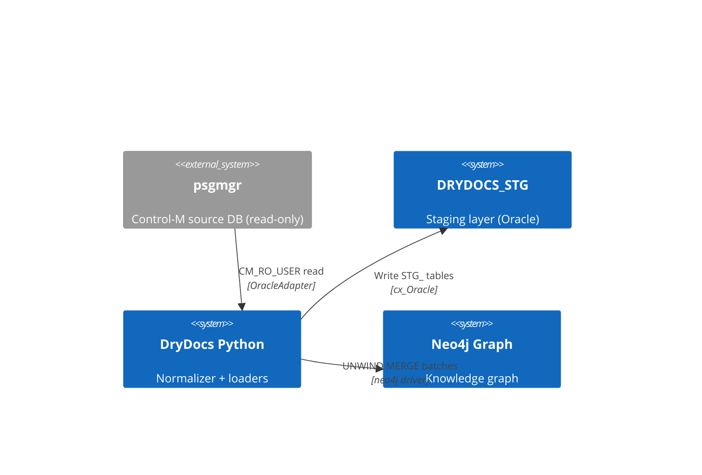

# DryDocs — Consolidated Work Plan

**Supersedes:** `persona-review-plan.md` (review COMPLETE; this plan owns next steps)
**Date:** 2026-06-18
**Branch:** `feature/oracle-ingestion` → company `psgmgr-base`

All work is organized into six streams. Each stream has its own gate, blocking
dependency, and priority tier. The streams run mostly in parallel; coupling points
are called out explicitly.

---

## How to read this plan

- **Gate** — what must be true before this stream can produce a working output.
- **Coupling** — which other stream or user action this stream hands off to or depends on.
- **Port disposition** — how work in this stream crosses to company `psgmgr-base`.
- **Priority** — P0 (blocker for production), P1 (same sprint), P2 (next sprint), P3 (backlog).

**Secrets discipline:** architecture-level only throughout. No real SIDs, data
values, credentials, server addresses, or company GHE org names committed.

---

## Stream A — Oracle Ingestion (iteration 1)

**Gate:** SQL Developer preflight answers (Q0.1, Q0.2, Q1, Q2, Q3).
**Port:** clean-add files + one append-only block in `cli.py`.
**Coupling:** A.4 (incremental loader) cannot ship to production until Stream B
(graph fixes) P0 items are complete.

### A.0 — SQL Developer preflight (user task — not automated)

Run `drydocs/loaders/sql/adhoc/preflight_open_questions.sql` against psgmgr.
Record **conclusions only** (never commit rows) in
`docs/reviews/feature-oracle-ingestion-plan.md §Open questions`.

| # | Question | Gates |
|---|---|---|
| Q0.1 | Does `TABLE_ID` collide across DCs? | Composite key assumption in STG_ DDL |
| Q0.2 | Do `MEMLIB`/`OVERLIB` columns exist? | §0.2 guard block in staging DDL |
| Q1 | Real object name for variable source (verify column-match in ALL_TAB_COLUMNS) | A.3 incremental predicates; A.4 loader |
| Q2 | Is `CAPTURE_DATE` per-row or uniform per snapshot? | HWM strategy: VERSION_SERIAL vs CAPTURE_DATE primary |
| Q3 | Do `CREATION_USER`/`CHANGE_USERID` exist on `CM_DEF_VJOB`? | `JOB_DEVELOPER_VIEW`; dev-SID graph edge |

### A.1 — Row model (P1)

File: `drydocs/models/controlm_loadcontrol.py` (new — clean-add)

- `LoadControlRow` dataclass: `source_object`, `data_center`, `hwm_version_serial`,
  `hwm_capture_date`, `load_mode`, `updated_at`, `rows_applied`
- `SampleManifestRow` dataclass: `run_id`, `scope_folder`, `developer_sid`,
  `row_cap`, `scenario_count`, `loaded_at`
- One import line in `drydocs/models/__init__.py` (isolated 1-line collision)

### A.2 — Supplement DDL fill-out (P1)

File: `drydocs/loaders/sql/ddl/controlm_staging_supplement_ddl.sql` (exists — extend)

Fill scaffold sections:
- `STG_LOAD_CONTROL` — CREATE OR REPLACE (gated on Q0.1 resolution)
- `STG_SAMPLE_MANIFEST` — CREATE OR REPLACE
- View extensions (`JOB_DETAILED_VIEW`, `JOB_DEVELOPER_VIEW`) — gated on Q2/Q3
- GRANT blocks — `CM_RO_USER` + `<PY_NORMALIZER_USER>` placeholders

### A.3 — Incremental extract predicates (P1)

Files: extend existing `drydocs/loaders/sql/controlm_jobs.sql` etc.
- Add `WHERE VERSION_SERIAL > :hwm_version_serial` predicate path (gated on Q2)
- Add `AND DATA_CENTER = :data_center` scope bind
- Add `CM_DEF_SETVAR` reference (gated on Q1 — use placeholder until verified)
- New: `drydocs/loaders/sql/incremental_changed_jobs.sql` — changed-job extract

### A.4 — IncrementalControlMLoader (P1)

File: `drydocs/loaders/controlm_incremental.py` (new — clean-add)

Sequence per batch:
1. Read HWM from Oracle `STG_LOAD_CONTROL`
2. Extract changed jobs (`VERSION_SERIAL > hwm`)
3. Open `:JobRun` in Neo4j
4. For each batch: cleanup stale graph edges → node upsert → edge re-assert → advance HWM
5. Annotate `:JobRun` with `load_mode`, `hwm_version_serial`, `rows_applied`

**Coupling:** requires Stream B P0 items (B.1, B.2, B.3) before running against
any production graph.

### A.5 — CLI surface (P1)

File: `drydocs/cli.py` (append-only — the only true collision with company side)

Append one block: `load-staging --incremental --data-center <dc>` command that
delegates to `IncrementalControlMLoader`. Never edit existing command bodies.

### A.6 — Tests (P2)

File: `tests/unit/test_oracle_incremental.py` (new — clean-add)

- HWM read/advance round-trip (mock Oracle)
- Changed-job extract produces correct predicates
- Batch loop: stale-edge cleanup fires before re-assert
- CLI command invokes loader with correct args

---

## Stream B — Graph Schema Fixes

**Gate:** none — can start immediately.
**Port:** Cypher files are canonical-here; take wholesale.
**Coupling:** B.1+B.2+B.3 must complete before Stream A (A.4) deploys to production.

### B.1 — RUNS_ON → SCHEDULED_ON (P0 — blocker)

Files: `drydocs/loaders/cypher/controlm_folders.cypher`

1. Update cypher to write `SCHEDULED_ON` not `RUNS_ON`
2. One-time data migration (run once on existing graph):
   ```cypher
   MATCH (f:JobFolder)-[r:RUNS_ON]->(srv:ControlMServer)
   MERGE (f)-[s:SCHEDULED_ON]->(srv)
     ON CREATE SET s.since = r.since, s.source = r.source, s.loader = r.loader
   SET s.last_seen_at = r.last_seen_at, s.last_run_id = r.last_run_id
   DELETE r;
   ```

### B.2 — stale_edge_cleanup.cypher (P0 — blocker)

File: `drydocs/loaders/cypher/stale_edge_cleanup.cypher` (new — clean-add)

```cypher
// Delete condition/invocation edges for changed jobs before re-asserting.
// Must run before controlm_conditions_in/out.cypher in each incremental batch.
UNWIND $changed_keys AS key
MATCH (j:ControlMJob {folder_id: key.folder_id, job_id: key.job_id})
OPTIONAL MATCH (j)-[r:REQUIRES_IN_CONDITION|EMITS_OUT_CONDITION]->()
DELETE r
```

### B.3 — datetime() wrapping (P0 — blocker)

Files: `controlm_jobs.cypher`, `controlm_folders.cypher`

Replace bare `row.capture_date` / `row.version_timestamp` / `row.last_updated` /
`row.active_from` / `row.active_till` with `datetime(row.<prop>)` in all SET
clauses. Confirm Oracle timestamp strings are ISO 8601 before this runs.

### B.4 — :ControlMFolder rename migration (P1)

File: `drydocs/schema/constraints.cypher` (add migration block)

```cypher
// Idempotent: no-op if rename already done
MATCH (n:JobFolder) WHERE NOT n:ControlMFolder
SET n:ControlMFolder REMOVE n:JobFolder;
// After migration, update constraint:
DROP CONSTRAINT folder_id IF EXISTS;
CREATE CONSTRAINT folder_id IF NOT EXISTS
  FOR (f:ControlMFolder) REQUIRE f.folder_id IS UNIQUE;
```

Until migration runs: keep loaders emitting `:JobFolder:Collection` dual label.

### B.5 — :JobRun HWM annotation (P1)

In `IncrementalControlMLoader` (Stream A.4), after advancing Oracle HWM:
```cypher
MERGE (run:JobRun {run_id: $run_id})
SET run.load_mode          = $load_mode,
    run.hwm_version_serial = $hwm_version_serial,
    run.hwm_capture_date   = datetime($hwm_capture_date),
    run.rows_applied       = $rows_applied
```

### B.6 — last_run_id index on condition edges (P1)

File: `drydocs/schema/constraints.cypher`

```cypher
CREATE INDEX conditions_in_last_run IF NOT EXISTS
  FOR ()-[r:REQUIRES_IN_CONDITION]-() ON (r.last_run_id);
CREATE INDEX conditions_out_last_run IF NOT EXISTS
  FOR ()-[r:EMITS_OUT_CONDITION]-() ON (r.last_run_id);
```

### B.7 — :Script and :File constraints (P2)

File: `drydocs/schema/constraints.cypher`

```cypher
CREATE CONSTRAINT script_path IF NOT EXISTS
  FOR (s:Script) REQUIRE s.executable_path IS UNIQUE;
CREATE CONSTRAINT file_key IF NOT EXISTS
  FOR (f:File) REQUIRE (f.canonical_path, f.date_token) IS NODE KEY;
```
Do not activate `STG_INVOCATION`/`STG_FILE_REF` loaders until these exist.

### B.8 — Drop stale m3_constraints_upgrade.cypher reference (P2)

In `controlm_jobs.cypher`: remove or create the referenced `m3_constraints_upgrade.cypher`
file. The correct NODE KEY is already in `constraints.cypher` with a DROP guard —
the stale comment is misleading.

---

## Stream C — Data Catalog & Lineage Integration

**Gate:** Stream B.1 (RUNS_ON fix) must be done before any lineage loader touches
the graph (avoids edge-type collision on `ControlMJob`). Constraints (C.1) must
precede any data load (C.5).
**Port:** clean-add new files; extend `constraints.cypher` (canonical-here).
**Reference:** `docs/patterns/data-catalog/` (7 files, all in `main`).

### C.1 — AppDataFlow + DataAsset constraints (P1)

File: `drydocs/schema/constraints.cypher`

```cypher
CREATE CONSTRAINT app_data_flow_urn IF NOT EXISTS
  FOR (f:AppDataFlow) REQUIRE f.dataflowUrn IS UNIQUE;
CREATE CONSTRAINT data_asset_id IF NOT EXISTS
  FOR (a:DataAsset) REQUIRE a.assetId IS UNIQUE;
CREATE INDEX data_asset_platform_idx IF NOT EXISTS
  FOR (a:DataAsset) ON (a.platform);
CREATE INDEX data_asset_name_idx IF NOT EXISTS
  FOR (a:DataAsset) ON (a.name);
```

### C.2 — Ontology supplement (P1)

File: extend `drydocs/schema/catalog_ontology_supplement.cypher`
(or new `data_lineage_supplement.cypher`)

- `AppDataFlow` → `prov:Activity` SUBCLASS_OF chain; DataHub `dataFlow` annotation
- `DataAsset` → `prov:Entity` SUBCLASS_OF chain; DataHub `dataset` annotation
- `HAS_DATA_FLOW`, `ORCHESTRATES`, `USED`, `GENERATED`, `REPRESENTS_CATALOG_DATASET`
  as `LocalRelationship` entries with PROV-O mapping

Update `drydocs/ontology/relationship_vocabulary.yaml` with the five new edge types
so the drift guard (`test_schema.py`) covers them.

### C.3 — AppDataFlow loader stub (P2)

File: `drydocs/loaders/app_data_flow_loader.py` (new — clean-add)

Populates one `:AppDataFlow` node per `(Application, data_center)` pair.
URN: `urn:li:dataFlow:{controlm,<folder_or_jobgroup_name>,<data_center>}`

```cypher
UNWIND $batch AS row
MATCH (app:Application {seal_id: row.seal_id})
MERGE (flow:AppDataFlow:Activity {dataflowUrn: row.dataflowUrn})
  ON CREATE SET flow.appId        = row.seal_id,
               flow.flowName      = row.flowName,
               flow.orchestrator  = 'controlm',
               flow.cluster       = row.data_center,
               flow.created_at    = datetime($loaded_at)
SET flow.last_run_id = $run_id
MERGE (app)-[:HAS_DATA_FLOW]->(flow)
```

After node creation, wire `ORCHESTRATES` from `AppDataFlow` to the folders/jobs it
owns (join via `Application.seal_id → ControlMJob.seal_app_ref`).

### C.4 — DataAsset loader stub (P2)

File: `drydocs/loaders/data_asset_loader.py` (new — clean-add)

Source: `STG_INVOCATION` (scripts/executables) and `STG_FILE_REF` (file objects)
parsed for input/output objects. Requires Stream B.7 constraints first.

Properties per asset:
- `assetId = 'urn:drydocs:dataasset:{platform}:{namespace}:{name}'`
- `platform`, `namespace`, `name`, `env`, `format`
- `isExternalFeed` — true for FileWatcher job inputs with no upstream ControlMJob
- `isSourceOfRecord` — set manually or via app-fact classifier

Edges: `(ControlMJob)-[:USED]->(DataAsset)` for inputs;
`(ControlMJob)-[:GENERATED]->(DataAsset)` for outputs.

### C.5 — CatalogDataset bridge (P3 — optional, additive)

```cypher
// Only when catalog URN is known and confirmed:
MATCH (a:DataAsset {assetId: $assetId})
MATCH (d:CatalogDataset {dataset_urn: $catalogUrn})
MERGE (a)-[:REPRESENTS_CATALOG_DATASET]->(d)
```

This edge is never blocking — populate it when the data catalog team can provide a
URN resolution API or a shared lookup table.

### C.6 — Lineage query library (P2)

File: `queries/lineage_queries.cypher` (new dir `queries/` — clean-add)

- End-to-end cross-platform path: `DataAsset {isExternalFeed} → ... → DataAsset {isSourceOfRecord}`
- Impact analysis: `ControlMJob → downstream conditions → affected Applications`
- Source-of-record lookup: `DataAsset {isSourceOfRecord} ← GENERATED ← ControlMJob ← Application`
- Cross-platform platform hop summary: extract `platform` from path nodes

---

## Stream D — SDLC Docs (cron: `drydocs-sdlc-docs`)

**Gate:** none — runs independently as a cron task.
**Checkpoint file:** `docs/reviews/SDLC-CHECKPOINT.md`
**Coupling:** should read Stream A plan as input for §FR and §UC sections; update
as oracle ingestion iteration 1 answers come in.

### D.1 — §C1 Mermaid context diagram — oracle ingestion (Phase 1 Task 1.1)

File: `docs/reviews/sdlc-oracle-ingestion.md §C1`



### D.2 — §C1 for neo4j schema (Task 1.2)

File: `docs/reviews/sdlc-neo4j-schema.md §C1`

Context diagram showing Neo4j as the consumer of the staging layer, with the new
`AppDataFlow` and `DataAsset` nodes added to the graph-plane view.

### D.3 — §DES deployment environment (Task 1.3)

Both SDLC docs: list platform, Neo4j version, Oracle version, Python version,
role placeholders (`CM_RO_USER`, `DRYDOCS_STG`, `<PY_NORMALIZER_USER>`).

### D.4 — §TM traceability matrix (Task 1.4)

`sdlc-oracle-ingestion.md §TM`: map each `FR-OI-*` to its implementation object.
`sdlc-neo4j-schema.md §TM`: map each constraint/index to the loader that depends on it.

---

## Stream E — PAT Ontology

**Gate:** none — independent of Oracle ingestion and catalog work.
**Port:** schema files are canonical-here.
**Reference:** `project_pat_ontology_analysis.md` memory (8-step implementation map).

### E.1 — AreaProduct SUBCLASS_OF wiring (P3)

File: `drydocs/schema/catalog_ontology_supplement.cypher`

```cypher
MATCH (lc:OntologyTerm:LocalClass {iri: "https://drydocs.local/ontology#AreaProduct"})
MATCH (pc:OntologyTerm:ProvClass {iri: "http://www.w3.org/ns/prov#Entity"})
MERGE (lc)-[r:SUBCLASS_OF]->(pc)
  ON CREATE SET r.source = "drydocs.catalog_supplement";
```

### E.2 — SUPPORTS range cleanup (P3)

Split `SUPPORTS` `range = "Product or AreaProduct"` (free-text ambiguity) into
`SUPPORTS_PRODUCT` and `SUPPORTS_AREA_PRODUCT` with distinct IRIs, or adopt the
`"dd:Product | dd:AreaProduct"` union notation in `relationship_vocabulary.yaml`.

### E.3 — HAS_MEMBERSHIP / WAS_ASSOCIATED_WITH (P2)

Once dev-SID graph edge is confirmed (gated on Q3 from Stream A.0):
- `(j:ControlMJob)-[:WAS_ASSOCIATED_WITH {role:'owner'|'author'|'version_user'}]->(e:Employee)`
- Normalize SID via `UPPER(REGEXP_REPLACE(sid,'p$',''))` before MATCH

---

## Stream F — Back-flow + Reorg

**Gate:** Streams A + B iteration 1 complete (stable file set on producer side).
**Reference:** `project_company_backflow_and_reorg.md` memory.

### F.1 — Company enhancement back-port (P3)

Sanitized reverse-port of company enhancements back to `ce-wilson/DryDocs`:
- Screenshot → reproduce generically (no internal data)
- Tree-snapshot drift tool (company `b86836f`) — adopt + enhance on producer side
- Wire drift tool as step-0 in `reconcile-port` skill

### F.2 — Tree-snapshot drift tool (P3)

Once F.1 adopted: enhance drift tool to surface Stream C additions (AppDataFlow,
DataAsset) in the snapshot comparison so drifts are caught before port.

---

## Summary — sequencing and gates

```
User runs SQL Developer preflight (A.0)
    │
    ├──▶ A.1 row model
    ├──▶ A.2 DDL fill-out  ──────────────────────────────────────┐
    ├──▶ A.3 extract predicates                                  │
    │                                                             │
    ▼  (parallel, no user gate)                                  │
B.1 RUNS_ON fix [P0]  ──▶ B.4 ControlMFolder rename [P1]        │
B.2 stale_edge_cleanup [P0]                                      │
B.3 datetime() fix [P0]  ──▶ B.5 JobRun annotation [P1]         │
B.6 condition edge index [P1]                                    │
    │                                                             │
    └── B.1+B.2+B.3 done ──────────────▶ A.4 IncrementalLoader ◀┘
                                              │
                                              ▼
                                         A.5 CLI  ──▶  A.6 Tests
    │
    ▼ (can parallel with A+B)
C.1 constraints  ──▶  C.2 supplement  ──▶  C.3 AppDataFlow loader
                                        ──▶  C.4 DataAsset loader  ──▶  C.5 bridge (P3)
                                        ──▶  C.6 query library

D.1–D.4  (independent cron; runs in parallel with all streams)
E.1–E.3  (independent; E.3 gated on A.0 Q3 answer)
F.1–F.2  (gated on A+B stability)
```

---

## Open decisions (carry-forward from persona review)

| # | Decision | Blocker for |
|---|---|---|
| D1 | Real variable source object name (`CM_DEF_SETVAR` or actual name) | A.3, A.4 |
| D2 | `CAPTURE_DATE` per-row or per-snapshot? | A.3 HWM strategy |
| D3 | `CREATION_USER`/`CHANGE_USERID` exist on `CM_DEF_VJOB`? | E.3, `JOB_DEVELOPER_VIEW` |
| D4 | Incremental cadence + staging retention window | A.2, A.4 |
| D5 | `RUNS_ON`→`SCHEDULED_ON` migration timing (before or with incremental deploy?) | B.1 |
| D6 | Is APOC available on Neo4j instance? | B.6 age-out cleanup tool choice |
| D7 | Full-load `:JobRun` supernode causing observable latency? | Prioritization of provenance restructure |
| D8-NEW | Can catalog team provide a URN resolution API or lookup table? | C.5 bridge edge |
| D9-NEW | Which Application/folder pairs should seed the first `AppDataFlow` nodes? | C.3 loader scope |

---

*Generated from: `persona-review-summary.md` (P0–P3 recs) + `persona-neo4j-architect.md §2.7`
(catalog addendum) + `feature-oracle-ingestion-plan.md` (iteration 1 units) +
`next-session-cron-prompt.md` (open questions). Supersedes the review-plan (now COMPLETE).*
