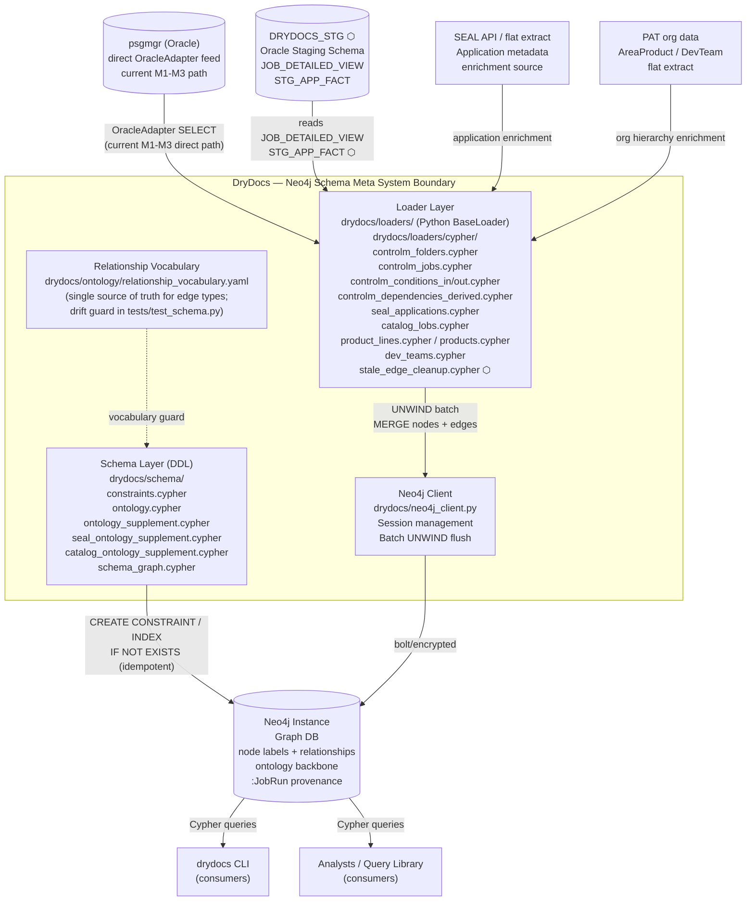
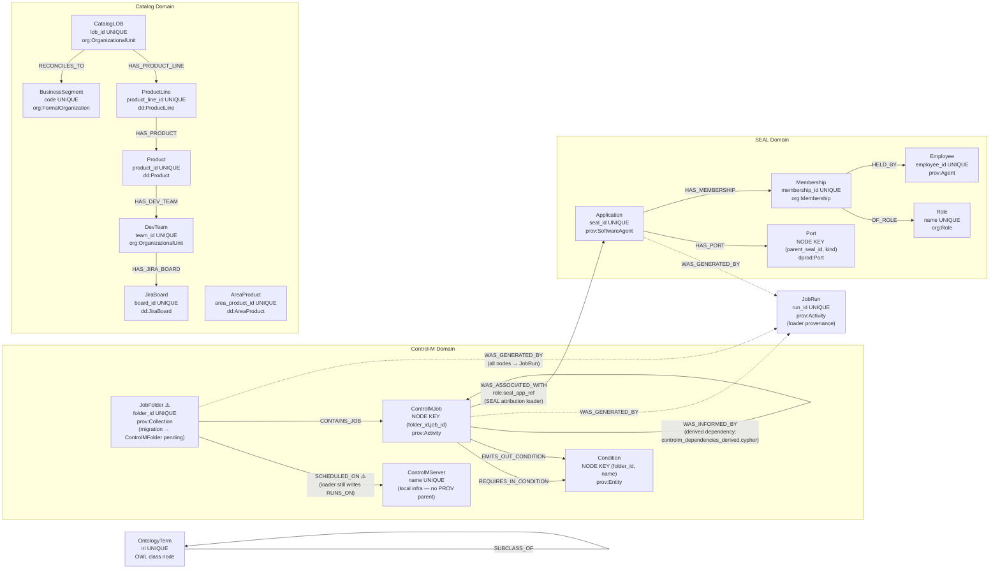

# Neo4j Schema Meta — Living SDLC Document

> **STATUS: Superseded (2026-07-01).** This review/plan is complete; its findings were rolled
> into `docs/decisions/` (ADRs), `MODULE_MAP.md`, and `docs/restructure/backlog.yaml`.
> Kept for historical reference.

<!-- §META -->
```yaml
persona: neo4j-architect
flow: neo4j-schema-meta
skills: neo4j-getting-started-skill, neo4j-modeling-skill, neo4j-cypher-skill
status: REVIEWED
version: 0.3
last_updated: 2026-06-25T12:38:42Z
populated_from: persona-neo4j-architect.md §2.1–2.6
diagrams_status: COMPLETE (§C1 flowchart, §DES/schema, §DES/ontology, §DES/incremental — cron tasks 2.1–2.4)
traceability_status: COMPLETE (§TM FR-NS-001 to FR-NS-018 — cron task 2.5)
verified_against: drydocs/schema/**, drydocs/loaders/cypher/**, drydocs/ontology/relationship_vocabulary.yaml, drydocs/loaders/base.py (cron task 2.6)
```

## §META — Scope and conventions

**Flow:** Define and maintain the Neo4j graph schema that represents Control-M
scheduling topology, SEAL application attribution, org hierarchy (PAT), and PROV-O
provenance. Provides idempotent incremental MERGE loading from DRYDOCS_STG. Ontology
is PROV-O aligned; relationship types registered in a single vocabulary file.

**Secrets discipline:** schema object names only; no real SIDs, data values,
credentials, org names, or server addresses.

**ID scheme:**
- Requirements: `FR-NS-NNN` (Functional Requirement, Neo4j Schema)
- Use Cases: `UC-NS-NNN`
- Open questions: `OQ-NS-N` (also tracked in persona-neo4j-architect.md §2.6)

**Status values per item:** `ACTIVE` | `PLANNED` | `PARTIAL` | `DEPRECATED`

**Cross-reference:** see `sdlc-oracle-ingestion.md` for the upstream Oracle ingestion
flow that feeds DRYDOCS_STG (the graph's data source).

---

## §FR — Functional Requirements

| ID | Requirement | Priority | Status | Implementation Object | Notes |
|---|---|---|---|---|---|
| FR-NS-001 | Schema SHALL enforce NODE KEY constraints on all composite-identity nodes before any loader executes | P0 | ACTIVE | `drydocs/schema/constraints.cypher` | IF NOT EXISTS guards make DDL idempotent |
| FR-NS-002 | Schema SHALL enforce UNIQUE constraints on all single-property identity nodes | P0 | ACTIVE | `constraints.cypher` | Includes :Application(seal_id), :Employee(employee_id), :JobRun(run_id), etc. |
| FR-NS-003 | Schema SHALL align every active node label to a PROV-O or W3C ORG class via SUBCLASS_OF chain | P0 | ACTIVE | `drydocs/schema/ontology_supplement.cypher`, `m3_ontology_supplement.cypher`, `seal_ontology_supplement.cypher`, `catalog_ontology_supplement.cypher` | All 9 PROV matrix rows declared |
| FR-NS-004 | Schema SHALL maintain a single relationship vocabulary registry; every active relationship type SHALL be registered before use | P0 | ACTIVE | `drydocs/ontology/relationship_vocabulary.yaml` | Drift guard in `tests/test_schema.py` enforces coverage |
| FR-NS-005 | Schema SHALL prohibit generic labels (`:Entity`, `:Node`) and generic relationship types (`:HAS`, `:RELATED_TO`) in the domain model | P0 | ACTIVE | Code review + drift guard | Enforced by convention and test |
| FR-NS-006 | Schema SHALL support idempotent MERGE for all node types: no duplicate nodes created on re-load | P0 | ACTIVE | UNWIND $batch + MERGE pattern in all loaders | Anchored on NODE KEY / UNIQUE constraints |
| FR-NS-007 | Schema SHALL track provenance for every loaded node via `(node)-[:WAS_GENERATED_BY {source:'BMC'}]->(run:JobRun)` | P0 | ACTIVE | All M3 loaders | One :JobRun node per loader execution; incremental runs produce low-degree :JobRun nodes |
| FR-NS-008 | Schema SHALL support per-job stale edge cleanup: delete condition and invocation edges for changed jobs before re-asserting the current edge set | P1 | PLANNED | `drydocs/loaders/cypher/stale_edge_cleanup.cypher` (new file needed) | Without this, removed conditions persist as phantom edges after incremental runs |
| FR-NS-009 | Schema SHALL store all date/timestamp properties as Neo4j temporal types using `datetime(row.field)` wrapping in Cypher | P1 | PLANNED | All M3 loader cypher files (fix needed) | Current state: raw strings break Neo4j temporal operators |
| FR-NS-010 | Schema SHALL support idempotent label migration via guarded migration blocks (MATCH n:OldLabel WHERE NOT n:NewLabel SET n:NewLabel REMOVE n:OldLabel) | P1 | PARTIAL | `constraints.cypher` migration blocks | :JobFolder→:ControlMFolder migration block needed |
| FR-NS-011 | Schema SHALL use `:ControlMFolder` as the canonical folder label; `:JobFolder` is the legacy label during migration only | P1 | PARTIAL | `constraints.cypher`, `controlm_folders.cypher` | Vocabulary says ControlMFolder; constraints/loaders still say JobFolder — half-applied |
| FR-NS-012 | Schema SHALL use `SCHEDULED_ON` (not `RUNS_ON`) as the folder→server relationship type | P0 | PARTIAL | `controlm_folders.cypher` | Vocabulary renamed RUNS_ON → SCHEDULED_ON; loader still writes RUNS_ON — fix needed before incremental ships |
| FR-NS-013 | Schema SHALL load SEAL application attribution via `(j:ControlMJob)-[:WAS_ASSOCIATED_WITH {role:'seal_app_ref'}]->(a:Application)` from `STG_APP_FACT` | P1 | ACTIVE | SEAL attribution loader | Maps to prov:wasAssociatedWith (Activity → Agent) |
| FR-NS-014 | Raw variable rows SHALL NOT become graph nodes; only semantic extracts (SEMANTIC_FACT, FLOW_REF subsets via STG_APP_FACT) enter the graph | P1 | ACTIVE | Design decision — no :ControlMVariable loader | Prevents 1.1M-node population for data that graph queries don't need |
| FR-NS-015 | Schema SHALL support developer SID attribution via `(j:ControlMJob)-[:WAS_ASSOCIATED_WITH {role:'owner'|'author'|...}]->(e:Employee)` when SID→Employee link is confirmed | P2 | PLANNED | Future job loader extension | Reuses :Employee (not a new :Developer type); SID normalized by `UPPER(REGEXP_REPLACE(sid,'p$',''))` |
| FR-NS-016 | Schema SHALL support periodic age-out cleanup of stale condition edges by `last_run_id` using server-side CALL IN TRANSACTIONS | P2 | PLANNED | Range index on REQUIRES_IN_CONDITION.last_run_id + cleanup Cypher | Fallback strategy (Strategy A) complementing per-job replacement (Strategy B) |
| FR-NS-017 | Incremental :JobRun nodes SHALL be annotated with load metadata: `load_mode`, `hwm_version_serial`, `rows_applied` from STG_LOAD_CONTROL | P2 | PLANNED | IncrementalControlMLoader Python code | Graph-side visibility of Oracle HWM state |
| FR-NS-018 | AreaProduct node SHALL have a SUBCLASS_OF wiring to prov:Entity to enable future PROV-O edge mapping | P3 | PLANNED | `catalog_ontology_supplement.cypher` | Currently deferred as "standalone local entity"; blocks future PROV mapping |

---

## §UC — Use Cases

### UC-NS-001: Full Graph Load (Baseline)

| Field | Value |
|---|---|
| Actor | Data Engineer / CLI (`drydocs` command) |
| Goal | Load all Control-M jobs, folders, conditions, and SEAL applications into Neo4j from DRYDOCS_STG |
| Preconditions | Constraints applied; DRYDOCS_STG populated (UC-OI-001 complete); `.env` configured |
| FR linkage | FR-NS-001, FR-NS-002, FR-NS-006, FR-NS-007, FR-NS-013, FR-NS-014 |
| Status | ACTIVE |

**Steps (dependency-ordered):**
1. Apply `constraints.cypher` (idempotent).
2. Apply ontology supplement cypher files.
3. Run `controlm_folders.cypher` (folders + servers).
4. Run `controlm_jobs.cypher` (jobs; depends on folders).
5. Run `controlm_conditions_in.cypher` / `controlm_conditions_out.cypher`.
6. Run SEAL attribution loader (depends on jobs + applications).
7. Log `:JobRun` node with `WAS_GENERATED_BY` on all loaded nodes.

**Postconditions:** Graph contains full current snapshot; all nodes have provenance edges to the `:JobRun` created in this run.

**Exceptions:**
- Constraint apply fails → stop; fix schema before loading.
- Loader error on a batch → `BaseLoader._flush` raises; run is aborted; re-run is safe (MERGE is idempotent).

---

### UC-NS-002: Incremental Graph Update

| Field | Value |
|---|---|
| Actor | Scheduled job / `IncrementalControlMLoader` |
| Goal | Merge only changed jobs into graph; clean up stale edges; preserve graph consistency |
| Preconditions | Baseline graph exists; `STG_LOAD_CONTROL` has HWM; `stale_edge_cleanup.cypher` deployed |
| FR linkage | FR-NS-006, FR-NS-007, FR-NS-008, FR-NS-017 |
| Status | PLANNED |

**Steps (per batch of changed jobs):**
1. Read changed job keys from `incremental_changed_jobs.sql`.
2. Execute `stale_edge_cleanup.cypher` (OPTIONAL MATCH + DELETE for condition/invocation edges).
3. Execute `controlm_jobs.cypher` (UNWIND $batch MERGE — only changed rows).
4. Execute `controlm_conditions_in.cypher` / `_out.cypher` (re-assert current edges).
5. Annotate `:JobRun` with `load_mode='INCREMENTAL'`, `hwm_version_serial`, `rows_applied`.

**Postconditions:** Graph reflects the delta; stale condition edges removed; `:JobRun` records load provenance.

**Exceptions:**
- Stale edge cleanup fails → do not proceed to node upsert; abort batch; retry from last committed HWM.
- Node upsert fails mid-batch → no HWM advance; safe to restart.

---

### UC-NS-003: Schema Constraint Application

| Field | Value |
|---|---|
| Actor | DBA / CI pipeline |
| Goal | Apply or re-apply all constraints and indexes to the Neo4j instance idempotently |
| Preconditions | Neo4j running; credentials in `.env` |
| FR linkage | FR-NS-001, FR-NS-002 |
| Status | ACTIVE |

**Steps:**
1. Execute `constraints.cypher` — all statements are `IF NOT EXISTS` guarded.
2. No manual cleanup needed; re-running is always safe.

**Postconditions:** All NODE KEY and UNIQUE constraints present; no duplicates can be created by MERGE.

---

### UC-NS-004: Label Migration (:JobFolder → :ControlMFolder)

| Field | Value |
|---|---|
| Actor | DBA |
| Goal | Complete the rename of :JobFolder to :ControlMFolder for all existing nodes |
| Preconditions | Migration Cypher block added to `constraints.cypher`; loaders still emit both labels (`:JobFolder:Collection`) |
| FR linkage | FR-NS-010, FR-NS-011 |
| Status | PLANNED |

**Steps:**
1. Run migration block: `MATCH (n:JobFolder) WHERE NOT n:ControlMFolder SET n:ControlMFolder REMOVE n:JobFolder`.
2. Drop old constraint: `DROP CONSTRAINT folder_id IF EXISTS` (keyed on :JobFolder).
3. Create new constraint: `CREATE CONSTRAINT folder_id IF NOT EXISTS FOR (f:ControlMFolder) REQUIRE f.folder_id IS UNIQUE`.
4. Update loaders to emit `:ControlMFolder:Collection` only (remove dual-label emit).

**Postconditions:** No `:JobFolder`-only nodes remain; `:ControlMFolder` constraint active; loaders emit canonical label.

---

### UC-NS-005: SEAL Application Attribution Query

| Field | Value |
|---|---|
| Actor | Analyst / Application |
| Goal | Find all Control-M jobs attributed to a given SEAL application |
| Preconditions | SEAL attribution loader has run; `WAS_ASSOCIATED_WITH` edges exist |
| FR linkage | FR-NS-013 |
| Status | ACTIVE |

**Query pattern:**
```cypher
MATCH (a:Application {seal_id: $seal_id})<-[:WAS_ASSOCIATED_WITH]-(j:ControlMJob)
RETURN j.folder_id, j.job_id, j.job_name, j.data_center
ORDER BY j.folder_id, j.job_id
```

---

### UC-NS-006: Ontology Term Browser Query

| Field | Value |
|---|---|
| Actor | Developer / Analyst |
| Goal | Traverse the ontology class hierarchy to understand node/edge semantics |
| Preconditions | Ontology supplement cypher files applied |
| FR linkage | FR-NS-003 |
| Status | ACTIVE |

**Query pattern:**
```cypher
MATCH (t:OntologyTerm:LocalClass)-[:SUBCLASS_OF*1..3]->(p:OntologyTerm)
RETURN t.label, t.iri, p.label, p.iri
ORDER BY t.label
```

---

### UC-NS-007: Stale Edge Age-Out Cleanup

| Field | Value |
|---|---|
| Actor | Scheduled job / DBA |
| Goal | Remove condition edges not re-asserted in recent incremental runs (age-out / Strategy A fallback) |
| Preconditions | Range index on `REQUIRES_IN_CONDITION.last_run_id` exists; cutoff `run_id` determined |
| FR linkage | FR-NS-016 |
| Status | PLANNED |

**Query pattern:**
```cypher
MATCH ()-[r:REQUIRES_IN_CONDITION|EMITS_OUT_CONDITION]->()
WHERE r.last_run_id < $cutoff_run_id
CALL (r) {
  DELETE r
} IN TRANSACTIONS OF 10000 ROWS ON ERROR CONTINUE REPORT STATUS AS s
RETURN count(*), s.committed
```

---

## §DEP — Dependencies

| System | Role | Interface | Access Pattern | Notes |
|---|---|---|---|---|
| **DRYDOCS_STG** | Upstream data source | `JOB_DETAILED_VIEW`, `STG_APP_FACT` | Read via OracleAdapter; same Oracle DB connection | Feed for all M3 loaders |
| **Neo4j Instance** | Graph database target | Python `neo4j` driver; `NEO4J_URI`/`USERNAME`/`PASSWORD`/`DATABASE` in `.env` | Write/read; UNWIND batches | Existing 5.x instance |
| **neo4j_client.py** | Driver session management | `drydocs/neo4j_client.py` | Python object; wraps driver | Internal DryDocs framework |
| **BaseLoader** | Batch flush abstraction | `drydocs/loaders/` Python base class | `_flush(batch_size=1000)` pattern | Reused by all loaders including incremental |
| **constraints.cypher** | Schema DDL | Cypher; run before loaders | Idempotent; `IF NOT EXISTS` guards | Applied once per environment setup; re-runnable |
| **relationship_vocabulary.yaml** | Relationship type registry | YAML; `drydocs/ontology/` | Parsed by `test_schema.py` drift guard | Single source of truth for edge types |
| **SEAL** (via staging) | Application metadata | Pre-enriched in `STG_APP_FACT` | Indirect — SEAL data enters via Oracle ingestion flow | No direct Neo4j→SEAL connection |
| **PAT** (via staging) | Org hierarchy | Pre-loaded `:AreaProduct`, `:DevTeam` etc. | Indirect | Same pattern as SEAL |
| **APOC** | Optional: `apoc.periodic.iterate` | Neo4j APOC plugin | Used for age-out cleanup if available | **OQ-NS-3: APOC availability unconfirmed** |

---

## §C1 — C1 Context Diagram

<!-- verified against drydocs/schema/, drydocs/loaders/cypher/, drydocs/ontology/ on 2026-06-25 -->
<!-- ⬡ = PLANNED; all other nodes/edges are ACTIVE -->



**Legend:**
- ⬡ = PLANNED (feature/oracle-ingestion); all un-marked nodes/edges are ACTIVE
- Current path: psgmgr → OracleAdapter → Loader → Neo4j (direct, no STG)
- Schema DDL applied once per environment; loaders run on schedule
- `relationship_vocabulary.yaml` is the design gate; any new edge type must appear there first

---

## §DES — Design Diagrams

### §DES/schema — Graph Node-Relationship Schema

<!-- verified against constraints.cypher + relationship_vocabulary.yaml on 2026-06-25 -->
<!-- ⚠️ = known issue / migration pending; ⬡ = PLANNED; solid = ACTIVE -->



**Key known issues (from constraints.cypher vs vocabulary):**
- ⚠️ `JobFolder` constraint still keyed on `:JobFolder` — migration to `:ControlMFolder` is PARTIAL (FR-NS-010, FR-NS-011)
- ⚠️ `controlm_folders.cypher` writes `RUNS_ON` — must be updated to `SCHEDULED_ON` before incremental ships (FR-NS-012)
- ⬡ PLANNED active relationships (not shown): `SUPPORTS` (DevTeam → AreaProduct/Product), `HAS_AREA_PRODUCT` (Product → AreaProduct), `HAS_APPLICATION` (Product → Application), `WAS_ASSOCIATED_WITH {role:owner}` (ControlMJob → Employee — FR-NS-015)
- Other node types with constraints declared but not yet actively loaded: `:Asset`, `:Dataset`, `:Distribution`, `:LineageRun`, `:QualityMeasurement`, `:Metric`, `:Dimension`, `:Company`, `:ServiceNowGroup`, `:File`, `:Channel`, snapshot nodes. For `:QualityMeasurement`/`:Metric`/`:Dimension` this is RULED, not an oversight: gate C23 (SME, 2026-08-03) kept the bootstrap-seeded Metric/Dimension reference catalog and DEFERRED the measurement leg until a measurement feed exists (revival trigger recorded in `ontology.cypher`; edges registered as `c23_*` in `relationship_vocabulary.yaml` — IN_DIMENSION active, the other three planned)

### §DES/ontology — Ontology Class Hierarchy

<!-- verified against ontology_supplement.cypher, seal_ontology_supplement.cypher,
     catalog_ontology_supplement.cypher, relationship_vocabulary.yaml on 2026-06-25 -->

```mermaid
graph BT

  %% ── W3C PROV-O root classes (seeded by ontology.cypher) ─────────────────
  subgraph PROVO ["PROV-O (W3C Recommendation)"]
    PROV_ACT["prov:Activity"]
    PROV_ENT["prov:Entity\n(prov:Collection ⊑ prov:Entity)"]
    PROV_COLL["prov:Collection"]
    PROV_AGT["prov:Agent"]
    PROV_SW["prov:SoftwareAgent\n(⊑ prov:Agent)"]
  end

  %% ── W3C ORG root classes (seeded by ontology.cypher) ────────────────────
  subgraph ORG ["W3C ORG Ontology"]
    ORG_ORG["org:Organization"]
    ORG_FORM["org:FormalOrganization\n(⊑ org:Organization)"]
    ORG_UNIT["org:OrganizationalUnit\n(⊑ org:Organization)"]
    ORG_MEMB["org:Membership"]
    ORG_ROLE["org:Role"]
  end

  %% ── DryDocs local classes (Control-M) ────────────────────────────────────
  subgraph CTM_ONT ["dd: Control-M classes"]
    DD_CMJ["dd:ControlMJob"]
    DD_CMF["dd:JobFolder\n(→ ControlMFolder migration pending)"]
    DD_COND["dd:Condition"]
    DD_CMS["dd:ControlMServer\n(local infra — no PROV parent)"]
    DD_JR["dd:JobRun"]
  end

  %% ── DryDocs local classes (SEAL) ─────────────────────────────────────────
  subgraph SEAL_ONT ["dd: SEAL classes"]
    DD_APP["dd:Application"]
    DD_EMP["dd:Employee"]
    DD_PORT["dd:Port\n(dprod:Port)"]
    DD_MEMB["dd:Membership"]
    DD_ROLE["dd:Role"]
  end

  %% ── DryDocs local classes (Catalog) ─────────────────────────────────────
  subgraph CAT_ONT ["dd: Catalog classes (local — no W3C parent)"]
    DD_LOB["dd:CatalogLOB"]
    DD_BS["dd:BusinessSegment"]
    DD_DT["dd:DevTeam"]
    DD_AP["dd:AreaProduct ⬡"]
    DD_PL["dd:ProductLine\n(local only)"]
    DD_PROD["dd:Product\n(local only)"]
    DD_JB["dd:JiraBoard\n(local only)"]
  end

  %% ── PROV-O internal hierarchy ─────────────────────────────────────────────
  PROV_SW -->|"⊑"| PROV_AGT
  PROV_COLL -->|"⊑"| PROV_ENT

  %% ── W3C ORG internal hierarchy ────────────────────────────────────────────
  ORG_FORM -->|"⊑"| ORG_ORG
  ORG_UNIT -->|"⊑"| ORG_ORG

  %% ── Confirmed SUBCLASS_OF wirings (solid) ─────────────────────────────────
  DD_CMJ -->|"SUBCLASS_OF\n(ontology_supplement.cypher)"| PROV_ACT
  DD_CMF -->|"SUBCLASS_OF\n(ontology_supplement.cypher)"| PROV_COLL
  DD_APP -->|"SUBCLASS_OF\n(seal_ontology_supplement.cypher)"| PROV_SW
  DD_EMP -->|"SUBCLASS_OF\n(seal_ontology_supplement.cypher)"| PROV_AGT
  DD_LOB -->|"SUBCLASS_OF\n(catalog_ontology_supplement.cypher)"| ORG_UNIT
  DD_BS  -->|"SUBCLASS_OF\n(catalog_ontology_supplement.cypher)"| ORG_FORM
  DD_DT  -->|"SUBCLASS_OF\n(catalog_ontology_supplement.cypher)"| ORG_UNIT

  %% ── Vocabulary-declared mappings (wiring not yet seen in supplement cypher)
  DD_COND -.->|"vocabulary: prov:Entity\n(SUBCLASS_OF wiring not confirmed in supplement)"| PROV_ENT
  DD_JR -.->|"vocabulary: prov:Activity\n(wiring not confirmed in supplement)"| PROV_ACT
  DD_MEMB -.->|"vocabulary: org:Membership\n(class declared; SUBCLASS_OF not wired)"| ORG_MEMB
  DD_ROLE -.->|"vocabulary: org:Role\n(class declared; SUBCLASS_OF not wired)"| ORG_ROLE
  DD_AP -.->|"PLANNED ⬡ prov:Entity\n(FR-NS-018)"| PROV_ENT
```

<!-- solid arrow = SUBCLASS_OF confirmed in cypher file -->
<!-- dashed arrow = declared in vocabulary but SUBCLASS_OF not seen in supplement cypher -->
<!-- ⬡ = PLANNED wiring (FR-NS-018) -->



**Findings:**
- 7 confirmed `SUBCLASS_OF` wiring points across 3 supplement files
- `dd:ControlMServer` is declared as a LocalClass but intentionally has no PROV-O parent (local infra — vocabulary note says: NOT an Agent, cannot use `prov:wasAssociatedWith`)
- `dd:Condition`, `dd:JobRun`: vocabulary maps to PROV-O but supplement SUBCLASS_OF block not yet confirmed (may be in `ontology.cypher` base — verify)
- `dd:AreaProduct`: wiring to `prov:Entity` is PLANNED per FR-NS-018; currently standalone local entity
- `dd:ProductLine`, `dd:Product`, `dd:JiraBoard`: local-only; no W3C parent declared or needed

### §DES/incremental — Incremental Graph Load Sequence

<!-- ALL graph-side incremental steps are PLANNED (feature/oracle-ingestion) -->
<!-- Reference files: drydocs/loaders/cypher/controlm_jobs.cypher (ACTIVE),
     drydocs/loaders/cypher/controlm_conditions_in.cypher (ACTIVE),
     drydocs/loaders/cypher/controlm_conditions_out.cypher (ACTIVE),
     drydocs/loaders/cypher/stale_edge_cleanup.cypher (NEW FILE NEEDED — FR-NS-008),
     drydocs/loaders/incremental_controlm.py (PLANNED — orchestrator),
     drydocs/loaders/sql/ddl/controlm_staging_supplement_ddl.sql (STG_LOAD_CONTROL DDL) -->

```mermaid
sequenceDiagram
    actor Actor as Scheduler / Data Engineer
    participant INC as IncrementalControlMLoader ⬡<br/>drydocs/loaders/incremental_controlm.py
    participant ORACLE as Oracle (psgmgr / STG_LOAD_CONTROL ⬡)<br/>changed-job keys via incremental_changed_jobs.sql
    participant NEO as Neo4j Instance<br/>drydocs/neo4j_client.py
    participant JR as :JobRun node<br/>(in Neo4j)

    Actor->>INC: run_incremental(data_center, batch_size=1000)
    INC->>NEO: MERGE :JobRun {run_id, kind='load', load_mode='INCREMENTAL', status='STARTED'}

    INC->>ORACLE: SELECT changed job keys (VERSION_SERIAL > hwm)<br/>via incremental_changed_jobs.sql ⬡
    ORACLE-->>INC: changed_keys list (folder_id, job_id per changed job)

    alt no changed keys
        INC->>JR: SET status='NO_CHANGES', completed_at
        INC-->>Actor: LoadSummary(rows=0, NO_CHANGES)
    else changed keys found
        loop per batch of 1 000 changed jobs
            INC->>NEO: stale_edge_cleanup.cypher ⬡<br/>UNWIND $changed_keys AS key<br/>MATCH (j:ControlMJob {folder_id:key.folder_id, job_id:key.job_id})<br/>OPTIONAL MATCH (j)-[r:REQUIRES_IN_CONDITION|EMITS_OUT_CONDITION]->(c)<br/>DELETE r
            Note over INC,NEO: Removes stale condition edges before re-assert (FR-NS-008)

            INC->>NEO: controlm_jobs.cypher (ACTIVE)<br/>UNWIND $batch AS row<br/>MERGE (j:ControlMJob {folder_id:row.folder_id, job_id:row.job_id})<br/>SET j += row properties<br/>MERGE (j)-[:WAS_GENERATED_BY]->(run:JobRun {run_id:$run_id})

            INC->>NEO: controlm_conditions_in.cypher (ACTIVE)<br/>UNWIND $batch AS row<br/>MERGE (c:Condition {folder_id:row.folder_id, name:row.condition_name})<br/>MERGE (j)-[:REQUIRES_IN_CONDITION]->(c)

            INC->>NEO: controlm_conditions_out.cypher (ACTIVE)<br/>UNWIND $batch AS row<br/>MERGE (c:Condition {folder_id:row.folder_id, name:row.condition_name})<br/>MERGE (j)-[:EMITS_OUT_CONDITION]->(c)

            INC->>ORACLE: COMMIT + advance STG_LOAD_CONTROL HWM ⬡<br/>(SET hwm_version_serial = MAX(batch.version_serial))
            Note over INC,ORACLE: HWM advances only after Neo4j commit; ensures restart safety
        end

        INC->>JR: SET :JobRun.status='OK', completed_at,<br/>load_mode='INCREMENTAL', hwm_version_serial, rows_applied ⬡
        INC-->>Actor: LoadSummary(rows_processed, status='OK')
    end

    Note over INC,NEO: ⬡ = PLANNED; controlm_jobs/conditions cypher files are ACTIVE (reused from full-load)
    Note over NEO: Fallback (Strategy A): age-out by last_run_id via CALL IN TRANSACTIONS (FR-NS-016 ⬡)
```

---

## §TM — Traceability Matrix

<!-- generated 2026-06-25; verified against §FR, §UC, drydocs/schema/, drydocs/loaders/cypher/,
     drydocs/ontology/relationship_vocabulary.yaml, drydocs/loaders/base.py -->

| FR | UC(s) | Implementation Object(s) | Status | Blocking OQ |
|---|---|---|---|---|
| FR-NS-001 | UC-NS-003 | `drydocs/schema/constraints.cypher` (all NODE KEY constraints; IF NOT EXISTS guards) | ACTIVE | — |
| FR-NS-002 | UC-NS-003 | `drydocs/schema/constraints.cypher` (all UNIQUE constraints) | ACTIVE | — |
| FR-NS-003 | UC-NS-006 | `drydocs/schema/ontology_supplement.cypher`; `seal_ontology_supplement.cypher`; `catalog_ontology_supplement.cypher` | ACTIVE (7 confirmed SUBCLASS_OF wirings; see §DES/ontology) | — |
| FR-NS-004 | UC-NS-001, UC-NS-002 | `drydocs/ontology/relationship_vocabulary.yaml`; drift guard: `tests/test_schema.py` | ACTIVE | — |
| FR-NS-005 | UC-NS-001 | Code review convention + drift guard (`tests/test_schema.py`) | ACTIVE | — |
| FR-NS-006 | UC-NS-001, UC-NS-002 | All loader cypher files: `controlm_jobs.cypher`, `controlm_folders.cypher`, `controlm_conditions_in.cypher`, `controlm_conditions_out.cypher`, `controlm_dependencies_derived.cypher` | ACTIVE | — |
| FR-NS-007 | UC-NS-001 | `drydocs/loaders/base.py` (`_open_run`, `_close_run` → `:JobRun` MERGE); all M3 loader cypher files | ACTIVE | OQ-NS-2 (full-load JobRun supernode latency) |
| FR-NS-008 | UC-NS-002 | `drydocs/loaders/cypher/stale_edge_cleanup.cypher` (**NEW FILE NEEDED**) | PLANNED | — |
| FR-NS-009 | UC-NS-001 | Fix `datetime()` wrapping in all M3 loader cypher files (`controlm_jobs.cypher` date strings) | PLANNED (fix needed) | — |
| FR-NS-010 | UC-NS-004 | `drydocs/schema/constraints.cypher` (migration blocks: `MATCH n:JobFolder ... SET n:ControlMFolder`) | PARTIAL (migration block not yet added) | — |
| FR-NS-011 | UC-NS-004 | `drydocs/schema/constraints.cypher` + `drydocs/loaders/cypher/controlm_folders.cypher` | PARTIAL (constraints still keyed on `:JobFolder`; loader still emits `:JobFolder`) | — |
| FR-NS-012 | UC-NS-001 | `drydocs/loaders/cypher/controlm_folders.cypher` (must change `RUNS_ON` → `SCHEDULED_ON`) | PARTIAL (vocabulary renamed; loader not updated) | OQ-NS-1 (migration order before incremental deploy) |
| FR-NS-013 | UC-NS-005 | SEAL attribution loader cypher (reads `STG_APP_FACT`); `WAS_ASSOCIATED_WITH {role:'seal_app_ref'}` edge | ACTIVE | — |
| FR-NS-014 | UC-NS-001 | Design decision: no `:ControlMVariable` loader written | ACTIVE | — |
| FR-NS-015 | UC-NS-001 (future) | Future extension of `controlm_jobs.cypher`; SID normalized by `JOB_DEVELOPER_VIEW` (see `sdlc-oracle-ingestion.md` FR-OI-015) | PLANNED | OQ-OI-3 (CREATION_USER / CHANGE_USERID existence on CM_DEF_VJOB) |
| FR-NS-016 | UC-NS-007 | Age-out Cypher (`CALL IN TRANSACTIONS ON ERROR CONTINUE`); range index on `REQUIRES_IN_CONDITION.last_run_id` | PLANNED | OQ-NS-3 (APOC vs native CALL IN TRANSACTIONS) |
| FR-NS-017 | UC-NS-002 | `drydocs/loaders/incremental_controlm.py` (PLANNED); adds `load_mode`, `hwm_version_serial`, `rows_applied` to `:JobRun` | PLANNED | — |
| FR-NS-018 | UC-NS-006 | `drydocs/schema/catalog_ontology_supplement.cypher` (add SUBCLASS_OF → `prov:Entity` for `dd:AreaProduct`) | PLANNED | — |

---

## §SRC — Source Views and Schema Files

### Schema definition files (Neo4j DDL layer)

| File | Role | Status |
|---|---|---|
| `drydocs/schema/ontology.cypher` | Base W3C ontology bootstrap: DPROD, DCAT, PROV-O, DQV, ORG anchor terms seeded as `:OntologyTerm:*Class` nodes; SchedulerKind, BusinessSegment, DQV catalog | ACTIVE; apply first before supplements |
| `drydocs/schema/constraints.cypher` | NODE KEY + UNIQUE constraints; migration blocks | ACTIVE; :ControlMFolder migration block NEEDED (currently still `:JobFolder`) |
| `drydocs/schema/ontology_supplement.cypher` | Control-M domain ontology (was incorrectly named `m3_ontology_supplement.cypher` in prior docs); wires dd:JobFolder→prov:Collection, dd:ControlMJob→prov:Activity | ACTIVE |
| `drydocs/schema/seal_ontology_supplement.cypher` | SEAL domain ontology: dd:Application→prov:SoftwareAgent, dd:Employee→prov:Agent; HAS_PORT/HAS_MEMBERSHIP/OF_ROLE/HELD_BY LocalRelationship declarations | ACTIVE |
| `drydocs/schema/catalog_ontology_supplement.cypher` | Catalog domain ontology: dd:CatalogLOB/DevTeam→org:OrganizationalUnit, dd:BusinessSegment→org:FormalOrganization; RECONCILES_TO/HAS_PRODUCT_LINE/HAS_PRODUCT/HAS_DEV_TEAM declarations | ACTIVE |
| `drydocs/schema/schema_graph.cypher` | **GENERATED** from `relationship_vocabulary.yaml`; creates `:SchemaMeta` exemplar nodes + edges for `CALL db.schema.visualization()` and meta-graph browsing; regenerate when vocabulary changes | ACTIVE (auto-generated; uses ControlMFolder label) |
| `drydocs/ontology/relationship_vocabulary.yaml` | Single registry of all relationship types + PROV-O mapping | ACTIVE; drift guard in test_schema.py |

### Cypher loader files (load layer)

| File | Role | Status | Issues |
|---|---|---|---|
| `drydocs/loaders/cypher/controlm_folders.cypher` | :ControlMFolder + :ControlMServer MERGE; SCHEDULED_ON edge | ACTIVE | Writes `RUNS_ON` — must change to `SCHEDULED_ON` (P0) |
| `drydocs/loaders/cypher/controlm_jobs.cypher` | :ControlMJob MERGE; CONTAINS_JOB; WAS_GENERATED_BY | ACTIVE | Date strings not wrapped with `datetime()` (P0) |
| `drydocs/loaders/cypher/controlm_conditions_in.cypher` | :Condition MERGE; REQUIRES_IN_CONDITION edge | ACTIVE | Correct pattern; stale-edge cleanup precedes this |
| `drydocs/loaders/cypher/controlm_conditions_out.cypher` | :Condition MERGE; EMITS_OUT_CONDITION edge | ACTIVE | Same as above |
| `drydocs/loaders/cypher/stale_edge_cleanup.cypher` | Delete condition/invocation edges before re-assert | **NEEDED** | New file required for incremental (FR-NS-008) |
| `drydocs/loaders/cypher/area_products.cypher` | MERGE :AreaProduct + HAS_AREA_PRODUCT (Product→AreaProduct) + HAS_DEV_TEAM (AreaProduct→DevTeam) | PLANNED | Part of PAT org hierarchy load |
| `drydocs/loaders/cypher/pat_product_mapping.cypher` | MERGE HAS_APPLICATION (Product→Application) + SUPPORTS (DevTeam→Product/AreaProduct) | PLANNED | PAT application attribution |
| `drydocs/loaders/cypher/pat_team_roles.cypher` | MERGE HAS_MEMBERSHIP (DevTeam→Membership) + OF_ROLE + HELD_BY for PAT role holders | PLANNED | PAT team role membership load |
| `drydocs/loaders/controlm_folders.py` | Python wrapper for folders loader | ACTIVE | — |
| `drydocs/loaders/controlm_jobs.py` | Python wrapper for jobs loader | ACTIVE | — |
| `drydocs/loaders/incremental_controlm.py` | IncrementalControlMLoader orchestrator | **PLANNED** | New file (FR-NS-008, FR-NS-017) |

### Upstream staging objects read by graph loaders

| Staging object | Read by | Purpose |
|---|---|---|
| `JOB_DETAILED_VIEW` | `controlm_jobs.py` | Full job extract; developer SID normalization inline |
| `STG_APP_FACT` | SEAL attribution loader | SEAL application-attributed semantic variable facts |
| `STG_LOAD_CONTROL` | `IncrementalControlMLoader` (planned) | HWM for changed-job extract |

---

## §OQ — Open Questions

| ID | Question | Blocks | Source |
|---|---|---|---|
| OQ-NS-1 | Should `RUNS_ON`→`SCHEDULED_ON` migration run before or at the same time as incremental loader deploy? | FR-NS-012 deploy order | persona-neo4j-architect.md §2.6 D5 |
| OQ-NS-2 | Is the full-load `:JobRun` supernode (300K+ `WAS_GENERATED_BY` edges) causing observable query latency in the current environment? | Prioritization of provenance restructuring (FR-NS-007) | persona-neo4j-architect.md §2.6 D7 |
| OQ-NS-3 | Is APOC available on the Neo4j instance? | Age-out cleanup method: `apoc.periodic.iterate` vs native `CALL IN TRANSACTIONS` (FR-NS-016) | persona-neo4j-architect.md §2.6 D6 |
| OQ-NS-4 | Should `m3_constraints_upgrade.cypher` be created or should the stale reference in `controlm_jobs.cypher` comment be removed? | Developer clarity; no functional block | persona-neo4j-architect.md §2.1 gap 2 |

---

## §XREF — Cross-References to Oracle Ingestion Flow

<!-- cross-reference to sdlc-oracle-ingestion.md; generated 2026-06-25 cron task 3.1 -->

### Graph loader cypher files → Oracle STG source objects

| Graph Loader (this doc) | Cypher file | Oracle Source (sdlc-oracle-ingestion.md) | Status |
|---|---|---|---|
| ControlMJobsLoader | `controlm_jobs.cypher` | `JOB_DETAILED_VIEW` (DRYDOCS_STG) or `CM_DEF_VJOB` direct | ACTIVE |
| ControlMFoldersLoader | `controlm_folders.cypher` | `JOB_DETAILED_VIEW` folder columns or `CM_DEF_VTAB` direct | ACTIVE |
| ControlMConditionsInLoader | `controlm_conditions_in.cypher` | `CM_DEF_LNKI_P_VW` (direct psgmgr) | ACTIVE |
| ControlMConditionsOutLoader | `controlm_conditions_out.cypher` | `CM_DEF_LNKO_P_VW` (direct psgmgr) | ACTIVE |
| ControlMDependenciesDerivedLoader | `controlm_dependencies_derived.cypher` | `controlm_dependencies_recursive.sql` → `CM_DEF_VJOB` (recursive with cycle detection) | ACTIVE |
| SEAL attribution loader | (seal attribution cypher) | `STG_APP_FACT` ⬡ (populated by Python normalizer from CM_DEF_SETVAR) | PLANNED |
| IncrementalControlMLoader ⬡ | feeds above cypher files | `STG_LOAD_CONTROL.hwm_version_serial` + `incremental_changed_jobs.sql` | PLANNED |

### FR interdependencies from Neo4j Schema → Oracle Ingestion

| Neo4j Schema FR | Upstream dependency in Oracle Ingestion FR | Nature |
|---|---|---|
| FR-NS-013 (SEAL graph attribution) | FR-OI-007 (STG_APP_FACT must be populated) | Graph attribution loader reads STG_APP_FACT; blocked if normalizer hasn't run or OQ-OI-1 unresolved |
| FR-NS-008/017 (stale edge cleanup + JobRun annotation) | FR-OI-009/010/012 (Oracle HWM advance) | Graph incremental only runs after Oracle STG_LOAD_CONTROL HWM is valid |
| FR-NS-015 (developer SID graph edge) | FR-OI-015 (JOB_DEVELOPER_VIEW + OQ-OI-3 resolved) | Graph cannot safely add SID edges until CREATION_USER/CHANGE_USERID confirmed on CM_DEF_VJOB |
| FR-NS-001/002 (constraints applied) | FR-OI-018 (T012 pilot start) | Constraints must be idempotently applied before any loader runs on T012 |
| FR-NS-012 (SCHEDULED_ON migration) | FR-OI-004 (folder extract; no direct dependency, but same loader) | Requires `controlm_folders.cypher` update — PARTIAL; fix before incremental ships (OQ-NS-1) |

### Shared open questions blocking both flows

| OQ | Blocks (Neo4j Schema) | Blocks (Oracle Ingestion) |
|---|---|---|
| OQ-OI-1: CM_DEF_SETVAR name unverified | FR-NS-013 (STG_APP_FACT unpopulated → no SEAL attribution) | FR-OI-006/007 (variable classification + all STG_* variable writes) |
| OQ-OI-2: CAPTURE_DATE uniformity | FR-NS-008/017 (incremental graph impossible until Oracle HWM reliable) | FR-OI-009/011 (incremental watermark strategy) |
| OQ-OI-3: CREATION_USER/CHANGE_USERID columns | FR-NS-015 (developer SID graph edge blocked) | FR-OI-015 (JOB_DEVELOPER_VIEW design) |
| OQ-NS-3: APOC availability on target Neo4j | FR-NS-016 (age-out cleanup method) | — (Oracle side not affected) |

---

## §LOG — Change Log (newest at bottom)

- 2026-06-18T18:00:00Z v0.1 scaffold: §META, §FR (FR-NS-001 to FR-NS-018), §UC (UC-NS-001 to UC-NS-007), §DEP populated from persona-neo4j-architect.md §2.1–2.6. Diagram/TM sections are stubs for cron task 2.1–2.5.
- 2026-06-18T18:00:00Z v0.2 §SRC with schema files + loader files + upstream staging objects added; §OQ section added.
- 2026-06-25T12:38:42Z v0.3 Phase 2 cron tasks 2.1–2.7 complete. See checkpoint log for detail.
- 2026-06-25T12:38:42Z v0.3 Phase 3 task 3.1: §XREF added cross-linking graph loaders → Oracle STG objects; FR interdependencies; shared OQ-OI-1/2/3 and OQ-NS-3. §C1 Mermaid flowchart added (verified drydocs/schema/ file paths; found ontology.cypher and schema_graph.cypher not in prior §SRC). §DES/schema graph added (3 domain subgraphs; active relationships from vocabulary; ⚠️ RUNS_ON/JobFolder migration issues annotated). §DES/ontology SUBCLASS_OF hierarchy added (7 confirmed wirings from supplement cypher files; ControlMServer intentionally has no PROV parent). §DES/incremental sequence diagram added (stale_edge_cleanup PLANNED; existing cypher files reused). §TM matrix generated (FR-NS-001 to FR-NS-018). §SRC updated: fixed m3_ontology_supplement.cypher→ontology_supplement.cypher; added ontology.cypher, schema_graph.cypher, PAT cypher loaders. §FR and §UC verified against actual files.
