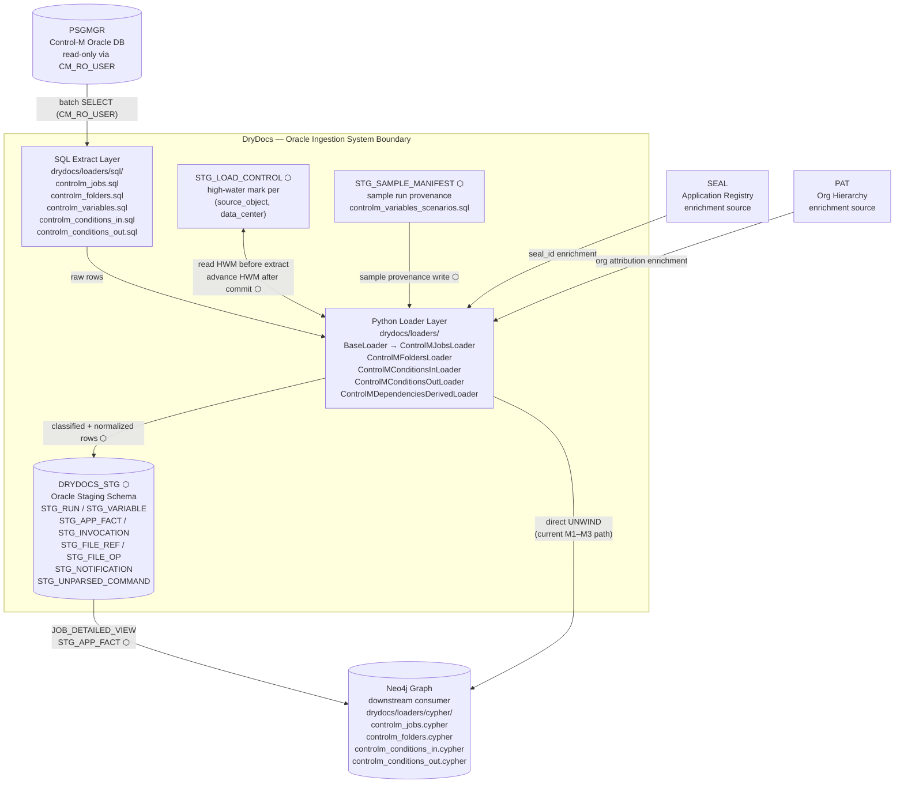

# Oracle Ingestion — Living SDLC Document

> **STATUS: Superseded (2026-07-01).** This review/plan is complete; its findings were rolled
> into `docs/decisions/` (ADRs), `MODULE_MAP.md`, and `docs/restructure/backlog.yaml`.
> Kept for historical reference.

<!-- §META -->
```yaml
persona: oracle-dba
flow: oracle-ingestion
skill: db
status: REVIEWED
version: 0.3
last_updated: 2026-06-25T12:38:42Z
populated_from: persona-oracle-dba.md §1.1–1.8
diagrams_status: COMPLETE (§C1 flowchart, §DES/full-refresh, §DES/incremental, §DES/er — cron tasks 1.1–1.4)
traceability_status: COMPLETE (§TM FR-OI-001 to FR-OI-019 — cron task 1.5)
verified_against: drydocs/loaders/**, drydocs/loaders/sql/**, drydocs/loaders/sql/ddl/**, base.py lifecycle (cron task 1.6)
```

## §META — Scope and conventions

**Flow:** Ingest Control-M job definitions from psgmgr (read-only) into DRYDOCS_STG
staging layer, then propagate to downstream Neo4j graph. Two modes: FULL REFRESH
(baseline) and INCREMENTAL (delta by VERSION_SERIAL watermark). Sample extraction
is a bounded variant of full refresh.

**Secrets discipline:** schema object names only; no real SIDs, data values,
credentials, org names, or server addresses.

**ID scheme:**
- Requirements: `FR-OI-NNN` (Functional Requirement, Oracle Ingestion)
- Use Cases: `UC-OI-NNN`
- Open questions: `OQ-OI-N` (also tracked in persona-oracle-dba.md)

**Status values per item:** `ACTIVE` | `PLANNED` | `PARTIAL` | `DEPRECATED`

**Cross-reference:** see `sdlc-neo4j-schema.md` for the downstream graph flow.

---

## §FR — Functional Requirements

| ID | Requirement | Priority | Status | Implementation Object | Notes |
|---|---|---|---|---|---|
| FR-OI-001 | System SHALL read Control-M job definitions from psgmgr exclusively via `CM_RO_USER` role (read-only) | P0 | ACTIVE | `drydocs/loaders/sql/controlm_jobs.sql` | Source of truth is immutable from DryDocs side |
| FR-OI-002 | System SHALL support FULL REFRESH mode: delete-by-run_id then bulk insert all current-version records | P0 | ACTIVE | `drydocs/loaders/controlm_jobs_loader.py` | Current production mode |
| FR-OI-003 | System SHALL filter source extracts to `IS_CURRENT_VERSION='1'` to load exactly one canonical record per logical job | P0 | ACTIVE | `controlm_jobs.sql` (WHERE clause) | Prevents version-history duplication |
| FR-OI-004 | System SHALL extract folder definitions from `CM_DEF_VTAB` per data center | P0 | ACTIVE | `controlm_folders.sql` | Not versioned; use LAST_UPDATED for change detection |
| FR-OI-005 | System SHALL extract job in-conditions from `CM_DEF_LNKI_P_VW` and out-conditions from `CM_DEF_LNKO_P_VW` | P0 | ACTIVE | `controlm_conditions_in.sql`, `controlm_conditions_out.sql` | Versioned; filter IS_CURRENT_VERSION |
| FR-OI-006 | System SHALL classify raw variables into semantic kinds: `SEMANTIC_FACT`, `FLOW_REF`, `INVOCATION`, `FILE_REF`, `FILE_OP`, `NOTIFICATION`, `UNPARSED_COMMAND` | P0 | ACTIVE | Python normalizer | Classification is Python-owned, not SQL-recursive |
| FR-OI-007 | System SHALL write classified variable rows to typed staging tables per kind | P0 | ACTIVE | `STG_VARIABLE`, `STG_APP_FACT`, `STG_INVOCATION`, `STG_FILE_REF`, `STG_FILE_OP`, `STG_NOTIFICATION`, `STG_UNPARSED_COMMAND` | Surrogate IDENTITY PKs; keyed `(run_id, data_center, folder_id, job_id)` |
| FR-OI-008 | System SHALL record each execution in `STG_RUN(run_id, loader, loaded_at, status)` | P0 | ACTIVE | `STG_RUN` | Provenance anchor for all staging rows |
| FR-OI-009 | System SHALL support INCREMENTAL mode driven by `VERSION_SERIAL` high-water mark per `(source_object, data_center)` | P1 | PLANNED | `STG_LOAD_CONTROL` + `drydocs/loaders/incremental_controlm.py` (new) | Primary watermark; CAPTURE_DATE as fallback if VERSION_SERIAL unreliable |
| FR-OI-010 | System SHALL persist the high-water mark in `STG_LOAD_CONTROL(source_object, data_center, hwm_version_serial, hwm_capture_date, load_mode, updated_at, rows_applied)` | P1 | PLANNED | `controlm_staging_supplement_ddl.sql` | New table; idempotent CREATE |
| FR-OI-011 | System SHALL detect changed jobs by querying `VERSION_SERIAL > hwm_version_serial` per data center | P1 | PLANNED | `drydocs/loaders/sql/incremental_changed_jobs.sql` (new) | Changed-job extract SQL |
| FR-OI-012 | System SHALL execute incremental batch loop: (1) cleanup stale staging rows for changed jobs, (2) insert normalized rows, (3) advance HWM; loop SHALL be restartable from last committed HWM on failure | P1 | PLANNED | `drydocs/loaders/incremental_controlm.py` | Per-job delete+insert is idempotent; HWM only advances after commit |
| FR-OI-013 | System SHALL support SAMPLE mode: scope-bounded extraction via binds `(:folder_filter, :run_as, :developer_sid, :row_cap)` | P1 | ACTIVE | `drydocs/loaders/sql/controlm_variables_scenarios.sql` | Row cap enforced via FETCH FIRST |
| FR-OI-014 | System SHALL persist sample provenance in `STG_SAMPLE_MANIFEST(run_id, scope_folder, developer_sid, row_cap, scenario_count, loaded_at)` | P2 | PLANNED | `controlm_staging_supplement_ddl.sql` | Enables downstream sample lineage queries |
| FR-OI-015 | System SHALL normalize developer SID attribution using `UPPER(REGEXP_REPLACE(sid,'p$',''))` to strip automation suffix | P2 | ACTIVE | `JOB_DETAILED_VIEW` inline expression | Automation accounts end in lowercase `p`; strip to get canonical employee SID |
| FR-OI-016 | System SHALL handle legitimate duplicate `(job, var)` definitions across data centers without collision | P1 | ACTIVE | `STG_VARIABLE` PK design; pre-flight TABLE_ID check | Defensive composite key; 0.1 pre-flight verifies no cross-DC TABLE_ID collision |
| FR-OI-017 | System SHALL support ~240K current-version jobs and ~1.1M variable rows across 4 data centers at full refresh | P0 | ACTIVE | Volume: <3M rows / <2GB; no partitioning needed currently | Volume baseline recorded here for capacity tracking |
| FR-OI-018 | System SHALL pilot incremental ingestion on data center P012 first | P1 | PLANNED | Pilot scope | Per `project_controlm_c3_normalization.md` |
| FR-OI-019 | System SHALL derive transitive job-to-job dependencies using a recursive SQL query with cycle detection and materialize `:DEPENDS_ON` edges in Neo4j | P1 | ACTIVE | `drydocs/loaders/sql/controlm_dependencies_recursive.sql`; `drydocs/loaders/controlm_dependencies_derived.py`; `drydocs/loaders/cypher/controlm_dependencies_derived.cypher` | M3 part 2; run order: folders → jobs → conditions in/out → dependencies derived |

---

## §UC — Use Cases

### UC-OI-001: Full Refresh Load

| Field | Value |
|---|---|
| Actor | Data Engineer / Scheduled job |
| Goal | Load all current-version Control-M jobs for one data center into DRYDOCS_STG |
| Preconditions | DRYDOCS_STG schema exists; CM_RO_USER has access to psgmgr objects; target data center is specified |
| FR linkage | FR-OI-001, FR-OI-002, FR-OI-003, FR-OI-004, FR-OI-005, FR-OI-006, FR-OI-007, FR-OI-008 |
| Status | ACTIVE |

**Steps:**
1. Open `STG_RUN` record (`status='RUNNING'`).
2. Query `CM_DEF_VTAB` for folders (data center filter).
3. Query `CM_DEF_VJOB WHERE IS_CURRENT_VERSION='1'` (data center filter).
4. Query `CM_DEF_LNKI_P_VW` / `CM_DEF_LNKO_P_VW` for conditions.
5. Run Python normalizer over raw job + variable rows.
6. DELETE old staging rows by `run_id` (or TRUNCATE for full replace).
7. Bulk INSERT to STG_ tables in batches of 1 000 rows.
8. Update `STG_RUN.status='SUCCEEDED'`, set `loaded_at`.

**Postconditions:** STG_ tables reflect complete current state for the data center; STG_RUN records the execution.

**Exceptions:**
- Source access denied → fail fast; `STG_RUN.status='FAILED'`.
- Normalizer error → partial insert may exist; mark run FAILED; re-run is safe (DELETE then re-insert).
- Duplicate TABLE_ID across DCs → pre-flight 0.1 check fails before any writes.

---

### UC-OI-002: Incremental Delta Load

| Field | Value |
|---|---|
| Actor | Scheduled job (daily / after-hours) |
| Goal | Load only jobs changed since the last high-water mark; avoid re-processing the full population |
| Preconditions | `STG_LOAD_CONTROL` has a prior HWM entry for `(source_object, data_center)`; a full refresh has established the baseline |
| FR linkage | FR-OI-009, FR-OI-010, FR-OI-011, FR-OI-012, FR-OI-018 |
| Status | PLANNED |

**Steps:**
1. Read `hwm_version_serial` from `STG_LOAD_CONTROL` for `(CM_DEF_VJOB, :data_center)`.
2. Query `CM_DEF_VJOB WHERE VERSION_SERIAL > hwm AND IS_CURRENT_VERSION='1'`.
3. If result is empty → log NO_CHANGES; stop.
4. For each batch of 1 000 changed jobs:
   a. DELETE existing staging rows for `(data_center, folder_id, job_id)`.
   b. INSERT normalized rows into STG_ tables.
   c. Advance `STG_LOAD_CONTROL.hwm_version_serial` to batch max; COMMIT.
5. (Downstream) trigger graph incremental sync (see `sdlc-neo4j-schema.md §UC-NS-002`).

**Postconditions:** Staging reflects the delta; `STG_LOAD_CONTROL.hwm_version_serial` advanced to latest processed version.

**Exceptions:**
- Mid-batch failure → HWM not advanced past failure point → safe restart from last committed HWM.
- HWM entry not found for this source/DC pair → fall through to full refresh (UC-OI-001).

---

### UC-OI-003: Sample Extraction

| Field | Value |
|---|---|
| Actor | Developer / Analyst |
| Goal | Extract a scope-bounded subset of jobs and variables for offline analysis or dev-environment testing |
| Preconditions | `controlm_variables_scenarios.sql` deployed; scope binds provided by caller |
| FR linkage | FR-OI-013, FR-OI-014 |
| Status | ACTIVE (sampling); PLANNED (manifest persistence) |

**Steps:**
1. Bind scope parameters: `:folder_filter`, `:run_as`, `:developer_sid`, `:row_cap`.
2. Execute `controlm_variables_scenarios.sql` (per-scenario probes + UNION-ALL).
3. Write rows to staging (same STG_ tables as full refresh, scoped run_id).
4. Write provenance row to `STG_SAMPLE_MANIFEST`.

**Postconditions:** Staging contains scoped sample; `STG_SAMPLE_MANIFEST` records what was loaded and at what scope.

**Exceptions:**
- Empty sample → warn; mark manifest with `scenario_count=0`.
- `row_cap` hit → `FETCH FIRST` enforces hard limit; manifest records actual vs. cap.

---

### UC-OI-004: Restart Failed Incremental Load

| Field | Value |
|---|---|
| Actor | Data Engineer |
| Goal | Resume a failed incremental run from the last safe checkpoint without data duplication |
| Preconditions | Prior incremental run failed mid-batch; `STG_LOAD_CONTROL` HWM was not advanced past the failure point |
| FR linkage | FR-OI-012 |
| Status | PLANNED |

**Steps:**
1. Identify last committed `hwm_version_serial` from `STG_LOAD_CONTROL` (unchanged by failed batches).
2. Re-run incremental load from that HWM (same as UC-OI-002).
3. Batches that were already fully committed = no-op (per-job DELETE+INSERT is idempotent).
4. Uncommitted batches are re-processed cleanly.

**Postconditions:** Full delta committed; no duplicates.

---

### UC-OI-005: Staging Provenance Audit

| Field | Value |
|---|---|
| Actor | Data Analyst / DBA |
| Goal | Determine what was loaded, when, with what scope, and from what HWM |
| Preconditions | Access to `STG_RUN`, `STG_LOAD_CONTROL`, `STG_SAMPLE_MANIFEST` |
| FR linkage | FR-OI-008, FR-OI-010, FR-OI-014 |
| Status | PLANNED (pending manifest table) |

**Steps (read-only):**
1. Query `STG_LOAD_CONTROL` for HWM history by `(source_object, data_center)`.
2. Query `STG_SAMPLE_MANIFEST` for sample scope by `run_id`.
3. Join `STG_RUN` for timing and status.

---

## §DEP — Dependencies

| System | Role | Interface | Access Pattern | Notes |
|---|---|---|---|---|
| **PSGMGR** | Source of truth for Control-M job definitions | Oracle JDBC via `CM_RO_USER` role | Read-only; no DML | External; read grants must be in place |
| **DRYDOCS_STG** | Owned staging schema | Oracle DDL + DML; same DB connection | Write/own; STG_ tables + views | DryDocs owns this schema |
| **SEAL** | Application metadata registry | Application API or flat extract | Enriches `STG_APP_FACT` with application identity (seal_id) | External; see `project_controlm_escalation_governance.md` |
| **PAT** | Product/Application/Team org hierarchy | API or flat extract | Enriches org attribution in staging | External; see `project_pat_ontology_analysis.md` |
| **OracleAdapter** | Python connector to Oracle | `drydocs/loaders/sql/` + cx_Oracle | Batched SELECT + batch INSERT | Internal; part of DryDocs framework |
| **Python normalizer** | Variable classification + staging writer | `drydocs/loaders/` Python framework | Reads raw extract; writes STG_ tables | Internal |
| **Neo4j** | Downstream graph consumer | Python neo4j driver (separate flow) | Reads `JOB_DETAILED_VIEW`, `STG_APP_FACT` after staging complete | See `sdlc-neo4j-schema.md §DEP` |
| **STG_LOAD_CONTROL** | Watermark table (new, PLANNED) | Oracle table in DRYDOCS_STG | Read HWM before extract; write after commit | Keystone for incremental mode |
| **CM_RO_USER** | Oracle role | Grant on psgmgr objects | SELECT only | Must include `CM_DEF_SETVAR` when name confirmed (OQ-OI-1) |

---

## §C1 — C1 Context Diagram

<!-- verified against drydocs/loaders/ and drydocs/loaders/sql/ on 2026-06-25 -->
<!-- ⬡ = PLANNED (feature/oracle-ingestion); all other nodes are ACTIVE -->



**Legend:**
- ⬡ = PLANNED on `feature/oracle-ingestion`; all un-marked nodes/edges are ACTIVE
- Current production path: PSGMGR → SQL → PY → Neo4j (direct via cypher/ files)
- Planned path adds: PY → DRYDOCS_STG → Neo4j (staging-first with HWM + manifest)

---

## §DES — Design Diagrams

### §DES/full-refresh — Full-Refresh Load Sequence

<!-- verified against drydocs/loaders/base.py, controlm_jobs.py, controlm_folders.py on 2026-06-25 -->
<!-- ⬡ = PLANNED (feature/oracle-ingestion staging path); unmark = ACTIVE (current M1-M3 direct path) -->

```mermaid
sequenceDiagram
    actor Actor as Data Engineer / Scheduler
    participant L as ControlMJobsLoader<br/>drydocs/loaders/controlm_jobs.py<br/>+ BaseLoader (base.py)
    participant SQL as OracleAdapter<br/>drydocs/loaders/sql/
    participant SRC as psgmgr (CM_RO_USER)<br/>CM_DEF_VTAB / CM_DEF_VJOB<br/>CM_DEF_SETVAR / LNKI / LNKO
    participant N as Python Normalizer<br/>(variable classification)
    participant STG as DRYDOCS_STG ⬡<br/>STG_RUN / STG_VARIABLE<br/>STG_APP_FACT / STG_INVOCATION etc.
    participant NEO as Neo4j<br/>drydocs/loaders/cypher/

    Actor->>L: load(data_center, mode=FULL_REFRESH)
    L->>NEO: MERGE :JobRun {kind='load', status='STARTED'}<br/>(BaseLoader._open_run)
    Note over L,STG: ⬡ STG path also writes STG_RUN INSERT status='RUNNING'

    L->>SQL: controlm_folders.sql(:data_center)
    SQL->>SRC: SELECT CM_DEF_VTAB WHERE data_center=:dc
    SRC-->>SQL: folder rows (~18.8K)
    SQL-->>L: folder rows (streamed)
    L->>NEO: UNWIND batch → MERGE :ControlMFolder<br/>(controlm_folders.cypher)
    Note over L,STG: ⬡ STG path: INSERT folder staging rows

    L->>SQL: controlm_jobs.sql(:data_center, IS_CURRENT_VERSION='1')
    SQL->>SRC: SELECT CM_DEF_VJOB WHERE IS_CURRENT_VERSION='1'
    SRC-->>SQL: job rows (~240K per DC)
    SQL-->>L: job rows (streamed)

    loop per batch of 1 000 rows
        L->>L: pydantic validate via ControlMJobRow model
        L->>NEO: UNWIND batch → MERGE :ControlMJob<br/>(controlm_jobs.cypher)
        Note over L,STG: ⬡ STG path: INSERT STG_VARIABLE + classified rows
    end

    L->>SQL: controlm_conditions_in.sql(:data_center)
    SQL->>SRC: SELECT CM_DEF_LNKI_P_VW WHERE IS_CURRENT_VERSION='1'
    SRC-->>SQL: in-condition rows
    SQL-->>L: in-condition rows (streamed)
    L->>NEO: UNWIND batch → MERGE :ControlMCondition [:REQUIRES]<br/>(controlm_conditions_in.cypher)

    L->>SQL: controlm_conditions_out.sql(:data_center)
    SQL->>SRC: SELECT CM_DEF_LNKO_P_VW WHERE IS_CURRENT_VERSION='1'
    SRC-->>SQL: out-condition rows
    SQL-->>L: out-condition rows (streamed)
    L->>NEO: UNWIND batch → MERGE :ControlMCondition [:PRODUCES]<br/>(controlm_conditions_out.cypher)

    L->>SQL: controlm_variables.sql(:data_center)
    SQL->>SRC: SELECT CM_DEF_SETVAR (verify name — OQ-OI-1)
    SRC-->>SQL: variable rows (~1.1M across 4 DCs)
    SQL-->>L: variable rows (streamed)
    loop per batch of 1 000 rows
        L->>N: classify var into SEMANTIC_FACT / FLOW_REF / INVOCATION<br/>FILE_REF / FILE_OP / NOTIFICATION / UNPARSED_COMMAND
        N-->>L: classified rows
        L->>NEO: UNWIND batch → MERGE variable nodes / edges<br/>(controlm_dependencies_derived.cypher)
        Note over L,STG: ⬡ STG path: INSERT STG_VARIABLE, STG_APP_FACT,<br/>STG_INVOCATION, STG_FILE_REF, STG_FILE_OP,<br/>STG_NOTIFICATION, STG_UNPARSED_COMMAND
    end

    L->>NEO: SET :JobRun.status='OK', completed_at, rows_processed<br/>(BaseLoader._close_run)
    Note over L,STG: ⬡ STG path: UPDATE STG_RUN SET status='SUCCEEDED', loaded_at=NOW()
    L-->>Actor: LoadSummary(rows_processed, rows_rejected, status)

    Note over L,STG: ⬡ = steps added by feature/oracle-ingestion staging layer
    Note over L,NEO: Current M1-M3 path bypasses STG entirely — direct Oracle→Neo4j via Cypher UNWIND
```

### §DES/incremental — Incremental Load Sequence

<!-- ALL steps in this diagram are PLANNED (feature/oracle-ingestion); no current implementation exists -->
<!-- Reference files: drydocs/loaders/sql/incremental_changed_jobs.sql (PLANNED),
     drydocs/loaders/incremental_controlm.py (PLANNED),
     drydocs/loaders/sql/ddl/controlm_staging_supplement_ddl.sql (STG_LOAD_CONTROL DDL, PLANNED) -->

```mermaid
sequenceDiagram
    actor Actor as Scheduler / Data Engineer
    participant INC as IncrementalControlMLoader ⬡<br/>drydocs/loaders/incremental_controlm.py
    participant HWM as STG_LOAD_CONTROL ⬡<br/>(high-water mark table)
    participant SQL as OracleAdapter<br/>drydocs/loaders/sql/
    participant SRC as psgmgr (CM_RO_USER)<br/>CM_DEF_VJOB / CM_DEF_SETVAR
    participant N as Python Normalizer<br/>(variable classification)
    participant STG as DRYDOCS_STG ⬡<br/>STG_VARIABLE / STG_APP_FACT etc.
    participant NEO as Neo4j<br/>(downstream graph)

    Actor->>INC: run(data_center, source_object='CM_DEF_VJOB')

    INC->>HWM: SELECT hwm_version_serial, hwm_capture_date<br/>WHERE source_object='CM_DEF_VJOB' AND data_center=:dc
    alt HWM row not found
        HWM-->>INC: no row
        INC->>Actor: WARN: no prior HWM → fall through to full refresh (UC-OI-001)
    else HWM found
        HWM-->>INC: hwm_version_serial=N
        INC->>SQL: incremental_changed_jobs.sql<br/>(:data_center, :hwm_version_serial)
        SQL->>SRC: SELECT CM_DEF_VJOB WHERE VERSION_SERIAL > N<br/>AND IS_CURRENT_VERSION='1'
        SRC-->>SQL: changed job rows (batch)
        SQL-->>INC: changed job rows

        alt no changed jobs
            INC->>INC: log NO_CHANGES; stop
            INC-->>Actor: LoadSummary(rows_processed=0, status='NO_CHANGES')
        else changed jobs found
            loop per batch of 1 000 changed jobs
                INC->>STG: DELETE STG_VARIABLE / STG_APP_FACT / STG_INVOCATION etc.<br/>WHERE (data_center=:dc, folder_id=:fid, job_id=:jid) IN batch
                Note over INC,STG: cleanup stale staging rows; DELETE before INSERT = idempotent

                INC->>SQL: controlm_variables.sql scoped to batch job_ids
                SQL->>SRC: SELECT CM_DEF_SETVAR WHERE job_id IN batch
                SRC-->>SQL: variable rows for changed jobs
                SQL-->>INC: variable rows
                INC->>N: classify variables (SEMANTIC_FACT / FLOW_REF / INVOCATION etc.)
                N-->>INC: classified rows

                INC->>STG: INSERT normalized rows into STG_VARIABLE, STG_APP_FACT,<br/>STG_INVOCATION, STG_FILE_REF, STG_FILE_OP,<br/>STG_NOTIFICATION, STG_UNPARSED_COMMAND

                INC->>HWM: UPDATE STG_LOAD_CONTROL<br/>SET hwm_version_serial = MAX(batch.version_serial),<br/>    hwm_capture_date = NOW(),<br/>    rows_applied += batch.size<br/>WHERE source_object='CM_DEF_VJOB' AND data_center=:dc
                INC->>INC: COMMIT (HWM only advances after commit)
                Note over INC,HWM: On failure: HWM not advanced → restart re-processes from last committed HWM
            end

            INC->>NEO: trigger graph incremental sync<br/>(see sdlc-neo4j-schema.md §UC-NS-002)
            INC-->>Actor: LoadSummary(rows_processed, status='OK')
        end
    end

    Note over INC,NEO: ⬡ = all steps PLANNED; pilot data center = P012 (FR-OI-018)
    Note over HWM: Fallback: if VERSION_SERIAL unreliable → use hwm_capture_date (OQ-OI-2)
```

### §DES/er — STG_ Tables Entity-Relationship

```mermaid
erDiagram

    STG_RUN {
        VARCHAR2 run_id PK
        TIMESTAMP started_at
        TIMESTAMP ended_at
        VARCHAR2 status "RUNNING|SUCCEEDED|FAILED"
        VARCHAR2 data_centers
        NUMBER src_job_count
        NUMBER src_var_count
        VARCHAR2 normalizer_version
    }

    STG_LOAD_CONTROL_PLANNED {
        VARCHAR2 source_object PK
        VARCHAR2 data_center PK
        VARCHAR2 load_mode "FULL|INCREMENTAL"
        NUMBER hwm_version_serial
        TIMESTAMP hwm_capture_date
        VARCHAR2 last_run_id "FK-able to STG_RUN"
        VARCHAR2 last_status
        NUMBER rows_applied
        TIMESTAMP updated_at
    }

    STG_SAMPLE_MANIFEST_PLANNED {
        VARCHAR2 run_id "links to STG_RUN"
        VARCHAR2 scope_folder
        VARCHAR2 scope_developer_sid
        NUMBER scope_row_cap
        VARCHAR2 scenario
        NUMBER rows_pulled
        TIMESTAMP captured_at
    }

    STG_VARIABLE {
        NUMBER variable_sk PK
        VARCHAR2 run_id FK
        VARCHAR2 data_center
        NUMBER folder_id
        NUMBER job_id
        VARCHAR2 var_scope "FOLDER|JOB"
        VARCHAR2 var_name
        VARCHAR2 raw_value
        CLOB resolved_value
        VARCHAR2 var_kind "LITERAL|VAR_REF|SYSTEM_FUNC|..."
        CHAR is_fully_resolved
    }

    STG_APP_FACT {
        NUMBER app_fact_sk PK
        VARCHAR2 run_id FK
        VARCHAR2 data_center
        NUMBER folder_id
        NUMBER job_id
        VARCHAR2 fact_type "SEAL|FID|DS_ID|DATAFLOW|IMAGE|..."
        VARCHAR2 fact_value
        VARCHAR2 environment "D/Q/P"
        VARCHAR2 source_var
    }

    STG_INVOCATION {
        NUMBER invocation_sk PK
        VARCHAR2 run_id FK
        VARCHAR2 data_center
        NUMBER folder_id
        NUMBER job_id
        NUMBER seq
        VARCHAR2 invocation_source "CMDLINE|MEMNAME|PRECMD|..."
        VARCHAR2 invocation_type "ABINITIO|PYSPARK|SHELL_SCRIPT|..."
        CLOB raw_command
        VARCHAR2 classifier_rule
    }

    STG_FILE_REF {
        NUMBER file_ref_sk PK
        VARCHAR2 run_id FK
        VARCHAR2 data_center
        NUMBER folder_id
        NUMBER job_id
        VARCHAR2 ref_role "WATCH_INPUT|INPUT|OUTPUT|LOG|..."
        VARCHAR2 path_raw
        VARCHAR2 path_canonical
        VARCHAR2 date_token "{ODATE}|{TS16}|..."
    }

    STG_FILE_OP {
        NUMBER file_op_sk PK
        VARCHAR2 run_id FK
        VARCHAR2 data_center
        NUMBER folder_id
        NUMBER job_id
        NUMBER seq
        VARCHAR2 op_type "COPY|MOVE|DELETE|MKDIR|..."
        VARCHAR2 src_pattern
        VARCHAR2 tgt_pattern
        VARCHAR2 raw_statement
    }

    STG_NOTIFICATION {
        NUMBER notification_sk PK
        VARCHAR2 run_id FK
        VARCHAR2 data_center
        NUMBER folder_id
        NUMBER job_id
        VARCHAR2 channel "EMAIL"
        VARCHAR2 address
        VARCHAR2 source_var
    }

    STG_PARSE_QUALITY {
        VARCHAR2 run_id PK
        VARCHAR2 data_center PK
        NUMBER folder_id PK
        NUMBER job_id PK
        NUMBER var_total
        NUMBER var_resolved
        CHAR cmd_present
        CHAR cmd_classified
        NUMBER invocation_count
        NUMBER file_ref_count
    }

    STG_UNPARSED_COMMAND {
        NUMBER unparsed_sk PK
        VARCHAR2 run_id FK
        VARCHAR2 data_center
        NUMBER folder_id
        NUMBER job_id
        VARCHAR2 source_field "PRECMD|POSTCMD|CMDLINE"
        CLOB raw_text
        VARCHAR2 fail_reason
    }

    STG_RUN ||--o{ STG_VARIABLE : "run_id FK"
    STG_RUN ||--o{ STG_APP_FACT : "run_id FK"
    STG_RUN ||--o{ STG_INVOCATION : "run_id FK"
    STG_RUN ||--o{ STG_FILE_REF : "run_id FK"
    STG_RUN ||--o{ STG_FILE_OP : "run_id FK"
    STG_RUN ||--o{ STG_NOTIFICATION : "run_id FK"
    STG_RUN ||--o{ STG_PARSE_QUALITY : "run_id FK (composite PK)"
    STG_RUN ||--o{ STG_UNPARSED_COMMAND : "run_id FK"
    STG_RUN ||--o{ STG_SAMPLE_MANIFEST_PLANNED : "run_id (no FK enforced) ⬡"
    STG_LOAD_CONTROL_PLANNED }o--|| STG_RUN : "last_run_id (no FK enforced) ⬡"
```

<!-- verified against controlm_staging_ddl.sql + controlm_staging_supplement_ddl.sql on 2026-06-25 -->
<!-- ⬡ = PLANNED tables (feature/oracle-ingestion); base tables are ACTIVE DDL -->
<!-- All STG_ tables carry (data_center, folder_id, job_id) as the job composite key -->



**Key design decisions (from DDL):**
- All normalized tables use surrogate `IDENTITY` PKs — natural job keys `(data_center, folder_id, job_id)` are NOT unique (duplicate variable definitions per job are legitimate)
- `STG_RUN` is the provenance anchor; all base tables enforce `REFERENCES stg_run(run_id)` via FK
- `STG_LOAD_CONTROL` and `STG_SAMPLE_MANIFEST` reference `STG_RUN` by convention, not enforced FK
- `STG_PARSE_QUALITY` uses a composite PK `(run_id, data_center, folder_id, job_id)` — one row per job per run

---

## §TM — Traceability Matrix

<!-- generated 2026-06-25; verified against §FR, §UC, drydocs/loaders/, drydocs/loaders/sql/ddl/ -->

| FR | UC(s) | Implementation Object(s) | Status | Blocking OQ |
|---|---|---|---|---|
| FR-OI-001 | UC-OI-001 | `drydocs/loaders/sql/controlm_jobs.sql` (SELECT via CM_RO_USER) | ACTIVE | — |
| FR-OI-002 | UC-OI-001 | `drydocs/loaders/controlm_jobs.py` (ControlMJobsLoader); `drydocs/loaders/base.py` (BaseLoader._open_run / _flush / _close_run) | ACTIVE | — |
| FR-OI-003 | UC-OI-001 | `drydocs/loaders/sql/controlm_jobs.sql` WHERE IS_CURRENT_VERSION='1' | ACTIVE | — |
| FR-OI-004 | UC-OI-001 | `drydocs/loaders/sql/controlm_folders.sql`; `drydocs/loaders/controlm_folders.py` | ACTIVE | — |
| FR-OI-005 | UC-OI-001 | `drydocs/loaders/sql/controlm_conditions_in.sql`; `drydocs/loaders/controlm_conditions_in.py`; `drydocs/loaders/sql/controlm_conditions_out.sql`; `drydocs/loaders/controlm_conditions_out.py` | ACTIVE | — |
| FR-OI-006 | UC-OI-001, UC-OI-003 | Python normalizer (classification logic within loader layer); `drydocs/loaders/sql/controlm_variables.sql` | ACTIVE | OQ-OI-1 (CM_DEF_SETVAR name unverified) |
| FR-OI-007 | UC-OI-001 | `STG_VARIABLE`, `STG_APP_FACT`, `STG_INVOCATION`, `STG_FILE_REF`, `STG_FILE_OP`, `STG_NOTIFICATION`, `STG_UNPARSED_COMMAND`; DDL: `controlm_staging_ddl.sql` §3 | ACTIVE (DDL) | OQ-OI-1 |
| FR-OI-008 | UC-OI-001, UC-OI-002, UC-OI-003, UC-OI-005 | `STG_RUN`; DDL: `controlm_staging_ddl.sql` §2 | ACTIVE (DDL) | — |
| FR-OI-009 | UC-OI-002 | `drydocs/loaders/incremental_controlm.py` (PLANNED); `STG_LOAD_CONTROL` | PLANNED | OQ-OI-2 (CAPTURE_DATE vs VERSION_SERIAL reliability) |
| FR-OI-010 | UC-OI-002, UC-OI-004, UC-OI-005 | `STG_LOAD_CONTROL`; DDL: `controlm_staging_supplement_ddl.sql` §1 | PLANNED (DDL exists) | — |
| FR-OI-011 | UC-OI-002 | `drydocs/loaders/sql/incremental_changed_jobs.sql` (PLANNED) | PLANNED | OQ-OI-2 |
| FR-OI-012 | UC-OI-002, UC-OI-004 | `drydocs/loaders/incremental_controlm.py` (PLANNED) | PLANNED | — |
| FR-OI-013 | UC-OI-003 | `drydocs/loaders/sql/controlm_variables_scenarios.sql` | ACTIVE (sampling); PLANNED (manifest) | — |
| FR-OI-014 | UC-OI-003, UC-OI-005 | `STG_SAMPLE_MANIFEST`; DDL: `controlm_staging_supplement_ddl.sql` §2 | PLANNED (DDL exists) | — |
| FR-OI-015 | UC-OI-001 | `JOB_DETAILED_VIEW` inline REGEXP_REPLACE (`controlm_staging_ddl.sql`); `JOB_DEVELOPER_VIEW` (`controlm_staging_supplement_ddl.sql` §3) | ACTIVE (view); PLANNED (full dev-SID flow) | OQ-OI-3 (CREATION_USER / CHANGE_USERID column existence) |
| FR-OI-016 | UC-OI-001 | `controlm_staging_ddl.sql` §0.1 pre-flight; `STG_VARIABLE` surrogate PK design | ACTIVE | — |
| FR-OI-017 | UC-OI-001 | `controlm_staging_ddl.sql` header (volume baseline); capacity tracked here | ACTIVE | — |
| FR-OI-018 | UC-OI-002 | `drydocs/loaders/incremental_controlm.py` (PLANNED); pilot scope = P012 | PLANNED | — |
| FR-OI-019 | UC-OI-001 | `drydocs/loaders/sql/controlm_dependencies_recursive.sql`; `drydocs/loaders/controlm_dependencies_derived.py`; `drydocs/loaders/cypher/controlm_dependencies_derived.cypher` | ACTIVE | — |

---

## §SRC — Source Views and Objects

### psgmgr read objects (via CM_RO_USER, read-only)

| Object | Grain | Key columns | Est. volume | Notes |
|---|---|---|---|---|
| `CM_DEF_VJOB` | Job version | `folder_id`, `job_id`, `version_serial`, `is_current_version` | ~240K current-version rows | Primary job source; ~100 cols; filter `IS_CURRENT_VERSION='1'` |
| `CM_DEF_VTAB` | Folder | `folder_id`, `data_center` | ~18.8K | Not versioned; `LAST_UPDATED` / `CAPTURE_DATE` for change detection |
| `CM_DEF_LNKI_P_VW` | In-condition per job | `folder_id`, `job_id`, `condition_name` | Varies | Prerequisites / in-conditions; versioned |
| `CM_DEF_LNKO_P_VW` | Out-condition per job | `folder_id`, `job_id`, `condition_name` | Varies | Postconditions / out-conditions; versioned |
| `CM_DEF_SETVAR` | Variable per job | `folder_id`, `job_id`, `var_name`, `var_value` | ~1.1M | **Name unverified — OQ-OI-1** |

### DRYDOCS_STG read views (for downstream consumers)

| View / Table | Purpose | Consumers |
|---|---|---|
| `JOB_DETAILED_VIEW` | Denormalized job record; inline developer SID normalization expression | Neo4j jobs loader; analysts |
| `JOB_VARIABLE_VIEW` | Variables joined to job for classification input | Python normalizer |
| `STG_COVERAGE_SUMMARY` | Cross-DC coverage metrics | Monitoring; QA |
| `STG_APP_FACT` | SEAL application-attributed semantic variable facts | Neo4j SEAL attribution loader |
| `STG_LOAD_CONTROL` | High-water mark per `(source_object, data_center)` — **PLANNED** | IncrementalControlMLoader; graph provenance |
| `STG_SAMPLE_MANIFEST` | Sample run provenance — **PLANNED** | Audit; graph :JobRun annotation |

### DryDocs Python + SQL loader files

| File | Role |
|---|---|
| `drydocs/loaders/sql/controlm_jobs.sql` | Full-refresh job extract |
| `drydocs/loaders/sql/controlm_folders.sql` | Folder extract |
| `drydocs/loaders/sql/controlm_conditions_in.sql` | In-condition extract |
| `drydocs/loaders/sql/controlm_conditions_out.sql` | Out-condition extract |
| `drydocs/loaders/sql/controlm_variables_scenarios.sql` | Sample-mode scoped variable extract |
| `drydocs/loaders/sql/ddl/controlm_staging_ddl.sql` | Base STG_ DDL |
| `drydocs/loaders/sql/ddl/controlm_staging_supplement_ddl.sql` | Phase-1 additions: STG_LOAD_CONTROL, STG_SAMPLE_MANIFEST; also JOB_DEVELOPER_VIEW |
| `drydocs/loaders/sql/controlm_dependencies_recursive.sql` | Recursive predecessor SQL with cycle detection (via path-INSTR + level cap); produces job-to-job dependency rows |
| `drydocs/loaders/controlm_dependencies_derived.py` | ControlMDependenciesDerivedLoader; materializes `:DEPENDS_ON` edges from recursive SQL output (M3 part 2) |
| `drydocs/loaders/cypher/controlm_dependencies_derived.cypher` | MERGE :ControlMJob-[:DEPENDS_ON]->:ControlMJob edges (UNWIND batch) |
| `drydocs/loaders/sql/adhoc/preflight_open_questions.sql` | Read-only SQL Developer probes answering OQ-OI-1 / OQ-OI-2 / OQ-OI-3 before production deploy; do not commit result rows |
| `drydocs/loaders/sql/incremental_changed_jobs.sql` | **PLANNED** — changed-job delta extract |
| `drydocs/loaders/incremental_controlm.py` | **PLANNED** — IncrementalControlMLoader orchestrator |

---

## §OQ — Open Questions

| ID | Question | Blocks | Source |
|---|---|---|---|
| OQ-OI-1 | What is the exact name of the variable source object? (`CM_DEF_SETVAR` is unverified) | FR-OI-006, FR-OI-007, all variable extracts | persona-oracle-dba.md §1.1; probe: `adhoc/preflight_open_questions.sql` Q1 |
| OQ-OI-2 | Is `CAPTURE_DATE` set per-row at insert time, or is it uniform per extract batch? | HWM strategy selection (FR-OI-009); if uniform, VERSION_SERIAL must be primary watermark | persona-oracle-dba.md §1.5; probe: `adhoc/preflight_open_questions.sql` Q2 |
| OQ-OI-3 | Do `CREATION_USER` and `CHANGE_USERID` exist on `CM_DEF_VJOB`? | FR-OI-015 (developer SID attribution graph edge); `JOB_DEVELOPER_VIEW` design | persona-oracle-dba.md §1.2; probe: `adhoc/preflight_open_questions.sql` Q3 |
| OQ-OI-4 | What incremental cadence is required, and how many runs of staging should be retained? | `STG_LOAD_CONTROL` rollback window; full-refresh schedule; `STG_SAMPLE_MANIFEST` retention | persona-oracle-dba.md §1.5 |

---

## §XREF — Cross-References to Neo4j Schema Flow

<!-- cross-reference to sdlc-neo4j-schema.md; generated 2026-06-25 cron task 3.1 -->

### Oracle STG objects → Graph loader cypher files

| Oracle Object (this doc) | Role | Graph Loader (sdlc-neo4j-schema.md) | Status |
|---|---|---|---|
| `JOB_DETAILED_VIEW` | Denormalized current-version job feed | `drydocs/loaders/cypher/controlm_jobs.cypher` | ACTIVE |
| `JOB_DETAILED_VIEW` | Folder + data center feed | `drydocs/loaders/cypher/controlm_folders.cypher` | ACTIVE |
| `CM_DEF_LNKI_P_VW` | In-conditions (direct psgmgr read, M1-M3 path) | `drydocs/loaders/cypher/controlm_conditions_in.cypher` | ACTIVE |
| `CM_DEF_LNKO_P_VW` | Out-conditions (direct psgmgr read, M1-M3 path) | `drydocs/loaders/cypher/controlm_conditions_out.cypher` | ACTIVE |
| `CM_DEF_SETVAR` (OQ-OI-1) + recursive SQL | Variable resolution → derived dependencies | `drydocs/loaders/cypher/controlm_dependencies_derived.cypher` (via `controlm_dependencies_recursive.sql`) | ACTIVE |
| `STG_APP_FACT` ⬡ | SEAL-attributed semantic facts | SEAL attribution loader cypher (FR-NS-013) | PLANNED |
| `STG_LOAD_CONTROL` ⬡ | Incremental HWM per (source_object, data_center) | Drives `IncrementalControlMLoader` → feeds `controlm_jobs.cypher` changed-job batches | PLANNED |
| `STG_SAMPLE_MANIFEST` ⬡ | Sample run provenance | `:JobRun {kind:'load', load_mode:'SAMPLE'}` annotation (FR-NS-017 extension) | PLANNED |

### FR interdependencies between flows

| Oracle Ingestion FR | Dependency on Neo4j Schema FR | Nature |
|---|---|---|
| FR-OI-007 (write STG_APP_FACT) | FR-NS-013 (SEAL attribution graph edge) | Oracle STG_APP_FACT must be populated before graph attribution loader can run |
| FR-OI-009/010/011/012 (Oracle incremental HWM) | FR-NS-008/017 (graph stale edge cleanup + :JobRun annotation) | Oracle HWM must exist and advance before graph incremental can safely re-assert edges |
| FR-OI-015 (developer SID → JOB_DEVELOPER_VIEW) | FR-NS-015 (graph WAS_ASSOCIATED_WITH {role:owner} edge) | SID normalization confirmed and columns verified (OQ-OI-3) before graph edge can be added |
| FR-OI-019 (dependencies derived from recursive SQL) | FR-NS-004/vocabulary WAS_INFORMED_BY | SQL produces rows consumed by graph loader; vocabulary WAS_INFORMED_BY edge type already declared active |
| FR-OI-018 (P012 incremental pilot) | FR-NS-001/002 (constraints applied) | Graph schema DDL must be idempotently applied before any data loader runs |

### Shared open questions blocking both flows

| OQ | Blocks (Oracle Ingestion) | Blocks (Neo4j Schema) |
|---|---|---|
| OQ-OI-1: CM_DEF_SETVAR name unverified | FR-OI-006/007 (variable classification + STG writes) | FR-NS-013 (STG_APP_FACT never populated → no SEAL attribution edges) |
| OQ-OI-2: CAPTURE_DATE uniformity | FR-OI-009/011 (incremental watermark strategy) | FR-NS-008/017 (incremental load/annotation impossible until Oracle HWM works) |
| OQ-OI-3: CREATION_USER/CHANGE_USERID columns | FR-OI-015 (JOB_DEVELOPER_VIEW depends on these columns) | FR-NS-015 (graph developer SID edge blocked until columns confirmed) |
| OQ-NS-3: APOC availability on target Neo4j | — (Oracle side not affected) | FR-NS-016 (age-out cleanup method: apoc.periodic.iterate vs CALL IN TRANSACTIONS) |

---

## §LOG — Change Log (newest at bottom)

- 2026-06-18T18:00:00Z v0.1 scaffold: §META, §FR (FR-OI-001 to FR-OI-018), §UC (UC-OI-001 to UC-OI-005), §DEP, §SRC populated from persona-oracle-dba.md. Diagram/TM sections are stubs for cron task 1.1–1.5.
- 2026-06-18T18:00:00Z v0.2 §OQ section added; §SRC loader file table added.
- 2026-06-25T12:38:42Z v0.3 Phase 1 cron tasks 1.1–1.7 complete. See checkpoint log for detail.
- 2026-06-25T12:38:42Z v0.3 Phase 3 task 3.1: §XREF added cross-linking Oracle STG objects → graph loaders; FR interdependencies; shared OQ-OI-1/2/3 and OQ-NS-3. §C1 Mermaid flowchart added (actual file paths verified from drydocs/loaders/). §DES/full-refresh and §DES/incremental sequence diagrams added (BaseLoader lifecycle sourced from base.py; STG⬡ path annotated). §DES/er erDiagram added (11 STG_ tables from actual DDL). §TM traceability matrix added (FR-OI-001 to FR-OI-019 → UC/file/status/OQ). §FR §UC verified against actual files; FR-OI-019 (dependencies derived) added as uncaptured requirement. §SRC updated with controlm_dependencies_recursive.sql, controlm_dependencies_derived.py/cypher, adhoc/preflight_open_questions.sql. §OQ updated with preflight probe SQL references.
