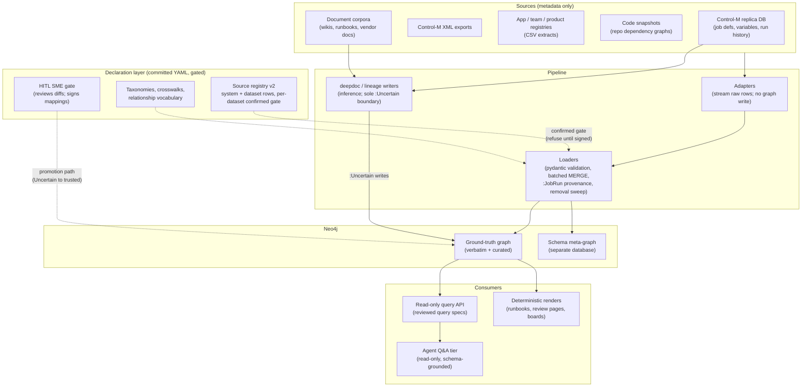
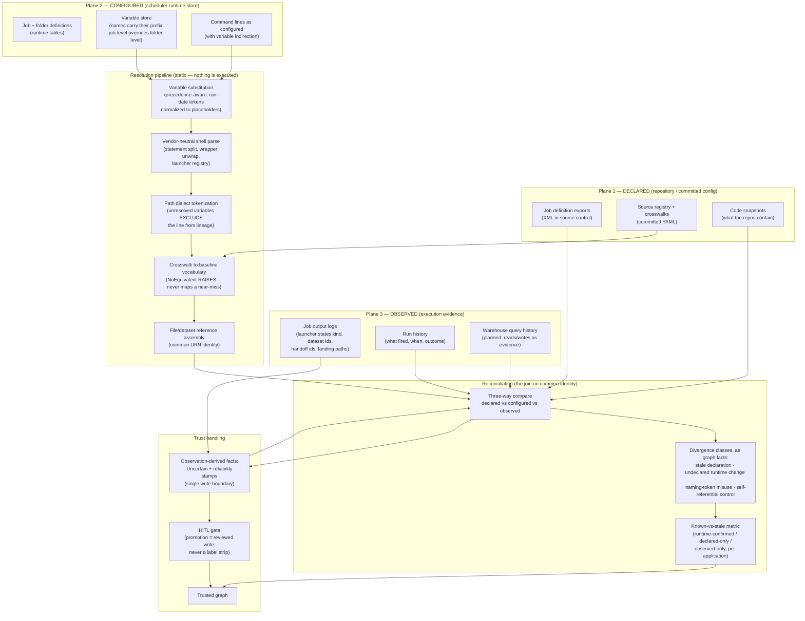

# DryDocs — project overview & the runtime-vs-declared reconciliation mechanism

**Purpose:** internal (bank) review brief — candidate material for the invention-disclosure
conversation. · **Date:** 2026-08-27 · **Classification: Internal** — this brief exists to
support an IP review; it must NOT reach the public remote (a public push is a §102
disclosure that starts the one-year clock on exactly the subject matter under review).
Mechanism only; every value is a placeholder per `PUBLISH-BOUNDARY.md` conventions. ·
**Audience:** IP counsel / invention-disclosure reviewers; engineering readers wanting the
one-page mechanism story. · **Nothing here is legal advice.**

---

## 1. What DryDocs is

DryDocs is a knowledge-graph platform that documents enterprise batch/data infrastructure
by loading METADATA — never business data — from the systems that run it: the Control-M
scheduler (definitions and runtime state via its Oracle replica), application registries,
team/product catalogs, code snapshots, server inventories, and document corpora. The graph
(Neo4j) models what exists, who owns it, what depends on what, and — the part this brief
is about — **whether what is documented agrees with what actually runs.**

The problem it answers: the bank's PRIMARY products carry true SDLC discipline
(requirements, repos, testing, controls). The SECONDARY data applications that report on
them do not — their operative truth lives in runtime configuration (scheduler job
definitions, resolved variables, launcher invocations) that no repository governs and no
document tracks. Support teams reconstruct that truth by hand, one incident at a time.
DryDocs captures it systematically, with provenance, behind a human-in-the-loop (HITL)
gate so nothing unverified enters the trusted record.

## 2. Architecture overview

Three design commitments shape everything:

1. **Declared before loaded.** Every source is registered in committed YAML
   (`config/source-registry.yaml`, schema v2) with a per-dataset `confirmed` gate — a
   loader refuses to run until a subject-matter expert has signed the dataset's mapping.
2. **Provenance on every write.** Each load runs as a `:JobRun` (W3C PROV activity);
   rows carry content checksums so provenance edges record real change, not re-runs.
3. **Trust is structural.** Uncertain, machine-inferred content carries an `:Uncertain`
   label stamped at a single write boundary and enters the trusted graph only through the
   HITL gate — promotion is a reviewed write, never a label strip.

## 3. The candidate mechanism — runtime-vs-declared reconciliation

**The claim-shaped idea, in one paragraph.** For scheduler-orchestrated data pipelines,
DryDocs derives lineage and configuration truth from THREE independent evidence planes —
what a repository DECLARES, what the scheduler's runtime store is actually CONFIGURED to
do, and what execution OBSERVABLY did — resolves each plane to a common vocabulary through
a crosswalk that **refuses to guess** (a native term with no baseline equivalent raises
`NoEquivalent` rather than mapping to a near-miss), and materializes the DISAGREEMENTS
between planes as first-class, queryable graph facts with named divergence classes. The
output is not a lineage graph that hides its uncertainty — it is a *provable divergence
report*: which facts are runtime-confirmed, which are declared-but-stale, and which exist
only at runtime with no declaration behind them.

Distinctive elements, stated plainly for the reviewer:

- **Static resolution of scheduler variable indirection.** Job command lines are opaque
  until the scheduler's variable layer is resolved: variables stored with their prefix
  in the runtime tables, folder-level definitions overridden by job-level ones, run-date
  tokens normalized to placeholders, and any command line still carrying an unresolved
  variable EXCLUDED from lineage rather than half-parsed. Resolution is static — from the
  configuration store, without executing anything.
- **A vendor-neutral parse with a refusal-based crosswalk.** The shell/path parser is
  vendor-neutral; each vendor supplies a dialect. Crosswalks map native concepts to a
  baseline vocabulary and raise on `fidelity: no-equivalent` — a near-miss is a defect,
  not a mapping. This is the inverse of the fuzzy-matching default in the field.
- **Observation as enrichment, labeled as such.** Execution-output logs (launcher
  statements of job kind, dataset/pipeline identifiers, handoff ids, landing paths)
  enrich command-line lineage; everything observation-derived carries `:Uncertain` +
  reliability stamps and promotes only through the HITL gate.
- **Divergence classes as facts.** Known classes are modeled, not narrated: stale
  declaration (repo behind runtime), undeclared runtime change, naming-token misuse
  (a job named as a file pre-processor that is actually an API pull), and
  self-referential controls (a file watcher validating a token produced by the same
  process it gates). Each is queryable per application, feeding a
  known-vs-stale coverage metric.
- **Honesty invariants throughout.** Freshness verdicts never report "fresh" when they
  could not look; coverage reports `not-probed` as distinct from zero; absent is never
  rendered as empty.

## 4. Framing for the IP conversation (honest, both directions)

**Why it may be disclosable.** The mechanism is a specific technical pipeline, not a
workflow: static precedence-aware variable resolution against a scheduler's runtime
store, a refusal-based (rather than similarity-based) crosswalk, exclusion semantics for
unresolvable inputs, and materialization of cross-plane divergence as queryable facts.
That combination is the part a claim would be built on, and it is the part not found
assembled in the surveyed open-source field (runtime lineage capture exists; static
scheduler-store resolution with refusal semantics and divergence-as-facts does not, to
the author's knowledge).

**Prior-art neighbors, named honestly.** OpenLineage/Marquez (runtime lineage capture at
execution time — the opposite entry point), DataHub/OpenMetadata/Purview (metadata graphs
and lineage models), scheduler-specific parsers, and the general HITL data-stewardship
practice in commercial catalogs. A professional search must run before any filing;
§101 (Alice) risk for anything framed as information organization is real and the claim
would need to stay on the technical mechanism.

**Recommended route.** Through the bank's invention-disclosure program, not a personal
filing: the subject matter is entangled with employer systems and almost certainly within
the employment agreement's assignment scope. Keeping this brief off the public remote
preserves the option; every day of public disclosure narrows it.
