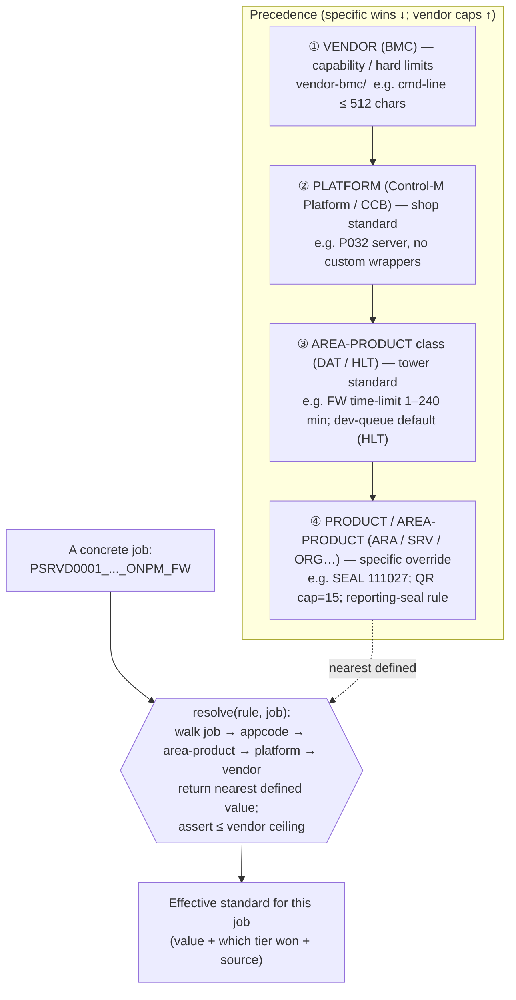

# Normalizing Confluence Standards into a Tiered Lookup Table (Goal 2)

**Corpus:** INTERNAL. **Status:** 🟠 PLAN — 2026-06-17. **Branch:** `controlm-spinoff`.
**Problem:** the internal standards live as **prose + screenshots in Confluence** (e.g. `CBTHLTAUTO/Control-M Command line and variables v2`, the cm-guidelines pages, the SCIM Details page). They're unstructured, un-queryable, and drift silently. We want them **normalized into one resolvable lookup table** layered **Vendor → Internal Platform → Product / Area-Product**.

---

## 1. Explanation view — the cascade (most-specific-wins, vendor is the ceiling)

The standards already form a **4-tier authority hierarchy** ([governance/README §1](governance/README.md)). Normalizing = turning that hierarchy into a **lookup with precedence resolution**, exactly like a CSS cascade or layered config: for any (rule × scope) you take the **most specific defined value**, but **Vendor capability is a hard ceiling** a lower tier may *tighten* but never *exceed*.

**Worked example (one job, three rules):**

| Rule | Vendor ① | Platform ② | DAT/HLT ③ | Product ④ | **Effective for `PSRVD0001…_FW`** | Won at |
|---|---|---|---|---|---|---|
| Cmd-line length | ≤ 512 chars | no custom wrapper; `-p` prefix hardcoded | (same) | — | ≤512 + template (Java/Abi/Infa) | ② (within ① ceiling) |
| FW time limit | any (0=unlimited allowed) | — | **1–240 min, never 0** | — | **1–240 min** | ③ |
| Escalation default | n/a | platform L1 `C1CCBDATAECO` | **HLT: owning dev queue** | SRV→`C3HLSRA` | **`C3HLSRA`** | ④ |

That last column — *effective value + winning tier + source* — **is the normalized lookup table.** It's the [rules registry](standards-rules-registry.md) (R1–R29) pivoted into tier-scoped rows with provenance.

### The table shape (target schema)
`rule_id · dimension · scope_level{vendor|platform|area_product_class|product} · scope_value · value · vendor_ceiling · source_ref(Confluence URL / screenshot / vendor doc) · status{ratified|provisional|open}`

One **rule** has several rows (one per tier that defines it); resolution picks the most specific. Provenance (`source_ref`) is mandatory — it's what lets us regenerate/audit against Confluence.

---

## 2. Plan — three options to build & maintain the lookup table

### Option A — In-repo structured registry (YAML/CSV), human-curated  ⭐ *recommended first*
Promote [standards-rules-registry.md](standards-rules-registry.md) from prose into a machine-readable `standards.yaml` (or CSV) with the §1.3 columns; a small Python resolver does most-specific-wins + vendor-ceiling check.
- **Pros:** lowest tech; **full git history + provenance**; diffable; SoD-safe (we own it); feeds Gate-2 (validate) / Gate-3 (generate) directly; ~80 % already captured in R1–R29 + governance docs.
- **Cons:** manual transcription from Confluence; can drift vs the Confluence source; static (not a live query over real jobs).
- **Effort:** ~1 wk to schema + migrate R1–R29 + write the resolver.

### Option B — Graph-native standards layer (Neo4j)
Model `:Rule`/`:Standard` nodes with `:APPLIES_AT {tier}`, `:OVERRIDES`, `:DERIVED_FROM {confluence_url}`; reuse the existing `Application`/`Product`/`AreaProduct` ontology already on `main`. Resolve via a most-specific-path Cypher query walking job → folder → appcode → AreaProduct → Platform → Vendor.
- **Pros:** **live per-job resolution** over the same topology that wires SEAL/Area-Product (see [gap analysis G1](main-branch-gap-analysis.md)); one source of truth co-located with conformance data; "what's the effective standard for job X?" is a single query.
- **Cons:** needs the graph populated + standards modeled; query complexity; heavier curation than YAML.
- **Effort:** ~2–3 wk; depends on the SEAL bridge (G1) being wired.

### Option C — Relational staging lookup (Oracle `STG_STANDARD_RULE`)
A staging table keyed by `(rule_id, scope_level, scope_value)` with precedence resolution in SQL/Python; fits the existing `STG_` contract and **joins directly to `CM_DEF_VJOB` / `CM_ESCALATION_DB`** for bulk per-job resolution.
- **Pros:** fits the Oracle source-of-truth + staging architecture; bulk-loadable; SQL-queryable for ops; can **feed both A and B**.
- **Cons:** another DB object (needs DBA); less human-readable for authoring than YAML.
- **Effort:** ~1–2 wk + DBA for the table.

### Option D (bonus) — Confluence extraction pipeline (the `drydocs-scrape` hybrid)
Use the planned `drydocs-scrape` to pull Confluence → a provenance-tracked structured intermediate (the **two-corpus envelope**, [[project-drydocs-scrape-two-corpus]]) → emit **both** the YAML registry (A) **and** load the graph (B) / Oracle (C). Confluence stays the human-editable record; normalization is regenerated.
- **Pros:** closes the **drift gap** (Confluence canonical, lookup regenerated); tracks provenance + contradictions; aligns with the architecture already planned.
- **Cons:** most build effort; depends on scrape access **and** parse reliability — **the screenshots aren't text** (OCR / manual transcription still required for image-only pages).
- **Effort:** ~3–4 wk + scrape access.

### Recommended sequence
**A now** (SoD-safe, immediately useful, mostly already done) → **C next** (materialize as `STG_` so it joins live Control-M/escalation data for per-job resolution) → **B then D** (graph query + Confluence auto-extraction, once the SEAL bridge G1 and scrape access exist). A is the source of truth until D can regenerate it; B/C are projections of A.

| | A YAML | B Graph | C Oracle STG_ | D Scrape hybrid |
|---|---|---|---|---|
| Effort | ▁ low | ▃ med | ▂ med-low | ▅ high |
| Live per-job resolution | ✗ | ✓✓ | ✓ | (feeds B/C) |
| Provenance / audit | ✓✓ | ✓ | ✓ | ✓✓ |
| Drift control vs Confluence | ✗ | ✗ | ✗ | ✓✓ |
| SoD-safe (we own it) | ✓✓ | ✓ | ✓ (DBA) | ✓ |

---

## 3. First concrete step (start of Option A)
Migrate R1–R29 into `standards.yaml` with the §1.3 columns, filling `scope_level`/`scope_value`/`source_ref` from the governance docs (most rows already cite their Confluence/screenshot source). The resolver + vendor-ceiling check is ~100 lines of Python. That alone gives a queryable, auditable normalized table and is the spec C/B/D project from.

Related: [[project-drydocs-scrape-two-corpus]], [[project-controlm-remediation-spinoff]], [[project-controlm-escalation-governance]], [[project-folder-naming-praocg]]
