<!-- PRODUCER-SIDE TRANSCRIPTION (2026-09-02). This is the company-side research log
     `internal/research/JOB-MFTS-MM-research.md` as it stood at its own stated venue,
     `feat/dd_lineage @ b6ca9422` (see `venue:` above). The company file is the source of
     record; this copy exists so producer-side items can cite it by path and so the
     findings can be compared against the producer backlog. Reproduced verbatim: 2,183
     lines, 120 hops, 6 CORRECTION sections, 19 open questions. One word clipped at the
     right margin of the line-6 `classification` comment is marked [illegible] rather than
     guessed. Producer review stamp: reviewed_commit 2872fff7, reviewed_branch main,
     reviewed_port_base port-base-20260901 (J63). Classification Internal — real route-id
     shapes, hostnames, SEAL ids and a support-group name are REQUIRED join-key content and
     this path is excluded from the public push. -->

# JOB→MFTS — which identifier joins a job to its transfer

> **Gate-preparation research, not the gate.** Nothing here decides anything. It exists so
> the SME opens `email-dl-contact-point` §G5 (and whatever item eventually lands Idea-104)
> knowing which of the four candidate identifiers survive evidence, which are homonyms, and
> which question is genuinely theirs. The ruling is made on the gate page and transcribed to
> `config/gate-log.md`.

## Overview & sources

The job side and the transfer side are both mature, and they do not touch.

- **The job side** — a Control-M FileWatcher declares its delivery in the 4000-char
  `DESCRIPTION` field as pipe-delimited tokens: `DELIVERY_MECHANISM`, `USER`, `FTS_ID`,
  `REC_ID`, `SOURCE_CONTACT`, and (on command jobs) `INBOUND_ROUTE` / `OUTBOUND_ROUTE`.
  The parse contract is `drydocs_core/orchestration/controlm/description_tokens.py`.
- **The transfer side** — **MFTS, SEAL 89830** (H93; **not** 90130 — see the CORRECTION), an
  **Axway SecureTransport 6.0.3** platform in its own right. It is **not** the old name of
  OneMFT: FileMover was replaced by OneMFT, and MFTS is a third, separate product. Every
  transfer fact this log inherits from the PEX trace was captured against the *other* lineage
  and has to be re-qualified.
- **The graph side already exists and is `active`** — `:MftsRoute {route_id}` with
  `USES_INBOUND_ROUTE` / `USES_OUTBOUND_ROUTE` from the FW job, plus `DELIVERED_VIA` to a
  `:DeliveryMechanism`. It is written today by `controlm_filewatcher_metadata.cypher`.

So the model is built, the loader is built, and the node key `route_id` is **UNIQUE-constrained**
— on a value whose *shape* nobody has ruled. That is the whole problem: this log is not
"can we join these", it is **"we already picked a key; is it the right one?"**

**The finding that governs this log: there are four identifier namespaces in play, at least
two of them are homonyms, and no two of them are the same thing.**

| # | Shape | Where it was observed | Platform | What it actually is |
|---|---|---|---|---|
| 1 | `ROUTE_ID: 372399` (numeric) | 2026-06-11 production description capture | **MFTS — H17** | **the live shape.** `Request ID` is a 6-digit number, 89/89 distinct, range `142688..452892`; `372399` falls inside it |
| 2 | `MFTS_RT_IN_*` / `MFTS_RT_OUT_*` (directional string pair) | 2026-08-11 C29 standards capture | names MFTS | **no such value observed** in 89 real routes — reads as a documentation placeholder (P1) |
| 3 | a UUID under `Route ID` | OneMFT UI CSV export | **OneMFT** | per **(feed, extension)**, so `.dat` and `.tok` ride separate routes. A different product's key |
| 4 | `NEP4824` | runbook column *"Inbound MFTS Route ID"* | FileMover/OneMFT era | **not a route id at all** — the partner/account stem |

> **H17 changes the standing of this table.** Shapes 3 and 4 belong to the *other* lineage.
> Between the two that could be MFTS's, only the **numeric** one has ever been observed in
> real data — 89 times, all 89 distinct, in the shape and range the production capture used.
> Idea-104's evidence side is close to settled; the *ruling* remains the SME's (OQ-1).

Sources, repo reads in this worktree at `b6ca9422`:

- `drydocs_core/orchestration/controlm/description_tokens.py` — the parse contract, the
  vocabularies, and the `retired_by` stamps
- `drydocs_core/ontology/relationship_vocabulary/49-local-company.yaml` — `m6_delivered_via`,
  `m6_uses_inbound_route`, `m6_uses_outbound_route`
- `drydocs_core/schema/contacts_supplement.cypher` — the `mfts_route_id` constraint
- `drydocs/loaders/cypher/controlm_filewatcher_metadata.cypher` — the only writer
- `internal/controlm-config/reference/controlm-job-metadata-standards-capture.md` Part D —
  the MFTS Route IDs / DPROD extension
- `internal/research/pex-controlm-trace.md` — H26–H32, H42/H43 and the OneMFT correction.
  **Read with the platform correction applied** — its transfer sections are FileMover/OneMFT
- `internal/research/api-specs/dpl-dataset-metadata-api.swagger.json` — the "Dataset Routes"
  tag (H9; a homonym)
- `docs/restructure/IDEAS.md` — Idea-104, open and deliberately ungroomed
- `config/gate-prompts/email-dl-contact-point.yaml` §G5
- the SEAL portal key-details page for **90130** — the id the trace started from, **since shown
  NOT to be MFTS** (H93). Retained because what 90130 *is* remains open
- `CHG54258315` (ServiceNow) and its deployment CI — the source of the SEAL correction, the
  Axway confirmation and the A→B failover (H93–H99)

## CORRECTION — three platforms, not two names for one (SME, 2026-09-01)

**The original claim (as first written, and as inherited from the PEX trace):** the
managed-file-transfer application is *"historically MFTS / File Mover, relaunched as
OneMFT"* — one product with three names across two eras.

**What is wrong with it:** it merges two independent lineages. The SME's correction:

| Platform | Status | Relationship |
|---|---|---|
| **FileMover** | legacy | **replaced by OneMFT** |
| **OneMFT** | current | FileMover's successor — the surface the PEX trace profiled |
| **MFTS** | current, **SEAL 89830** (H93) | **a separate platform.** Not a former name of either of the above |

**What this changes — and it is not cosmetic:**

1. **H7 flips meaning.** The PEX trace found the OneMFT export and the `mymfts…/myTransfers`
   export to have *disjoint* columns, opposite `Direction` and different `Protocol`, and
   read that as one product's two eras drifting apart. **P5 is now CONFIRMED** — the SME
   names `mymfts.gaiacloud.jpmchase.net/myTransfers` as the MFTS site — so those are **two
   different products** and the disjointness is the expected result, not an anomaly. "One
   loader for both" was never a coherent goal, and the PEX trace's 3,263-row estate-wide
   export is **MFTS evidence this log inherits**.
2. **Every PEX-derived transfer hop is now provisional.** H6, H7, H8 and G-6 were captured
   on the FileMover/OneMFT lineage. They may or may not describe MFTS. Each is re-stamped
   below rather than deleted — the observation stands, its *subject* is what moved.
3. **The four-namespace table survives, but its column 3 is re-labelled.** The UUID under
   `Route ID` is a **OneMFT** id. Whether MFTS uses that shape, the numeric shape, or the
   `MFTS_RT_*` shape is exactly OQ-1 — and the token vocabulary is named `MFTS_AGENT`, which
   points at MFTS rather than at OneMFT.
4. **A platform now has a SEAL**, so OQ-4 (registration) gets easier and OQ-7 (which product
   serves this route) gets sharper — though the id itself was wrong until H93 corrected it to
   **89830**.

**Kept, not overwritten:** the PEX trace is not edited by this log. When this trace settles
which surface belongs to which platform, that correction is owed back to its transfer
sections.

## CORRECTION to H33 / H34 — the API-store probe was a false positive (2026-09-01, same session)

**The original claim:** `apistore.jpmchase.net/products/mfts` *"answers 200 over Kerberos from
the terminal"*, and the identical ~51.7 KB responses across guessed paths were **SPA catch-all
routing**.

**What is wrong with it:** the probe never authenticated. Every one of the five URLs returned
`<title>Home Realm Discovery</title>` — the **ADFS login page**, carrying 24 ADFS/SAML markers
and a single stylesheet link, with **no script bundles at all**. A single-page app has script
bundles; an auth interstitial does not. So the 200 was ADFS saying *"who are you?"*, and
`-UseDefaultCredentials` did not carry through the home-realm step.

**What was reported as a finding and was not:**

| Claimed | Actually |
|---|---|
| the product page renders for us | never reached it |
| SPA catch-all routing | one auth interstitial for every path |
| the page publishes an IDA resource URI for MFTS | that URI is the **API Store's own** SP identifier |
| "the rung 1–2 lead is LIVE" | the lead is real — but on the SME's copy/paste, not on this probe |

**How it should have been caught — two checks, both cheap, both skipped:**

1. **Read the `<title>`.** Ten seconds. It said `Home Realm Discovery` the whole time.
2. **Distrust identical byte lengths.** Four different paths returned 51711 / 51713 / 51715 /
   51729 bytes — differing only by the echoed URL. That near-identity was *read as evidence of
   catch-all routing* when it was evidence of **not being logged in**. Comparing lengths was
   the right instinct applied to the wrong conclusion.

**The standing rule this earns:** *a `200` is not a success — it is a status line.* Before any
fetch is recorded as a hop, check the `<title>` and look for the content you expected. This is
a known pattern on JPMC ADFS surfaces, where the login page is served **200** rather than
**401/302**, so every status-code-only check passes.

**What survives:** H35–H44 — everything about the API's purpose, auth model, base path,
operations and vendor — rests on the **SME's copy/paste of the rendered pages**, not on the
probe, and is unaffected.

## CORRECTION to H87 — "temporal contamination" (2026-09-01, same session)

**The original claim:** the extraction's summary cited events of **August 4 and August 7, 2026**
in an email dated **June 23, 2026**, so it was drawing on material outside the artifact and
self-rating `"confidence": "high"` while doing it.

**What is wrong with it:** the August dates are **in the message**. Reading the `.msg` directly
— a stdlib UTF-16LE scan, no library — shows the outer message is
`From: "Peruri, Vijay (CCB, USA)" <vijay.peruri@jpmorgan.com>`, `Date: Fri, 7 Aug 2026
20:58:50 +0000`, `Return-Path: vijay.peruri@jpmorgan.com`, and its body reads *"As of 8/4 all
the pending File Mover routes for FAS has been Successfully Migrated to GAIA MFT"*. The
summary was **accurate**.

**What the defect actually is (H88):** the extractor anchored its `header` on an **inner quoted
message** — the June 23 reply from a different author — while summarising the outer one. One
root cause, two symptoms: a wrong date and sender in `header`, and the outer sender absent from
the JSON entirely (`peruri` occurs **115 times in the `.msg`, 0 in the JSON**) even though 34+
inner-thread contacts are listed.

**Why I got it backwards, and what it costs:** I trusted the extraction's `header` and tested
the summary against it. The header was the wrong half. My own boundary check — G-21 #2, *"any
date later than the header is contamination"* — **would have flagged a correct summary as
fabricated.** It is now inverted: *a body date later than the header means the **header** is
suspect.* A check written from a single wrong example encodes the mistake.

**The rule underneath it:** the `.msg` was readable the whole time (H89). I compared a
derivative against another part of the same derivative, when the source was one command away.
**Do not validate an extraction against itself.**

## CORRECTION — MFTS is SEAL **89830**, not 90130 (2026-09-01, SME-prompted and evidence-confirmed)

**The original claim:** MFTS is *"a managed-file-transfer platform, **SEAL 90130**"* — recorded
in the frontmatter, the Overview, H13, the acronym table, the brain-map and ~27 places besides.

**Where it came from:** the SME supplied a SEAL-portal link for 90130 with the caveat that it
was *pulled by name* and might be a sibling in the same file-transfer family. **I took it as
settled and propagated it through the log for two days without ever resolving it** — while
"resolve SEAL 90130" sat in the next-actions list the whole time, unactioned.

**The evidence (H93):** change `CHG54258315` carries `cmdb_ci` →
`Managed File Transfer Service 6.0 NANW`, a `cmdb_ci_service_discovered` Deployment CI with
`discovery_source: seal-deployments` and

```
correlation_id = 89830:111291        // <sealAppId>:<deploymentId>
```

So the MFTS **SEAL application id is `89830`** and `111291` is one of its deployments. `90130`
is not this application.

**What changes, and what does not.** Nothing structural: every finding about routes,
transfers, environments, the two-leg topology and the vendor stands — none of them rested on
the SEAL id. What changes is the **identifier**, everywhere it is used as a join key, plus
OQ-4's registration clause. What is **not** yet established is what `90130` actually is; the
SME's "family of seals" reading is plausible and untested, and MFTS plainly has **more than
one** deployment CI (this one is region-scoped, `NANW`), so a family is likely by construction.

**The lesson, and it is the same one this log keeps re-learning:** an identifier supplied with
an explicit caveat is not evidence. It was cheap to check — one CI lookup — and the check was
on the action list. **A recorded next-action is not a substitute for doing it before building
on the fact.**

> Historical notes-log entries below retain "90130" as written; they are dated records of what
> was believed at the time and are not corrected in place.

## CORRECTION to H64 and H100 — two claims built on one curated file (2026-09-01)

**Both original claims came from `Malcolm-MFTS-hand-curated.csv`**, a 21-column *hand-curated*
extract, and both were written as facts about **MFTS** rather than about that file.

| Claim | Verdict | What the full exports show |
|---|---|---|
| **H64** — *"no file mask or pattern appears anywhere in the MFTS route record"* | **REFUTED** | the 139-column config export has `Sender/Receiver File Name`, `Sender Remote Filename` (**populated 3/12**), `Receiver MFTS File Name`, `Receiver Remote Filename`, `Sender S3 Download Pattern` |
| **H100 / G-12** — *"the history is a SUCCESS VIEW; failures leave by email"* | **REFUTED** | `ftsi18193 -transfers.csv`: **47 FAILED of 725**, `Error Message` populated on 46 |

**What survives.** The failure *email* is real (H101–H105) and carries things the export does not
— the troubleshooting taxonomy, the SNOW-ticket state, the contact routing. It is **a** channel,
not **the** channel. And most routes still carry no filename, so G-9's core point — that the
file name is a weak durable join — holds; what fails is the absolute *"the route has no file"*.

**What this costs.** OQ-13 was marked **ANSWERED** on the strength of H100. It is re-opened,
narrower: *what determines whether a failure appears in the export, and does the email add
rows the export lacks?*

**The pattern, now seven times in two days.** Platform (MFTS≠OneMFT) → artifact (framework≠history)
→ project intent (source constraint≠requirement) → `.tok` route grain → receiver-shaped export
(H20) → file mask (H64) → failure visibility (H100). Every one is **U-6**, and the specific
accelerant here is that a *curated* artifact looks like a complete one: 21 tidy columns read as
a schema. **A hand-curated extract must be treated as a projection until a full export is seen
— record the curation, not just the columns.**

## Scope — the trace this log follows

**Direction — UPSTREAM, not outbound.** *(SME correction, 2026-09-01; an earlier reading of
"the opposite direction" as outbound was wrong and is struck.)* The flow is the **same
inbound direction** the PEX trace followed — a file arriving and a job waiting on it. What
changes is **how far up the chain the trace goes**: PEX stopped at the FileWatcher and looked
sideways at the transfer; this trace goes **upstream of the inbound job** — to the transfer
itself, its route, its sender and that sender's owner. Different platform, same direction,
one hop further back.

That matters for C30: a watcher is inherently inbound, so the retirement of the directional
route pair **does** apply here, and the tokens in play are `FTS_ID` + `REC_ID` rather than
`INBOUND_ROUTE`/`OUTBOUND_ROUTE`.

**The MFTS capture contract — two artifacts, two contracts, two clocks (SME, 2026-09-01).**
MFTS exposes **two different downloads**, and conflating them was this log's second mistake:

| | **Framework / routes** | **Transfers / history** |
|---|---|---|
| What it is | the route **definitions** — created once, then downloadable | the **events** — one row per file actually moved |
| Grain | a route | a transfer |
| Identity | `Request ID`, 6-digit numeric (H17) | `Core ID`, a UUID (H25) |
| Exports | **two, near-disjoint, joinable on `Request ID`** (H75): hand-curated 21 cols (receiver-side) · search export 18 cols (sender-side, state, provenance) | one |
| Filter by | user, file location, sender/receiver **cost centre (KEY FIELD)** | user (this sample is one account) |
| **File name** | **NOT available** | **PRESENT — 264/264** (H26) |
| Ownership | route owner / ops / tech contacts (H22); submitter + modifier SIDs (H78) | none |
| **Window** | durable — and **dated** (submit/modified, H78) | **7 days, and that is the whole of it** (H24) |
| Sample | `Malcolm-MFTS-hand-curated.csv` 89 routes + `myRoutes_export (2).csv` 1 route | `Malcolm-MFTS-transfers-ftsi22188.csv`, 264 transfers |

**The two clocks matter, but not the way a loader would.** The portal serves at most **7 days**
of transfer history, and the **files themselves are retained ~3 days, less for large files**
(SME). **DryDocs does not capture this daily and never intended to — the plan is to document
the routes** (the durable half); transfer history is pulled **manually, periodically, as
research needs it**, and the 264-row sample is one such pull. So the clock is a **provenance**
constraint, not an ingest one: a transfer fact is unfalsifiable within a week, so the capture
must be preserved as evidence at the time it is made (G-10).

**This asymmetry is the central mechanical problem of the whole subject.** Control-M knows
the **file name**. MFTS knows it too — **but only in the 7-day history**, never in the durable
route framework. So the job→*route* join still cannot be made on the file name and has to run
through **user**, **file location** or **cost centre**; while the job→*transfer* join **can**
use the file name, and expires. Two joins, two keys, two lifetimes.

**First candidate folder:** `PRARAG-HLDM-111027-CA-MLS-TRUST-DLY`.

It shares the `PRARAG-HLDM-<seal>-<series>-<class>-<cadence>` shape with the PEX family, so
the folder-name parser, the ingest flag and the `%%SEAL` reading all carry over unchanged.
Two differences matter: the series token is `CA-MLS`, not `PEX`, so **none** of the PEX
feed/entity mappings apply; and the SEAL segment is `111027`, which the PEX trace established
is the *owning* application for that family even where the folder name says otherwise
(H19/H20/H54 there). So this folder's name and its owner are expected to agree — a simpler
starting point than PEX was.

**The worked MFTS sample is Malcolm (`mlc_p`)** — `Malcolm-MFTS-hand-curated.csv` in the
evidence root, 89 routes, profiled at H17–H22. The PEX trace already met Malcolm from the
other end (`/data/uds/mlc/dropbox/…`, and two MALCOM folders in the PEX folder family), so
the two logs meet at the same application from opposite ends of the chain.

**"A few different folders" — the selection is expected to iterate (SME).** The acceptance
test for a candidate, so one can be rejected in minutes rather than a session:

| Link in the chain | What has to be true | Cheapest check |
|---|---|---|
| 1 · folder ingests | the folder resolves in the `CM_` extract | `ingest-controlm --folder '<name>'` returns jobs |
| 2 · an inbound job exists | a FileWatcher, or a job with `DELIVERY_MECHANISM` | parse the `DESCRIPTION` tokens; else read the watched path |
| 3 · the file is named | a concrete filename or mask, **and the directory it lands in** | job/folder variables, the FW path |
| **4a · a DURABLE handle** | user, **landing directory** or cost centre — reaches the **route framework**. A file name is useless here: the route has no file (H63, H64) | the `USER` / `FTS_ID` / `REC_ID` tokens; the FW watched **path** |
| **4b · an EPHEMERAL handle** | a file name — reaches **transfer history**, for 7 days only | the FW watched file / mask |
| 5 · the record is findable | 4a retrieves a route; 4b retrieves transfers (a **set**, not a row — H27) | one filtered download of the matching kind |
| 6 · the sender is named | `Sender MFTS Username` (framework) or the account in `Remote Folder` (history — H28) | either export |
| 7 · the sender attributes to an application | the owner SID or cost centre resolves to a SEAL | whodapp on the SID; cost centre → org |

**Record 4a and 4b separately.** A folder that passes on 4b alone is traceable **this week and
not next**, which is a materially weaker result than one that passes on 4a — and reporting
them as one "pass" would hide the only constraint that cannot be engineered around (G-10).

**Rejection is a result, not a failure.** A candidate that dies at link 4 or 5 says something
specific about coverage, and that is worth recording as a hop even though the folder is
dropped. Log every candidate tried, with the link it died at — the pattern across three
rejects is more informative than one success.

## RESUME HERE — orientation (as of 2026-09-01)

**The through-line:** the join is not missing, it is **over-determined and mis-keyed**. Four
identifier namespaces have each been called the route id, and the graph has already committed
to one of them as a UNIQUE key. Two SME corrections on 2026-09-01 reordered the log: **MFTS is
its own platform (**SEAL 89830**, H93 — the log ran on a wrong id for two days)**, and the trace runs **upstream of the inbound job**, not
outbound. A profiled 89-route MFTS sample then settled the identifier question's evidence side
and raised a harder one in its place.

**The finding that now governs the subject:** MFTS answers the job→transfer question in **two
halves that share no key** (H31), on **two different clocks**, and **a route is not a file**
(H63, H64). An MFTS route is scoped to a *(sender account → receiver directory)* pair, carries
no file mask, and is identified by a **provisioning-request** number that its own attributes do
not determine (H65). The durable route framework therefore cannot be filtered by file name; the
transfer history can — but it holds **7 days**, and the files themselves last about **3**
(H24, H26). So there is no single join, and half of what there is **expires**.

**Read in this order:**

| Read | For |
|---|---|
| **CORRECTION — three platforms** | read first; it re-qualifies most of what follows |
| **Scope** | direction (upstream), the two-artifact capture contract, the candidate folder, the reject test |
| **The four namespaces** | now largely settled by H17 — the MFTS route id is numeric |
| **Trace ledger** (H1–H32) | every finding with its verdict, citation and platform stamp |
| **Gotchas** (G-1…G-12) | twelve; **G-10 (no backfill) is the one that constrains design** |
| **CORRECTION to G-9** | the same over-generalisation, made twice in one day — worth reading as method |
| **Predictions** (P1–P8) | P5 confirmed, P6 refuted — both left in place |
| **Open questions** (OQ-1…OQ-14) | the agenda for the gate page |

**Next actions, in the order they unblock each other:**

1. **Read the Axway documentation (H41, G-15) — the best lead in the log.** MFTS is an Axway
   product. Axway MFT/SecureTransport has **public** docs, so route, transfer, partner and
   account semantics are reachable at rung 1 under **External** classification — the role BMC
   plays for Control-M. This answers *what a route is* without any entitlement at all.
2. **Mine the technical guide further (H47–H55).** Thirty pages read once; the environment
   hosts and the route-request lifecycle came out of two sections. §5 (AS2), §7 (SFTP), §10
   (risk) and §14 (SOP) have not been worked through.
3. **Capture `/docs/ais/file-transfer/` (H38).** The uncaptured third of a corpus DryDocs
   already used for the capability taxonomy; tracked by DD5.
3. **Ingest `PRARAG-HLDM-111027-CA-MLS-TRUST-DLY` and run it down the reject test.** Link 4
   splits: does the folder carry a handle that reaches the **durable route** (user, file
   location, cost centre), or only one that reaches the **ephemeral transfer** (file name)?
   Those are different results and must be recorded separately.
4. **Do NOT chase the User API further (G-13).** It moves files rather than describing them,
   and its operations change state. If it is ever called, it is for a deliberate transfer, not
   for research — and the endpoint host is not even published (H42).
5. **Pull a cost-centre-filtered framework download.** Cost centre is the SME's KEY FIELD and
   neither sample carries the column (kit slot 14).
6. **Ask about failures (G-12, OQ-13).** 264/264 `COMPLETED` with an empty `Error Message`
   column. If failures are exported elsewhere, that export is the one support actually needs.
7. **Take G-8 to the standard.** 89/89 sampled routes are `SFTP`, and the token rules forbid
   recording a route id unless the mechanism is `MFTS_AGENT`. The id exists; the standard says
   do not write it down. That is a C29/C30 defect needing a ruling, not a workaround.
8. **Resolve the remaining ownership questions at rung 2** — SEAL **89830**'s full deployment/CI
   set (H93 shows they are region-scoped), what **90130** actually is, and a route-owner SID
   (H22 — ownership is two hops away).
9. **Re-read the PEX trace's 3,263-row export as MFTS evidence** (P5 confirmed).
10. **Then OQ-1** — now near-settled by H17 and H37; the ruling is a confirmation.

**Standing constraints:**

- Nothing in `config/` is edited by this research. The gate edits config, after sign-off.
- **Zero graph writes.** No new relationship type, label or constraint is introduced here.
- No transfer UI was opened, no export pulled and no folder ingested this session — every
  hop below is a repo read, and the ones that rest on a transfer export are cited to the PEX
  trace that pulled them, **and stamped with the platform they actually describe**.
- SME knowledge checks an answer, never supplies one.
- A difference between two captures is not a defect until a transform, a convention or a
  version change has been ruled out. H4 is held to that bar — the numeric/string split may
  be a genuine format change, a per-platform difference, or an error.
- **The PEX trace is not edited from here.** Corrections owed to it are listed, not applied.

## The understanding — stated plainly, for the SME to confirm or correct

**What the graph holds today.** The job half is fully built; the transfer half is absent:

```
(:ControlMJob)-[:DELIVERED_VIA]->(:DeliveryMechanism {name})          // live, FW-only
(:ControlMJob)-[:USES_INBOUND_ROUTE]->(:MftsRoute {route_id})         // live, FW-only
(:ControlMJob)-[:USES_OUTBOUND_ROUTE]->(:MftsRoute {route_id})        // live, FW-only
                                                  ^
                                                  |  nothing on this side
(:MftsRoute) . . . . . . . . . . . . . . . . . .?  no transfer record, no partner,
                                                  |  no sender, no landing path, no SEAL
```

An `:MftsRoute` node today is a **bare id asserted by a job's own description**. It carries
no independent existence: nothing verifies the route is real, nothing says who sends on it,
and nothing joins it to the transfer record that would answer either.

**Why it matters operationally.** "The file did not arrive" is the single most common batch
failure, and the first question is always *who was supposed to send it, on what route, and
did the transfer run*. Today that walk stops at the FileWatcher — which is exactly the point
this trace starts from. The runbook answers it by hand, with a value (`NEP4824`) that is not
the key any transfer export is indexed on, and that comes from the **FileMover/OneMFT** era
besides. **The upstream walk this log wants is: watched file → landing directory → MFTS route
→ sender → sender's owner → owning application.** H17–H22 show MFTS holds the last four
links; G-9 shows the second is the only one Control-M can hand over.

**What C30 already settled, and what it did not.** C30 (`done`, 2026-08-11) ruled that a
watcher is **inherently inbound**, so the directional `INBOUND_ROUTE`/`OUTBOUND_ROUTE` pair
is retired *on watchers* in favour of `FTS_ID` + `REC_ID`, and `ENV` carries an explicit
`retired_by` stamp in the token registry. That narrows Idea-104's *directional-pair* half.
It leaves untouched the half the idea was raised for: **numeric or string.**

## Method

The same adapted availability test as the G64 log (which credits it to the C35 log — **note
that both `C35.yaml` and `C35-SME-MM-research.md` exist on `origin/main` but NOT in this
worktree**, so the citation resolves only there). The reader is the SME at a gate, so each
finding is stamped by what it takes to reach it.

| Stamp | Meaning |
|---|---|
| `REPO-REACHABLE` | reachable from committed evidence; cite the file |
| `SUPPORT-REACHABLE` | reachable by a current support member from a live surface |
| `SME-ONLY` | true only because the SME knows it — a gap, not a working path |
| `UNREACHABLE` | neither |

Verdicts: `PRESENT`, `WRONG`, `ABSENT-GAP`, `ABSENT-LOADABLE`, `OPEN`, `OUT-OF-SCOPE`,
`UNSAMPLED`.

## Evidence

**Rung** is the capture ladder in [`_templates/source-probe.md`](_templates/source-probe.md):
1 spec/bulk export · 2 authenticated API call · 3 saved HTML · 4 print-to-PDF · 5 copy/paste.
Rungs 1–2 are VERBATIM.

| # | Kit slot | Platform | Rung | Status |
|---|---|---|---|---|
| 1 | the token parse contract | — | — | **in hand** — `description_tokens.py` |
| 2 | the C29 standards capture, Part D | names MFTS | 5 | **in hand** — `controlm-job-metadata-standards-capture.md` §613–§709 |
| 3 | the 2026-06-11 production description capture | unattributed | 5 | **in hand** — `description-field-metadata-plan.md`; carries `ROUTE_ID: 372399` |
| 4 | the graph model + loader | — | — | **in hand** — vocabulary, constraint, cypher |
| 5 | OneMFT UI CSV export (20 rows, 10 routes) | **OneMFT** | 5 | **in hand via the PEX trace** — wrong platform for this log; kept as contrast |
| 6 | `mymfts…/myTransfers` export (3,263 rows, estate-wide) | **MFTS — P5 CONFIRMED** | 5 | **in hand via the PEX trace.** Now known to be MFTS evidence; re-read owed |
| 6b | **`Malcolm-MFTS-hand-curated.csv`** — 89 routes, 21 columns** | **MFTS** | 5 | **IN HAND and PROFILED** (H17–H23) — the durable **framework/routes** half, receiver-side, app `mlc_p` |
| 6d | **`myRoutes_export (2).csv`** — 1 route, 18 columns** | **MFTS** | 5 | **IN HAND and PROFILED** (H75–H81) — the **search-route** export: sender-side, lifecycle state, provenance dates, `MFT System Environment`, `Description`. **Shares exactly one column with 6b: `Request ID`** |
| 6c | **`Malcolm-MFTS-transfers-ftsi22188.csv`** — 264 transfers, 17 columns** | **MFTS** | 5 | **IN HAND and PROFILED** (H24–H32) — the **history/events** half; one account, one directory, 2026-08-25→09-01 |
| 7 | **an MFTS folder that traces end-to-end** | MFTS | — | **ABSENT — the live blocker.** First candidate `PRARAG-HLDM-111027-CA-MLS-TRUST-DLY`; not yet ingested |
| 8 | **a real MFTS route id, observed** | MFTS | 5 | **IN HAND** (H17) — 6-digit numeric `Request ID`, 89 distinct values. Supersedes the earlier "never observed" reading of H14 |
| 9 | **the MFTS SEAL application record** | MFTS | 2 | **RESOLVED** (H93) — SEAL **89830**, via the change's deployment CI `correlation_id`. Still open: what `90130` is, and the full deployment/CI set (it is region-scoped) |
| 10 | a rung 1–2 MFTS source (spec or API) | MFTS | 1–2 | **REAL BUT WRONG-CAPABILITY** (H35). The MFTS 6.0 User API 1.4 moves files; it does not describe routes. Auth, base path and operations known (H40–H44); **endpoint host withheld** (H42) |
| 10b | the API-store pages themselves | MFTS | 5 | **in hand as SME copy/paste only.** The terminal probe never got past ADFS — see the CORRECTION to H33/H34 |
| 10c | **Axway MFT / SecureTransport vendor documentation** | **Axway** | 1–2 | **ABSENT — newly available lead** (H41). Public vendor docs; an External-classification reference for route/transfer semantics, the way BMC is for Control-M |
| 10d | `engineers.jpmchase.net/docs/ais/file-transfer/` | MFTS docs | 3–5 | **ABSENT-LOADABLE** (H38) — the uncaptured third of a corpus DryDocs already used; tracked by DD5 |
| 10e | **`Technical Guide to File Transfer Services — External.pdf`** | **MFTS** | **1** | **IN HAND and READ** (H47–H55) — 30 pages, *Managed File Transfer 6.0 External Technical Guide*, dated 2026-06-10, fetched VERBATIM from SharePoint over Kerberos. **Classification Internal** despite the title — see G-16 |
| 10f | **`MFTS-copy-paste-engineers-page.csv`** — the INTERNAL environments page | **MFTS** | 5 | **IN HAND and READ** (H56–H62) — `…/docs/ais/file-transfer/mft/references/environments/`, updated 2026-05-01. Captured as copy/paste because the page would not render; **rung 3 or better is owed** |
| 11 | the runbook's `Inbound MFTS Route ID` column (20/70 populated) | FileMover/OneMFT era | 5 | **in hand via the PEX trace** |
| 12 | the unsigned gate page §G5 | — | — | **in hand** — `email-dl-contact-point.yaml` |
| 13 | a transfer record joined to a SEAL | either | — | **ABSENT-GAP**, re-qualified by H22 — no SEAL column, but a route-owner SID on 89/89 |
| 14 | **a cost-centre-filtered download** | MFTS | 5 | **RESOLVED** (H112) — `Sender/Receiver Cost Center` are columns of the **139-column config export**; they were absent from the *curated* file, not from the platform |
| 19 | **`ftsi18193-config.csv`** — 12 routes × **139 columns** | **MFTS** | 5 | **IN HAND and PROFILED** (H112–H116) — the full route-config export: symmetric sender/receiver, cost centre, S3/AS2 blocks, lifecycle states and dates |
| 20 | **`ftsi18193 -transfers.csv`** — 725 transfers | **MFTS** | 5 | **IN HAND and PROFILED** (H117–H119) — **carries `FAILED` rows**; both directions; five protocols; replicates the A→B failover boundary |
| 15 | **a single route's `/myRoutes/display/<id>/overview` page** | MFTS | **4** | **IN HAND** (H68–H74) — `zmyRoutes-display-376456-overview.pdf`, a **Snagit screen capture with no text layer** (`pypdf` extracts 0 chars). Read via the LLM suite → `internal/research/llm-md-pdf-review.md`. **The image is the VERBATIM artifact; the markdown is GROUNDED** — see G-20. Still owed: the **Route Information** tab (for cost centre) |
| 16 | **the FileMover→OneMFT migration thread** (`INC59280454`, app FAS) | **FileMover/OneMFT** | 1 (`.msg`) · 5 (the JSON) | **IN HAND** (H82–H92) — 1.43 MB `.msg` + a **9.5 KB Copilot-extracted JSON that does not parse**. The `.msg` is the VERBATIM artifact; the JSON is a **defective derivative** (G-21). Relayed to the SME by their manager |
| 17 | **the MFTS transmission-failure notice** | **MFTS** | 1 (`.msg`) | **IN HAND** (H100–H105) — *"Action Required: myMFT — JPMC File Transmission Failure"*, 2026-08-31. **The failure channel** OQ-13 was looking for; six-column Files List + error taxonomy |
| 18 | **the `llb-mfts-data-transfer-failure` CloudWatch alarm** | **MFTS** | 1 (`.msg`) | **IN HAND** (H106) — SNS/CloudWatch alarm, 2026-08-29, `mon.sealid:110865`. Evidence of a **Lambda-triggered** MFTS transfer path |

## Brain-map

```mermaid
%%{init: {"theme":"dark", "themeVariables": {"primaryColor":"#4b0082", "primaryTextColor":"#ffffff", "primaryBorderColor":"#b388ff", "lineColor":"#e0e0e0", "fontSize":"16px"}}}%%
mindmap
  root((JOB to MFTS))
    Three platforms not one
      FileMover legacy replaced by OneMFT
      OneMFT current successor to FileMover
      MFTS separate platform SEAL 89830 not 90130
      mymfts myTransfers IS MFTS confirmed
      Which platform does MFTS_AGENT name ?
      Does a folder ever use more than one ?
    Direction
      Same inbound flow as PEX
      Tracing UPSTREAM of the inbound job
      Not outbound that reading was wrong
      C30 watcher retirement DOES apply
      Tokens in play are FTS_ID and REC_ID
    The filter asymmetry
      Control-M knows the file name
      Route framework cannot be filtered by file name
      Transfer history DOES carry the file name
      But history is seven days only
      Filter by user
      Filter by file location
      Filter by cost centre KEY FIELD
      Control-M records cost centre nowhere
      Which handle does the candidate folder carry ?
    Two artifacts two clocks
      Framework equals durable route definitions
      History equals seven day event stream
      Request ID versus Core ID no shared key
      A route is not a file
      MFTS route is sender to directory scoped
      OneMFT route was feed and extension scoped
      No file mask anywhere on an MFTS route
      Request ID not derivable from attributes
      Files retained about three days
      Less for large files
      DryDocs documents routes not daily transfers
      History pulled manually as research needs it
      Transfer facts cannot be re verified
      Preserve the capture not the query
      Does a transfer ever become a graph node ?
    The API lead
      MFTS published in the API store
      Answers two hundred over Kerberos
      Store is an SPA shell paths cannot be guessed
      Page names its own IDA resource URI
      Spec via browser network tab or IDA token
      Would move every route fact off rung five
      Does the product publish a spec at all ?
    The transfers sample 264 events
      One account one directory one environment
      Core ID unique per transfer
      File name not unique 146 of 264 share one
      Remote Folder embeds the sending account
      Thirty five distinct senders
      ftsi versus ftse internal versus external ?
      Environment FTS2 equals the FTS_ID token
      Every row COMPLETED no failures at all
      Are failures filtered or absent ?
    The candidate folder
      PRARAG-HLDM-111027-CA-MLS-TRUST-DLY
      Same folder name grammar as PEX
      Series token CA-MLS not PEX
      SEAL segment and owner expected to agree
      Expect to try several folders
      Seven link reject test
      Which link do candidates die at ?
    The Malcolm sample 89 routes
      Request ID six digit numeric all distinct
      Sender MFTS Username 64 distinct two populations
      Half are SIDs half are ftsi accounts
      No file name column at all
      Nineteen of twenty one columns are receiver side
      Route owner SID on every row
      No cost centre column despite it being the key field
      Is the receiver Malcolm itself ?
    Four id namespaces
      Numeric ROUTE_ID matches MFTS Request ID
      MFTS_RT strings never observed in real data
      OneMFT UUID Route ID different product
      NEP4824 partner account stem NOT a route id
      Evidence points at numeric ruling still SME
      Do any two of them convert ?
    The job side is built
      DELIVERY_MECHANISM three values
      FTS_ID shape FTS letters digits
      REC_ID comma separated source reference
      Route tokens are MFTS_AGENT only
      ENV retired by C30
    The graph side is built
      MftsRoute keyed on route_id UNIQUE
      USES_INBOUND_ROUTE and USES_OUTBOUND_ROUTE FW only
      DELIVERED_VIA to DeliveryMechanism
      Direction on the relationship not the node
      Key committed before the shape was ruled
    The transfer side is absent
      No source registry row for any of the three
      No loader no mapper
      No SEAL column on either export
      MFTS itself has never been probed
      SEAL 89830 confirmed via change CI
      What is 90130 then ?
      Axway confirmed by internal change record
      A to B failover visible in the transfer sample
      Route ID only in OneMFT
      Landing path only in mymfts export
      Both surfaces are rung five
      Is there a rung one or two MFTS source ?
    Homonym traps
      Dataset Routes in DPL is storage not transfer
      Runbook column named Inbound MFTS Route ID holds an account stem
      MFTS is not the old name of OneMFT
      MFT and GaiaMFT are two AisTool products
      Which product does a given route belong to ?
    Modelling open
      One MftsRoute node or two dprod ports
      C16 assigns a single mfts.routeId prefix
      A directional pair does not fit one target
      Does a route have an owner and an SLA ?
    Precedent
      C11 signed capability and tool taxonomy
      C29 captured the standard
      C30 retired the pair on watchers
      email-dl-contact-point G5 unsigned
      Idea-104 open and ungroomed on purpose
```



> Legend: a trailing `?` marks a node still to verify or still the SME's to rule.

## Trace ledger

**Platform** is the column the 2026-09-01 correction added. A hop captured on the
FileMover/OneMFT lineage does not automatically hold for MFTS — the observation stands, its
subject is what is in question.

| Hop | Evidence | What it proves | Verdict | Platform | Stamp | Citation |
|---|---|---|---|---|---|---|
| H1 · **the graph half already exists and is `active`** | `m6_delivered_via`, `m6_uses_inbound_route`, `m6_uses_outbound_route` all `status: active`; `:MftsRoute {route_id}` UNIQUE | this is not greenfield modelling — a key is already committed | `PRESENT` | n/a | REPO-REACHABLE | `49-local-company.yaml`; `contacts_supplement.cypher` |
| H2 · **directionality lives on the relationship, not the node** | the vocabulary note: *"on the relationship label (not the node) so a single `:MftsRoute` …"* | one route = one node, used inbound or outbound; §G5's DPROD port pair is a **different** shape | `PRESENT` | n/a | REPO-REACHABLE | `49-local-company.yaml` |
| H3 · **route tokens are `MFTS_AGENT`-only** | validator exempts `INBOUND_ROUTE`/`OUTBOUND_ROUTE` when mechanism ≠ `MFTS_AGENT`; `SFTP_DIRECT` and `API_GENERATED` carry literal `NULL` | a null route is conformant, not missing data — do not treat it as a gap | `PRESENT` | names MFTS | REPO-REACHABLE | `description_tokens.py` |
| H4 · **the code itself records the numeric/string ambiguity** | the `INBOUND_ROUTE` note: *"Production observation carries a NUMERIC route id under the single key `ROUTE_ID`"* against `sql_column: MFTS_INBOUND_ROUTE_ID` | Idea-104 is live *in the parse contract*, not just the idea inbox | `OPEN` — **both shapes attested; neither ruled** | unattributed | REPO-REACHABLE | `description_tokens.py`; `IDEAS.md` Idea-104 |
| H5 · **C30 narrowed the question without answering it** | `ENV` carries `retired_by: "C30 (2026-08-11) §5.1 — ENV → FTS_ID on a watcher"`; `REC_ID` note: *"a watcher is inherently inbound, so this is a SOURCE reference, not a route pair"* | the directional-pair half is settled **for watchers**; command jobs and the id *shape* are not | `PRESENT` (the retirement) · `OPEN` (the shape) | names MFTS | REPO-REACHABLE | `description_tokens.py` |
| H6 · **`NEP4824` is a fourth namespace, not a route id** | it is the stem of `Username`, `Directory`, `Remote Host` and `Remote Folder` in the OneMFT export; the export's own `Route ID` values are UUIDs | a mapper keyed on the OneMFT `Route ID` would not join the runbook at all | `WRONG`-shaped | **OneMFT** | SUPPORT-REACHABLE | `pex-controlm-trace.md` H42, and its OneMFT correction |
| H7 · **the two transfer exports have disjoint contracts** | `Route ID` exists only in OneMFT; the landing path exists only in the `mymfts…` export — different columns, opposite `Direction`, different `Protocol` | **re-read post-correction:** if these are two *products*, disjointness is expected and "one loader for both" was never coherent | `WRONG`-shaped · **re-qualified** | **OneMFT vs unconfirmed (P5)** | SUPPORT-REACHABLE | `pex-controlm-trace.md` H30 |
| H8 · **no transfer record carries a SEAL** | the `mymfts…` export has no SEAL column; 101 service-account usernames need a second source to resolve | ownership of a route cannot be asserted from the transfer side | `ABSENT-GAP` | unconfirmed (P5) | SUPPORT-REACHABLE | `pex-controlm-trace.md` H32 |
| H9 · **the `source-probe.md` rung-1 lead is a homonym** | the DPL dataset-metadata API's **"Dataset Routes"** tag: `platform ∈ {AWS_S3, HORTONS, INFORMATICA}`, `routeProperties.awsOptions.{bucketName, region, kmsKeyArn, roleArn, glueTableArn}` | this is a **storage/publication** route, not a file-transfer route. The registry row's advice points somewhere that cannot answer the question | `WRONG` — the row needs correcting | n/a (DPL) | REPO-REACHABLE | `api-specs/dpl-dataset-metadata-api.swagger.json` §`RouteInformation`/`RouteProperties` |
| H10 · **the product layer names two MFT products, the job layer names one mechanism set** | C11 (signed) staged `:AisTool` incl. two internal MFT products; `DELIVERY_MECHANISMS = ("MFTS_AGENT", "SFTP_DIRECT", "API_GENERATED")` | "which product serves this route" is not answerable from the token — **and the correction says there are at least three products, not two** | `OPEN` — **widened** | all three | REPO-REACHABLE | `C11.yaml`; `description_tokens.py`; `platforms_supplement.cypher` |
| H11 · **the DPROD port modelling is staged and unsigned** | `email-dl-contact-point` §G5: *"NEW MODELLING THE GATE HAS NOT SEEN — MFTS routes as DPROD ports"*; the page is `open` per J24 | there is already a gate clause for OQ-5 — do not open a second one | `PRESENT` | names MFTS | REPO-REACHABLE | `config/gate-prompts/email-dl-contact-point.yaml` |
| H12 · **no transfer surface is registered** | no system row, no dataset row, no loader, no mapper in `config/source-registry.yaml` | even with the key ruled, nothing could be ingested — and now **three** platforms need a registration decision, not one | `ABSENT-LOADABLE` | all three | REPO-REACHABLE | `pex-controlm-trace.md` H29; `source-registry.yaml` |
| H13 · **MFTS, FileMover and OneMFT are three platforms** *(new, 2026-09-01)* | SME correction: FileMover was replaced by OneMFT; MFTS is separate and carries **SEAL 90130** | the repo's transfer prose conflates them — see the CORRECTION for what it re-qualifies | `WRONG` (the prior claim) · `PRESENT` (the correction) | — | SME-ONLY → verifiable at rung 2 via SEAL 90130 | SME, 2026-09-01; portal key-details page |
| H14 · ~~**no MFTS route id has ever been observed in this repo**~~ — **SUPERSEDED same day by H17** | as written: three of four namespaces are FileMover/OneMFT-era or unattributed, and only the `MFTS_RT_*` *specification* names MFTS | held for the few hours between the platform correction and the sample landing. The Malcolm export then produced 89 real MFTS route ids | `WRONG` — superseded, left in place | MFTS | REPO-REACHABLE | superseded by H17 |
| H15 · **the candidate folder shares the PEX name grammar** | `PRARAG-HLDM-111027-CA-MLS-TRUST-DLY` vs `PRARAG-HLDM-85025-PEX-TRUST-DLY` | the folder-name parser, the `--folder` ingest flag and the `%%SEAL` reading all carry over; only the series token changes | `PRESENT` | n/a | REPO-REACHABLE | `folder_name.py`; `pex-controlm-trace.md` H17/H19 |
| H16 · **the folder's SEAL segment matches the PEX family's true owner** | PEX folders named `85025` are owned by `111027` (`%%SEAL`, the K7 mapping, and 7/7 incident routing); this candidate is *named* `111027` | the K7 owner-vs-name ambiguity is expected **not** to bite here — one fewer thing to disambiguate | `UNSAMPLED` — predicted, not yet confirmed on this folder | n/a | REPO-REACHABLE | `pex-controlm-trace.md` H19/H20/H48/H54 |
| H17 · **the MFTS route id is a 6-digit NUMBER** *(new, profiled 2026-09-01)* | `Request ID` — **89/89 populated, 89/89 distinct**, shape `999999` on every row, range `142688..452892`, non-contiguous | the row identity of an MFTS route record. **`ROUTE_ID: 372399` from the 2026-06-11 production capture matches the shape AND falls inside this range** | `PRESENT` — and it largely settles Idea-104's evidence side | **MFTS** | SUPPORT-REACHABLE (`myTransfers`) | `Malcolm-MFTS-hand-curated.csv` |
| H18 · **`Sender MFTS Username` is a real join key, with two populations** | 89/89 populated, **64 distinct**; **49 are SID-shaped** (`a999999`) and **40 are functional-account shaped** (`ftsi#####`) | the C29 example `USER: ftsi37291` is an **MFTS username** — so the description `USER` token joins this column directly. But half the senders are *people*, not service accounts | `PRESENT` | **MFTS** | SUPPORT-REACHABLE | same |
| H19 · **the export carries no file name — confirmed against the artefact** | no column matches `file`; the only `route`-matching columns are `Receiver Route Owner {Email,Name,SID}` | corroborates the SME's statement that `myTransfers` cannot be filtered by file name. **The one attribute Control-M and MFTS visibly share is the one neither side can join on** | `ABSENT-GAP` — **by design, not by export scope** | **MFTS** | SUPPORT-REACHABLE | same |
| H20 · **the CURATED export is receiver-shaped — MFTS route data is not** | in `Malcolm-MFTS-hand-curated.csv`, 19 of 21 columns are `Receiver`, `Receiver MFTS Username` is populated **1/89**. **But the search export (H75) carries `Sender`, `Sender Username`, `Sender Directory`** | corrected 2026-09-01: the receiver bias belongs to **that one curated artefact**, not to the platform. Sender-side data exists and is downloadable — from a different export | `WRONG` as stated · `PRESENT` scoped to the curated file | **MFTS** | SUPPORT-REACHABLE | both route exports |
| H75 · **there are TWO route exports with near-disjoint contracts — joinable on `Request ID`** *(new, 2026-09-01)* | hand-curated **21** columns · `myRoutes_export` **18** columns · **shared columns: exactly one, `Request ID`**. Route `376456` appears in both, and its sender `ftsi3497` is among the curated 64 | a third instance of the disjoint-export pattern (H7 across platforms, H31 framework↔history) — but **this pair shares a key**, so joining yields **38 columns** for the same route population. The "which export carries what" problem is *solvable*, not structural | `PRESENT` | **MFTS** | SUPPORT-REACHABLE | both route exports, joined this session |
| H76 · **`MFT System Environment` is in a downloadable export — OQ-18's key is constructible TODAY** | `MFT System Environment` = **`ST 6.0 FTS2`** | H57 said the field exists on the Route Info tab; it is also **machine-readable in the search export**. So `(Request ID, FTS environment)` needs no re-pull, and the value packs *product version* + *environment* into one string to be parsed | `PRESENT` — **supersedes H57's "absent from the sample"** | **MFTS** | SUPPORT-REACHABLE | `myRoutes_export (2).csv` |
| H77 · **H73's Axway version leak, now from a machine-readable source** | the same field's value literally begins **`ST 6.0`** | upgrades H73 from a **GROUNDED** screenshot reading to a **CSV** value. *MFTS 6.0* = **Axway SecureTransport 6.0**, and the environment string carries it on every route row | `PRESENT` — evidence strengthened | **MFTS** | SUPPORT-REACHABLE | same |
| H78 · **routes carry lifecycle state and full change provenance** | `State` = **In Production**; `Submitter` (name + SID); `Submit Date` **2024-08-07**; `Modified By` (SID); `Modified Date` **2025-07-08**; plus `Region`, `Project`, `Assigned Engineer`, `Retest` | the route is a **durable, dated, attributable** object — who asked for it, when, who changed it, when. That is exactly the provenance layer the graph wants, and it is a year of drift on this one route | `PRESENT` | **MFTS** | SUPPORT-REACHABLE | same |
| H79 · **`Sender Directory` is the durable link-4a handle** | `Sender Directory` = `/at_hl_to_hadoop`; `Receiver Username` and `Receiver Directory` are **empty** on this row, while the curated export populates `Receiver Remote Directory` on 70/89 | **the "file location" handle G-9 identified as the only durable join is present and exportable.** Note the two exports populate *opposite* sides, so a full picture needs both (H75) | `PRESENT` | **MFTS** | SUPPORT-REACHABLE | both route exports |
| H80 · **a route carries free-text `Description`** | *"This route is for AT HL to Hadoop"*, matching the directory `/at_hl_to_hadoop` | a human-authored purpose statement per route — the MFTS analogue of the Control-M `DESCRIPTION` field, and subject to the same quality caveats | `PRESENT` | **MFTS** | SUPPORT-REACHABLE | same |
| H81 · **the receiver field and the description disagree about the destination** | `Receiver` = *MIS Operations Reporting DB*; `Description` and `Sender Directory` both say **Hadoop** (`/at_hl_to_hadoop`) — and *CCB DECO Hadoop Platform* is a **separate** `Receiver Name` value in the curated 89 | an observation, not a defect (working agreement): the registered receiver may sit on Hadoop, or the description may be stale, or the route may have been re-pointed. Do not model the description as a destination | `OPEN` | **MFTS** | SUPPORT-REACHABLE | same, vs the 89-route census |
| H82 · **a migration thread exists, and it is the SME's manager's** *(new, 2026-09-01)* | `INC59280454`, subject *"RE: FTS to MFTS (File Mover / OneMFT) Migration"*, application **FAS**, `NOJOB`, dated 2026-06-23 17:23. Original author `phanesh.garapati@chase.com`; **relayed to the SME by their manager, `vijay.peruri@jpmorgan.com`** | a live corporate record of the FileMover→OneMFT migration — the lineage H13 separated from MFTS. Also the first **DEEPDOC** artifact in this log (email corpus → data-flow binding, backlog **MM9**) | `PRESENT` | FileMover/OneMFT | SUPPORT-REACHABLE | `…FTS-to-MFTS-File-Mover-OneMFT-Migration_v01.msg` / `.json` |
| H83 · **seven names for the transfer estate in ONE thread** | the extraction's `mft_names`: **FTS · MFTS · File Mover · OneMFT · GAIA MFT · GAIA MFTS · MyMFT** | independent corroboration of G-7 from a source outside this repo, and it adds three spellings the log had not seen: **GAIA MFT**, **GAIA MFTS**, **MyMFT** | `PRESENT` | all | SUPPORT-REACHABLE | same |
| H84 · **the thread's own wording conflates MFTS with OneMFT — flagged, NOT re-litigated** | subject *"FTS to **MFTS** (File Mover / **OneMFT**) Migration"*; summary: *"migration of FAS File Mover routes to **OneMFT/GAIA MFTS**"* | sits in tension with the SME's ruling (H13) that MFTS and OneMFT are distinct platforms. Most likely the thread is using "MFTS" generically for *managed file transfer*, which is exactly the ambiguity G-7 describes — **but this is the SME's to rule, not mine to resolve from an email** | `OPEN` · **do not treat as evidence against H13** | — | SUPPORT-REACHABLE | same |
| H85 · **the extraction emits a `DELIVERY_MECHANISM` value outside the closed vocabulary** | `"DELIVERY_MECHANISM": "GAIA MFT"` vs `DELIVERY_MECHANISMS = ("MFTS_AGENT", "SFTP_DIRECT", "API_GENERATED")` | an email-derived enrichment will invent values the parse contract rejects. Whatever binds this corpus to jobs must **normalise against the vocabulary**, and count unknown spellings rather than drop them — the discipline `dpl_registry.py` already uses for active flags | `WRONG` against the contract | — | REPO-REACHABLE | the JSON vs `description_tokens.py` |
| H86 · **EXTRACTION DEFECT 1 — the JSON is truncated and does not parse** | 9,526 bytes from a 1.43 MB `.msg`; ends mid-array at `jobs[0].observed.primary_contacts[34]` with no closing brackets. `ConvertFrom-Json` → *"Unexpected end when deserializing object"* | the artifact **cannot be loaded by anything**. A downstream reader that tolerated it (regex, partial parse) would silently ingest a fragment. Any DEEPDOC pipeline needs a **parse check at the boundary**, before the file is treated as data | `WRONG` | — | REPO-REACHABLE | validated this session |
| H87 · ~~**EXTRACTION DEFECT 2 — temporal contamination**~~ — **WRONG, corrected same session** | claimed the August dates were invented because the header said June. **They are in the `.msg`**: the outer message is `From: "Peruri, Vijay" <vijay.peruri@jpmorgan.com>`, `Date: Fri, 7 Aug 2026 20:58:50 +0000`, and the body states *"As of 8/4 all the pending File Mover routes for FAS has been Successfully Migrated to GAIA MFT"* | the **summary was accurate**; the **header was not**. See the CORRECTION | `WRONG` — struck | — | REPO-REACHABLE | `.msg` scan, this session |
| H88 · **THE REAL DEFECT — the extractor anchored on an INNER QUOTED message** *(restated)* | JSON `header` = *"Tuesday, June 23, 2026 5:23 PM"*, sender `phanesh.garapati@chase.com` — an inner quoted reply. The **outer** message is the SME's manager's, 2026-08-07 (`Return-Path: vijay.peruri@jpmorgan.com`). `peruri` occurs **115 times in the `.msg` and 0 times in the JSON**, while 34+ inner-thread contacts are enumerated | **one root cause, two symptoms**: wrong date and sender in `header`, and the actual sender absent entirely. The document's own provenance — who sent it to us, and when — is the part that was lost | `WRONG` (header) · `ABSENT-GAP` (outer sender) | — | REPO-REACHABLE | `.msg` scan vs the JSON |
| H89 · **the `.msg` is readable with stdlib alone — no library needed** | UTF-16LE run extraction over the raw bytes yields **261 KB** of text from the 1.43 MB file: full RFC headers, the quoted thread, and the body | `extract_msg` / `olefile` are absent from the venv and **were not needed**. A `.msg` is rung 1 evidence that can be verified directly, so an extraction never has to be taken on trust | `PRESENT` | — | REPO-REACHABLE | scan, this session |
| H90 · **the migration's substance, from the source** | *"As of 8/4 all the pending File Mover routes for **FAS** has been Successfully Migrated to **GAIA MFT**; currently active and executing in GAIA MFT"*; one open **Mainframe concurrency** issue, root-caused to **an expired certificate on one of the hosts**; **95 OSDS routes** flipped for an overnight prod test; migrations targeted on/before **7/24**, with **APAC/EUR and NA/NW auto-switch-over on July 26** | the FileMover→OneMFT/GAIA migration is **substantially complete for FAS**, with dates, a root cause and a residual issue. This is the operational history a support graph would want and has nowhere to put | `PRESENT` | FileMover/OneMFT | SUPPORT-REACHABLE | `.msg` body |
| H91 · **the thread carries a per-application route census** | a table with columns *App Area · App ID · Application Name · Region* · **FM Count** · **GAIA MFTS Count** · *SND Route · RCV Route · tested/…* | **route counts per application, per region, before and after migration** — exactly the coverage denominator this log has lacked (OQ-6 in G64 terms). Not extracted into the JSON at all | `ABSENT-LOADABLE` — present in the source, absent from the derivative | FileMover/OneMFT | SUPPORT-REACHABLE | `.msg` body |
| H92 · **the migration TARGET is called GAIA MFT / GAIA MFTS — sharpening H84** | the thread says *"Migrated to GAIA MFT"*, *"GAIA MFTS Count"*, *"one MFT"*, *"one MFTS team"*, *"MFTS Engineering team"* | in this thread "MFTS" denotes the OneMFT/GAIA **target**, not the `mymfts` platform. So H84's tension is a **vocabulary collision**, not a contradiction of H13 — but the collision is now evidenced, and it is the SME's to rule | `OPEN` — evidence added, ruling unchanged | — | SUPPORT-REACHABLE | `.msg` body |
| H93 · **MFTS is SEAL 89830 — 90130 was wrong** *(new, 2026-09-01)* | `CHG54258315` → `cmdb_ci` = *Managed File Transfer Service 6.0 NANW*, `cmdb_ci_service_discovered`, `discovery_source: seal-deployments`, **`correlation_id = 89830:111291`** (`<sealAppId>:<deploymentId>`) | corrects a two-day-old assumption carried in ~27 places. Also shows the deployment CI is **region-scoped** (`NANW`), so MFTS has several — which is why a "family of seals" is plausible | `WRONG` (90130) · `PRESENT` (89830) | **MFTS** | SUPPORT-REACHABLE (ServiceNow) | change + CI lookup, this session |
| H94 · **Axway confirmed by an internal JPMC operational record — the strongest attribution yet** | the change's own test plan: *"Verify the **Axway processes** are up and running on active TMs"* | supersedes the compatibility-table trap of G-17. This is **JPMC describing its own runtime**, not a list of clients it interoperates with. Combined with H77's `ST 6.0`, the attribution is closed | `PRESENT` | **MFTS** | SUPPORT-REACHABLE | `CHG54258315` test plan |
| H95 · **the transfer sample straddles a planned A→B failover — a natural experiment** | `CHG54258315` ran the PRESS on **2026-08-30, 12:05–16:23**, naming the new active hosts *FTS2 TM1–3* **B** (`iaasn0062796{2,3,4}`). Splitting the 264 transfers by TM side and date: **A 91 / B 0** before the 30th; **A 4 / B 2** on the day; **A 0 / B 173** after | **two artifacts collected for unrelated reasons, joined through a change record**, and the crossover lands exactly on the change window. The clearest single corroboration in the log | `PRESENT` — **91 / 173, clean split** | **MFTS** | SUPPORT-REACHABLE | change + transfers sample, joined this session |
| H96 · ~~**resiliency is transparent; a route is not pinned to a node**~~ — **H60's reasoning REFUTED** | H60 explained the history spanning all six FTS2 TMs as load-balancing across both VIP sides. H95 shows it is a **planned failover mid-window**: one side is active at a time, and the sample happens to contain the switch | the `A`/`B` sides are **active/standby, not active/active**. A model that treats `Source` as randomly distributed across six nodes is wrong; it is deterministic per period, and it **encodes which side was live** | `WRONG` (the reasoning) · `PRESENT` (the observation) | **MFTS** | SUPPORT-REACHABLE | same |
| H97 · **the estate is larger and newer than the environments page** | the change covers **FTS2, FTS7 and FTSNANW001** at **MFTS 6.0.3**; the 2026-05-01 page (H59) lists no `fts7` and no `ftsnanw001` | H59's value space is a floor, not a ceiling, and the page is already stale. Also pins a **patch** version (6.0.3) where H77 gave only `ST 6.0` | `PRESENT` — extends H59 | **MFTS** | SUPPORT-REACHABLE | `CHG54258315` |
| H98 · **the MFTS support group, and `GTI` decoded in passing** | assignment group **`IP_CFP_ISUP_MFTS: Change Owner`** (`GRO00039629`, 25 members); aliases include **`GTI_PS_ISUP_MFTS`**, `GTI_EWP_ISUP_ECSMFTS`, `GTI_PS_ISUP_ECSMFTS`, `IP_PS_ISUP_MFTS` | a concrete owning team for OQ-4, plus historical org prefixes: **`GTI`** — the untranslated API-store tag from H39 — is the **former org prefix**, now `IP`. And `ECSMFTS` is yet another spelling for G-7's collection | `PRESENT` | **MFTS** | SUPPORT-REACHABLE | `sys_user_group` lookup |
| H99 · **the change describes the event this all sits inside** | *"prepare for the 2026 **MEPC NA-NW-C01 (Aurora) Data Center Isolation Test Event (EVT-942)**"*; opened 2026-08-11, window 08-30 12:00–20:00, `close_code: successful`, risk 2 / impact 1 / priority 4 | the failover in H95 is a **DR isolation test**, not an incident. Relevant to any support use of transfer history: a side switch may be planned and scheduled weeks ahead | `PRESENT` | **MFTS** | SUPPORT-REACHABLE | `CHG54258315` description |
| H100 · **OQ-13 ANSWERED — failures arrive by EMAIL, not in the export** *(new, 2026-09-01)* | *"Action Required: **myMFT — JPMC File Transmission Failure**"* from `gti.transmission.control@jpmchase.com` (Return-Path `messaging.ndr.repository@jpmchase.com`), 2026-08-31 23:31 UTC | G-12's *"264/264 COMPLETED"* is explained: the `myTransfers` history is a **success view**, and failures are pushed to contacts as notifications. **The failure channel is a mailbox, not a queryable surface** — which is why DEEPDOC's email corpus matters to this subject | `PRESENT` | **MFTS** | SUPPORT-REACHABLE | `Action Required File transmission failure at MFTS#secure#.msg` |
| H101 · **the failure notice has a fixed six-column contract** | *Files List*: **Environment · FTS ID · File Name · Timestamp(UTC) · Error Message · SNOW Ticket**. Observed row: `ftsi18193` · `20260831181525MMPX.dat` · `31-Aug-26 10.55.28.848000 PM` · *"Error during transfer operation: Transfer site upload failed for file: …"* · **`Ticketing not Configured`** | a parseable failure record carrying **the file name** — the one attribute the durable route framework never holds (H64). So the *failure* channel joins to Control-M on file name where the *route* channel cannot | `PRESENT` | **MFTS** | SUPPORT-REACHABLE | same |
| H102 · **"FTS ID" in the failure notice does NOT look like the `FTS_ID` token** | the column pair reads `Environment · FTS ID`, and the observed value is **`ftsi18193`** — a **username**-shaped value (H18), not an environment like `FTS2` (H47). Flattened text leaves it ambiguous which of the two columns it occupies | either the notice's "FTS ID" means *account*, or `Environment` is blank and the two vocabularies genuinely collide. **Do not map this column to `FTS_ID` without checking a rendered copy** | `OPEN` — a G-7-class collision, unresolved | **MFTS** | SUPPORT-REACHABLE | same |
| H103 · **failure notices route to the ROUTE'S REGISTERED CONTACT — closing the loop on H22** | *"As the listed contact associated with these transmissions we ask that you take action…"*; addressed to four named engineers plus the DL **`HL-EMITS-Support`** | H22 found `Route Owner` / `Ops Contact` / `Tech Contact` on 89/89 routes and called ownership "two hops away". This shows the platform **uses those fields operationally** — they are the notification target, not decoration | `PRESENT` | **MFTS** | SUPPORT-REACHABLE | same |
| H104 · **`Ticketing not Configured` — SNOW integration is per-contact and OFF here** | the `SNOW Ticket` cell reads `Ticketing not Configured`, with *"contact us … so you can receive SNOW incidents in your queue for any file transfer failures"* | a failure that raises **no incident** is invisible to every ticket-based process. A conformance check worth having: **"which MFTS routes have ticketing configured?"** Also names a fixable gap for this team | `ABSENT-GAP` — and actionable | **MFTS** | SUPPORT-REACHABLE | same |
| H105 · **the notice ships a failure-mode taxonomy** | troubleshooting by *Issue Type*: **Authentication Failures** · **Connection Failures** / *Connect:Direct: PNUM XXXXX returned error CCOD 8* · **Network stream read/write error** · **Error during transfer operation** | a vendor-authored error vocabulary for a `:TransferFailure` model, and independent confirmation that **Connect:Direct/NDM** is a first-class protocol here (H59) | `PRESENT` | **MFTS** | SUPPORT-REACHABLE | same |
| H106 · **a LAMBDA triggers MFTS transfers — a third invocation path** | CloudWatch alarm `llb-mfts-data-transfer-failure`, `arn:aws:cloudwatch:us-east-1:992382801459:…`, 2026-08-29 10:06 UTC, *"This is a lambda alertalarm for lambda which triggers mfts data transfer"*; description carries `mon:alert:true`, `mon.ticket:true`, `mon.severity:error`, `mon.assignmentgroup:C3HLSRA`, `mon.sealid:110865` | MFTS is invoked by **Control-M jobs, the User API, and AWS Lambdas** — the third was unknown to this log, and it belongs to a **different SEAL** (110865). Note the alarm description is a **`key:value` block stuffed into a free-text field** — structurally identical to the C29/C30 Control-M `DESCRIPTION` convention, and carrying the same facts (assignment group, SEAL) | `PRESENT` | **MFTS** | SUPPORT-REACHABLE | `EXTERNALALARM llb-mfts-data-transfer-failure….msg` |
| H107 · **`INC59280454` is a GaiaMFT/OneMFT incident — and H93's SEAL is independently reconfirmed** *(new, 2026-09-01)* | short description *"**GaiaMFT** \| 500003995, 500004082 \| PROD **One MFT** failures for seal **83613**"*; CI = *Managed File Transfer Service 6.0- Deployment*, `correlation_id` = **`89830`**`:63021`; assignment group **`IP_CFP_ISUP_MFTSGaia: Technician`** (`GRO0279720`) | SEAL **89830** confirmed from a **second, independent** record — and a **different deployment** (`63021` vs `111291`), proving the CI family is per-deployment as H93 suspected. Also: a **separate GaiaMFT support group** exists alongside `IP_CFP_ISUP_MFTS` (H98) | `PRESENT` | **MFTS / GaiaMFT** | SUPPORT-REACHABLE (ServiceNow) | `INC59280454` + CI/group lookups |
| H108 · **`NEP####` appears AS a route identifier — refining H6** | the description names routes as *"`GIC7_TO_CAF_PROD`* **NEP4940**"* and *"`GIC7_TO_MB_ASMP_PROD`* **NEP5116**"* — a route **name** paired with an `NEP` stem | H6 (from the PEX trace) ruled `NEP4824` *"the partner/account stem, **not** a route id"*. Here the stem is used **to identify a route**, alongside a name. Both can hold if a route is keyed by *(partner account, direction)* — but the flat claim "not a route id" is too strong on the Gaia/OneMFT side | `OPEN` — H6 narrowed | **GaiaMFT/OneMFT** | SUPPORT-REACHABLE | `INC59280454` description |
| H109 · **a THIRD route-name convention, and a fifth id namespace** | names here are `<SOURCE>_TO_<TARGET>_<ENV>` (`GIC7_TO_CAF_PROD`); H69's MFTS name was *"`<sender>` to `<receiver>`"*. And the short description carries **`500003995, 500004082`** — 9-digit ids unlike MFTS's 6-digit `Request ID` (H17) | the four-namespace table needs a fifth row. **Do not assume a numeric id in a file-transfer context is an MFTS `Request ID`** — check the digit count and the platform first | `OPEN` | **GaiaMFT/OneMFT** | SUPPORT-REACHABLE | same |
| H110 · **the incident's own failure vocabulary matches H105's taxonomy** | *"Authentication failure connecting to remote host … Publickey authentication failed"* and *"An error occurred while sending the file … to partner … **Stop configuration suggests to stop further route execution**"*; resolved as category **Asset / Configuration** · subcategory **Configuration is Incorrect/Inadequate** · close code **Closed/User Education**, root cause a **wrong public key on one host of a multi-server target** | corroborates H105's *Authentication Failures* class from a real incident, and adds a route behaviour the log had not seen: **stop-on-error halts further route execution**, so one bad key stops a queue rather than failing one file | `PRESENT` | **GaiaMFT/OneMFT** | SUPPORT-REACHABLE | same |
| H111 · **work notes are NOT reachable through the JSONv2 bypass** | `sys_journal_field` filtered on the incident's `element_id` returns **0 records**; `work_notes` and `comments` are empty on the incident record itself | the journal table is ACL'd on this path — the same pattern as `sys_dictionary`. **Work notes require the UI**, so any "trace an incident" tooling that promises them will under-deliver on this route | `ABSENT-GAP` | — | SUPPORT-REACHABLE (UI only) | probe, this session |
| H112 · **the FULL route-config export exists — 139 columns, and COST CENTRE is in it** *(new, 2026-09-01)* | `ftsi18193-config.csv`: **12 routes × 139 columns**, 58 populated. **`Receiver Cost Center` 12/12, `Sender Cost Center` 9/12** — **kit slot 14 filled.** The SME's KEY FIELD is exportable after all — it was absent from the *hand-curated* 21-column file, not from the platform. This is the export the log has been asking for since H57 | `PRESENT` | **MFTS** | SUPPORT-REACHABLE | `ftsi18193-config.csv` |
| H113 · **the config schema is SYMMETRIC sender/receiver — H68's two legs, in the data model** | ~60 `Sender *` columns mirrored by ~60 `Receiver *`: MFTS username/directory/host/port/auth, remote host/dir/user, protocol, cost centre, encryption, AS2 + MDN, **S3 bucket/URL/GAIA UUID**, and four contact roles (key/ops/tech/route-owner) each side | the schema **is** the two-leg topology — independent structural confirmation of H68, and strong input to OQ-5: a `dprod:inputPort`/`outputPort` pair mirrors this exactly | `PRESENT` | **MFTS** | SUPPORT-REACHABLE | same |
| H114 · **routes CAN carry a filename — H64 REFUTED** | `Sender Remote Filename` populated **3/12**; the schema also has `Sender/Receiver File Name`, `Receiver MFTS File Name`, `Receiver Remote Filename`, `Sender S3 Download Pattern` (unpopulated here) | H64 said *"no file mask anywhere on an MFTS route"* — true of the 21-column curated file, **false of the platform**. G-9/G-19 need re-reading: the file→route join is *sometimes* possible, route by route | `WRONG` — see the CORRECTION | **MFTS** | SUPPORT-REACHABLE | same |
| H115 · **routes have terminal states and lifecycle dates** | `State Name`: In Production 6 · **Decommissioned 3** · **Cancelled 1** · **Rejected 1**. `Go-Live Date` 11/12, `Decommission Date` 1/12, plus `Assigned Date`/`Assigned Engineer`/`Created`/`Modified` | extends H72's 8-stage lifecycle with the **terminal** states, and gives a route a **birth and death date**. A decommissioned route still exports — so any census must filter on state or it will over-count | `PRESENT` | **MFTS** | SUPPORT-REACHABLE | same |
| H116 · **accounts have lettered sub-accounts** | senders include `ftsi18193**a**`, `ftsi18193**b**`, `ftsi18193**c**` alongside `ftsi36798` — all sending to base account `ftsi18193` | H18's `ftsi#####` shape is incomplete; a trailing letter denotes a sub-account of the same application. An exact-match join on username will silently miss these | `PRESENT` — H18 refined | **MFTS** | SUPPORT-REACHABLE | same |
| H117 · **transfer history DOES carry failures — H100/G-12 REFUTED** | `ftsi18193-transfers.csv`, 725 rows: `Status` = COMPLETED **678** / **FAILED 47**; `Error Message` populated **46/725**, e.g. *"Permission denied. /data/restricted/mfts/…/20260901211530MMPX.dat file is marked as in-process"* | the history is **not** a success view. OQ-13's answer was built on Malcolm's 264/264 and generalised from one account's quiet week. Email is **a** failure channel, not **the** failure channel | `WRONG` — see the CORRECTION | **MFTS** | SUPPORT-REACHABLE | `ftsi18193-transfers.csv` |
| H118 · **the transfer surface is richer than Malcolm showed** | both directions (Inbound 489 / Outbound 236); `Action By` User 489 / Server 236; protocols **http 269 · s3 220 · http-generic 218 · sftp 12 · routing 6**; one `Directory` is an **S3 bucket name** (`ho7zdhyz-incomingdcm`) and `Remote Folder` is an API path, `/api/mymfts/s3service/private/v2/s3-mercury-multipart-uploader` | Malcolm's single-valued columns (Inbound/Server/routing) were **that account's shape**, not the platform's. MFTS also moves files **into S3 over a REST service** — a delivery mode the token vocabulary's three `DELIVERY_MECHANISMS` cannot express | `PRESENT` · widens H85/G-4 | **MFTS** | SUPPORT-REACHABLE | same |
| H119 · **H95's failover boundary REPLICATES on an independent account** | same `CHG54258315` cut (2026-08-30 12:05): **before A 85 / B 10; after B 630 / A 0** | a different account, a different week's data, the same boundary. H95 was not a coincidence of one sample, and H96's active/standby reading holds. The 10 pre-cut B rows are unexplained and worth a glance, not a claim | `PRESENT` — replicated | **MFTS** | SUPPORT-REACHABLE | join run this session |
| H120 · **the account is documented — but NOT in EMITS** | CQL `space = EMITS AND text ~ "ftsi18193"` → **0 hits**; `text ~ "ftsi18193"` → **12 hits**, mostly **EMIHUBSOURCE** and **DML2** — including pages titled **MFTS**, **MyMFTS File Search & MQ Search**, and **CHF Enterprise Mortgage Integration Hub - EMIHUB** (matching the config's `Receiver Name` exactly). EMITS separately holds **Outbound Feeds - Control-M Job Mapping**, **GAIA MFT Route Details**, **MFT Routes** | the documentation exists in a space nobody would have guessed from the support DL. **Searching the expected space returned zero and would have been read as "undocumented"** — search the term, not the space | `PRESENT` | **MFTS** | SUPPORT-REACHABLE (`confluence` CLI) | CQL searches, this session |
| H21 · **every route in the sample is `SFTP`, and the token standard says SFTP carries NO route id** | `Receiver Protocol` = `SFTP` on **89/89**; `Receiver Transmission Type` = `Push` 86 / `Pull` 3; ports `22` (68) and `40022` (2) | collides head-on with H3: route tokens are exempted when `DELIVERY_MECHANISM ≠ MFTS_AGENT`, so a **conformant** description for these 89 routes would record `NULL` — the id exists in MFTS and the standard forbids writing it down | `WRONG` — a standards defect, not a data gap | **MFTS** | SUPPORT-REACHABLE | same, vs `description_tokens.py` |
| H22 · **MFTS carries route-grain OWNERSHIP, which upgrades H8** | `Receiver Route Owner {Email,Name,SID}` **89/89**, 11 distinct owners; plus Ops Contact (email 89/89, SID 30/89, phone 17/89) and Tech Contact (89/89) | there is still no SEAL column (H8 stands) — but there **is** a named owner SID per route, and a SID resolves to a person and thence to an application. Ownership is reachable in two hops, not absent | `PRESENT` — **H8 is re-qualified: no SEAL, but not unattributable** | **MFTS** | SUPPORT-REACHABLE | same |
| H23 · **the sample is one receiver, many senders** | `Receiver Name` = one system on **81/89** rows, 6 distinct overall; 64 distinct senders | the hand-curated shape is *"who sends to us"* — which **is** the upstream question. **Receiver named by H70: *MIS Operations Reporting DB*.** Whether that is Malcolm (`mlc_p`) is still unstated | `PRESENT` (shape) · `PRESENT` (name, H70) · `OPEN` (`mlc_p`) | **MFTS** | SUPPORT-REACHABLE | same |
| H24 · **transfer history is a 7-day window, and the files live ~3 days** *(new, 2026-09-01)* | the transfers export spans **2026-08-25 20:00 → 2026-09-01 11:00**, exactly the stated 7-day portal limit; SME: file retention is **3 days, less for large files** | **MFTS cannot be backfilled.** Two clocks run: the record outlives the file by a few days, and after a week neither exists. Any DryDocs use requires a capture cadence inside 7 days | `PRESENT` — **a hard requirement, not a caveat** | **MFTS** | SUPPORT-REACHABLE | `Malcolm-MFTS-transfers-ftsi22188.csv` (264 rows) |
| H25 · **the history grain is the transfer event, keyed on `Core ID`** | `Core ID` UUID, **264/264 distinct**; `Event Date` to the minute, 214 distinct; `Status` and `Direction` single-valued | this is an **event stream**, not a definition table — a different node class from `:MftsRoute` | `PRESENT` | **MFTS** | SUPPORT-REACHABLE | same |
| H26 · **the history DOES carry the file name — G-9 was too strong** | `File Name` **264/264 populated**, 95 distinct; and the name appears inside `Remote Folder` on **264/264** rows | the file-name join is possible — **but only against history, and only for 7 days.** The durable route framework still cannot be filtered by it | `WRONG` (the earlier absolute claim) · `PRESENT` (scoped) | **MFTS** | SUPPORT-REACHABLE | same; see the CORRECTION to G-9 |
| H27 · **the file name is NOT unique per transfer** | 264 transfers over 95 names; repeat distribution `{1×86, 2×4, 5×2, 7×2, 146×1}` — **one name accounts for 146 of the 264 rows** | a file-name join returns a *set*, never a row. Anything that assumes one file → one transfer is wrong by a factor of 146 in this sample | `WRONG`-shaped for a 1:1 join | **MFTS** | SUPPORT-REACHABLE | same |
| H28 · **`Remote Folder` embeds the SENDING account — this is the upstream link** | path shape `/data/restricted/mfts/<sender-account>/<subdir>/<filename>`, matched on **231/264**; **35 distinct sender accounts** | link 6 of the 7-link test is answerable from the history alone, without the route framework | `PRESENT` | **MFTS** | SUPPORT-REACHABLE | same |
| H29 · **account prefixes separate internal from external counterparties** | sender accounts split `ftsi*` and `ftse*`; the dominant sender (146/264) is an `ftse*` account | an `i`/`e` prefix appears to encode internal vs external — which would make counterparty class readable from the path with no lookup. **Not confirmed by any document** | `OPEN` — a strong pattern, unverified | **MFTS** | SUPPORT-REACHABLE | same |
| H30 · **`Environment` IS the `FTS_ID` token** | `Environment` = `FTS2` on 264/264; the C29 standard's watcher example reads `FTS_ID: FTS2` | a second confirmed job↔MFTS join field, alongside `USER` (H18) | `PRESENT` | **MFTS** | SUPPORT-REACHABLE | same, vs the C29 capture |
| H31 · **the history and the framework share NO key — IN THEIR EXPORTS** | the transfers export has no `Request ID`; the framework export has no `Core ID` and no file name. **But the route page carries a `Recent Transfers` tab (H71)** | narrowed: the platform joins them internally, so this is an **export limitation, not a platform one**. Still blocking for a loader, and still means a *downloaded* transfer cannot be tied to a *downloaded* route without username + directory matching | `ABSENT-GAP` in the exports · `PRESENT` on the platform | **MFTS** | SUPPORT-REACHABLE | both samples; route page |
| H32 · **the sample contains no failures at all** | `Status` = `COMPLETED` on **264/264**; `Error Message` populated **0/264**; `Remote Host (IP)` also 0/264 | the one thing support most needs — *what failed* — is absent from this slice. Whether that is the filter, the export or the platform is unknown | `OPEN` — **ask before designing anything on it** | **MFTS** | SUPPORT-REACHABLE | same |
| H33 · ~~**MFTS is published in the API store — probed 200 over Kerberos**~~ — **FALSE POSITIVE, corrected same session** | every request to `apistore.jpmchase.net/…` returned HTTP **200** — but the payload is `<title>Home Realm Discovery</title>`, the **ADFS login page**, on all five URLs tried | the terminal probe never authenticated. **A 200 proved nothing** about the product page. That MFTS is catalogued is true — from the SME's copy/paste (H35), not from this probe | `WRONG` — see the CORRECTION | **MFTS** | — | corrected 2026-09-01 |
| H34 · ~~**the API store is an SPA shell; path-guessing is useless**~~ — **half right, for the wrong reason** | three guessed backend paths and `/products/mfts/specification` all returned the same ~51.7 KB page (lengths 51711 / 51713 / 51715 / 51729) | path-guessing IS useless, but not because of SPA catch-all routing — because **every path lands on the same auth interstitial**. The "IDA resource URI" in the markup is the API Store's own SP identifier, and says nothing about MFTS | `WRONG` (the reasoning) · `PRESENT` (the conclusion) | — | corrected 2026-09-01 |
| H40 · **the API's base path and operation set are now known** *(new, spec page 2026-09-01)* | base path `/api/v1.4/`; observed operations `POST /myself` (login → FDX cookie), `GET /myself`, `DELETE /myself` (logout), `GET /files` | confirms H35 from the spec rather than the feature bullets: the surface is **account + file operations**. `GET /files` is a *directory listing*, not a route registry | `PRESENT` | **MFTS** | SME copy/paste (rung 5) | spec page §auth |
| H41 · **MFTS is an Axway product — and the vendor name is erased at the company boundary** | every cURL example carries `User-Agent: Axway/EndPoint`, and the header is **required on all requests**. SME (2026-09-01): has worked with the MFTS team and seen the tool in a screenshare, and has researched its use cases substantially — **the vendor name never appeared on any of it.** *(The SME never asked the team for it; the point is that it was never there to be noticed.)* | a **vendor identification**, and the first one this log has had. Axway MFT/SecureTransport has public documentation — a genuine External-classification reference source for route/transfer semantics, in the way BMC is for Control-M | `PRESENT` | **MFTS** | SME-CORROBORATED + SME copy/paste | spec page examples; SME |
| H45 · **the two platforms brand their vendors oppositely — and nothing signals which** *(new, SME 2026-09-01)* | **Control-M** is deployed under its **vendor name**, used verbatim in folder metadata, in this repo, in `external/orchestration/bmc-controlm/` and in everyday support speech. **Axway** is deployed under an **internal product name, MFTS**, with the vendor invisible on the UI, the portal, the API-store entry and the docs | the vendor is discoverable for one platform and absent for the other, by branding convention rather than by rule. It is why substantial use-case research, team contact and a screenshare all passed over it, and why it finally turned up in an HTTP header | `PRESENT` — **a naming convention, not an accident** | — | SME-ONLY (corroborated by H41) | SME, 2026-09-01 |
| H46 · **the vendor-baseline tier has no file-transfer slot** | `config/precedence.yaml` defines `bmc-baseline` with `role: orchestration-vendor-baseline`, sourced from `external/orchestration/bmc-controlm/`; `external/` holds only `orchestration/` and `ServiceNow/` | if Axway becomes a reference vendor it is the **first non-orchestration vendor baseline** — a new `external/` category and a new precedence rank, mirroring the BMC row. Structural, so gate-bound | `ABSENT-LOADABLE` | — | REPO-REACHABLE | `config/precedence.yaml`; `external/` |
| H47 · **`FTS_ID` is a HOST, and the whole token is now decoded** *(new, guide §4/§11; refined by H56)* | **internal** VIPs `fts1` / **`fts2`** / `fts6`.mfts.jpmchase.**net** (+ `ftscat`); **external** the same names on `.com`. Ports differ too — internal SSH **1022**, external SSH **22** | the Control-M token `FTS_ID: FTS2` and the history column `Environment = FTS2` both name **the `fts2` production instance**. C30's shape rule `FTS[A-Z]*[0-9]+` was written to cover exactly this set — numeric `FTS2` **and** lettered `FTSCAT`. A token described only by shape is now resolvable to an address | `PRESENT` — **the single most decodable finding in the log** | **MFTS** | SUPPORT-REACHABLE | guide §4, §11; environments page |
| H56 · **the transfer history's `Source` column IS the FTS2 transfer-manager node — 6/6** *(new, joined 2026-09-01)* | the 6 distinct `Source` hosts in the 264-row history map **exactly** onto the environments page's `FTS2 TM1–TM3 A` and `FTS2 TM1–TM3 B` rows | **a closed loop.** The history's `Environment = FTS2` is independently corroborated by its own `Source` hosts, both VIP sides are in use, and an opaque hostname column becomes *which node of which environment moved this file* | `PRESENT` — **6 of 6, exact** | **MFTS** | SUPPORT-REACHABLE | join run this session, both samples |
| H57 · **the environment lives on the route record, in a field the curated sample dropped** | environments page: *"In myMFT, the environment is located in the route details, on the **Route Info** tab in the '**MFT System**' field"* | the framework export **can** carry the environment — the 89-route sample simply has no such column. So `(route_id, fts_id)` (OQ-18) is constructible from the real export, and kit slot 14's re-pull should ask for `MFT System` as well as cost centre | `ABSENT-GAP` in the sample · `PRESENT` on the platform | **MFTS** | SUPPORT-REACHABLE | environments page |
| H58 · **legacy and current FTS numbering COLLIDE — the same string means two systems** | the page's `Legacy DC Environment` column: `fts1` → **`FTS3 / FTS4`**, **`fts2`** → **`FTS5`**, `ftscat` → *`FTS CAT 2`*, `fts6` → N/A | a bare `FTS<n>` is ambiguous across eras: legacy **`FTS5`** *is* current **`fts2`**. Our `FTS2` resolves to current `fts2` — proven by H56's host join, **not** by the number | `WRONG`-shaped if read naively | **MFTS** | SUPPORT-REACHABLE | environments page |
| H59 · **the `FTS_ID` value space is much larger than four** | beyond `fts1/2/6/cat`: **NDM** variants on port 1364 (`ftscatndm`, `fts1ndm`, `fts2ndm`, `fts6ndm`), **India** (`ftsin` — payment data localization, SFTP + REST only), and **HITRUST** CAT/PROD (`FTSHT*` — healthcare payments only) | C30's `FTS[A-Z]*[0-9]+` shape rule has to admit all of these. Two of the estates are **regulatory-scoped**, so an `FTS_ID` value also implies a data-residency or compliance regime | `PRESENT` | **MFTS** | SUPPORT-REACHABLE | environments page |
| H60 · **every environment is dual-VIP across paired data centres** | `VIP A` / `VIP B` per FQDN; East `NA-NE-CO1/CO2`, West `NA-NW-CO1/CO2`, India `IN-BRCH1/2`; zone `ESF` throughout; explicit warning **not** to hard-code a VIP side (e.g. `fts1a`) | resiliency is transparent by design, so a route is **not** pinned to a node — which is why H56's history spans all six FTS2 TMs. Any model that treats `Source` as stable per route is wrong | `PRESENT` | **MFTS** | SUPPORT-REACHABLE | environments page |
| H61 · **the internal page and the partner guide are the same facts at two audiences** | the environments page carries `.net` FQDNs, internal-only outbound host tables and a pointer: *"you may also reference the External Technical Guide"* | the pair is a natural **precedence** case: same subject, two documents, one Internal-only. Neither supersedes the other — they are scoped by audience | `PRESENT` | **MFTS** | SUPPORT-REACHABLE | environments page; guide |
| H62 · **the internal docs tree has a navigable structure** | source URL `…/docs/ais/**/file-transfer/mft/references/environments/**` | H38's uncaptured subtree has a shape: product `mft`, section `references`, page `environments`. A capture (DD5) has a starting path, not just a root | `ABSENT-LOADABLE` | **MFTS docs** | SUPPORT-REACHABLE | the source URL |
| H63 · **the two platforms store a route at DIFFERENT GRAINS — this is the structural difference** *(new, SME prompt + census 2026-09-01)* | **OneMFT**: `Route ID` is a UUID per **(feed, extension)** — 10 routes over 20 rows, `.dat` and `.tok` on separate routes. **MFTS**: `Request ID` is a 6-digit number per **provisioning request** over a *(sender account → receiver directory)* pair — 89 routes, **no file mask or pattern column exists at all** | a OneMFT route is **file-scoped**; an MFTS route is **account/directory-scoped**. Not an export quirk — two different data models | `PRESENT` — **explains G-9 mechanically** | both | SUPPORT-REACHABLE | census, 89-route sample; `pex-controlm-trace.md` H26 |
| H64 · **no file mask or pattern appears anywhere in the MFTS route record** | scanned all 21 columns × 89 rows for `*`, `?`, `.dat`, `.tok` — **zero hits**. The nearest thing to a file locator is `Receiver Remote Directory` (20 distinct) | **the file name is not a property of an MFTS route** — it exists only on the transfer *event*. That is *why* the framework cannot be filtered by file name (G-9), and why one name covered 146 of 264 transfers (H27): many files, one route | `PRESENT` | **MFTS** | SUPPORT-REACHABLE | census, 89-route sample |
| H65 · **`Request ID` is NOT derivable from the route's own attributes** | 89 distinct `Request ID` over only **73** distinct `(sender, receiver, remote directory, protocol)` combinations — 16 rows share an attribute signature with another row | two separate provisioning requests can yield routes that look identical in every visible field. So the id is a **workflow key, not a natural key** — independent support for H49/OQ-11, and a warning that de-duplicating routes on their attributes would silently merge distinct ones | `PRESENT` | **MFTS** | SUPPORT-REACHABLE | census, 89-route sample |
| H66 · **the 6-digit id addresses a ROUTE in the UI — `/myRoutes/display/<id>/overview`** *(new, SME-supplied URL 2026-09-01)* | the platform's own path names the section **`myRoutes`**, uses the id as the display key, and exposes an **`/overview`** tab (H57 named a *Route Info* tab, so the page is tabbed) | refines OQ-11 rather than reversing it: **one 6-digit id spans the provisioning request and the route it produced** — the request number becomes the route's display key. H65 still stands, so it is a workflow key that is *also* the route's address | `PRESENT` | **MFTS** | SUPPORT-REACHABLE | the URL itself; SME |
| H67 · **that page is unreachable from here — by tooling, not by the host** | terminal probe over Kerberos: **200**, but `<title>Home Realm Discovery`, 27 ADFS markers, **0 script tags** — the ADFS interstitial again (G-14). The integrated browser refuses outright: *blocked by network domain policy* | **neither result says anything about the host** (`source-probe.md`). The route page is reachable **by the SME in their own browser** and by nobody else here — so this is a capture the SME has to make | `UNREACHABLE` from this session | **MFTS** | — | probe, this session |
| H68 · **A ROUTE IS TWO LEGS — MFTS is a store-and-forward intermediary** *(new, route 376456)* | the overview describes: sender connects to **FTS2** over SFTP and **pushes**; then **FTS2** connects to the receiver over SFTP and **pushes** onward | **the single most structurally important finding in the log.** A route is not one connection but a **pair** — which means C29's `INBOUND_ROUTE` (source→MFTS) / `OUTBOUND_ROUTE` (MFTS→landing zone) pair describes the **real topology**, not a documentation artefact. And MFTS issues **one `Request ID` for both legs** | `PRESENT` | **MFTS** | GROUNDED (LLM read of a screenshot) | `llm-md-pdf-review.md`; capture `zmyRoutes-display-376456-overview.pdf` |
| H69 · **a route has a NAME, formed `<sender> to <receiver>`** | route 376456 is *"Insight Enablement Services (IES) - SAS Viya to MIS Operations Reporting DB"* | routes are human-identified by endpoint pair, which is why the framework export is sender/receiver-shaped (H20) and why the id is not a natural key (H65) — the *name* is the natural identifier and it is not unique-safe either | `PRESENT` | **MFTS** | GROUNDED | same |
| H70 · **H23 resolved — the Malcolm sample is the routes INTO one named receiver** | route 376456's receiver is **MIS Operations Reporting DB**, the same value the framework export carries on **81 of 89** rows | the hand-curated sample is *"who sends to this receiver"* — confirming the **upstream** shape the trace wants. Whether that receiver *is* Malcolm (`mlc_p`) is still not stated anywhere | `PRESENT` (the shape) · `OPEN` (the `mlc_p` identity) | **MFTS** | GROUNDED | same, vs the 89-route census |
| H71 · **the route page shows a `Recent Transfers` tab — the UI joins what the exports cannot** | tabs: Route Information · Sender Information · Receiver Information · **Recent Transfers** · Audit History · Comments | **re-qualifies H31/G-11.** Framework and history share no key *in their exports*; the platform plainly joins them internally. So the missing key is an **export limitation**, not a platform one — and an `Audit History` tab means route-change provenance exists too | `PRESENT` — H31 narrowed to the exports | **MFTS** | GROUNDED | same |
| H72 · **the request lifecycle has 8 stages — richer than the SOP described** | Submit → Pending Approval → Approved → Assigned → Requirements Gathering → Build/Testing → Quality Check → In Production | confirms and extends H49. Note **Pending Approval / Approved** — an approval gate the partner-facing SOP never mentions, which is where ownership and entitlement are actually asserted | `PRESENT` | **MFTS** | GROUNDED | same |
| H73 · **another Axway leak, and it pins the version** | the middle hop is labelled **"SFTP ST 6.0 - FTS2 SFTP"** | **`ST` = SecureTransport.** So *MFTS 6.0* is **Axway SecureTransport 6.0** — a third independent vendor leak after the `User-Agent` (H41) and the `FDX` cookie (H54), and the first to give a **version**, which is what makes vendor documentation actually usable | `PRESENT` | **MFTS** | GROUNDED | same |
| H74 · **no file pattern on the route page either — H64 holds at the UI** | the overview shows endpoints, protocol, encryption and lifecycle; the reviewer explicitly notes file pattern and schedule are **not shown** | independent confirmation from a second surface that a route carries **no file identity** (H63/H64). Encryption reads **None** on both legs, with *"Route Uses Payload"* — transport vs payload distinction unresolved | `PRESENT` | **MFTS** | GROUNDED | same |
| H48 · **file retention is EVENT-driven, not age-driven — partially corrects H24** | guide §14: *"FTS does not provide data storage for file retention; files will be deleted **upon successful download**, and files that have not been downloaded will be **purged after seven calendar days**. An exception may be requested … with a business reason and JPMC Managing Director approval"* | the documented policy is not "3 days": a **consumed** file is gone essentially at once, an **unconsumed** one lasts 7 calendar days. The SME's "~3 days, less for large files" is an operational impression of a mixed population — both can be true, and the difference is not yet ruled (OQ-16) | `PRESENT` (documented) · `OPEN` (vs the SME figure) | **MFTS** | SUPPORT-REACHABLE | guide §14 |
| H49 · **a route request has a documented lifecycle with SLAs — OQ-11 is settled in substance** | build (requirements 10 business days → engineer builds the route in **1**), testing (10 business days; over-run **disables the prod route** and leaves CAT enabled), on-hold (ACM/KEON only), cancelled (re-openable), first production run (**2-week warranty**) | the **request** is a workflow object with states and SLAs; the **route** is what it produces, per environment. So `Request ID` (H17) is a provisioning-request key, and `:MftsRoute.route_id` is keyed on the request, not the route | `PRESENT` — confirms OQ-11's second reading | **MFTS** | SUPPORT-REACHABLE | guide §14 |
| H50 · **routes are per-environment, and a prod route can be disabled while CAT stays up** | *"the prod route will be disabled, the CAT route will remain enabled"* | one logical route has **per-environment instances with independent states**. A single `:MftsRoute {route_id}` node cannot represent that — identity needs the environment (H47), exactly as G-7 of the G64 log found for DPL zones | `WRONG`-shaped for the current key | **MFTS** | SUPPORT-REACHABLE | guide §14 |
| H51 · **PUSH transfers carry a 16–20 day ACM lead time; inbound does not** | *"For PUSH (send) transfer requests, there is an additional 16 to 20 day lead time to implement Application Connectivity Manager (ACM)"* | send and receive are **not symmetric** to provision. Relevant to any modelling that treats inbound and outbound legs as one thing (OQ-5) | `PRESENT` | **MFTS** | SUPPORT-REACHABLE | guide §14 |
| H52 · **the guide independently confirms the API is operational** | §12 *MFT RESTful API Webservices*: GET files/folders collection · POST upload · GET list of files · **POST an update to a file's metadata** | a second, independent source for H35/H40 — the API manipulates **files**, not routes. Note the one metadata operation is per-**file**, not per-route | `PRESENT` | **MFTS** | SUPPORT-REACHABLE | guide §12 |
| H53 · **the guide's Axway mentions are a CLIENT compatibility matrix — NOT the vendor attribution** | all 12 hits sit in a supported-client/server table alongside GlobalSCAPE, Ipswitch, Tectia, WinSCP, FileZilla, VanDyke, OpenSSH | **it would be wrong to cite this as proof the JPMC server is Axway** — the table says Axway *clients* interoperate. H41's attribution rests on the server **requiring** `User-Agent: Axway/EndPoint`, not on this table | `WRONG` if cited as attribution · `PRESENT` as corroboration | **MFTS** | SUPPORT-REACHABLE | guide §13 |
| H54 · **`FDX` is an Axway product name — the corroboration that does hold** | the same table lists *"Axway SecureTransport Command Line Client **(FDX)**"*; the API's session cookie is named **`FDX`** (H44) | an internal cookie name carrying a **vendor product name** — independent support for H41 from a different surface, and a textbook U-2 leak | `PRESENT` | **MFTS** | SUPPORT-REACHABLE | guide §13 vs spec page |
| H55 · **operational limits worth knowing before designing a capture** | 20 simultaneous connections per account · accounts idle >13 months are deleted · files >2 GB need an FTS Consulting review · CAT maintenance nightly 20:00–02:00 ET · ports SFTP 22, AS2 10443, REST 443 · MFTS VIPs in `198.36.0.0/22` | the history sample's port **40022** (2/264) is **not** in this list — evidence that the internal estate differs from the partner-facing one (OQ-17) | `PRESENT` · `OPEN` (the port) | **MFTS** | SUPPORT-REACHABLE | guide §11, §14 |
| H42 · **the API endpoint host is deliberately withheld** | every example targets `donotuse.jpmchase.net:443` | the spec page documents *how* to authenticate but not *where*. Knowing the auth scheme does not make the API callable — the host is a separate ask | `ABSENT-GAP` | **MFTS** | SME copy/paste | spec page examples |
| H43 · **two unusual hard requirements: `Referer` AND `User-Agent` on every request** | *"Referer header is required for all requests. User-Agent header is required for all requests."* | a default HTTP client will be rejected. Worth recording because the failure would look like an auth problem and be diagnosed as one | `PRESENT` | **MFTS** | SME copy/paste | spec page §requirements |
| H44 · **session auth is a server token with a 30-minute idle timeout** | `POST /myself` returns an **FDX cookie**; ~30 min inactivity timeout; `DELETE /myself` invalidates all cookies; certificate CN maps to the MFTS user account | any capture script must handle re-auth on 401, and a certificate identity is **an MFTS account**, not a person — which is the same entitlement question as H36 | `PRESENT` | **MFTS** | SME copy/paste | spec page §cookie, §certificate |
| H35 · **the API is an OPERATIONAL user API, not a metadata API** *(new, product page 2026-09-01)* | *"MFTS 6.0 User API 1.4 enables end users to manage their credentials and perform file transfer operations."* Feature list: get cookie · change password · get directory listing · upload a file · download a file · trigger a pull event | **it moves files; it does not describe routes.** No operation lists routes, enumerates transfers, or exposes ownership — so it cannot answer any question in this log | `WRONG` kind of API — the lead is real, the capability is not | **MFTS** | SUPPORT-REACHABLE | API store product page (copy/paste, rung 5) |
| H36 · **auth is MFTS-account-based, not enterprise SSO** | supported methods: basic user/password · basic authorization header · cookie · certificate. **No OAuth/IDA token**, and *"get cookie"* is itself an operation | calling it needs **transfer-account credentials** (an `ftsi*`-class account), not the caller's Kerberos identity — an entitlement question, not a network one. Contrast G64, where both DPL services answered over Kerberos | `PRESENT` | **MFTS** | SUPPORT-REACHABLE | same |
| H37 · **a route is provisioned BY A REQUEST — OQ-11 is all but answered** | product note: *"Trigger pull operations require a **myMFT route request** to enable the service"* | the platform's own wording separates the **request** from the **route** it enables. So `Request ID` (H17) is very likely the *provisioning request*, and `:MftsRoute.route_id` is keyed on it | `PRESENT` — strong support for OQ-11's second reading | **MFTS** | SUPPORT-REACHABLE | same |
| H38 · **the documentation go-link lands in a corpus DryDocs already knows** | the product page points at `engineers.jpmchase.net/docs/ais/file-transfer/` — a subtree of the `ais-engineering-docs` portal, cited in `software-registry.yaml` as `/docs/ais/{orchestration,etl,file-transfer}/` and captured once at the C2c/C11 gate | the file-transfer subtree is the **uncaptured** third of a corpus already used for the capability taxonomy. Caveat: the `Ais*` node labels were **retired 2026-07-21**, and the source has **no row in `config/source-registry.yaml` in this worktree** — it is tracked by backlog item **DD5** (doc-corpora re-home) | `ABSENT-LOADABLE` | **MFTS docs** | REPO-REACHABLE | `software-registry.yaml`; `config/gate-log.md`; `DD5.yaml` |
| H39 · **two more names for the platform, and an untranslated tag** | the page says **myMFT** (route request) while the UI host is `mymfts` and the export is `myTransfers`; the product is tagged `API, MFTS, **GTI**` | adds to G-7's naming problem: the platform is now spelled at least four ways across its own surfaces, and `GTI` is undecoded | `OPEN` | **MFTS** | SUPPORT-REACHABLE | same |

## Candidate folders — the running log

One row per folder tried, with the link of the 7-link test it reached. Rejections are
recorded, not deleted.

| # | Folder | Reached link | Outcome | Note |
|---|---|---|---|---|
| 1 | `PRARAG-HLDM-111027-CA-MLS-TRUST-DLY` | — | **not yet started** | SME's first pick; `CA-MLS` series, `TRUST` class, daily. P7 predicts it dies at link 4 |

> Prior art, for contrast only: `PRARAG-HLDM-85025-PEX-TRUST-DLY` reached link 6 on the
> **FileMover/OneMFT** lineage (`pex-controlm-trace.md`) and stopped at link 7 — no SEAL on
> the transfer record. On MFTS, H22 suggests link 7 is reachable in two hops via the route
> owner's SID, so the same folder might score differently on this platform.
>
> The Malcolm sample enters from the other end: it is 89 **transfer records** with no folder
> attached, i.e. links 5–7 already satisfied and links 1–4 missing. A folder that meets it in
> the middle is what "traceable end-to-end" means here.

## Gotchas — read before the gate

**G-1 · The key was committed before the shape was ruled (H1, H4).**
`mfts_route_id` is a **UNIQUE constraint** on `:MftsRoute.route_id`. If the numeric and
`MFTS_RT_*` forms are two spellings of the same route, the graph will currently create two
nodes for one route and the constraint will not notice, because the two spellings are
distinct strings. This is the cheapest failure to introduce and the most expensive to
unwind — rule OQ-1 before any real description data is loaded.

**G-2 · "Route" is a homonym at least twice (H6, H9).**
The DPL API's *Dataset Routes* are storage destinations (S3 bucket, KMS key, Glue table).
The runbook's column literally titled *"Inbound MFTS Route ID"* holds a partner/account
stem. Two artifacts using the word correctly in their own domain, neither of them meaning a
transfer route id. **Match on the value shape, never on the column name.**

**G-3 · Do not accept a rung-5 export as the contract (H7, and the whole of slot 10).**
Both transfer exports are UI CSV downloads, and the PEX trace already established that they
have *disjoint* columns and that at least one field (the landing path) is present in the UI
but omitted from the download. Profiling a CSV and calling it the route contract would
repeat exactly the mistake `source-probe.md` was written to prevent — and G64 paid for that
lesson in a full session of PDF reconstruction. Probe for a spec first.

**G-4 · A null route is conformant (H3).**
`SFTP_DIRECT` and `API_GENERATED` deliveries carry literal `NULL` in both route tokens by
design. A census that reports "route id populated on N% of jobs" is meaningless unless it is
partitioned by `DELIVERY_MECHANISM` first.

**G-5 · Watchers and command jobs are now different token sets (H5).**
Post-C30 a FileWatcher carries `FTS_ID` + `REC_ID`; the directional route pair survives on
command jobs. Any query that expects one uniform description grammar across job types will
under-report. This also means **there are two join stories, not one**, and they may want two
different keys.

**G-6 · The `.tok` sentinel rides its own route — ON ONEMFT ONLY (H63).**
OneMFT `Route ID` is per **(feed, extension)**, so a feed's `.dat` and its `.tok` sentinel are
two routes — and the sentinel is *delivered*, not written locally after the data file.
Estate-wide, ~31% of transfers are sentinels. **On MFTS this does not apply at all**: routes
are directory-scoped and carry no file pattern (H64), so a sentinel and its data file ride the
**same** route. A route-per-file model is right for OneMFT and wrong for MFTS — which is
precisely why the two cannot share a loader (G-11).

**G-21 · A structured extraction's own `confidence` field is not evidence (H86–H88).**
The Outlook-Copilot extraction self-rates `"confidence": "high"` and is wrong in two ways: it
does not parse (truncated mid-array), and its `header` describes an **inner quoted message**
rather than the outer one — wrong date, wrong sender, and the actual sender (the SME's manager)
absent from the file entirely. Its *summary*, notably, was **accurate**. Three boundary checks
for the DEEPDOC binding (backlog **MM9**), the second of them written the wrong way round on
first attempt:

1. **Does it parse?** `json.loads` / `ConvertFrom-Json`. A fragment a lenient reader accepts is
   worse than a hard failure.
2. **Does the `header` match the OUTER message?** Compare the extracted sender and date against
   the `.msg`'s own RFC headers (`Return-Path`, the last `Date:`). **A body date later than the
   header means the HEADER is suspect — not the body.** Stated the other way round it produces
   a false positive on a correct summary, which is exactly what happened here.
3. **Does every entity in the source appear somewhere reachable in the output?** Checking the
   output alone catches invention; only comparing against the source catches **loss** — and the
   loss here was the one fact the SME asked to have recorded.

**And the source is directly readable (H89):** a `.msg` yields ~261 KB of text to a stdlib
UTF-16LE scan, no library required. **An extraction never has to be trusted when the artifact
is one command away.**

**G-20 · An LLM reading of a screenshot is GROUNDED evidence, not VERBATIM — cite both (H68–H74).**

**G-20 · An LLM reading of a screenshot is GROUNDED evidence, not VERBATIM — cite both (H68–H74).**
The route-overview capture is a **Snagit screenshot wrapped in a PDF**: `pypdf` extracts **zero
characters**, so there is no text layer to verify against. Everything H68–H74 asserts is one
remove from the artifact — a model's reading of pixels. Three rules. **(a)** Cite the *image*
as the evidence and the markdown as the *reading*; the PNG is what a later session can
re-check. **(b)** Treat exact strings from it — ids, names, labels — as **transcriptions that
could be wrong**, and prefer corroboration: `376456` is confirmed by the URL (H66) and by
falling inside the census range (H17); *MIS Operations Reporting DB* is confirmed by 81 of 89
rows in the framework export (H70). **(c)** A screenshot is **rung 4** and the page underneath
it is HTML — rung 3 is one "save page as" away, so do not let a readable capture stop the climb.

**G-19 · The two platforms store a route at different grains — do not port a model across (H63).**

| | FileMover / OneMFT | MFTS |
|---|---|---|
| Route identity | UUID | 6-digit numeric `Request ID` |
| Grain | per **(feed, extension)** — *file-scoped* | per **provisioning request** over (sender account → receiver directory) — *account/directory-scoped* |
| File pattern on the route | yes, implicitly (routes split by extension) | **none — no such column exists** (H64) |
| Derivable from attributes | route per feed+extension | **no** — 89 ids over 73 attribute signatures (H65) |
| Sentinel `.tok` | its **own** route (G-6) | the **same** route as its data file |

This is the root of several findings that looked unrelated: the file name is unusable against
MFTS routes (G-9) *because the route has no file*; one file name covered 146 of 264 transfers
(H27) *because many files share a route*; and the two exports share no key (G-11) *because
they are not describing the same kind of object*. **Any modelling carried over from the PEX
trace's transfer work has to be re-derived, not adapted.**

**G-7 · The word "MFTS" does not reliably name the MFTS platform (H13) — and "MFTS" is itself
a rebrand (H41, H45).**
The token vocabulary says `MFTS_AGENT`, the schema says `:MftsRoute`, the runbook column says
*"Inbound MFTS Route ID"*, the C29 standard says *"MFTS Route IDs"*, the product page says
*`myMFT` route request*, the UI host is `mymfts`, the export is `myTransfers` — and the PEX
trace uses "legacy MFTS" to mean *the era before OneMFT*. **Underneath all of them the product
is Axway.** Two independent naming problems are stacked here: *which platform* a name refers
to (MFTS vs FileMover vs OneMFT), and *whose product* it is (internal brand vs vendor). So do
not assume a `:MftsRoute` node built from a description token belongs to the SEAL-89830
platform, and do not expect any internal surface to name the vendor. Same class of error as
G-2, one level up: a homonym on the *platform* rather than on the *field*.

**G-8 · The description standard forbids recording the route id for SFTP — and every sampled
route is SFTP (H3 vs H21). This is a defect, not a convention.**
`DELIVERY_MECHANISMS` has three values, and the validator exempts `INBOUND_ROUTE` /
`OUTBOUND_ROUTE` unless the mechanism is `MFTS_AGENT`; the C29 standard says route ids are
"MFTS_AGENT-only" and that the other mechanisms carry a literal `NULL`. In the 89-route
sample, **`Receiver Protocol` is `SFTP` on 89/89** — and every one of those routes **has** a
`Request ID`. So the id exists in MFTS and a conformant Control-M description is required to
write `NULL`. Two consequences: (a) any census of "how many jobs carry a route id" will read
near-zero for reasons that have nothing to do with data quality, and (b) G-4's advice to
partition by `DELIVERY_MECHANISM` is right but insufficient — the partition that reports
`NULL` is the one the standard *created*. **Take this to the standard, not to the loader.**

**G-9 · The file name is a decoy for the ROUTE, but the key for the TRANSFER (H19, H26).**
*(Corrected 2026-09-01 — the original read "the file name is a decoy", full stop. Too strong;
see the CORRECTION below.)* The durable **route framework** cannot be filtered by file name,
so "look up the file name to find who sends it" fails against route definitions. The 7-day
**transfer history** carries `File Name` on 264/264 rows. So the join exists — it just points
at the ephemeral half of the platform, and it returns a **set**, not a row (H27). For durable
lineage the reachable handles remain **user**, **file location** and **cost centre**, and of
those Control-M holds a landing *path*, holds the MFTS `USER` only when a conformant token is
present, and holds **cost centre nowhere at all**.

**G-10 · MFTS transfer evidence cannot be re-verified — preserve the capture, not the query (H24, H33).**
*(Re-scoped 2026-09-01 by the SME's plan: DryDocs documents **routes**, not daily transfers.
The original framing — "capture cadence is a requirement" — assumed an ingest this project
never intended.)* The clock is real but it lands on **research provenance**, not on a loader.
Seven days of history, ~three days of file retention, less for large files: so **any transfer
fact cited in a research log is unfalsifiable within a week.** Three rules follow. (a) A hop
resting on transfer history must cite a **preserved capture** in the evidence root, never a
query someone could "just re-run" — they cannot. (b) Record the capture date **and the window
it covers**, because the same query on two dates returns disjoint data. (c) An absence in a
history export means *not in this window*, never *did not happen*. The **route framework**,
by contrast, is durable and is what the graph actually models.

**G-11 · The two MFTS artifacts share no key (H31).**
The framework is identified by `Request ID` and the history by `Core ID`, and neither export
carries the other's. This is H7's disjoint-contract problem repeated **inside one platform**,
so it is not a symptom of comparing two products — it is how MFTS exports work. Joining a
transfer back to the route that authorised it currently needs `Username` + directory matching,
which is exactly the kind of string-shaped join that ADR 0001's business-key discipline exists
to avoid.

**G-12 · A single account's clean week is not a platform property (H32, H117).**
Malcolm's 264 rows are `COMPLETED` 264/264 with no error text — and I read that as *"the export
is a success view"*. A second account's 725 rows carry **47 `FAILED`** with error messages. The
export **does** model failure; that one sample had none. Two rules: **never infer a schema's
capability from one sample's values**, and when a column is single-valued across a whole sample,
treat it as *unsampled*, not *constant*. The same applies to Malcolm's `Direction`, `Action By`
and `Protocol`, every one of which turned out to be multi-valued elsewhere (H118).

**G-13 · "There is an API" is not "there is a source" — ask what it DOES (H35).**
The MFTS API is real, catalogued, versioned and documented, and it is **the wrong kind of
API**: a *user* API that moves files (upload, download, trigger pull, change password), not a
*metadata* API that describes them. It cannot list routes, enumerate transfers or expose
ownership — so it answers nothing this log asks, and calling it would *perform a transfer*
rather than *observe one*. **Read the operation list before promoting a lead to rung 1**; a
product page's feature bullets settle in ten seconds what a spec hunt would take a session to
discover. Worse, the operations are **destructive-capable** — `POST /myself`, `DELETE /myself`,
upload, and *trigger pull* all change state, so this is not an API to explore casually.

**G-14 · On JPMC ADFS surfaces a `200` is not a success (CORRECTION to H33/H34).**
The login page is served with **status 200**, not 401 or 302, so a status-code-only check
passes while nothing was ever fetched. Two checks catch it and both cost seconds: read the
`<title>` (it says `Home Realm Discovery`), and treat **near-identical byte lengths across
different paths** as "one interstitial", not "catch-all routing". This log recorded two hops
on a probe that never authenticated — and the byte-length comparison that should have exposed
it was actually performed, then reasoned to the wrong conclusion.

**G-18 · A bare `FTS<n>` is ambiguous across eras — legacy FTS5 IS current fts2 (H58).**
The environments page carries a `Legacy DC Environment` column, and the two numbering schemes
do not line up: current `fts1` was **FTS3 / FTS4**, current **`fts2` was FTS5**, `ftscat` was
*FTS CAT 2*. So a number alone identifies nothing — an old runbook, ticket or description
saying "FTS5" means today's `fts2`, and one saying "FTS2" may mean either. Our `FTS_ID: FTS2`
resolves to **current `fts2`**, and that is settled by the **host join** (H56, 6/6), not by the
digit. Resolve `FTS<n>` through the host list, never by matching the number.

**G-16 · "External" on this document means AUDIENCE, not classification.**
*Technical Guide to File Transfer Services — **External**.pdf*, subtitled *"(For External
Use)"*, is a **partner-facing** document — and its own copyright block reads *"contains
information that is confidential and is the property of JPMorgan Chase & Co."* It is
**Internal** in DryDocs terms and must not be published, quoted at length, or moved out of
`internal/` on the strength of the word in its filename. DryDocs' External tier means *public
vendor/standards material* (`reference/`, `external/`) — Axway's own public docs qualify; this
guide does not. A second scope limit rides with it: it describes the **partner-facing** FTS
estate, so an internal app-to-app transfer may not obey everything in it (see H55's port
40022, OQ-17).

**G-17 · A vendor named in a compatibility matrix is not the vendor of the system (H53).**
The guide names Axway 12 times — every one of them in a **supported-client** table alongside
GlobalSCAPE, Ipswitch, Tectia, WinSCP, FileZilla, VanDyke and OpenSSH. Citing that as "the
guide confirms MFTS is Axway" would be a straightforward misreading, and a tempting one
because the conclusion happens to be true. The attribution rests on two *server-side* facts:
the API **requires** `User-Agent: Axway/EndPoint`, and its session cookie is named **`FDX`**,
which the same table shows is Axway's own SecureTransport CLI client (H54). **Check whether a
name appears as the subject or merely in a list of things the subject talks to.**

**G-15 · The rung ladder inverts on this platform (H35, H41).**
`source-probe.md` says always probe upward, because a higher rung serves the same content more
faithfully. Here the higher rung serves a **different subject**: the rung-2 API reaches files
and accounts, while the durable route metadata exists only as a **rung-5 UI download**. Probing
upward is still right — but the upward move that helps is sideways to the **vendor**: MFTS is
an **Axway** product (H41), and Axway's public documentation is a rung-1 External source for
what a route, a transfer and a partner mean, in exactly the role BMC plays for Control-M.

## CORRECTION to G-9 — "the file name is a decoy" (2026-09-01, same day)

**The original claim:** MFTS cannot be queried by file name, therefore the file name is
unusable as a join key and any design assuming otherwise is dead on arrival.

**What is wrong with it:** it generalised one artifact's contract to the whole platform — the
same error the platform correction earlier in this log was made to fix, repeated one level
down. The SME's statement was specifically about the **framework/routes** download. The
**transfers/history** download carries `File Name` on 264/264 rows, and the name is embedded
in `Remote Folder` on 264/264 as well.

**The corrected version:** the file name joins to **transfers**, not to **routes**; the join
is good for **7 days**; and it is **one-to-many** (H27 — one name covered 146 of 264 rows).

**What this changes:** link 4 of the 7-link test splits in two. A folder that carries only a
file name can still reach the *transfer* — within the window — and from there reach the sender
via `Remote Folder` (H28). It still cannot reach the durable *route*. So a candidate folder
may now pass end-to-end on the ephemeral path while failing on the durable one, and those are
different results that must not be recorded as the same one.

**Kept, not overwritten:** G-9 stands with its scope corrected rather than being deleted. The
twice-repeated lesson is the point — **a contract observed on one export is not the
platform's contract**, and this log has now made that mistake at the platform level and at
the artifact level in a single day.

## Predictions — recorded before the evidence, resolved against it

Written so they can be wrong. Refuted predictions stay in place with their verdict; deleting
them would destroy the only thing that makes a prediction worth recording.

- **P1 — CONFIRMED in substance (H17).** The numeric `372399` and the `MFTS_RT_IN_*` string
  are **not** two spellings of one id: the numeric is the transfer system's own key
  (`Request ID`, 89/89 distinct, and `372399` sits inside the sampled range), and the
  `MFTS_RT_*` string does not appear in 89 real routes. Recorded as *confirmed in substance*
  rather than *confirmed*, because "documentation placeholder" is an inference about intent
  and only the SME can rule it (OQ-1).
- **P2 — PARTIAL / re-aimed (H33).** Predicted the *modern* surface would publish a
  machine-readable API and the legacy one would not, and that MFTS might therefore be stuck at
  rung 5. **Wrong about MFTS:** it is published in the API store. The prediction's spirit
  survives only as a narrower one — that a catalogued product does not guarantee a retrievable
  **spec**, which H34 leaves open.
- **P3 — PARTIAL (H18, H22).** The prediction was that the *partner/account* would be the
  durable join key. In MFTS the account-shaped field is `Sender MFTS Username` and it is
  populated 89/89 — so the shape of the prediction holds. But the SME names **cost centre**
  as the KEY FIELD, and that column is absent from the sample, so the strongest key may be
  one this log has not yet seen.
- **P4 — CHALLENGED by H68.** Predicted `:MftsRoute` survives as one node with §G5's DPROD
  ports ruled a *projection*, *"because a route is used in one direction per job and the
  direction is already on the relationship"*. **That reasoning is now wrong:** a route is
  **two legs** — sender→FTS2 and FTS2→receiver — both live, under **one** `Request ID`. So the
  input/output port pair mirrors the real topology rather than abstracting it. The conclusion
  may still hold (one node, two ports), but not for the reason given, and H2's
  direction-on-the-relationship model looks like the weaker fit.
- **P5 — CONFIRMED (SME, 2026-09-01).** `mymfts.gaiacloud.jpmchase.net/myTransfers` **is**
  the MFTS site. The PEX trace's 3,263-row estate-wide export is therefore **MFTS evidence**,
  and H7's "disjoint contracts" finding is two products differing, not one product drifting.
  This was the highest-value prediction in the log and it paid: an existing rung-5 artifact
  changed platform.
- **P6 — REFUTED (SME, 2026-09-01).** Predicted the transfer-bearing job would be a **command
  job, not a FileWatcher**, on the reasoning that an outbound leg has nothing to wait for. The
  premise was wrong, not the inference: the trace is **upstream of an inbound job**, so a
  FileWatcher is exactly what is expected, and C30's watcher retirement **does** apply. Left
  in place because it records how far a wrong premise propagated before the correction landed.
- **P7 — new, 2026-09-01.** The candidate folder's inbound job will carry a **landing path**
  and a **file mask**, and **no** MFTS username or cost centre — so it will pass link 4b
  (ephemeral) and fail link 4a (durable), and *file location* will be the only handle that
  reaches a route. If that holds across two or three folders, it is the finding, not a run of
  bad luck.
- **P8 — new, 2026-09-01.** The `:MftsRoute` node and an MFTS **transfer** will turn out to be
  two node classes, not one — a durable definition and an expiring event, related but never
  merged. The 7-day/3-day clocks (H24) make that structural rather than stylistic: a graph
  that stores both under one label will accumulate nodes it can never refresh and cannot
  distinguish from ones that never existed.

## Open questions — the SME's to rule

- **OQ-1 — which route-id shape is real?** Numeric, or `MFTS_RT_*` string, or both-with-a-
  conversion. **The SME's, not the evidence's** — both are attested captures (H4). Decides
  the `mfts_route_id` UNIQUE key, C16's single `mfts.routeId` prefix target, and the
  `dprod:DataProductPort` key. **H17 largely settles the evidence side** — 89 real MFTS route
  ids, all 6-digit numeric, with the production capture's value inside the sampled range. The
  ruling is still the SME's; it is now a confirmation rather than a coin-flip. See also OQ-11.
- **OQ-2 — is there a rung 1–2 MFTS source?** **YES, and it is why this research exists**
  (H33): MFTS is published in the API store. What remains is retrieval, not existence — the
  store is an SPA whose backend path cannot be guessed (H34), so the spec comes from a browser
  network capture or an IDA-token call against the store's own resource URI. Until it lands,
  every route fact here is rung 5.
- **OQ-3 — which surface belongs to which platform?** Specifically: is `mymfts…/myTransfers`
  the SEAL-89830 platform (P5)? A ruling here either hands the log a 3,263-row estate-wide
  MFTS sample or confirms it has none.
- **OQ-4 — do the transfer platforms get registered, and as what?** No source row, no
  classification, no owner for any of the three (H12). MFTS has a SEAL (**89830**, H93) and a
  named support group (`IP_CFP_ISUP_MFTS`, H98), so it is at
  least a `:BusinessApplication`; whether FileMover survives as a *retired* entry or is
  dropped is a separate call, and it decides whether the PEX trace's evidence stays
  addressable.
- **OQ-5 — one `:MftsRoute` node, or a pair of `dprod:DataProductPort` instances?** Already
  a gate clause (H11, §G5). Do not open a second one; answer it there. **H68 is the decisive
  input and it favours the ports:** a route really is **two SFTP legs** through FTS2 under one
  `Request ID`, so `dprod:inputPort` (source→MFTS) and `dprod:outputPort` (MFTS→landing zone)
  describe the actual topology. C29 was not inventing a pair — it was reading one. Note this
  cuts against H2/P4, where directionality sits on the relationship.
- **OQ-6 — does a route have an owner, an SLA, and an expected arrival?** **Owner: yes**
  (H22 — `Route Owner SID` on 89/89, 11 distinct). The FileWatcher declares
  `%%FileWatch-TIME_LIMIT`, so Control-M holds the *expectation*; whether MFTS holds a
  matching **commitment** is still unknown, and that is the pair support actually needs.
- **OQ-7 — which product serves a given route (H10, H13)?** At least three products, two
  entries in the `:AisTool` taxonomy, three mechanisms in the token vocabulary, and no
  mapping between any of them. `MFTS_AGENT` names *a* mechanism; it does not name a platform.
- **OQ-8 — is Idea-104 groomed into an item now, or does it stay an open question?** It was
  deliberately left ungroomed on 2026-08-11 because "a groom cannot pick between" the
  readings. This log does not pick either — but the platform correction adds a third reading
  the idea never considered: **the two shapes may belong to two different platforms.**
- **OQ-9 — what is the job-side counterpart of cost centre? (revised)** *(Superseded the
  earlier "which direction" question, which the SME answered: upstream of the inbound job.)*
  Cost centre is MFTS's KEY FIELD and Control-M records it nowhere. Does it come from the
  application, the SEAL, the run-as account, or does the join simply never use it?
- **OQ-10 — what makes a candidate folder acceptable?** The 7-link test in Scope is this
  log's proposal, not a ruling. If the SME would accept a folder that dies at link 6
  (sender unattributed) as "traceable end-to-end", the bar moves and several rejects come
  back into play.
- **OQ-11 — is `Request ID` the route, or the request that created the route? (H17, H49, H66)**
  **Refined, not settled.** H49 shows the *request* is a workflow object with states and SLAs;
  H66 shows the same 6-digit id **addresses the route** in the UI
  (`/myRoutes/display/<id>/overview`). Best current reading: **one id spans both** — the
  request number becomes the route's display key. That is still not a natural key (H65: 89 ids
  over 73 attribute signatures), and it does not resolve per-environment identity (H50, OQ-18).
  What the SME has to rule is whether a **re-provisioned** route keeps its id — if not,
  `:MftsRoute.route_id` fails ADR 0001's business-key test.
- **OQ-12 — ~~does DryDocs capture MFTS transfers?~~ ANSWERED by the SME's plan (2026-09-01).**
  **No daily capture.** DryDocs documents **the routes** — the durable framework — and nothing
  more. Transfer history is pulled **manually and periodically, as research needs it**; the
  264-row sample is one such pull. That collapses the loader/cadence question and leaves a
  smaller, sharper one: **G-10** — a transfer fact can never be re-verified, so a hop that
  rests on one must cite a preserved capture and its window. What survives for the gate is
  whether a **transfer** ever becomes a graph node at all, or stays research evidence (P8).
- **OQ-13 — what determines whether a failure is visible where? (RE-OPENED, narrower)** Marked
  ANSWERED on H100 (*"failures leave by email"*); **H117 refuted the premise** — the export
  carries `FAILED` rows (47/725) with error text. So both channels exist. What is unruled:
  does the email add failures the export lacks, or is it a notification *of* export rows? Does
  `Ticketing not Configured` (H104) suppress anything beyond the SNOW incident? And why did
  Malcolm's 264 rows contain none — a quiet week, or a filtered pull?
- **OQ-14 — do the `ftsi` / `ftse` account prefixes encode internal vs external? (new, H29)**
  If so, counterparty class is readable straight off the path with no lookup — a cheap and
  valuable property. If not, it is a coincidence of naming and must not be modelled. No
  document has been found either way.
- **OQ-15 — does Axway become a vendor baseline, and where does it live? (new, H45, H46)**
  `config/precedence.yaml` has exactly one vendor baseline, `bmc-baseline`, with
  `role: orchestration-vendor-baseline` and source `external/orchestration/bmc-controlm/`;
  `external/` holds only `orchestration/` and `ServiceNow/`. Adopting Axway means a **new
  `external/` category** (file transfer) and a **second vendor-baseline rank** — the first
  non-orchestration one. Three sub-questions: does file-transfer semantics get a baseline at
  all; does it outrank internal standards the way BMC does; and does the **software registry**
  record `mfts` as a product with `vendor: axway`, the way it records `controlm` with
  `vendor: bmc`? That last one is the smallest change and the one that stops the vendor being
  lost again.
- **OQ-16 — which retention rule is operative? (new, H48 vs H24)** The guide says files are
  deleted **on successful download** and unconsumed files purged after **7 calendar days**,
  with exceptions needing MD approval. The SME's figure is **~3 days, less for large files**.
  Both can be true of a mixed population, but they imply different things: event-driven
  deletion means a consumed file is gone *immediately*, which is stricter than any day count.
  Worth settling because it decides how quickly research evidence must be captured.
- **OQ-17 — ~~does the internal estate follow the partner-facing guide?~~ PREMISE WITHDRAWN.**
  The question rested on the framework export's port `40022` not appearing in the guide's port
  list. **That was a misread:** `Receiver Remote Port No` is the **counterparty's** port, not
  MFTS's, so there was never a conflict. What is genuinely true and worth keeping (H47, H61):
  the two documents describe the **same estate at two audiences** — internal FQDNs are `.net`
  with SSH on **1022**, external are `.com` with SSH on **22**. Not a discrepancy, a scope.
- **OQ-18 — does `:MftsRoute` identity need the environment? (H47, H50, H57, H76)** A prod route
  can be disabled while its CAT twin stays enabled, so one logical route has per-environment
  instances with independent states. `route_id` alone cannot express that; `(route_id, fts_id)`
  can — and **H76 makes that key constructible today**: `MFT System Environment` (`ST 6.0 FTS2`)
  is a column in the search export, no re-pull needed. Same shape as G64's
  `(guid, connectorName)` finding; worth ruling together. What remains is purely the ruling.
- **OQ-19 — does an `FTS_ID` value imply a compliance regime? (new, H59)** `ftsin` exists
  solely for **India payment data localization** and `FTSHT` solely for **HITRUST healthcare
  payments**. If so, the environment is not just an address — it is a data-residency /
  regulatory fact, and that changes what an `:MftsRoute` node asserts.

## Follow-ups spun out of this trace

Work this log identified but deliberately did **not** do. Captured so it is not lost, and
scoped so nobody mistakes a note for a design.

**F-1 · `dd_remediation`: add a QR to jobs that use MFTS 6 (SME, 2026-09-01) — `Idea-10021`.**
Control-M **QRs** (quantitative resources) are how work is throttled or held against a shared
dependency, and **File Watchers have never carried one for MFTS** — not by choice, but because
nothing correlated a watcher to the transfer platform underneath it, so there was no resource
to name. That anchor now exists:

> *Managed File Transfer Service **6.0 NANW**, a `seal-deployments` CI with
> `correlation_id = 89830:111291`*

There is already a worked case for why it matters: `CHG54258315` moved FTS2/FTS7/FTSNANW001
A-side→B-side on 2026-08-30, and the effect is visible in transfer history (H95). A QR is the
control that would let a planned MFTS change **hold** its dependent watchers rather than let
them fail and be re-run.

**Explicitly out of scope here (SME):** designing the QR — its scope (platform? environment?
`FTS_ID`?), the capacity it represents, and **what it brings down** — is *another research
session by itself*. This is a dependency note, not a proposal: no resource name, no count, no
hold policy.

Three things that will shape that session, all already evidenced here: the estate is
**per-environment and larger than the published reference** (H59, H97), so one global QR is
almost certainly wrong; the deployment CI is **region-scoped** (`NANW`), so the correlation is
many-to-one (H93); and **"which jobs use MFTS 6" cannot be read off the route token** — the
C29/C30 standard makes route ids `MFTS_AGENT`-only while every sampled route is `SFTP` (G-8).

## Use cases — what generalises past this subject

Findings that would repeat on the next platform, kept here as well as in the ledger.

**U-1 · Vendor identity is preserved for some platforms and erased for others, and nothing
tells you which (H45).** Control-M is deployed under its **vendor** name — verbatim in folder
metadata, in `external/orchestration/bmc-controlm/`, in support speech. Axway is deployed under
an **internal brand**, MFTS, with the vendor absent from the UI, the portal, the API-store
entry and the docs. The SME has worked with the MFTS team, seen the tool in a screenshare and
researched its use cases substantially — and the vendor name **was never on any of it**. That
is a statement about the *surfaces*, not about the team: nobody withheld it, and nobody had to.
**Consequence for research:** never conclude "there is no vendor reference source" from the
absence of a vendor name on internal surfaces — that absence is a branding decision, not
evidence.

**U-2 · When a platform is internally branded, the vendor leaks through implementation
surfaces, not documentation (H41).** MFTS's vendor surfaced in a **mandatory HTTP header**
(`User-Agent: Axway/EndPoint`). Rebranding reaches names, logos and prose; it rarely reaches
protocol details. So when the vendor is wanted and the docs will not say, check: user-agent
strings, cookie names (here, `FDX`), header requirements, default ports, on-disk path
conventions, error-message wording, and the shape of identifiers. **This is a cheap first move
and it should be the first move**, ahead of asking a team.

**U-3 · Naming a vendor changes what classification tier the subject can reach.** An internal
platform is Internal by default and its facts are entitlement-bound. Identify the vendor and
an **External**, publishable, no-entitlement reference source usually exists for the same
concepts — what a route is, what a transfer record contains, what a partner means. One header
value moved this subject's core semantics from "ask someone who has access" to "read the
vendor's public documentation."

**U-4 · "There is an API" is not "there is a source" (G-13).** Read the operation list before
promoting a lead. The MFTS API is real, catalogued and versioned — and *operational*: it moves
files rather than describing them, so it answers nothing a lineage question asks, and several
of its operations change state.

**U-5 · A `200` is a status line, not a success (G-14).** On JPMC ADFS surfaces the login page
is served **200**, so status-only checks pass on total failures. Read the `<title>`; treat
near-identical byte lengths across different paths as one interstitial rather than as routing.

**U-6 · A contract observed on one export is not the platform's contract.** This log made the
same over-generalisation three times in a day — at the platform level (MFTS ≠ OneMFT), the
artifact level (the framework's contract is not the history's), and the project level (a
source's constraint is not a requirement on DryDocs). Scope every contract claim to the
artifact it was observed on, and say which artifact that was.

## Acronyms & terms

| Term | Meaning | Confidence |
|------|---------|-----------|
| **MFTS** | a managed-file-transfer platform, **SEAL 89830** (corrected from 90130, H93) — **Axway SecureTransport 6.0.3**. *Previously recorded here (and in the PEX trace) as the legacy name of OneMFT — that was wrong* | **Corrected** (H13, SME 2026-09-01) |
| **FileMover** | the legacy transfer platform, **replaced by OneMFT**. Distinct from MFTS | Confirmed (SME) |
| **OneMFT** | FileMover's successor; the surface that carries the UUID `Route ID` | Confirmed |
| **`mymfts…/myTransfers`** | the 3,263-row estate-wide export the PEX trace called "legacy MFTS" — **which platform it belongs to is now open** | To verify (P5) |
| **`FTS_ID`** | the MFTS *File Transfer instance* id, shape `FTS[A-Z]*[0-9]+` — an environment, not a route | Confirmed (C30 §5.1) |
| **`REC_ID`** | comma-separated **source** reference on a watcher; not a route pair (post-C30) | Confirmed |
| **`MFTS_AGENT`** | a `DELIVERY_MECHANISM` token value. Names *a mechanism*; whether it names the SEAL-89830 platform is unruled | Partial (H13, OQ-7) |
| **route id** | on MFTS: the 6-digit numeric `Request ID` (H17). Across the repo the word still spans four namespaces — **do not use unqualified** | Confirmed for MFTS (H17) · ambiguous elsewhere |
| **`Request ID`** | the MFTS route record's identity, 6-digit numeric. Whether it identifies the **route** or the **request that created it** is open | Partial (OQ-11) |
| **cost centre** | MFTS's **KEY FIELD** for downloading the framework. Has no counterpart on the Control-M side | Confirmed (SME) · unmapped |
| **Axway** | the **vendor** behind MFTS — `User-Agent: Axway/EndPoint` is mandatory on every API call. Public docs make it an External-classification reference source | Confirmed (H41) |
| **MFTS (as a name)** | a **JPMC internal product brand for Axway**, not a vendor product name. The vendor is absent from every internal surface | Confirmed (SME, H45) |
| **MFTS 6.0 User API 1.4** | the catalogued API: account + file **operations**, base path `/api/v1.4/`. **Not** a metadata API | Confirmed (H35, H40) |
| **FDX cookie** | the MFTS session token from `POST /myself`; ~30 min idle timeout | Confirmed (H44) |
| **`myMFT` route request** | how a route is provisioned — the platform's own wording separates the request from the route | Confirmed (H37) |
| **GTI** | a product tag on the API store entry alongside `API` and `MFTS` | Undecoded |
| **FTS** | **File Transfer Services** — the service name the partner-facing guide uses throughout; the root of the `FTS_ID` token | Confirmed (guide) |
| **`FTS2`** | **a production environment** — internal `fts2.mfts.jpmchase.net` (external `.com`), six transfer-manager nodes across paired West data centres. Siblings `fts1`, `fts6`; CAT is `ftscat`. The value of `Environment` in history, of `MFT System` on a route, and of the `FTS_ID` token in a job description | Confirmed (H47, H56, H57) |
| **legacy `FTS<n>`** | a **different** numbering: legacy FTS5 = current `fts2`, legacy FTS3/FTS4 = current `fts1`. Never match on the digit | Confirmed (H58) |
| **TM** | *Transfer Manager* — a node within an FTS environment (TM1–TM3, sides A and B); the value of the history's `Source` column | Confirmed (H56) |
| **VIP A / VIP B** | the paired load-balanced front ends per environment, one per data centre. Hard-coding a side (e.g. `fts1a`) is explicitly discouraged | Confirmed (H60) |
| **NDM** | Connect:Direct connectivity, port 1364; its own `*ndm` FQDN per environment | Confirmed (H59) |
| **`ftsin` / `FTSHT`** | regulatory-scoped estates — India payment data localization, and HITRUST healthcare payments | Confirmed (H59) |
| **MFT System** | the field on a route's **Route Info** tab that names its environment — the join to `FTS_ID`. Exported as **`MFT System Environment`**, e.g. `ST 6.0 FTS2` (product version + environment in one string) | Confirmed (H57, H76) |
| **`ST`** | **SecureTransport** — as in the route label *"SFTP ST 6.0 - FTS2 SFTP"*. Pins MFTS 6.0 to **Axway SecureTransport 6.0** | Confirmed (H73) |
| **route (MFTS)** | **two SFTP legs** through an FTS environment — sender→FTS2 push, FTS2→receiver push — under one `Request ID`. Named `<sender> to <receiver>` | Confirmed (H68, H69) |
| **route lifecycle** | Submit → Pending Approval → Approved → Assigned → Requirements Gathering → Build/Testing → Quality Check → In Production | Confirmed (H72) |
| **CAT** | Customer Acceptance Testing — the non-prod MFTS environment; routes exist per environment | Confirmed (H50) |
| **ACM** | **Application Connectivity Manager** — required for PUSH/send routes, 16–20 day lead time | Confirmed (guide) |
| **KEON** | a key-management dependency that can put a route request on hold | Partial — named, not defined |
| **IOC** | the operations desk called to enable a production account | Partial — named, not expanded |
| **`FDX`** | the MFTS session cookie — **and** the name of Axway's SecureTransport CLI client. A vendor name surviving inside an internal artifact | Confirmed (H44, H54) |
| **framework** | the MFTS **route definitions** download — durable, no file names | Confirmed (SME, H17–H23) |
| **transfer history** | the MFTS **event** download — one row per file moved, **7 days only**, carries file names | Confirmed (SME, H24–H32) |
| **`Core ID`** | the transfer event's UUID identity; unique per transfer, unrelated to `Request ID` | Confirmed (H25, H31) |
| **`FTS2`** | the value of `Environment` in history and of the `FTS_ID` token in a job description — the same field | Confirmed (H30) |
| **`ftsi*` / `ftse*`** | MFTS account prefixes; the `i`/`e` split **looks like** internal vs external | To verify (H29, OQ-14) |
| **`ftsi#####`** | an MFTS functional transfer account; the shape of the C29 `USER:` token example. Coexists with SID-shaped senders (H18) | Confirmed (H18) |
| **`NEP4824`** | a partner/account stem appearing in four OneMFT columns; **not** a route id | Confirmed (H6) |
| **Dataset Route** | a DPL *storage* destination (S3/Hortons/Informatica) — an unrelated homonym | Confirmed (H9) |
| **DPROD port** | `dprod:DataProductPort` — how the C29 standard models a transfer route leg | Confirmed (as a proposal) |
| **sentinel / `.tok`** | a zero-content trigger file delivered on its **own** route after the data file | Confirmed (on OneMFT) |
| **`CA-MLS`** | the series token of the candidate folder; meaning not decoded | To verify |
| **`TRUST` / `DLY`** | class and cadence tokens in the `PRARAG-HLDM-…` folder grammar, shared with the PEX family | Confirmed |

## References

> **Rule:** cite the artifact that carries the fact, at `b6ca9422` on `feat/dd_lineage`. Real
> transfer host names and account values stay in the PEX trace and the runbook; this log
> carries shapes and one already-published account stem.

- **`drydocs_core/orchestration/controlm/description_tokens.py`** — the parse contract:
  `DELIVERY_MECHANISMS`, the `FTS_ID` shape rule, the `MFTS_AGENT`-only route exemption, and
  the `INBOUND_ROUTE` note that carries Idea-104 in code.
- **`drydocs_core/ontology/relationship_vocabulary/49-local-company.yaml`** —
  `m6_delivered_via`, `m6_uses_inbound_route`, `m6_uses_outbound_route`; all `active`, all FW-only.
- **`drydocs_core/schema/contacts_supplement.cypher`** — the `mfts_route_id` UNIQUE constraint.
- **`drydocs/loaders/cypher/controlm_filewatcher_metadata.cypher`** — the only writer of
  `:MftsRoute`.
- **`internal/controlm-config/reference/controlm-job-metadata-standards-capture.md`** Part D —
  MFTS Route IDs, the `dprod:inputPort`/`outputPort` mapping, and the DDL sketch.
- **`internal/standards/technology/description-field-metadata-plan.md`** — the 2026-06-11
  production capture with the numeric `ROUTE_ID`.
- **`internal/research/pex-controlm-trace.md`** — H26–H32 (the transfer profile), H42/H43 and
  the OneMFT correction (`NEP4824`), and the two transfer sections at full size. **Its
  transfer sections describe the FileMover/OneMFT lineage and call one surface "legacy
  MFTS"; read them with the platform correction applied.**
- **`internal/research/api-specs/dpl-dataset-metadata-api.swagger.json`** — H9's homonym.
- **`internal/research/_templates/source-probe.md`** — the capture ladder; **its OneMFT/MFTS
  registry row is wrong twice over — the rung-1 lead is a homonym (H9) and the row's subject
  conflates two platforms (H13)**.
- **`CHG54258315`** (ServiceNow) — *"PROD MFTS 6.0.3 FTS2, FTS7 and FTSNANW001 | Pre-MEPC
  EVT-942 Readiness | Application PRESS from A-side to B-side"*, 2026-08-30, `close_code:
  successful`. Its CI gives the **SEAL correction** (89830), its test plan gives the **Axway
  confirmation**, and its window explains the transfer sample's A→B split. Source of H93–H99.
  Retrieved via `snow.exe` **0.9.1** + the `.do?…&JSONv2` bypass (the REST API returns 403).
- **SEAL portal, application 90130** — the id this trace started from; **H93 shows it is not
  MFTS.** What it is remains open.
- **MFTS UI** — `mymfts.gaiacloud.jpmchase.net/myTransfers`. Two downloads: the **framework**
  (routes; filtered by user, file location, sender/receiver **cost centre**; no file names)
  and the **transfer history** (**7 days maximum**; carries file names). File retention itself
  is ~3 days, less for large files.
- **MFTS API store product page** — `apistore.jpmchase.net/products/mfts` and `…/specification`.
  **Reached only as SME copy/paste** — the terminal probe never got past ADFS (CORRECTION to
  H33/H34). Documents the *MFTS 6.0 User API 1.4*: account and file operations, base path
  `/api/v1.4/`, four auth methods, mandatory `Referer` + `User-Agent`.
- **`<evidence_root>\Action Required File transmission failure at MFTS#secure#.msg`** — the
  MFTS failure notification, 2026-08-31, from `gti.transmission.control@jpmchase.com`. Source
  of H100–H105 and the answer to OQ-13.
- **`<evidence_root>\EXTERNALALARM llb-mfts-data-transfer-failure in US East (N. Virginia).msg`**
  — a CloudWatch/SNS alarm on a **Lambda that triggers MFTS transfers**, 2026-08-29,
  `mon.sealid:110865`. Source of H106.
- **`<evidence_root>\20260623-172300_INC59280454_FAS_NOJOB_FTS-to-MFTS-File-Mover-OneMFT-Migration_v01.msg`**
  and its `.json` — the FileMover→OneMFT migration thread for application **FAS**, relayed to
  the SME by their manager (`vijay.peruri@jpmorgan.com`); original author
  `phanesh.garapati@chase.com`. The `.msg` is VERBATIM; **the JSON is a defective Copilot
  derivative** — truncated, temporally contaminated, and missing the relay contact (H86–H88,
  G-21). A **DEEPDOC** artifact; relates to backlog **MM9** (email corpus → data-flow binding).
- **`<evidence_root>\myRoutes_export (2).csv`** — the **search-route** export for route
  `376456`: 18 columns, sender-side, with `State`, `MFT System Environment`, submitter/modifier
  provenance and a free-text `Description`. Shares exactly **one** column with the hand-curated
  export (`Request ID`), so the two join. Source of H75–H81.
- **`<evidence_root>\zmyRoutes-display-376456-overview.pdf`** — a Snagit screen capture of one
  route's overview page. **No text layer** (`pypdf` → 0 chars); the embedded PNG is the
  VERBATIM artifact. Read via the LLM suite into
  [`llm-md-pdf-review.md`](llm-md-pdf-review.md), which is **GROUNDED**, not verbatim (G-20).
  Source of H68–H74: the two-leg topology, the route name, the tab set, the 8-stage lifecycle
  and the `ST 6.0` version leak.
- **`<evidence_root>\MFTS-copy-paste-engineers-page.csv`** — the **internal** environments
  reference, `engineers.jpmchase.net/docs/ais/file-transfer/mft/references/environments/`,
  updated 2026-05-01. Captured as copy/paste because the page would not render; a rung-3
  capture is owed. Source of H56–H62: the FTS environment/VIP/TM tables, the legacy-name
  crosswalk, the NDM/India/HITRUST estates, and the `MFT System` field.
- **`Technical Guide to File Transfer Services — External.pdf`** — *Managed File Transfer 6.0
  External Technical Guide*, 30 pages, dated 2026-06-10, on SharePoint (`sp006`), linked from
  the internal support page. Fetched VERBATIM over Kerberos; preserved capture in the evidence
  root. **Internal classification despite the filename (G-16).** Source of H47–H55: the
  environment hosts, the retention policy, the route-request lifecycle and SLAs, the REST
  operation list, and the supported-client matrix.
- **Axway** — the vendor behind MFTS (H41). Public MFT/SecureTransport documentation is the
  **External** reference source this subject has been missing, in the role BMC holds for
  Control-M. Not yet consulted.
- **`engineers.jpmchase.net/docs/ais/file-transfer/`** — the go-link from the product page;
  the uncaptured third of the `ais-engineering-docs` corpus (H38, DD5).
- **`<evidence_root>\Malcolm-MFTS-hand-curated.csv`** — the framework sample: 89 routes,
  21 columns, app `mlc_p`. Source of H17–H23.
- **`<evidence_root>\Malcolm-MFTS-transfers-ftsi22188.csv`** — the history sample: 264
  transfers, 17 columns, one account, 2026-08-25→2026-09-01. Source of H24–H32.

> Both samples carry contact names, emails, SIDs, account ids, hostnames and file names.
> **This log records shapes, counts and category values only** — no row-level values are
> transcribed.
- **`config/gate-prompts/email-dl-contact-point.yaml`** §G5 — the DPROD-port clause.
- **`docs/restructure/IDEAS.md`** — Idea-104, open, with the 2026-08-11 groom note.
- **C11 / C29 / C30** — the signed capability taxonomy, the standards capture, and the
  watcher-token retirement.

### Corrections owed to other files

Listed, not applied — this log does not edit shared artifacts before the trace settles.

| File | What is wrong | Blocked on |
|---|---|---|
| `internal/research/_templates/source-probe.md` | the OneMFT/MFTS registry row: the DPL rung-1 lead is a homonym, and the row treats OneMFT and MFTS as one subject | H9 is settled now; H13 wants P5 tested first |
| `internal/research/pex-controlm-trace.md` | "historically MFTS / File Mover, relaunched as OneMFT", and "legacy MFTS" as a label for the `mymfts…` surface | P5 — confirm which platform that surface is |
| this log's own H6–H8, G-6 | stamped to the FileMover/OneMFT lineage; may not describe MFTS | the folder trace |

## Tools and skills used

| Tool / skill | Used for |
|---|---|
| `grep_search` across the worktree | H1–H5, H10–H12 — locating every artifact that says "MFTS" |
| `read_file` on the committed OpenAPI capture | H9 — reading `RouteInformation` / `RouteProperties` in full rather than matching on the tag name |
| python `csv` + shape-census scripts | H17–H23 — per-column population, distinct count and value shape over the 89-route sample |
| `internal/research/_templates/research-log.template.md` | the two-phase skeleton |
| sibling logs `G64-SME-MM-research.md`, `pex-controlm-trace.md` | the gate-prep shape, and every transfer-side hop cited above |

## Notes log

### 2026-09-01 (18) — the full exports arrive, and two of my findings do not survive them

The SME supplied the **139-column route config** and a **725-row transfer history** for account
`ftsi18193`, then asked for a Confluence search. The exports are the ones this log has been
asking for since H57 — and they refute two things I had recorded as findings.

**Kit slot 14 is filled (H112).** `Sender Cost Center` and `Receiver Cost Center` are columns.
The KEY FIELD was absent from the **hand-curated** file, not from the platform. And the schema
is **symmetric sender/receiver** — ~60 columns each side, MFTS + remote + S3 + AS2 + four
contact roles — which is H68's two-leg topology **in the data model** (H113), and the strongest
input yet to OQ-5.

**H64 is refuted (H114).** *"No file mask anywhere on an MFTS route"* — the config has
`Sender Remote Filename` populated on **3 of 12**, plus five more filename/pattern columns. And
**H100/G-12 is refuted (H117):** the transfer export carries **47 `FAILED` of 725** with error
text. I had marked **OQ-13 ANSWERED** on that claim; it is re-opened, narrower.

**Both errors have one shape, and it is now the seventh in two days.** Platform → artifact →
project intent → route grain → receiver-shaped export → file mask → failure visibility. Every
one is **U-6**. The accelerant here is specific and worth naming: **a hand-curated extract
looks like a complete one.** Twenty-one tidy columns read as a schema. Malcolm's `Direction`,
`Action By` and `Protocol` were each single-valued across 264 rows, and I read "constant" where
the honest reading was **"unsampled"** — all three are multi-valued in the second account
(H118). G-12 is rewritten around that rule.

**What the second sample adds.** Both directions, five protocols, and MFTS moving files **into
S3 over a REST service** (`/api/mymfts/s3service/…`, with an S3 bucket name in the `Directory`
column) — a delivery mode the three-value `DELIVERY_MECHANISMS` vocabulary cannot express.
Routes also carry **terminal states** (Decommissioned/Cancelled/Rejected) and **go-live /
decommission dates** (H115), so any census must filter on state. And accounts have **lettered
sub-accounts** — `ftsi18193a/b/c` — which an exact-match username join would silently miss
(H116).

**One thing held up under replication (H119).** Against the same `CHG54258315` cut: before,
A 85 / B 10; after, B 630 / A 0. A different account and a different week reproduce H95's
failover boundary exactly, so H96's active/standby reading stands. The 10 pre-cut B rows are
unexplained — noted, not theorised.

**The Confluence result is a lesson in its own right (H120).** `space = EMITS AND text ~
"ftsi18193"` returned **0 hits** — which, taken alone, reads as *"undocumented"*. Dropping the
space filter returned **12 pages**, in `EMIHUBSOURCE` and `DML2`, including ones titled `MFTS`,
`MyMFTS File Search & MQ Search`, and `CHF Enterprise Mortgage Integration Hub - EMIHUB` — the
last matching the config export's `Receiver Name` exactly. **Search the term, not the space.**
EMITS separately holds `Outbound Feeds - Control-M Job Mapping`, which is the closest thing yet
to the job↔transfer join this whole trace is about, and is not yet read.

**Tooling note:** `drydocs/scrapers/confluence.py` resolves the **highest-versioned** Toby
binary, which is 0.9.5 — the same build whose SAML is broken for `snow`. I used the `confluence`
CLI from **0.9.1** directly. Worth checking whether the scraper's `find_confluence_binary()`
should prefer a known-good version rather than the newest.

### 2026-09-01 (17) — the two failure emails: OQ-13 answered, and a third way to invoke MFTS

Scanned the other two `.msg` files in the evidence root with the same stdlib UTF-16LE approach
(H89). Both are failure notifications, and between them they close the log's most awkward open
question.

**OQ-13 is answered: failures arrive by email (H100).** *"Action Required: **myMFT — JPMC File
Transmission Failure**"*, from `gti.transmission.control@jpmchase.com`, 2026-08-31 23:31 UTC.
So G-12's uncomfortable *"264/264 COMPLETED"* was never about reliability — the `myTransfers`
history is a **success view**, and failures leave by a different door. **The failure channel is
a mailbox, not a queryable surface**, which means for this subject the transfer-failure record
and the DEEPDOC email corpus are the *same problem*, not adjacent ones.

**And the notice is structured (H101).** A *Files List* table with a fixed six columns —
**Environment · FTS ID · File Name · Timestamp(UTC) · Error Message · SNOW Ticket** — plus a
troubleshooting taxonomy by *Issue Type* (authentication · connection / *Connect:Direct PNUM
XXXXX error CCOD 8* · network stream read/write · error during transfer operation). That is a
vendor-authored error vocabulary, and it independently confirms NDM/Connect:Direct as a
first-class protocol here. **Note what the failure record carries that the route never does:
the file name** (H64) — so the *failure* channel joins to Control-M on exactly the attribute
the *route* channel cannot.

**Two findings I did not expect.** The notice is addressed *"as the listed contact associated
with these transmissions"* — so the `Route Owner` / `Ops Contact` / `Tech Contact` fields from
H22 are **operationally live**, not decoration; they are the notification target (H103). And
the `SNOW Ticket` cell reads **`Ticketing not Configured`** (H104): these failures raise **no
incident at all**, so they are invisible to every ticket-based process. The email itself says
to ask for it to be turned on. That is a fixable gap and a cheap conformance check — *which
MFTS routes have ticketing configured?*

**One ambiguity flagged rather than resolved (H102).** The notice's column reads *"FTS ID"* but
the observed value is **`ftsi18193`** — a **username** shape (H18), not an environment like
`FTS2` (H47). Flattened text cannot tell whether `Environment` is simply blank. Either the
notice means *account* by "FTS ID", or two vocabularies genuinely collide. **Do not map that
column to the C29 `FTS_ID` token without a rendered copy.** G-7 again, on a fourth surface.

**The second email opens a path the log did not know about (H106).** A CloudWatch alarm,
`llb-mfts-data-transfer-failure`, on *"a lambda which triggers mfts data transfer"* — so MFTS
is invoked by **Control-M jobs, the User API, and AWS Lambdas**. It belongs to a **different
SEAL** (`mon.sealid:110865`). And the alarm's `Description` is a **`key:value` block stuffed
into a free-text field** — `mon:alert:true`, `mon.ticket:true`, `mon.severity:error`,
`mon.assignmentgroup:C3HLSRA`, `mon.sealid:110865` — structurally identical to the C29/C30
Control-M `DESCRIPTION` convention, carrying the same facts. Two unrelated platforms reached
the same workaround for the same missing metadata slot, which is worth more than either
instance.

### 2026-09-01 (16) — one change request: the SEAL was wrong, Axway is confirmed, and a failover shows up in the data

The SME flagged that **SEAL 90130 was pulled by name** and might be a sibling in a file-transfer
family, and pointed at a change request that had impacted the group. Both halves paid off.

**The SEAL was wrong, and that is on me (H93).** `CHG54258315`'s `cmdb_ci` resolves to
*Managed File Transfer Service 6.0 NANW*, a seal-deployments CI whose
`correlation_id = 89830:111291` decodes as `<sealAppId>:<deploymentId>`. **MFTS is SEAL
89830.** The id was supplied *with an explicit caveat*, I treated it as settled, and it
propagated into 27 places over two days — while "resolve SEAL 90130" sat unactioned in the
next-actions list the entire time. One CI lookup. **A recorded next-action is not a substitute
for doing it before building on the fact.** Live claims are corrected; the notes-log entries
keep "90130" as dated record.

**Axway is now closed (H94).** The change's own test plan says *"Verify the **Axway processes**
are up and running on active TMs."* That is JPMC describing **its own runtime** — categorically
stronger than the client-compatibility table G-17 warned against, and it retires any residual
doubt from the `User-Agent`/`FDX`/`ST 6.0` chain. The change also pins the patch level:
**MFTS 6.0.3**.

**And then the best corroboration in the log (H95).** The change performed an A-side→B-side
PRESS on **2026-08-30, 12:05–16:23**, naming the new active hosts as FTS2 TM1–3 **B**. Splitting
the 264-row transfer sample by TM side and date:

| | before 08-30 | on 08-30 | after |
|---|---|---|---|
| A-side | 91 | 4 | 0 |
| B-side | 0 | 2 | 173 |

The crossover lands **exactly** on the change window. Two artifacts collected weeks apart for
entirely unrelated reasons, joined through a third record neither knew about.

**Which refutes something I asserted two entries ago (H96).** H60 explained the six TM hosts as
load-balancing across both VIP sides — "resiliency is transparent by design". Wrong: the sides
are **active/standby**, one live at a time, and the sample happens to straddle a **planned
failover**. So `Source` is not randomly distributed; it is deterministic per period and
**encodes which side was live**. A useful property, arrived at by being wrong first.

**Two smaller gains.** The estate is bigger and the environments page already stale — the
change covers **FTS7** and **FTSNANW001**, neither on the 2026-05-01 page (H97). And the
assignment group `IP_CFP_ISUP_MFTS: Change Owner` carries aliases `GTI_PS_ISUP_MFTS`,
`GTI_EWP_ISUP_ECSMFTS` — which incidentally decodes **`GTI`**, the untranslated API-store tag
from H39, as the **former org prefix** (H98). And adds `ECSMFTS` to G-7's collection.

**Tooling note for the next session:** `snow.exe` **0.9.1** + the `.do?…&JSONv2` path-traversal
bypass worked exactly as the stored gotchas describe. `-whoami` and the REST Table API both
return **403 Failed API level ACL Validation**; the classic UI processor honours the session.
Every returned `sys_id` was verified against the one requested.

### 2026-09-01 (15) — read the `.msg` directly, and found my own defect report was half wrong

The SME asked whether I could read the `.msg` as-is. I can, and should have first: a stdlib
UTF-16LE scan over the raw bytes yields **261 KB** of text from the 1.43 MB file — full RFC
headers, the whole quoted thread, the body. `extract_msg` and `olefile` are not installed and
were **not needed** (H89).

**H87 was wrong, and it is struck.** I reported "temporal contamination": August events in a
June email, at high self-rated confidence. The August dates are **in the message**. The outer
message is the SME's manager's, `Date: Fri, 7 Aug 2026 20:58:50 +0000`, and its body says *"As
of 8/4 all the pending File Mover routes for FAS has been Successfully Migrated to GAIA MFT"*.
The summary was accurate.

**The real defect is better than the one I invented.** The extractor anchored its `header` on
an **inner quoted message** — June 23, a different author — while summarising the outer one.
One root cause, two symptoms: wrong date and sender in `header`, and the outer sender missing
entirely (`peruri`: **115 occurrences in the `.msg`, 0 in the JSON**, against 34+ inner-thread
contacts enumerated). The document's own provenance is precisely the part that was dropped.

**And my proposed check would have made it worse.** G-21 #2 read *"any date later than the
header is contamination"*. Applied here it flags a **correct** summary as fabricated. Inverted
now: **a body date later than the header means the header is suspect.** A check written from
one wrong example encodes the mistake in it. The deeper error was procedural — I compared a
derivative against another part of the same derivative while the source sat one command away.
**Do not validate an extraction against itself.**

**What the source gives that the extraction did not (H90, H91).** The migration is
substantially complete for FAS as of **8/4**; the residual Mainframe concurrency issue was
root-caused to **an expired certificate on one of the hosts**; **95 OSDS routes** were flipped
for an overnight prod test; migrations were targeted on/before **7/24** with **APAC/EUR and
NA/NW auto-switch on July 26**. And the thread carries a **per-application route census** —
*App Area · App ID · Application Name · Region · FM Count · GAIA MFTS Count · SND/RCV Route* —
which is the coverage denominator this subject has never had. None of it reached the JSON.

**H84 sharpens without being resolved (H92).** The thread's "MFTS" means the **GAIA/OneMFT
target** ("Migrated to GAIA MFT", "GAIA MFTS Count", "MFTS Engineering team"), not the
SEAL-90130 `mymfts` platform. So it is a vocabulary collision rather than a contradiction of
H13 — now evidenced, still the SME's to rule.

Prompt refinement deferred at the SME's direction: this email shape is infrequent, and the
prompt is a separate session's work.

### 2026-09-01 (14) — the migration email, and an extraction that fails three ways

The SME supplied the FileMover→OneMFT migration thread (`INC59280454`, application **FAS**,
2026-06-23), **relayed to them by their manager**, plus a Copilot-extracted JSON — they are
trialling Outlook Copilot prompts for **DEEPDOC**. Both halves are informative, the JSON mostly
as a warning.

**Seven names for the transfer estate in a single thread (H83):** FTS · MFTS · File Mover ·
OneMFT · **GAIA MFT** · **GAIA MFTS** · **MyMFT**. Independent corroboration of G-7 from outside
this repo, and three spellings the log had never seen.

**One tension, flagged and left alone (H84).** The subject reads *"FTS to **MFTS** (File Mover /
**OneMFT**) Migration"* and the summary says routes moved to *"OneMFT/GAIA MFTS"* — which
conflates the two platforms the SME's ruling (H13) separated. The likeliest reading is that the
thread uses "MFTS" generically for *managed file transfer*, which is precisely the ambiguity
G-7 exists to describe. **Recorded as open, not as evidence against H13** — an email's loose
vocabulary does not overturn an SME ruling, and resolving it is not mine to do.

**The extraction fails three mechanical checks, at `"confidence": "high"` (G-21).**

1. **It does not parse.** 9,526 bytes from a 1.43 MB `.msg`, ending mid-array at
   `primary_contacts[34]` with no closing brackets. A lenient downstream reader would ingest a
   fragment silently.
2. **It reports the future.** A June 23 email whose summary cites routes *"migrated by August 4,
   2026"* and *"the August 7, 2026 reply"*. Six weeks after the message. One comparison against
   the header catches it.
3. **It lost the relationship the SME asked me to record.** `peruri` appears in the `.msg` and
   **not once** in the JSON, while 34+ other contacts are enumerated. The extraction captured
   the *original author* and dropped the *relay path* — and the schema has nowhere to put
   "how this document reached us" at all. That is a **model gap**, not a miss, and it is the
   one no amount of checking the output would have found: only comparing against the source
   surfaces a **loss**.

That third point is the useful one for MM9. Validation that only reads the extraction can catch
invention; catching **omission** requires the source. Written up as G-21 with the three checks
stated as a boundary gate.

**One smaller thing with teeth (H85):** the extraction emits `DELIVERY_MECHANISM: "GAIA MFT"`,
which is not in the closed vocabulary `(MFTS_AGENT, SFTP_DIRECT, API_GENERATED)`. Email-derived
enrichment **will** invent values the parse contract rejects, so the binding has to normalise
and **count** unknown spellings rather than drop them — the discipline `dpl_registry.py`
already uses for active flags.

Nothing here changes the MFTS picture; it is FileMover/OneMFT lineage (platform-stamped
accordingly) and a first DEEPDOC artifact.

### 2026-09-01 (13) — the search export: "less than the report version" and better than both

The SME held this one back as the lesser artifact — a search-route download for the same route
as the screenshot. It is smaller. It is also **machine-readable**, and it settles things the
screenshot could only suggest.

**Two route exports, one shared column (H75).** Hand-curated **21** columns, search export
**18** — and the intersection is exactly **`Request ID`**. Route `376456` is in both, and its
sender `ftsi3497` is among the curated 64. So this is the disjoint-export pattern for a third
time (H7 across platforms, H31 framework↔history, now framework↔framework) — **but unlike H31
this pair shares a key.** Join them and the same route population carries **38 columns**. The
"which export has what" problem turns out to be solvable rather than structural.

**OQ-18 stops needing a re-pull (H76).** `MFT System Environment` = **`ST 6.0 FTS2`** — the
field H57 found on the Route Info tab is right there in a downloadable CSV. So
`(Request ID, FTS environment)` is constructible **today**; what remains on OQ-18 is purely the
ruling, not the evidence. The value packs product version and environment into one string, so
it needs parsing, not just reading.

**And it upgrades the vendor evidence (H77).** That same value begins `ST 6.0` — so *MFTS 6.0*
= **Axway SecureTransport 6.0** now rests on a **CSV column**, not on a model's reading of a
screenshot. Fourth leak, best provenance yet, and it appears on every route row.

**H20 was wrong and is corrected.** I wrote that "the export is receiver-shaped, 19 of 21
columns are `Receiver *`" and read that as a problem for an upstream trace. It is a property of
**that one curated file**, not of MFTS: the search export carries `Sender`, `Sender Username`
and `Sender Directory`. **Fifth time in two days** a single artifact's contract was written as
though it were the platform's — U-6 exists because of exactly this, and I still did it.

**The link-4a handle is real and exportable (H79).** `Sender Directory` = `/at_hl_to_hadoop`.
G-9 identified *file location* as the only durable join available, and here it is as a column.
Note the two exports populate **opposite sides** — `Receiver Username`/`Receiver Directory` are
empty here while the curated file fills `Receiver Remote Directory` on 70/89 — which is another
reason the join in H75 matters.

**Routes are dated and attributable (H78).** `State: In Production`, submitter with name and
SID, `Submit Date` 2024-08-07, `Modified By` + `Modified Date` 2025-07-08 — a year of drift
visible on one route. That is the provenance layer the graph wants, and it is durable, unlike
everything on the transfer side.

**One thing left as an observation, not a defect (H81).** `Receiver` says *MIS Operations
Reporting DB*, while the `Description` and `Sender Directory` both say **Hadoop** — and *CCB
DECO Hadoop Platform* is a separate receiver value in the curated 89. The registered receiver
may sit on Hadoop, the description may be stale, or the route may have been re-pointed. Held to
the working agreement: a difference between two fields is not a defect until a convention has
been ruled out. Do not model the description as a destination.

### 2026-09-01 (12) — one route page, and a route turns out to be two legs

The SME captured `/myRoutes/display/376456/overview` — kit slot 15, the page I could not reach.
It arrived as a **Snagit screenshot inside a PDF** with no text layer (`pypdf` extracts zero
characters), and was read by the LLM suite into `llm-md-pdf-review.md`. So everything below is
**GROUNDED, not VERBATIM** — a model's reading of pixels (G-20). Where a string mattered I
looked for corroboration rather than trusting the transcription: `376456` is confirmed by the
URL and by sitting inside the census range; the receiver name is confirmed by 81 of 89 rows in
the framework export.

**A route is two legs (H68), and that is the most structurally important finding in the log.**
The sender connects to **FTS2** over SFTP and pushes; **FTS2** then connects to the receiver
over SFTP and pushes onward. MFTS is a **store-and-forward intermediary**, and one `Request ID`
covers **both** hops. Which means C29's `INBOUND_ROUTE` (source→MFTS) / `OUTBOUND_ROUTE`
(MFTS→landing zone) pair was never a documentation flourish — **it was describing the real
topology**, and Idea-104's "directional pair" half deserves a better hearing than this log had
been giving it.

**So P4 is challenged and I have said why.** I predicted §G5's DPROD ports would be ruled a
*projection* over a single node, *"because a route is used in one direction per job"*. That
reasoning is wrong: both directions are live simultaneously on every route. The conclusion may
survive — one node with two ports — but H2's direction-on-the-relationship model is now the
weaker fit, and OQ-5 has a decisive input it did not have this morning.

**H31 narrows, usefully.** The page has a **`Recent Transfers`** tab — so the platform *does*
join framework to history; only the **exports** fail to. That downgrades G-11 from "how MFTS
works" to "how MFTS exports", which is a much more fixable problem, and it means an
`Audit History` tab exists for route-change provenance too.

**A third Axway leak, and the first with a version (H73).** The middle hop is labelled
*"SFTP **ST 6.0** - FTS2 SFTP"*. `ST` is **SecureTransport** — so *MFTS 6.0* is **Axway
SecureTransport 6.0**. After the `User-Agent` (H41) and the `FDX` cookie name (H54), this is
the third leak through an implementation surface, and the only one that pins a **version**,
which is what makes vendor documentation actually usable. U-2 keeps paying.

**Two smaller resolutions.** H23's open half closes: the Malcolm sample is the set of routes
*into* **MIS Operations Reporting DB** (H70) — the upstream shape the trace wants, though
whether that system *is* `mlc_p` remains unstated anywhere. And the 8-stage lifecycle (H72)
confirms H49 while adding something the partner-facing SOP omits entirely: **Pending Approval
→ Approved**, which is where ownership and entitlement are actually asserted.

**Still not shown, and now confirmed absent from a second surface:** no file pattern, no
schedule (H74). H64 holds at the UI as well as in the export — a route carries no file
identity. Encryption reads **None** on both legs against a *"Route Uses Payload"* label, which
is a transport-versus-payload ambiguity worth one question.

**Owed next:** the **Route Information** tab. The overview does not show `MFT System` (H57) or
cost centre — the two fields that would close OQ-18 and kit slot 14. And the page underneath
the screenshot is HTML, so **rung 3 is one "save page as" away** (G-20c).

### 2026-09-01 (11) — the route URL: what it says, and what I could not reach

Probed `https://mymfts.gaiacloud.jpmchase.net/myRoutes/display/376456/overview` two ways, and
failed both times — informatively.

**Terminal over Kerberos: 200, and worthless.** `<title>Home Realm Discovery`, 27 ADFS markers,
**zero script tags** — the same interstitial as the API store. This time the G-14 check caught
it in the first command instead of two hops later, which is the only reason this entry is three
lines rather than a correction section.

**Integrated browser: refused before it left the building** — *blocked by network domain
policy*. Per `source-probe.md`, **a blocked agent fetch says nothing about the host.** Neither
result is evidence about MFTS; both are evidence about this session's reach. Recorded as H67
so nobody re-runs them expecting a different answer.

**What the URL itself gives, and it is not nothing (H66).** The SME supplied it, so its
structure is evidence even though its content is not: the platform's own section is
**`myRoutes`**, the 6-digit id is the **display key for a route**, and there is an `/overview`
tab — which fits H57's separate mention of a *Route Info* tab, so the page is tabbed. And
`376456` sits inside the framework export's observed `Request ID` range (`142688..452892`),
consistent with H17.

**That refines OQ-11 rather than reversing it.** H49 established the *request* as a workflow
object with states and SLAs; H66 shows the same id addresses the *route*. The best reading is
now **one id spanning both** — the request number becomes the route's display key. H65 is
unaffected: 89 ids over 73 attribute signatures means it is still not a natural key. The
question left for the SME is narrower and sharper: **does a re-provisioned route keep its id?**
If not, `:MftsRoute.route_id` fails ADR 0001's business-key test.

**The action this produces is the SME's, not mine (kit slot 15).** A single route's overview
page is now the **highest-value capture available** — it should show the full field set the
curated CSV dropped: `MFT System` (H57), cost centre (the KEY FIELD nothing has carried yet),
and whatever else a route record holds. Saved HTML or print-to-PDF, rung 3–4. One page would
probably close OQ-18 and half of kit slot 14.

### 2026-09-01 (10) — a route is not a file: the two platforms store routes at different grains

The SME asked whether I had noticed that the route is stored differently between FileMover and
MFTS. I had the pieces and had never put them together — so I ran the census rather than
asserting, and the answer is sharper than the prompt.

**A OneMFT route is file-scoped; an MFTS route is account/directory-scoped (H63).** OneMFT's
`Route ID` is a UUID per **(feed, extension)** — 10 routes over 20 rows, with `.dat` and `.tok`
on *separate* routes. MFTS's `Request ID` is a 6-digit number per **provisioning request** over
a *(sender account → receiver directory)* pair. Scanning all 21 columns × 89 rows for `*`, `?`,
`.dat`, `.tok` returns **zero hits**: there is no file mask on an MFTS route at all (H64). The
nearest file locator is `Receiver Remote Directory`, 20 distinct values.

**This is the mechanism behind three findings that looked unrelated.** The file name cannot
filter the framework (G-9) *because the route has no file*. One file name covered 146 of 264
transfers (H27) *because many files share one route*. The two exports share no key (G-11)
*because they are not describing the same kind of object*. Each had been recorded as its own
observation; they are one structural fact seen three times.

**And G-6 was over-generalised — corrected.** "The `.tok` sentinel rides its own route" is true
**on OneMFT only**. On MFTS a sentinel and its data file share a route, because routes are
directory-scoped. That is the fourth time in two days a contract from one surface was written
as though it held platform-wide, which is now U-6's whole point.

**One further thing the census turned up that nobody asked for (H65): `Request ID` is not
derivable from the route's own attributes.** 89 distinct ids over only **73** distinct
`(sender, receiver, directory, protocol)` signatures — 16 rows are indistinguishable from
another row on every visible field. Two separate requests can produce apparently identical
routes. So it is a **workflow key, not a natural key**, which independently supports H49/OQ-11
and carries a concrete warning: de-duplicating routes on their attributes would silently merge
distinct ones.

**Consequence for the modelling:** nothing from the PEX trace's transfer work can be adapted
to MFTS — it has to be re-derived. Recorded as **G-19** with the grain comparison in a table,
because this is the assumption most likely to be carried across by someone reading the two
logs in sequence.

### 2026-09-01 (9) — the environments page closes a loop, 6 of 6

The SME's Control-M research had already captured this page as CSV — the site would not render,
so it was copy/pasted out of a data frame. It is the **internal** counterpart to yesterday's
partner-facing guide, and it turns two opaque columns into facts.

**The closed loop.** The 264-row transfer history has a `Source` column: six hostnames, no
explanation. The environments page lists `FTS2 TM1 A` … `TM3 B` — and the six `Source` hosts
map onto them **exactly, 6 of 6**. So the history's `Environment = FTS2` is corroborated by
its own `Source` column, both VIP sides are demonstrably in use, and *which node of which
environment moved this file* is now readable. Two rung-5 artifacts, captured weeks apart for
unrelated reasons, validating each other on a join neither was collected for.

**And the route record has the field all along (H57).** *"In myMFT, the environment is located
in the route details, on the Route Info tab in the 'MFT System' field."* The 89-route framework
sample has no such column — it was curated away, not missing from the platform. So OQ-18's
`(route_id, fts_id)` key is constructible from a real export, and the re-pull owed for cost
centre should ask for `MFT System` in the same breath.

**A trap I would have walked into (G-18).** The page carries a `Legacy DC Environment` column,
and the numbering schemes do **not** line up: current `fts1` was *FTS3 / FTS4*, and current
**`fts2` was FTS5**. A bare `FTS<n>` therefore identifies nothing across eras — an old runbook
saying "FTS5" means today's `fts2`. Our `FTS_ID: FTS2` resolves to current `fts2` because the
**hosts** match (H56), not because the digits do. That distinction is the whole finding.

**A premise withdrawn.** OQ-17 asked whether the internal estate disobeys the partner guide,
on the strength of port `40022` appearing in the framework export but not in the guide's port
list. Misread: `Receiver Remote Port No` is the **counterparty's** port, not MFTS's. There was
never a conflict, and the question is struck. What survives is a scope, not a discrepancy —
internal FQDNs are `.net` with SSH on **1022**, external are `.com` with SSH on **22** (H47,
H61). Worth noting how the error was made: a number that did not appear in a list, treated as
evidence, without checking whose port the column described.

**The estate is bigger than four environments (H59).** NDM (Connect:Direct, port 1364) has its
own FQDN per environment, and there are two **regulatory-scoped** estates — `ftsin` for India
payment data localization and `FTSHT*` for HITRUST healthcare payments. So an `FTS_ID` value
may carry a data-residency or compliance meaning, not just an address (OQ-19). And every
environment is dual-VIP across paired data centres, with an explicit warning not to pin a side
— which is exactly why one week of one account's transfers touched all six FTS2 nodes.

Last thing, small but useful: the source URL is
`…/docs/ais/file-transfer/**mft/references/environments/**`, so H38's uncaptured subtree has a
navigable shape rather than just a root (H62). The capture owed to DD5 has a starting path.

### 2026-09-01 (8) — the technical guide lands, and `FTS_ID` stops being a shape

The SME found a SharePoint link on the internal support page. It fetched cleanly over Kerberos
— **30 pages, `application/pdf`, `%PDF-1.7`, 822 KB**, *Managed File Transfer 6.0 External
Technical Guide*, dated 2026-06-10. Checked as content, not as a status code, after the
morning's lesson.

**The best single finding in the whole log: `FTS_ID` is a hostname.** Production VIPs are
`fts1`, **`fts2`** and `fts6`.mfts.jpmchase.com; CAT is `ftscat`. So the Control-M description
token `FTS_ID: FTS2` and the transfer-history column `Environment = FTS2` both name **the
`fts2` production instance** — a token the C29 standard could only describe by *shape*
(`FTS[A-Z]*[0-9]+`) is now resolvable to an address. And the shape rule suddenly makes sense:
it is written that way to cover numeric `FTS2` **and** lettered `FTSCAT`. A rule that looked
arbitrary was fitted to a host list nobody had.

**OQ-11 is settled in substance (H49).** The guide documents a route **request** as a workflow
object with states and SLAs — build (requirements 10 days, engineer builds the route in one),
testing (10 days; over-run disables the **prod** route and leaves CAT enabled), on-hold
(ACM/KEON only), cancelled, and a two-week production warranty. The request is the workflow;
the route is what it produces, **per environment**. So `Request ID` is a provisioning key, and
`:MftsRoute.route_id` is keyed on the request — which also means (H50, OQ-18) that identity
probably needs `(route_id, fts_id)`, the same shape G64 found for DPL's `(guid, connectorName)`.

**The retention figure moved, and I have not called the SME wrong (H48, OQ-16).** The guide:
files are deleted **on successful download**, unconsumed files purged after **seven calendar
days**, exceptions need MD approval. The SME's figure was ~3 days, less for large files. Both
can describe a mixed population, and the documented rule is *event-driven* rather than
age-driven — a consumed file is gone at once, which is stricter than any day count. Recorded as
a discrepancy to rule, not as a correction.

**Two traps caught, one of which I nearly walked into.** The guide names Axway twelve times —
and **every one is in a supported-client compatibility table**, next to GlobalSCAPE, Tectia,
WinSCP and OpenSSH. Citing it as "the guide confirms MFTS is Axway" would be a plain
misreading made tempting by the conclusion being true anyway. The attribution still rests on
two *server-side* facts (G-17): the API **requires** `User-Agent: Axway/EndPoint`, and its
session cookie is `FDX` — which that same table shows is Axway's own SecureTransport CLI
client. That cookie name is a textbook **U-2** leak: a vendor product name surviving inside an
internal artifact.

The second trap is the filename. *"— External.pdf"*, *"(For External Use)"* — and a copyright
block declaring the contents **confidential and JPMC property**. "External" is the *audience*,
not the classification: it is **Internal** in DryDocs terms and stays in `internal/` (G-16).
Axway's own public docs are what the External tier means. The same word, two systems, opposite
consequences — which is G-2's lesson arriving on a classification label instead of a field.

Scope limit recorded rather than glossed: this is the **partner-facing** estate. The history
sample carries port **40022** on 2 of 264 rows and the guide lists only 22 / 10443 / 443, so
the internal estate may differ (OQ-17). Everything drawn from the guide is scoped accordingly.

### 2026-09-01 (7) — SME context: why the vendor was invisible, and what that generalises to

The SME has **worked with the MFTS team, seen the tool in a screenshare, and researched its use
cases substantially** — and the vendor name **was never on any of it**. Recorded precisely,
because an earlier draft of this entry got it wrong: it said the SME had contacted the team
*and still never got the name*, which implies asking and being refused. **The SME never asked.**
The finding is not about a team withholding anything — it is that the name is **absent from
every surface a researcher would naturally cross**, so it was never there to be noticed. That
is a claim about discoverability, and it is the stronger of the two.

**The two platforms brand their vendors oppositely, and nothing signals which (H45).**
Control-M is deployed under its **vendor** name — verbatim in folder metadata, in this repo, in
`external/orchestration/bmc-controlm/`, in everyday support speech. Axway is deployed under an
**internal product brand**, MFTS, with the vendor absent from the UI, the portal, the API-store
entry and the documentation. Same company, same class of infrastructure, opposite convention.

**So the vendor surfaced where rebranding does not reach: a mandatory HTTP header.** Renaming
covers names, logos and prose; it rarely covers protocol details. `User-Agent: Axway/EndPoint`
survived because the API will not answer without it. That is now **U-2**, and it is a cheap
first move that should have been the *first* move: when the vendor is wanted and the docs will
not say, read the user-agent strings, cookie names (`FDX` here), header requirements, default
ports, path conventions and identifier shapes before asking anyone.

**Why this matters beyond curiosity (U-3).** An internal platform is Internal by default and
its facts are entitlement-bound. Name the vendor and an **External, publishable,
no-entitlement** reference source usually exists for the same concepts. One header value moved
this subject's core semantics — what a route is, what a transfer record holds, what a partner
means — from *ask someone with access* to *read the vendor's public docs*.

**The structural consequence is real and gate-bound (H46, OQ-15).** `config/precedence.yaml`
has exactly one vendor baseline: `bmc-baseline`, `role: orchestration-vendor-baseline`, sourced
from `external/orchestration/bmc-controlm/`. `external/` holds only `orchestration/` and
`ServiceNow/`. Adopting Axway means a new `external/` category and the **first
non-orchestration vendor baseline**. The smallest useful version of that change is much
smaller: record `mfts` in the software registry with `vendor: axway`, the way `controlm`
already carries `vendor: bmc` — which alone would stop the vendor being lost a second time.

A `## Use cases` section was opened at the same time. The template calls for one and this log
had gone six entries without it, which is the section that makes a trace worth more than its
subject. Six entries in, and three of them are lessons about over-generalising.

### 2026-09-01 (6) — the API is the wrong kind of API, the probe was a false positive, and MFTS is Axway

Three things, and two of them are negative results worth more than the positive one.

**My API-store probe never authenticated.** I reported that `apistore.jpmchase.net` *"answers
200 over Kerberos"* and read four near-identical responses as SPA catch-all routing. Both were
wrong: every response was the **ADFS `Home Realm Discovery` page**, served with status **200**.
The page has no script bundles — a single-page app has bundles, an auth interstitial does not
— and its `<title>` said so the entire time. Worse, I *did* compare the byte lengths
(51711 / 51713 / 51715 / 51729) and reasoned from that near-identity to the wrong conclusion;
the right one was "you are looking at one login page four times". H33 and H34 are struck in
place and G-14 records the rule: **a `200` is a status line, not a success** — read the title
before recording a fetch as a hop.

**The API is real and cannot help.** The *MFTS 6.0 User API 1.4* is an **operational user
API**: get cookie, change password, list a directory, upload, download, trigger a pull. Base
path `/api/v1.4/`, operations `POST/GET/DELETE /myself` and `GET /files`. **No operation lists
routes, enumerates transfers, or exposes ownership**, so it answers nothing this log asks —
and several of its operations *change state*, so it is not a thing to explore casually (G-13).
The research was opened partly on "I found an API"; the honest result is that the API exists,
is well documented, and is the wrong capability. The endpoint host is not even published —
every example targets `donotuse.jpmchase.net` (H42).

**The find of the session is a single header value.** `User-Agent: Axway/EndPoint`, mandatory
on every call, identifies **MFTS as an Axway product** (H41). That is the first vendor
attribution this subject has had, and it changes what is reachable: Axway MFT/SecureTransport
has **public** documentation, so what a route, a transfer, a partner and an account *mean* is
answerable at rung 1 under **External** classification, with no entitlement at all — exactly
the role BMC Control-M plays elsewhere in this repo. It is now action 1, ahead of the folder
ingest.

**And the rung ladder is inverted here (G-15).** `source-probe.md` says probe upward. On this
platform the higher rung serves a *different subject*: the rung-2 API reaches files, while the
durable route metadata exists only as a rung-5 UI download. The useful "upward" move is
**sideways, to the vendor**.

Two smaller gains. The product note *"trigger pull operations require a **myMFT route
request**"* is the platform separating a request from the route it enables — near-decisive for
**OQ-11**, and it means `:MftsRoute.route_id` is probably keyed on a provisioning request
(H37). And the page's go-link, `/docs/ais/file-transfer/`, lands in a corpus DryDocs already
knows: `ais-engineering-docs`, cited in `software-registry.yaml` as
`/docs/ais/{orchestration,etl,file-transfer}/` and captured once at the C2c/C11 gate — with
the file-transfer third never taken. Caveat recorded rather than glossed: the `Ais*` labels
were retired 2026-07-21 and the source has **no row in `config/source-registry.yaml`** in this
worktree; DD5 tracks it (H38).

### 2026-09-01 (5) — the capture plan was never daily, and there is an API

**OQ-12 was a question the project had already answered, and this log invented a harder
version of it.** G-10 had been written as *"capture cadence is a requirement"* — reasoning
from the 7-day window straight to a loader nobody had asked for. The SME's actual plan:
**DryDocs documents the routes** — the durable framework — and does **not** capture transfers
daily. History is pulled by hand, periodically, when research needs it; the 264-row sample was
one such pull, made today.

That does not make the clock irrelevant, it **relocates** it. The constraint is on
**provenance, not ingest**: a transfer fact is unfalsifiable within a week, so a hop resting on
one must cite a **preserved capture and the window it covers**, never a query someone could
"re-run" — they cannot. G-10 is re-scoped accordingly and the original framing is noted in
place. The lesson is a familiar one in this log: **an observation about a source is not a
requirement on the project.** Three over-generalisations in one day — platform, artifact, and
now project intent.

**And there is an API.** `apistore.jpmchase.net/products/mfts` — the SME named it as one of
the reasons this research was opened. Probed from the terminal over Kerberos per the
source-probe ladder: **200**, `text/html`, ~51.7 KB. It is an SPA shell, and three guessed
backend paths returned **the same page**, which is catch-all routing rather than three
endpoints — so path-guessing is dead and would have produced three convincing false positives
if the byte length had not been compared. What the markup does yield: the only API path in it
is the ADFS login, and the page publishes its own **IDA resource URI**. So the retrieval route
is a browser network capture or an IDA-token call, and that is now the log's **first** next
action.

This is the highest-leverage thread here. Every route fact in this log is rung 5 — two
hand-curated CSVs. A rung-1 spec would answer OQ-1 (which id shape), OQ-11 (route vs request)
and G-11 (why the two exports share no key) from the **contract** instead of from samples, and
would retire the "we only have what someone downloaded" limitation entirely.

Still nothing ingested from Control-M, no spec retrieved, no `config/` edited, SEAL 90130
unresolved.

### 2026-09-01 (4) — the transfers half lands; MFTS turns out to be a source that expires

The SME supplied the second MFTS artifact and the constraint that goes with it, and between
them they change what kind of source this is.

**MFTS has two downloads, not one, and this log had been treating them as one.** The
**framework** is the durable route definitions (`Request ID`, no file names, filterable by
cost centre). The **transfer history** is the event stream (`Core ID`, one row per file moved,
**carries file names**). They share **no key** — H31 — which is H7's disjoint-contract problem
repeated *inside a single platform*, so it cannot be blamed on comparing two products. That is
simply how MFTS exports.

**G-9 is corrected, and the correction is the more useful artifact than the gotcha was.**
"The file name is a decoy" was written on the strength of the framework's contract and
silently generalised to the platform. The history carries `File Name` on 264/264 rows, and
embeds it in `Remote Folder` on 264/264 as well. **This is the same over-generalisation the
platform correction fixed earlier today, made again one level down — twice in one session.**
It is left in place with its scope narrowed rather than deleted, because the recurrence is the
lesson: *a contract observed on one export is not the platform's contract.*

**The finding that outranks everything else here is the clock (H24, G-10).** The portal serves
at most **7 days** of history — and the sample proves it exactly, spanning 2026-08-25 20:00 to
2026-09-01 11:00. The files themselves are kept about **3 days, less if large**. So MFTS is
the first source DryDocs has met that **cannot be re-extracted**: a missed capture window is
permanent loss, not a delayed load. Two consequences that need SME rulings before any loader
exists (OQ-12): whether DryDocs captures transfers at all, and how the graph is to distinguish
*aged out* from *never happened*, since after seven days those look identical.

**Three smaller findings with teeth.** `Environment` = `FTS2` on 264/264 is the **same field**
as the C29 `FTS_ID:` token — a second confirmed job↔MFTS join alongside `USER` (H30).
`Remote Folder` embeds the **sending account** on 231/264, giving 35 distinct senders, so the
upstream link is answerable from history alone (H28) — and the accounts split `ftsi*`/`ftse*`,
which *looks* like internal vs external but is undocumented (OQ-14). And the file name is
**not unique**: 264 transfers over 95 names, with one name accounting for **146** of them, so
a file-name lookup returns a set and never a row (H27).

**One thing to be suspicious of.** Every row is `COMPLETED` and `Error Message` is empty on
all 264. A support graph whose model has no failure state is the wrong model, so before
anything is designed on this shape someone has to establish whether failures are filtered out
of this view, exported separately, or genuinely absent from this account's week (OQ-13).

Still nothing ingested from Control-M, no cost-centre-filtered framework pulled, no `config/`
edited, SEAL 90130 unresolved. Shapes, counts and category values only — no row values
transcribed from either sample.

### 2026-09-01 (3) — direction corrected to UPSTREAM; the MFTS sample lands and changes the question

Two corrections and one artifact, and the artifact is the reason this entry matters.

**Direction: upstream, not outbound.** The earlier reading of "the opposite direction" as
*outbound* was wrong. The flow is the **same inbound direction** as the PEX trace; what
changes is **how far up the chain the trace goes** — upstream of the inbound job, to the
transfer, its route, its sender and that sender's owner. **P6 is refuted and left in place**,
because it records how far a wrong premise had already propagated: it had reached C30's
applicability, the token set in play, and the 7-link test's link 2. All three are corrected.

**P5 is confirmed by the URL alone.** `mymfts.gaiacloud.jpmchase.net/myTransfers` is the MFTS
site, so the PEX trace's 3,263-row estate-wide export was MFTS evidence all along, filed under
"legacy MFTS" and read as a superseded view of OneMFT. That artifact is worth re-reading.

**The 89-route Malcolm sample settles the identifier question and replaces it with a harder
one.** `Request ID` is 6-digit numeric, populated and distinct on 89/89, range
`142688..452892` — and the production capture's `ROUTE_ID: 372399` matches the shape *and*
falls inside the range. Against that, the C29 standard's `MFTS_RT_IN_*` / `MFTS_RT_OUT_*`
strings appear **zero** times in real data. Idea-104's evidence side is effectively answered
(P1 confirmed in substance); the SME still rules, and OQ-11 adds a wrinkle worth ruling with
it — the SME's own phrasing (*"once the routes are created"*) implies a request is not a
route, and `:MftsRoute.route_id` may be keyed on the provisioning request rather than the
thing provisioned.

**The harder question is the filter asymmetry (G-9).** MFTS is downloadable by user, file
location and cost centre — **never by file name**, and the census confirms it: no column in
the sample matches `file` at all. Control-M knows the file name and essentially nothing else
MFTS can be filtered on. So the join everyone would reach for first cannot be built, and the
field MFTS itself calls the KEY FIELD — cost centre — has **no counterpart on the job side**
and is not even present in the curated sample. That is now the central mechanical problem of
the subject, and OQ-9 was re-posed to ask it.

**One finding is a defect rather than a gap (G-8).** All 89 sampled routes are `SFTP`, and
every one has a `Request ID`. The description standard exempts — that is, forbids — the route
id unless `DELIVERY_MECHANISM` is `MFTS_AGENT`. So the identifier exists in MFTS and a
conformant Control-M description is required to write `NULL`. Any "how many jobs carry a route
id" census will read near-zero for a reason that has nothing to do with data quality. This
goes to C29/C30, not to a loader.

**One thing got better:** H8's "no SEAL on the transfer record" stands, but H22 shows a
`Route Owner SID` on 89/89 rows, 11 distinct. Ownership is two hops away (route → SID →
application), not absent.

Still nothing ingested: no folder run, no cost-centre-filtered download pulled, no `config/`
edited, SEAL 90130 not yet resolved. Values from the sample are deliberately **not**
transcribed here — shapes and counts only.

### 2026-09-01 (2) — SME correction: MFTS is its own platform; the trace gets a folder

The SME made two corrections in one message, and the first invalidates a premise the log had
inherited without checking.

**MFTS is not the old name of OneMFT.** FileMover was replaced by OneMFT; **MFTS is a third,
separate platform, SEAL 90130.** The log had copied the PEX trace's phrasing — *"historically
MFTS / File Mover, relaunched as OneMFT"* — straight into its Overview. Copying a sibling
log's framing sentence is exactly how an unverified claim propagates, and this one had
already propagated once before it reached here.

The consequence is not cosmetic. **Three of the four identifier namespaces were captured on
the wrong lineage**, which means the log's headline finding needed restating: it is no longer
"four candidate route ids, pick one", it is *"no MFTS route id has ever been observed in
this repo"* (H14) — **itself superseded hours later by H17, when the Malcolm sample produced
89 of them.** OQ-1 was briefly unanswerable and is now close to settled. The
ledger gained a **Platform** column so a hop's subject can never again be implicit.

One thing got *better* under the correction. The PEX trace found the two transfer exports to
have disjoint columns, opposite `Direction` and different `Protocol`, and read it as version
drift within one product. If `mymfts…/myTransfers` turns out to be the SEAL-90130 platform,
that disjointness is simply two products being different — and the log inherits a 3,263-row
estate-wide MFTS sample it did not know it had. Recorded as **P5**, the highest-value
prediction here, and cheap to test: resolve SEAL 90130 and see whether it names that host.
*(Confirmed a few hours later by the SME supplying the URL — see entry (3).)*

**Second correction: the trace has a direction and a subject.** ~~Opposite to PEX — read as
**outbound**, carried as OQ-9 rather than assumed, because C30's retirement covers watchers
only and an outbound leg is precisely the uncovered case (P6).~~ **The outbound reading was
wrong — corrected in entry (3) to UPSTREAM of the inbound job.** Left struck rather than
deleted: the wrong premise reached C30's applicability, the token set and the acceptance
test before it was caught. First candidate folder:
`PRARAG-HLDM-111027-CA-MLS-TRUST-DLY`. It shares the PEX folder grammar, so the parser and
the ingest flag carry over; the series token differs, so none of the PEX feed mappings do.

The SME expects to try several folders. That turned into a **7-link acceptance test** and a
**candidate log**, so a folder can be rejected in minutes and the *link it died at* is
recorded. Three rejects with a common failure link would be a more useful finding than one
success.

Still nothing verified live: no folder ingested, no transfer UI opened, no `config/` edited,
SEAL 90130 not yet resolved. The corrections owed to `source-probe.md` and the PEX trace are
**listed, not applied** — both wait on P5.

### 2026-09-01 (1) — opened; the four namespaces named

Opened on SME direction as a sibling of the G64 log. The subject looked like a missing edge
and turned out to be the opposite: **the edge is built, loaded and constrained, and the key
it is built on has never been ruled.**

Phase 1 was mostly a naming exercise, and it paid for itself immediately. Four things had
each been called "the route id" in four artifacts — a numeric production value, a directional
string pair from the standard, a UUID in the OneMFT export, and a partner/account stem in a
runbook column *titled* "Inbound MFTS Route ID". No two are the same thing. That table is the
single most useful output of the session, and it is what the gate should open on.

One genuinely new finding: `source-probe.md`'s registry row directs the next investigator to
the DPL dataset-metadata API as the rung-1 source for route information. It is a homonym —
"Dataset Routes" there means an S3/Hortons/Informatica storage destination, with bucket,
region, KMS key and Glue table ARNs. Reading the tag name would have confirmed the lead;
reading the schema refuted it. The registry row needs correcting, and that correction is
owed back to the template (not made here — this log does not edit shared templates without a
ruling).

Not done, deliberately: no transfer UI opened, no export pulled, no `config/` file edited,
no clause answered. OQ-1 is explicitly the SME's — the 2026-08-11 groom already ruled that a
groom cannot pick between the two readings, and neither can this log.

