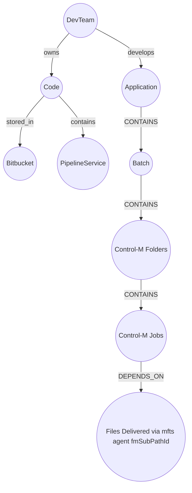

# DryDocs Consolidated Documentation

**Taxonomy + ontology reference.** DryDocs is built in four layers (see
[`../../docs/restructure/00-conceptual-model.md`](../../docs/restructure/00-conceptual-model.md)
and `CLAUDE.md` §1): **taxonomy** classifies (*"what category is this?"*), **ontology** gives
meaning (*"what do the connections mean?"*), the **knowledge graph** combines them, and the
**context graph** answers *"what matters right now?"*. This document covers layers 1–2. Taxonomy
is captured first as pure classification (`config/taxonomy/`); ontology is applied to it only
through the HITL gate (`docs/restructure/03-hitl-sme-flow.md`).

## 1. Taxonomy — hierarchical classification by domain

Taxonomy answers *"what category is this, and what is it a child/member of?"* — classification
only, **no meaning-bearing edges**. Taxonomies are organized under the three top-level domains
(Business / Technology / Data), captured in `config/taxonomy/`, and governed by the internal
standards in `knowledge/standards/<domain>/` (each standard declares the `taxonomy_path` it
constrains).

### 1.1 Technology — orchestration (Control-M)
| taxonomy_path | Element | Parent | Captured from |
|:--------------|:--------|:-------|:--------------|
| `technology/orchestration/control-m/server` | ControlMServer (data center) | — | controlm-psgmgr |
| `technology/orchestration/control-m/folder` | JobFolder | server | controlm-psgmgr |
| `technology/orchestration/control-m/job` | ControlMJob | folder | controlm-psgmgr |
| `technology/orchestration/control-m/condition` | Condition | job | controlm-psgmgr |
| `technology/orchestration/control-m/variable` | Variable (9 VariableKinds) | job | controlm-psgmgr (C3/C4) |

> The **variable taxonomy** (`VariableKind`: MALFORMED · EMBEDDED_SHELL · PLUGIN_NS · FLOW_REF ·
> DYNAMIC_NAME · SEMANTIC_FACT · SYSTEM_FUNC · VAR_REF · LITERAL) is a worked example already
> implemented in `drydocs/controlm/variables.py`. The folder-naming standard
> (`…/control-m/folder`) parses `JobFolder.name` into taxonomy attributes (env · LOB · app · type).

### 1.2 Business — org & applications (Catalog/PAT, SEAL)
| taxonomy_path | Element | Parent | Captured from |
|:--------------|:--------|:-------|:--------------|
| `business/lob` | CatalogLOB | — | catalog-pat |
| `business/lob/product-line` | ProductLine | CatalogLOB | catalog-pat |
| `business/lob/product-line/product` | Product | ProductLine | catalog-pat |
| `business/lob/product-line/product/area-product` | AreaProduct | Product | catalog-pat |
| `business/lob/product-line/product/dev-team` | DevTeam | AreaProduct / Product | catalog-pat |
| `business/application` | Application | Product | seal-extract |
| `business/application/port` | Port (EventProcessing / BatchProcessing) | Application | seal-extract |
| `business/application/membership` | Membership ▸ Role ▸ Employee | Application | seal-extract |

### 1.3 Data — data platforms (Oracle, Snowflake)
| taxonomy_path | Element | Parent | Captured from |
|:--------------|:--------|:-------|:--------------|
| `data/oracle/schema` | Schema | — | oracle-schemas |
| `data/oracle/schema/table` | Table → DataAsset | Schema | oracle-schemas |
| `data/script` | Script | job | controlm-psgmgr / oracle |

## 2. Taxonomy → ontology bridge

Each taxonomy element, once classified, is mapped to its ontology type via the PROV-O matrix
(§3) and the registered standards (ORG, DPROD, DCAT, SOSA/SSN), then **confirmed at the HITL
gate** before any edge is written. This is the join between layer 1 (taxonomy) and layer 2
(ontology); the machine-readable bindings live in `config/taxonomy-ontology-map.yaml`.

| Taxonomy element | PROV-O / W3C type | Neo4j label | Precedence authority | status |
|:-----------------|:------------------|:------------|:---------------------|:-------|
| JobFolder | prov:Collection | JobFolder | bmc-baseline | active |
| ControlMJob | prov:Activity | ControlMJob | bmc-baseline | active |
| Condition | prov:Entity | Condition | bmc-baseline | active |
| ControlMServer | local Platform | ControlMServer | bmc-baseline | active |
| CatalogLOB / DevTeam | org:OrganizationalUnit | CatalogLOB / DevTeam | lob-product-team | active |
| ProductLine / Product | local (dd:) | ProductLine / Product | lob-product-team | active |
| AreaProduct | dd:AreaProduct ⊑ prov:Entity | AreaProduct | lob-product-team | planned |
| Application | prov:SoftwareAgent | Application | lob-product-team | active |
| Port | dprod:Port | Port | lob-product-team | active |
| Membership / Role | org:Membership / org:Role | Membership / Role | lob-product-team | active |
| Schema / Table | dcat:Dataset (prov:Entity) | DataAsset | internal-standards | planned |
| Script | dd:Script ⊑ prov:Entity | Script | internal-standards | planned |

> Precedence (`config/precedence.yaml`): when sources disagree, **bmc-baseline → internal-standards
> → lob-product-team**. Full node typing is in §4; full edge rules in §3; the relationship
> registry is `drydocs/ontology/relationship_vocabulary.yaml`.

## 3. Relationship Mapping

DryDocs classifies every relationship by PROV-O source / target type, then picks the Neo4j label. The matrix below is the canonical rule-set.

| Source type   | Target type       | PROV-O term            | Neo4j label         |
|:--------------|:------------------|:-----------------------|:--------------------|
| Activity      | Activity          | prov:wasInformedBy     | WAS_INFORMED_BY     |
| Activity      | Entity            | prov:used              | USED                |
| Activity      | Entity (produces) | prov:generated         | GENERATED           |
| Activity      | Agent             | prov:wasAssociatedWith | WAS_ASSOCIATED_WITH |
| Entity        | Activity          | prov:wasGeneratedBy    | WAS_GENERATED_BY    |
| Entity        | Entity            | prov:wasDerivedFrom    | WAS_DERIVED_FROM    |
| Entity        | Agent             | prov:wasAttributedTo   | WAS_ATTRIBUTED_TO   |
| Agent         | Agent             | prov:actedOnBehalfOf   | ACTED_ON_BEHALF_OF  |
| Collection    | any               | prov:hadMember         | HAD_MEMBER          |

> **USED vs GENERATED:** Activity→Entity. Use USED for reading, GENERATED for producing.

## 4. Node type quick reference

| Node label      | PROV-O / W3C type      | Supplement                         |
|:----------------|:-----------------------|:-----------------------------------|
| ControlMJob     | prov:Activity          | ontology_supplement.cypher      |
| JobFolder       | prov:Collection        | ontology_supplement.cypher      |
| ControlMServer  | local Platform         | ontology_supplement.cypher      |
| Condition       | prov:Entity            | ontology_supplement.cypher      |
| JobRun          | prov:Activity          | base ontology                      |
| Application     | prov:SoftwareAgent     | seal_ontology_supplement.cypher    |
| Employee        | prov:Agent             | seal_ontology_supplement.cypher    |
| Membership      | org:Membership         | seal_ontology_supplement.cypher    |
| Role            | org:Role               | seal_ontology_supplement.cypher    |
| Port            | dprod:Port             | seal_ontology_supplement.cypher    |
| CatalogLOB      | org:OrganizationalUnit | catalog_ontology_supplement.cypher |
| BusinessSegment | org:FormalOrganization | catalog_ontology_supplement.cypher |
| DevTeam         | org:OrganizationalUnit | catalog_ontology_supplement.cypher |
| ProductLine     | local                  | catalog_ontology_supplement.cypher |
| Product         | local                  | catalog_ontology_supplement.cypher |
| JiraBoard       | local                  | catalog_ontology_supplement.cypher |

## 5. Phase 2 — execution lineage (planned)

Extends Control-M graph from scheduled to actual runtime execution.

| Edge                      | Domain → Range               | PROV-O                 | Required feed                    |
|:--------------------------|:-----------------------------|:-----------------------|:---------------------------------|
| DEPLOYED_BY               | Deployment → Developer       | prov:wasAssociatedWith | Change / CI-CD                   |
| DEPLOYED_TO               | Deployment → ControlMServer  | prov:wasAssociatedWith | Change / CI-CD                   |
| DEPLOYS_FOLDER            | Deployment → JobFolder       | prov:used              | Change / CI-CD                   |
| AUTHORED_BY               | JobFolder → Developer        | prov:wasAttributedTo   | Folder XML / Git blame           |
| INSTANCE_OF               | ControlMJobRun → ControlMJob | prov:wasInfluencedBy   | Control-M history API            |
| EXECUTED_BY               | ControlMJobRun → AppUser     | prov:wasAssociatedWith | Control-M history API            |
| INVOKES                   | ControlMJob → Script         | prov:used              | Folder XML (CMDLINE / MEMNAME)   |
| TRIGGERS                  | Script → ETLProcess          | prov:wasStartedBy      | Informatica / Ab Initio metadata |
| RUNS_ON (role=agent_host) | ControlMJob → ExecutionHost  | infra                  | CMDB / Control-M agent map       |
| RUNS_ON (role=etl_host)   | ETLProcess → ExecutionHost   | infra                  | CMDB / ETL engine config         |
| READS_FROM                | ETLProcess → DataSource      | prov:used              | Informatica / Ab Initio          |
| WRITES_TO                 | ETLProcess → DataTarget      | prov:generated         | Informatica / Ab Initio          |
| DELEGATES_TO              | AppUser → ExecutionHost      | prov:actedOnBehalfOf   | CMDB / IAM                       |

## 6. Architectural Graph Flow

This diagram outlines the refined application hierarchy:

## 7. Passwords Sheet — workstation fallback

Used when the AWS Glue Plugin runs on a workstation.

| Field       | Description                                                    |
|:------------|:---------------------------------------------------------------|
| FID         | FID name / id.                                                 |
| Domain      | Domain the FID is on. Look up in go/ars, go/arsdev, or go/vst. |
| Environment | DEV, UAT, or PROD.                                             |
| Use Case    | AWS, CCMS, DPL, or CONTROL-M.                                  |

## 8. DryDocs Ingest Notes

| Template sheet / field                                                                                           | Graph projection                                                                                            | Vocabulary id (status)                      |
|:-----------------------------------------------------------------------------------------------------------------|:------------------------------------------------------------------------------------------------------------|:--------------------------------------------|
| Ingestion · Dataset; Route · datasetGuid/datasetName/datasetVersion                                              | ETLProcess identity (one Placement Job → one ETLProcess activity)                                           | anchors the Script → ETLProcess edge below) |
| Ingestion · Source Zone + Source Glue Database; Route · source side                                              | DataSource node; edge ETLProcess -[:READS_FROM]-> DataSource                                                | m3_reads_from (planned)                     |
| Ingestion · Target Zone + Target Glue Database Name; Glue · Database Name/Dataset/AWS Bucket Name/Partition Keys | DataTarget node; edge ETLProcess -[:WRITES_TO]-> DataTarget                                                 | m3_writes_to (planned)                      |
| Control_M · Jar Path + Task Json Path                                                                            | Script node (the placement JAR + its Task-JSON argument); edge ControlMJob -[:INVOKES]-> Script             | m3_invokes (planned)                        |
| Implicit on the Placement Job                                                                                    | Script -[:TRIGGERS]-> ETLProcess (script launches the AWS-side ingestion workload)                          | m3_triggers (planned)                       |
| Control_M · Host (e.g. PROCO-CDS-UTIL#, 124n8)                                                                   | ExecutionHost; edge ControlMJob -[:RUNS_ON {role:'agent_host'}]-> ExecutionHost                             | m3_runs_on_agent_host (planned)             |
| Connector · Region / Bucket Name (AWS-side cluster entry point)                                                  | ExecutionHost for the ETL engine; edge ETLProcess -[:RUNS_ON {role:'etl_host'}]-> ExecutionHost             | m3_runs_on_etl_host (planned)               |
| Control_M · Run as User; EPV/Passwords · FID rows with Use Case='CONTROL-M'                                      | AppUser (service account); edge ControlMJob -[:EXECUTED_BY]-> AppUser                                       | m3_executed_by (planned)                    |
| EPV · FID rows with Use Case='AWS'/'DPL'/'CCMS' plus Environment                                                 | AppUser -[:DELEGATES_TO]-> ExecutionHost per environment                                                    | m3_delegates_to (planned)                   |
| Control_M · Folder Name (+ Domain fallback), Environment, Server                                                 | JobFolder + JobFolder -[:SCHEDULED_ON]-> ControlMServer (already loaded by M3)                              | m3_scheduled_on (active)                    |
| Control_M · In Conditions                                                                                        | ControlMJob -[:REQUIRES_IN_CONDITION]-> Condition (folder-level, already loaded by M3)                      | m3_requires_in_condition (active)           |
| Connector · Application ID; Glue · Publisher Seal                                                                | Application (SEAL) node; the Data-Delivery SEAL owns the ETLProcess, the Publisher SEAL owns the DataTarget | linked via SEAL loaders (out of M3 scope)   |

