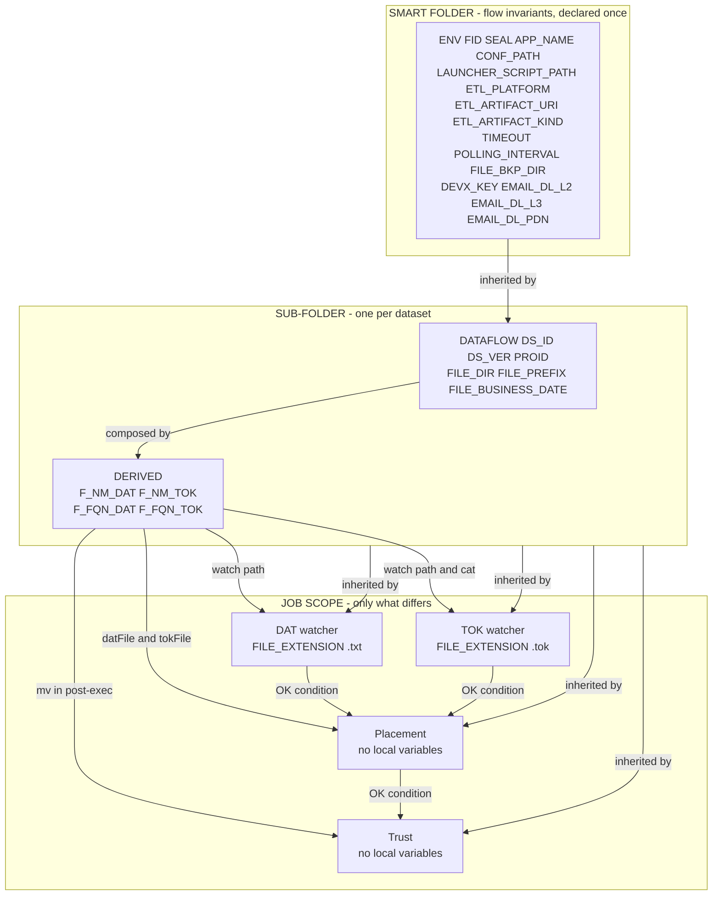
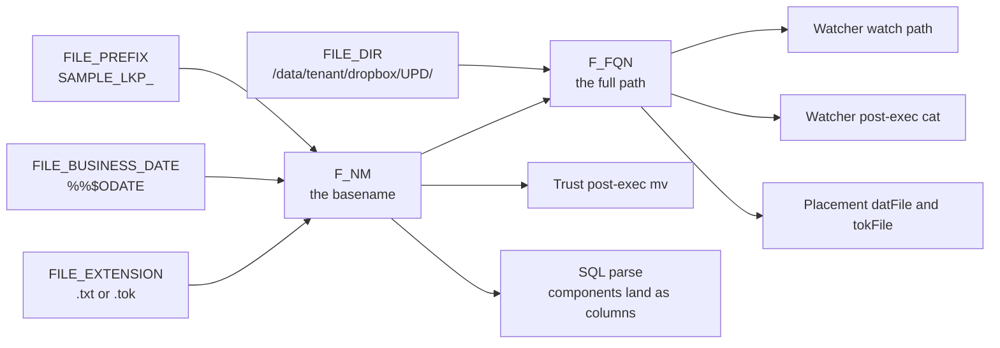

# Control-M Guidelines & Standards

**Version 1.0 — 2026-08-11.** Applies to all new Control-M jobs and any job undergoing material
refactor.

This page **replaces** five overlapping documents. Where they disagreed, this page decides. It is
the page a job author follows; the reasoning behind each decision lives in the
[greenfield job standard](controlm-greenfield-job-standard.md), and the machine checks live in the
standards rules registry. Three documents, three jobs — **normative here, rationale there,
enforcement in the registry** — so no two of them can drift into two different arguments.

> **Classification: Internal-Public.** Examples use the synthetic SEAL block **70001–70099**,
> `example.invalid` addresses and `/data/<tenant>/` paths. No real folder, account, SEAL, FID or
> GUID appears on this page.

**Conventions.** **MUST** is enforced and non-negotiable. **MUST NOT** is the same in reverse and is
usually where the operational risk sits. **SHOULD** is expected, with deviations recorded. Each rule
cites its enforcing rule id (`R30`…) where one exists — if a rule has no id, nothing is checking it
yet, and that is worth knowing.

---

## 1. The one principle

Almost every defect this standard prevents has the same shape: **the same fact written down twice,
in two places, which then disagree.** A launcher path declared on two jobs under two spellings. A
filename composed in a watcher and re-composed in a downstream job. A pipeline id in the command and
again in a variable. A support DL in a folder variable and again in a job description.

So the principle is one line:

> ### Every fact is declared **once**, at the **widest scope where it is still true**, and everything else **references** it.

Sections 2–4 are that principle applied to scope, to file names, and to carriers.

---

## 2. Variable scope — the ladder

### 2.1 The rule

**MUST**: declare a value at the widest scope where it is still true.

| Scope | Holds | Test to apply |
|---|---|---|
| **SMART folder** | flow invariants | *Is this the same for every job in the flow?* |
| **Sub-folder** (one per dataset) | dataset identity | *Is this the same for every job of this dataset?* |
| **Job** | only what genuinely differs | *Do two jobs of the same dataset disagree about it?* |

**MUST**: one sub-folder per dataset. A folder cannot hold three values for one name, so without the
sub-folder layer the dataset identity falls back to job scope and the copy-paste problem returns.

### 2.2 What lives where

```
SMART FOLDER — declared once for the whole flow
  ENV  FID  SEAL  APP_NAME  ALIAS  CONF_PATH
  LAUNCHER_SCRIPT_PATH  ETL_PLATFORM  ETL_ARTIFACT_URI
  ETL_ARTIFACT_KIND  ETL_PLATFORM_FLAGS
  TIMEOUT  POLLING_INTERVAL  FILE_BKP_DIR
  DEVX_KEY  EMAIL_DL_L2  EMAIL_DL_L3  EMAIL_DL_PDN

  SUB-FOLDER — one per dataset
    DATAFLOW  DS_ID  DS_VER  PROID
    FILE_DIR  FILE_PREFIX  FILE_BUSINESS_DATE
    F_NM_DAT  F_NM_TOK  F_FQN_DAT  F_FQN_TOK      (derived — see §3)

      JOB — only what differs between the four
        FILE_EXTENSION        .txt on the DAT watcher, .tok on the TOK watcher
```

For three datasets × four jobs that is roughly **64 declarations instead of 204** — and, the point,
**one** copy of each value to maintain.

### 2.3 The flow



Read it as two movements. **Downward** is inheritance: each scope adds facts and passes everything
above it along. **Rightward from DERIVED** is reference: all four jobs point at the same two
composed handles, so the filename exists in exactly one place.

### 2.4 Vendor resolution order

Control-M resolves a reference by **narrowest scope first**:

```
1. Local  — the job's own variable            → if found, used
2. SMART folder / sub-folder                  → if found, used
3. Global — %%\VAR                            → if found, used
4. Nothing found                              → the reserved word CTMERR
```

**Step 4 is why R30 is a must-fix.** An undefined reference does not fail loudly; it resolves to the
literal string `CTMERR` and is handed to the agent as text. The job runs and does the wrong thing.

⚠️ **One caveat.** Folder-scope resolution is documented for **job processing parameters** — command
line, watch path, pre/post-execution command. Resolving a folder variable **inside a job's script**
additionally requires `VARIABLE_INC_SEC = Global` on the Control-M/Server. Every reference in this
standard is a processing parameter, so the ladder does not depend on that setting. Confirm it before
moving a reference into a script.

---

## 3. File names — decomposed for SQL, one token in commands

### 3.1 The problem this solves

A watched file must be **decomposed**, because that is how watchers are built and how the metadata
tables are populated. But a command that repeats a four-part composition is unreadable, and — this
is the failure actually observed — it gets edited in one place and not the other.

**MUST**: declare the components, then **derive** one handle from them, and reference only the
handle.

### 3.2 The derivation

```
FILE_DIR           = /data/<tenant>/dropbox/UPD/       ← component
FILE_PREFIX        = SAMPLE_LKP_                       ← component
FILE_BUSINESS_DATE = %%$ODATE                          ← component

F_NM_DAT  = %%FILE_PREFIX.%%FILE_BUSINESS_DATE..txt    ← derived: the basename
F_FQN_DAT = %%FILE_DIR.%%F_NM_DAT                      ← derived: the full path
```



**MUST**: `FILE_BUSINESS_DATE`, not `FILE_DATE`. Three different dates get conflated routinely, so
all three are named apart:

| Variable | Meaning |
|---|---|
| `FILE_BUSINESS_DATE` | the date the **data** represents |
| `FILE_LOAD_DATE` | the date the file was **processed** |
| `FILE_ARRIVAL_DATE` | the date the file **arrived** on disk |

**MUST**: `FILE_EXTENSION` drives DistributionRole, not the job-name suffix:

| Extension | DistributionRole |
|---|---|
| `.dat` `.csv` `.txt` | DAT |
| `.tok` | TOK |
| `.ctl` | CTL |
| `.done` | DONE |

**SHOULD**: keep compression separate from format. `.dat.gz` is still a DAT file; compression is how
it is stored, not what it contains.

> ⚠️ **The `..` before the extension is correct, not a typo.** Control-M **consumes** the first dot
> as the concatenation delimiter, so the second is the literal separator. Storing `.txt` with its
> leading dot inside `FILE_EXTENSION` also works. Pick one per estate and **MUST NOT** mix.
> Forbidden either way: a variable whose value is a **bare** `.` — that is dot-smuggling (**R1**),
> and it is invisible to every text-level analysis of the estate.

### 3.3 Why components are declared even when nothing references them

`FILE_EXTENSION` may be referenced by no runtime field, and that is correct. It is declared **for the
record**, so the metadata parse can read it into its column. The orphan rule (**R31**) exempts
registered facts and standard metadata fields for exactly this reason: an orphan is a name that is
both unregistered *and* unused.

---

## 4. Carriers — every fact has exactly one

**MUST** (**R33**): a value is a command literal **or** a variable, never both. Two carriers can
disagree silently; the command wins and the variable lies.

| Fact | Carrier | Why |
|---|---|---|
| `pipelineId` | **the command literal** `-pipeline <uuid>` | generator-owned and immutable per pipeline. A variable makes it hand-editable, which is the whole drift problem |
| everything else in the templates | **a variable** | authored per flow or per dataset |

**MUST NOT** declare a `PIPELINE_ID` variable. If one exists, remove it.

> **The one exception this creates, and how it is paid for.** The pipeline GUID is the join key into
> the DPL dataset-flow lineage, and the tooling otherwise refuses to parse command lines. So the
> standard grants exactly **one anchored extractor** — `-pipeline <uuid>`, matched on the flag and
> validated as a UUID, nothing else. This is a named exception, not a general licence to infer
> values from command text.

---

## 5. Naming

### 5.1 One name per concept

**MUST**: the variable name, the staging `fact_type`, the SQL column and the ontology property stem
are the **same token**, `UPPER_SNAKE`. One hop, no translation table.

That is why the payload artifact is `ETL_ARTIFACT_URI` and not `IMG`: the concept names the
variable; `-img` is only how one launcher spells the flag. **The flag is a binding recorded in the
command template — never the variable's name.**

### 5.2 Casing is exact, and drift is silent

Control-M variables are **case-sensitive at execution**, so the registry does not case-fold —
normalising would silently merge bindings someone meant to keep distinct.

The cost of that correct decision: **`DATA_FLOW` is not `DATAFLOW`.** It misses the registry, writes
no row, and the dataset has no lineage at all. Nothing errors. **Drift is silent, which is why it
survives** (**R2**).

Non-canonical names still materialise through the alias map with a rename WARN — legacy is never
broken — but WARN-free is the target.

### 5.3 Vendor legality (**R38**)

**MUST NOT** use any of these in a user-defined variable name, or a blank:

```
< > [ ] { } ( ) = ; ` ~ | : ? . + - * / & ^ # @ ! , " '
```

**MUST**: user-defined names are ≤ 38 characters.

**MUST NOT** declare a variable inside a vendor application prefix — the `%%FileWatch-`, `%%UCM-`,
`%%SAPR3-` form. Those namespaces belong to Control-M.

The hyphen being forbidden settles three names outright. In each case the **shorter, legal spelling
wins**:

| Old | Use | Why |
|---|---|---|
| `DevX-project` | **`DEVX_KEY`** | hyphen illegal |
| `%%FileWatch-FILE_PATH` | **`FILE_PATH`** | hyphen illegal, and a vendor plugin namespace |
| `L2_EMAIL_DL_NM` / `L3_EMAIL_DL_NM` | **`EMAIL_DL_L2` / `EMAIL_DL_L3`** | one prefix, sortable, and it already has a third member |

### 5.4 Job naming and numbering

```
{APP[:4]}{FREQ}{JOB_NUM}_{SOR}_{DATASET}_{PAYLOAD}_{CHANNEL}_{TYPE}
                                          DAT|TOK   AWS|ONPM
```

**MUST** (**R29**): `JOB_NUM` is fixed-width zero-padded, so alphanumeric sort equals numeric sort —
`_FW_0010` beside `_FW_0002`, never `_FW_10` beside `_FW_2`.

**MUST**: the numbering is a **linear extension of the dependency graph** — if A must run before B
then `number(A) < number(B)`. Reading a folder top to bottom must be reading a valid execution
order. The number *reflects* the flow; conditions *enforce* it, and the two must not disagree.

**SHOULD**: leave gaps (0010, 0020, 0050) so a step can be inserted without renumbering every
downstream job, its conditions and its escalation rows.

### 5.5 The folder holds the whole process — channel is a **job** fact

**MUST NOT** split a flow across folders so that each folder's name becomes true about where its
jobs run. A flow that begins with an on-prem file watcher and ends in an S3 zone is **one folder**:
the watcher, the placement and the trust ingestion succeed and fail together, and they are one thing
to monitor.

**Channel is stated once, per job, in the `{CHANNEL}` slot** (§5.4). The generator hardcodes `_AWS_`
into every name it emits, which is why deployed on-prem watchers carry a name that misdescribes
them. That is a defect in the grammar — the reason `{CHANNEL}` is a slot — and **not** an argument
for a second folder.

Two audiences read the folder, and both are served by keeping it whole:

- **The Control-M operator** monitors folders. Seeing one logical process in one place beats
  tracing it across neighbours.
- **The SRE** reads folder placement as *where this runs*. It is a heuristic, and on a mixed flow it
  is partly wrong — but splitting folders to make the heuristic literal spends monitoring legibility
  to buy an approximation.

**The graph already carries the exact answer**, per job: channel, host, zone, and the
FW → PLCT → TRUST chain that joins them. That is what the folder name was being asked to approximate,
and it no longer has to.

---

## 6. Job types

### 6.1 File watchers

**MUST** declare, at some scope: `FILE_DIR`, `FILE_PREFIX`, `FILE_BUSINESS_DATE`, `FILE_EXTENSION`
(**R32**).

**Watch path**: `%%F_FQN_DAT` or `%%F_FQN_TOK` — one token.

**Post-execution command** — two clauses, and the forbidden one carries the risk:

| DistributionRole | Post-execution command |
|---|---|
| **TOK / CTL** | **MUST** be `cat ` + the watch path, the same expression (**R39a**) |
| **DAT** | **MUST NOT** cat (**R39b**) |

The required clause gives upfront data-quality evidence: the declared record count lands in the
watcher's sysout at detection time, before ingestion, so a short feed is caught at the transfer
rather than blamed on the load.

The forbidden clause is the operational risk: **data files can be multi-GB, and echoing one into
sysout floods the log and can breach sysout limits.** If a watcher watches a data file with no
token/control file in the interface, that is a finding to raise with the source — **MUST NOT**
satisfy the rule by catting the data file.

Because both fields are now one token, the check is string equality: `post_command == "cat " +
watch_path`.

### 6.2 Command jobs — Placement, Trust, and every ETL job

**MUST** declare, at some scope, regardless of platform (**R32**):

```
LAUNCHER_SCRIPT_PATH   ETL_PLATFORM   ETL_ARTIFACT_URI   ETL_ARTIFACT_KIND
```

`ETL_PLATFORM_FLAGS` is optional. **The names are always present; the values differ by platform** —
that uniformity is what makes a cross-platform query possible.

| | Values |
|---|---|
| `ETL_PLATFORM` | `pyspark` · `java` · `abinitio` · `informatica` |
| `ETL_ARTIFACT_KIND` | `wheel` · `jar` · `pset` · `container` · `other` |

**MUST** (**R34**): `DS_ID` is a UUID and `DS_VER` is dotted-numeric. This is not pedantry — a
swapped pair still resolves, so **both write a fact row and one of them is false**. A wrong row is
worse than a missing one, and it is the only defect class here that a reader downstream cannot spot.

**MUST**: `ETL_ARTIFACT_URI` is a **registry-qualified URI**, not a bare image name. The security
boundary restricts artifact sources to approved repositories, and a bare name names no repository.

Under the ladder, Placement and Trust declare **nothing of their own**.

---

## 7. The description field

The field is 1–4000 characters and is **not** runtime-accessible as a `%%` variable. That is what
makes it safe to restructure — and what makes it unable to drive anything. It is a graph feed.

> ### MUST: the description carries only facts with no runtime role and no other carrier.
> Anything already in a variable, or derivable from the job name, **MUST NOT** appear in it.

**Format**: `key: value` pairs delimited by `|`. Parsers **MUST** split on the **first colon only**
(values contain colons), tolerate whitespace on both sides, and treat `;` as an *inner* separator
within one value — never as a delimiter.

### 7.1 File watchers

```
DELIVERY_MECHANISM: MFTS_AGENT | USER: <transfer-account> | FTS_ID: FTS2 |
REC_ID: <id>,<id> | SOURCE_CONTACT: <origin-owner-DL>
```

| Token | Value rule |
|---|---|
| `DELIVERY_MECHANISM` | `MFTS_AGENT` · `SFTP_DIRECT` · `API_GENERATED` |
| `USER` | the transfer service account |
| `FTS_ID` | the **bare** File Transfer id — `FTS1` `FTS2` `FTS6` `FTS7` `FTSCAT1`; shape `^FTS[A-Z]*[0-9]+$` |
| `REC_ID` | source-system reference id(s), comma-separated |
| `SOURCE_CONTACT` | who owns the file at the originating system |

Three rulings worth stating plainly:

- **`ENV` is not used here — use `FTS_ID`.** On a watcher description `ENV` named a transfer
  instance; on command jobs `ENV` is the deployment environment (`prod`). One key, two concepts,
  landing in the same tables. The transfer instance moves; `ENV` keeps the meaning it has everywhere
  else.
- **Drop version fragments from the value.** `ST 6.0 - FTS2` becomes `FTS2`. The vocabulary is open
  but governed — new transfer instances appear, and `FTSCAT1` already breaks a naive `FTS<digit>`
  pattern, so the check is a shape and not a closed list.
- **A file watcher is inherently INBOUND.** Direction is carried by the job type and **MUST NOT** be
  re-encoded in a token. There is no outbound route token: the watched directory *is* the landing
  zone, and it is already `FILE_DIR`. Description carries the source side, variables carry the
  target side, nothing is stated twice.

### 7.2 Placement and Trust

```
JOB_ROLE: PLACEMENT              JOB_ROLE: TRUST_INGEST
```

That is the whole set. Everything else a reader might want is a variable or derivable from the job
name. `JOB_ROLE` earns its place as the **discriminator** that decides which table a row lands in.

### 7.3 Contacts — documentation, at folder scope

Notification is being **removed** as a mechanism. Control-M shouts are deleted; generated mail adds
noise; **the failure raises a ServiceNow incident, and the incident is the call to action.**

**MUST**: `EMAIL_DL_L2`, `EMAIL_DL_L3` and `EMAIL_DL_PDN` are **folder variables**, extracted later
for runbook documentation. They are deliberately not wired to anything.

**MUST NOT** put contacts in a job description — that duplicates a folder fact per job.

**MUST NOT** bind any of them to a `DOMAIL` destination. An unset destination — `%%NOTIFY`,
`%%EMAIL_GRP`, whatever a given job spells it — is an ordinary unresolvable reference to report
(**R30**), never an invitation to re-wire the mechanism being removed (§8).

**Two different kinds of contact, despite the shared prefix:**

| Variable | Audience | Role |
|---|---|---|
| `EMAIL_DL_L2` · `EMAIL_DL_L3` | internal **support tiers** | support contact |
| `EMAIL_DL_PDN` | downstream **business users** — Production **Delay** Notification | consumer contact |

**MUST NOT** collapse them. And **MUST NOT** put a ServiceNow queue in a Control-M variable at all:
technician routing lives in the escalation database, joined on the job name.

---

## 8. Notifications

**MUST** (**R40**): folder and job definitions contain **zero** `<SHOUT>`, `<DOSHOUT>` and
`<DOMAIL>` elements, for every job type. The failure raises a ServiceNow incident, and **the
incident is the call to action** — a generated mail is a second, weaker signal alongside it, and a
signal nobody is required to act on is noise.

**Mail goes with the shouts** (SME ruling, 2026-08-11). REQ-2 removed `<SHOUT>`/`<DOSHOUT>` and left
`<DOMAIL>` "out of scope"; this ruling extends REQ-2 to cover it. So the whole `ON … NOTOK` →
`DOMAIL` block is deleted, not re-pointed.

**MUST NOT** repair the destination. Delete the block and its destination reference goes with it,
whatever that job spells it — the estate currently carries at least `%%NOTIFY` (what every generated
job emits) and `%%EMAIL_GRP` (an On-Do action on a deployed load job). **Neither is declared
anywhere.** That is the second argument for deletion rather than repair: the mechanism is already
silently unbound wherever it is used, so nothing is being switched off that was working. Where such
a reference is found it is reported as an ordinary unresolvable reference (**R30**) — evidence the
block should not be there, never a missing variable to supply.

Contacts survive this, at folder scope and as documentation only — see §7.3.

---

## 9. Use the tool's own guardrails

**SHOULD**: enable **Enforce Validations** and attach a **Site Standard** to the folder. A Site
Standard enforces the required declaration set **at author time, in Control-M**, instead of a
downstream check discovering the gap after deployment. Confirm what the environment licenses before
committing to it.

---

## 10. Worked example — a folder-to-job variable flow, resolved step by step

One dataset, four jobs. This is the whole standard in one folder.

### 10.1 What is declared

**SMART folder `PRARAG-HLDM-70002-UDM-TRUST-UPD`**

| Name | Value |
|---|---|
| `ENV` | `prod` |
| `FID` | `S000001` |
| `SEAL` | `70002` |
| `APP_NAME` | `sample-srvc-prod` |
| `CONF_PATH` | `/data/<tenant>/cfg/sample_prod_conf.json` |
| `LAUNCHER_SCRIPT_PATH` | `/apps/tenants/dpl_utils/dt-accelerators/dt-launcher.sh` |
| `ETL_PLATFORM` | `java` |
| `ETL_ARTIFACT_URI` | `https://artifacts.example.invalid/maven/sample-1.0.0.jar` |
| `ETL_ARTIFACT_KIND` | `jar` |
| `TIMEOUT` | `24` |
| `POLLING_INTERVAL` | `1` |
| `FILE_BKP_DIR` | `/data/<tenant>/dropbox/bkp/` |
| `DEVX_KEY` | `SAMPLEKEY` |
| `EMAIL_DL_L2` | `l2_support@example.invalid` |
| `EMAIL_DL_L3` | `l3_devteam@example.invalid` |
| `EMAIL_DL_PDN` | `downstream_owners@example.invalid` |

**Sub-folder `STG_SAMPLE_LKP`**

| Name | Value |
|---|---|
| `DATAFLOW` | `STG_SAMPLE_LKP` |
| `DS_ID` | `00000000-0000-4000-8000-000000000001` |
| `DS_VER` | `1.0.0` |
| `FILE_DIR` | `/data/<tenant>/dropbox/UPD/` |
| `FILE_PREFIX` | `STG_SAMPLE_LKP_` |
| `FILE_BUSINESS_DATE` | `%%$ODATE` |
| `F_NM_DAT` | `%%FILE_PREFIX.%%FILE_BUSINESS_DATE..txt` |
| `F_NM_TOK` | `%%FILE_PREFIX.%%FILE_BUSINESS_DATE..tok` |
| `F_FQN_DAT` | `%%FILE_DIR.%%F_NM_DAT` |
| `F_FQN_TOK` | `%%FILE_DIR.%%F_NM_TOK` |

**Jobs**

| Job | Local variables | Key fields |
|---|---|---|
| `PARAD0010_…_DAT_ONPM_FW` | `FILE_EXTENSION = .txt` | Path `%%F_FQN_DAT` · **no** post-exec |
| `PARAD0011_…_TOK_ONPM_FW` | `FILE_EXTENSION = .tok` | Path `%%F_FQN_TOK` · post-exec `cat %%F_FQN_TOK` |
| `PARAD0020_…_AWS_PLCT` | *(none)* | command below |
| `PARAD0050_…_AWS_TRUST` | *(none)* | command + `mv` post-exec below |

### 10.2 Resolving one reference, step by step

The TOK watcher's **watch path** is the single token `%%F_FQN_TOK`. Control-M resolves it on
`%%$ODATE = 20260811`:

| # | Resolving | Looks in | Found at | Becomes |
|---|---|---|---|---|
| 1 | `%%F_FQN_TOK` | job → **sub-folder** | sub-folder | `%%FILE_DIR.%%F_NM_TOK` |
| 2 | `%%FILE_DIR` | job → **sub-folder** | sub-folder | `/data/<tenant>/dropbox/UPD/` |
| 3 | *the `.` after it* | — | — | **consumed** as the concatenation delimiter |
| 4 | `%%F_NM_TOK` | job → **sub-folder** | sub-folder | `%%FILE_PREFIX.%%FILE_BUSINESS_DATE..tok` |
| 5 | `%%FILE_PREFIX` | job → **sub-folder** | sub-folder | `STG_SAMPLE_LKP_` |
| 6 | `%%FILE_BUSINESS_DATE` | job → **sub-folder** | sub-folder | `%%$ODATE` → `20260811` |
| 7 | *the `..` before `tok`* | — | — | first dot consumed, **second is literal** |

**Result:** `/data/<tenant>/dropbox/UPD/STG_SAMPLE_LKP_20260811.tok`

The post-execution command is `cat %%F_FQN_TOK` — the **same token**, so it resolves to the same
string by construction. The file detected is the file echoed, and there is no second expression that
can drift.

### 10.3 The same trace, three ways it can go wrong

| If… | Resolution | Symptom |
|---|---|---|
| the job also declared `FILE_PREFIX` | **job scope wins** at step 5 | the watcher silently watches a different file from its siblings |
| `FILE_DIR` were declared nowhere | step 2 falls through to global, then fails | the path contains the literal `CTMERR`; the watcher never fires — **R30** |
| the path were retyped instead of referencing `%%F_FQN_TOK` | resolves correctly *today* | the next rename updates one copy and not the other — **R36** |

The middle row is the one to internalise: **an undefined reference does not error.** It becomes the
word `CTMERR` inside your path.

### 10.4 The downstream jobs — no new declarations

```
PARAD0020_…_AWS_PLCT
  Desc : JOB_ROLE: PLACEMENT
  Cmd  : %%LAUNCHER_SCRIPT_PATH -env %%ENV
         -pipeline 00000000-0000-4000-8000-000000000002
         -dataset %%DS_ID -version %%DS_VER -bd %%BUS_DATE -od %%ODATE
         -datFile %%F_FQN_DAT -tokFile %%F_FQN_TOK
         -fid %%FID -timeout %%TIMEOUT -sleep %%POLLING_INTERVAL -p
         -conf %%CONF_PATH

PARAD0050_…_AWS_TRUST
  Desc : JOB_ROLE: TRUST_INGEST
  Cmd  : %%LAUNCHER_SCRIPT_PATH -env %%ENV
         -pipeline 00000000-0000-4000-8000-000000000002
         -appName %%APP_NAME -alias %%APP_NAME -seal %%SEAL
         -dataflow %%DATAFLOW -img %%ETL_ARTIFACT_URI
         -bd %%BUS_DATE -od %%ODATE -fid %%FID
         -timeout %%TIMEOUT -sleep %%POLLING_INTERVAL -i -conf %%CONF_PATH
  Post : mv %%FILE_DIR/%%F_NM_DAT %%FILE_BKP_DIR/%%F_NM_DAT;
         mv %%FILE_DIR/%%F_NM_TOK %%FILE_BKP_DIR/%%F_NM_TOK;
```

Both jobs reference the **same** two derived handles the watchers use. The filename is composed once
per dataset, and `-pipeline` is a literal by §4.

### 10.5 What this buys

| Join | Key |
|---|---|
| the four jobs of a dataset | sub-folder = `DATAFLOW` = `DS_ID` |
| Control-M → the file | `FILE_PREFIX` + `FILE_BUSINESS_DATE` + `FILE_EXTENSION` |
| Control-M → DPL dataset-flow lineage | the `-pipeline` GUID, via the §4 anchored extractor |

Without the ladder these four jobs cannot be joined at all: each spells the file differently and the
dataset key drifts out of the registry. **Watcher → Placement → Trust becomes a lineage chain
instead of three unrelated rows.** That is the return on the standard.

---

## 11. Author's checklist

Before submitting a folder:

- [ ] Every value declared **once**, at the widest scope where it is true (**R35**)
- [ ] No `%%` reference undeclared at every scope (**R30**)
- [ ] No variable declared and referenced nowhere, unless it is a registered fact or a metadata field (**R31**)
- [ ] Command jobs carry `LAUNCHER_SCRIPT_PATH`, `ETL_PLATFORM`, `ETL_ARTIFACT_URI`, `ETL_ARTIFACT_KIND` (**R32**)
- [ ] Watchers carry `FILE_DIR`, `FILE_PREFIX`, `FILE_BUSINESS_DATE`, `FILE_EXTENSION` (**R32**)
- [ ] No `PIPELINE_ID` variable beside the `-pipeline` literal (**R33**)
- [ ] `DS_ID` is a UUID, `DS_VER` is dotted-numeric — check the sibling job for a swap (**R34**)
- [ ] The filename is derived once, not retyped (**R36**)
- [ ] No two `%%` references side by side (**R37**)
- [ ] No forbidden character in any variable name; none ≤ 38 chars exceeded (**R38**)
- [ ] TOK/CTL watcher cats its watch path; **DAT watcher does not cat** (**R39a/b**)
- [ ] Zero `<SHOUT>` / `<DOSHOUT>` / `<DOMAIL>` (**R40**)
- [ ] No variable value is bare punctuation (**R1**)
- [ ] Job numbers zero-padded, gapped, and ordered like the dependency graph (**R29**)

---

## 12. Open items

1. **`SOURCE_CONTACT`** — must it be a DL rather than a named individual? (§7.1)
2. **The dot convention** — `..` before the extension, or the dot stored inside `FILE_EXTENSION`?
   Both are legal; the estate must pick one. (§3.2)
3. **Site Standards licensing** (§9)
4. **Job-number bands** — reconcile the generator's numbering with the functional bands. (§5.4)

*Closed:* `<DOMAIL>` — **removed alongside the shouts** (SME, 2026-08-11; §8).

---

**Rationale and evidence:** [greenfield job standard](controlm-greenfield-job-standard.md) ·
**enforcement:** the standards rules registry (R1, R2, R29–R40), implemented in
`drydocs_remediation.detect.detect_conformance` · **related:**
[description-field metadata plan](description-field-metadata-plan.md) ·
[file-watcher token cat](filewatcher-postexec-token-cat.md) ·
[folder naming convention](folder-naming-convention.md)
